**[English](README.md) | [中文](README_zh.md)**

<p>
  <a href="https://github.com/lisering/lisp-rs/stargazers"></a>
  <a href="https://github.com/lisering/lisp-rs/network/members"></a>
  <a href="https://github.com/lisering/lisp-rs/blob/main/LICENSE"></a>
  
  
  
  <a href="https://github.com/lisering/lisp-rs/issues"></a>
</p>

# Building a Lisp Interpreter from Scratch — Rust Hands-On Tutorial

**Zero knowledge required. Zero dependencies.** 47 steps. 45 tests. One working Lisp interpreter at the end. Each step first explains **what problem to solve**, then writes the code.

### TCO in action — 1,000,000 iterations vs. stack overflow


---

## 🧭 Choose Your Path

You don't have to read everything. Pick the lane that fits you:

| If you... | Start at | Time to first code |
|-----------|----------|-------------------|
| Have **never programmed before** | [What We're Building](#what-were-building) | approx. 15 minutes |
| Know **Python/JS/Java but not Rust** | [Step 4: Define Core Types](#step-4-define-core-types--lispexp-and-lisperr) | approx. 5 minutes |
| Know **Rust basics** (enum, match, HashMap) | [Step 7: Create the Lexer](#step-7-create-the-lexer) | Right away |
| Have **written an interpreter before** | Skim to [Step 24: Closures](#step-24-lambda-captures-environment-implementing-true-closures) and [Step 26: TCO](#step-26-tco-trampoline-loop-implementation) | approx. 30 minutes |
| Just want to see **how closures are implemented** | Jump to [Step 24: Closures](#step-24-lambda-captures-environment-implementing-true-closures) | approx. 10 minutes |

**Already built something like this?** You might still find something new here: the backpack-closure trace (Step 24), the trampoline-loop TCO walkthrough (Step 26), and the three teaching-focused optimization passes (Steps 27–30). Everything else you can skim.

---

## Table of Contents

- [Preparation](#preparation) — Steps 1-3
- [Understanding "Values"](#understanding-values) — Step 4
- [Making Programs "Compute"](#making-programs-compute) — Steps 5-6
- [Splitting Sentences into Words](#splitting-sentences-into-words) — Step 7
- [Understanding the Meaning of Words](#understanding-the-meaning-of-words) — Steps 8-11
- [Giving Things Names](#giving-things-names) — Steps 12-13
- [Doing Real Computation](#doing-real-computation) — Steps 14-17
- [More Data Types](#more-data-types) — Steps 18-19
- [Making Programs Choose](#making-programs-choose) — Steps 20-22
- [Remembering the Past](#remembering-the-past) — Steps 23-26
- [Making Programs Run Faster](#making-programs-run-faster) — Steps 27-30
- [More Magic Commands](#more-magic-commands) — Steps 31-35
- [Built-in Functions + Challenge Levels](#built-in-functions-completion--challenge-levels) — Steps 36-47

---


## What We're Building

---

### First, What Is "Programming"?

Programming is **telling a computer what to do**. But you can't just speak to it in English—it won't understand you. You need to speak a "language" the computer understands.

The catch is, the computer's native language is **0 and 1** (machine code), which no normal person can read. So someone invented a middleman: you write code in a **human-readable language**, and an **interpreter** (that's what we're about to build) translates it into something the computer can execute.

💡 In short: You write the recipe for spaghetti bolognese. The interpreter is the chef who reads it and actually cooks the dish.

---

### What Is Lisp?

Lisp is the **second** oldest programming language (second only to Fortran, born in 1958). It's a special language—special in what way?

**Almost all programming languages look like math formulas:**
```
if (x > 0) { return x + 1; }
```

**But Lisp looks like a shopping list:**
```
(if (> x 0) (+ x 1))
```

This isn't just being different for the sake of it. Lisp's core idea is: **code and data are the same thing—both are lists.**

Look at `(+ x 1)` above—it's both a piece of "code" (telling the computer to add 1 to x) and a "list" (three things: `+`, `x`, `1` arranged together). Later you'll see this gives it a flexibility that other languages can't match.

💡 In short: Other languages give you a fixed recipe book. Lisp gives you a kitchen — you can rewrite the recipe as you go. That's why they call it "the programmable programming language."

---

### Lisp's Syntax Has Only Two Rules

Read through this entire tutorial and you'll find that Lisp's syntax rules boil down to just two:

**Rule 1: Parentheses mean "call"**
```
(+ 1 2)      →  Pass 1 and 2 to the + function, result is 3
(if a b c)   →  If a is true, execute b, otherwise execute c
```
The first thing inside parentheses is the "operation", the rest are "arguments".

**Rule 2: You can nest them**
```
(+ 1 (* 2 3))   →  1 + (2 × 3) = 7
```
The inner list is computed first, then the result is used by the outer one—like Russian nesting dolls.

That's it. You read that right—the entire syntax of the Lisp language, fully explained right here.

💡 Why "Lisp"? The name mashes **Lis**t + **P**rocessing together — a syllabic abbreviation, not a letter-by-letter acronym like "HTTP". Early papers wrote LISP in all caps; modern style uses **Lisp**. The name says what it does: a language designed for processing lists.


### 🗺️ Roadmap: What Depends on What

Before we start building, here's a map of the chapters and their prerequisites:

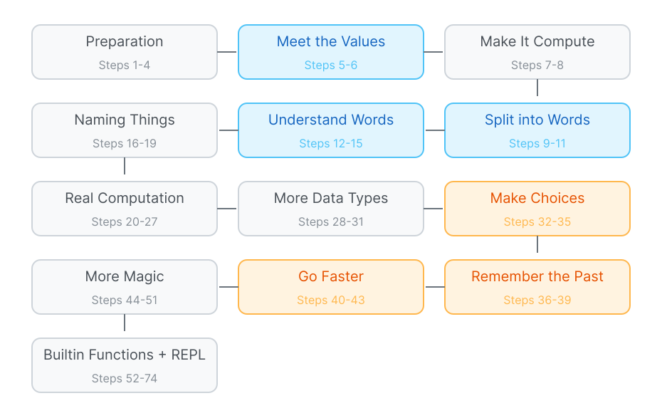


Each chapter builds on the previous one. The blue-highlighted chapters (Lexer, Parser, Values) are core foundations; the orange-highlighted ones (Closures, TCO) are the deepest features. If you ever feel lost, refer back to this map.

---

### A Few Real Examples to Make It Clear

The syntax is simple, but it's surprisingly expressive. Don't worry if these examples are fuzzy right now—they're here to give you a feel for what Lisp can do.

**1 Defining Functions (lambda)**

Calculate a square:

```lisp
(define square (lambda (x) (* x x)))
(square 5)    ; → 25
(square 12)   ; → 144
```

`lambda` means "create a function"—it doesn't compute anything, just packages it into a value waiting to be called.

**Break it down** to see what pieces `lambda` is made of:

```
(lambda (x) (* x x))
   │     │     │
   │     │     └── function body: what does this function do?
   │     │            Given x, compute (* x x), that is x times x
   │     │
   │     └── parameter list: what does this function receive?
   │           Only one parameter, named x
   │
   └── lambda keyword: tells Lisp "I want to create a function"
```

```
Full breakdown:

  (define square             ← Give the function a name, store it in the global environment
    (lambda (x)              ← "I want to make a function that takes one parameter called x"
      (* x x)))              ← "What this function does: multiply x by itself"
```

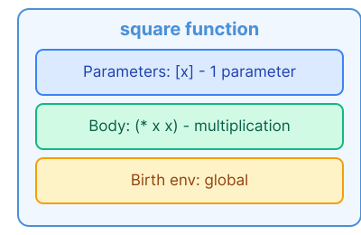

```
Call Process:

  (square 5)           ← Pass 5 to square

  1 Replace parameter x with 5: (* 5 5)
  2 Compute (* 5 5) → 25

  (square 12)          ← Pass 12 to square

  1 Replace parameter x with 12: (* 12 12)
  2 Compute (* 12 12) → 144
```

💡 In short: `lambda` is designing a machine on paper — you haven't built it yet. `(square 5)` means "build the machine from that blueprint, feed it 5, and return the output." Unlike a recipe (just instructions), a `lambda` is a **value** — you can store it in a variable, pass it to another function, or return it. Lambda produces a thing, not just directions.

**2 Recursion (Lisp has no loops, only functions calling themselves)**

Calculate factorial (5! = 5×4×3×2×1 = 120):

```lisp
(define factorial (lambda (n)
    (if (= n 1)
        1
        (* n (factorial (- n 1))))))
(factorial 5)   ; → 120
```

Notice something? Lisp has **no for loops, no while loops**. To repeat things, you need "a function calling itself" (recursion). That's because Lisp's designers started from mathematical theory (λ-calculus), choosing recursion as the sole repetition mechanism — mathematics has no concept of "loops," only recursive function definitions. Later Lisp dialects (such as Common Lisp) did add looping constructs, but recursion has always remained the core style of Lisp.

Below is the **Russian-doll-style breakdown** of `(factorial 5)`, showing how it computes 120 layer by layer.

The key thing to understand: in each layer's false branch `(* n (factorial (- n 1)))`, `(- n 1)` has to be computed first, then `(factorial ...)` also has to be computed first, and only then can `*` do its thing.

```
Review factorial's definition:
  (define factorial (lambda (n)
      (if (= n 1)                          ← condition
          1                                ← true branch (return 1 when n=1)
          (* n (factorial (- n 1))))))     ← false branch (run this when n≠1)

═══════════════════════════════════════════════════════════
Layer 1: Start computing (factorial 5)
═══════════════════════════════════════════════════════════

  First "unfold" factorial's function body—
  replace parameter n with 5, yielding:
    (if (= 5 1)
        1
        (* 5 (factorial (- 5 1))))

  1 Compute if's condition: (= 5 1)?
    These are three things: =, 5, 1. Let's see what each is:

```

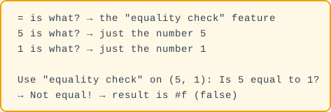

```

  2 if sees condition is #f → don't enter true branch, go to false branch:
    false branch: (* 5 (factorial (- 5 1)))

  3 This is multiplication. Multiplication needs two numbers, so compute each:

     First number to multiply: 5 (that's current n)

     Second number to multiply: (factorial (- 5 1))
     This is still nested! First compute the innermost (- 5 1):

```


```

     So (factorial (- 5 1)) becomes (factorial 4)
     → But what is (factorial 4)? Need to call factorial again!
     → Enter Layer 2 nesting doll!

  4 Pause—must wait for (factorial 4) to finish. After it returns:
     (factorial 5) = (* 5 (result of factorial 4))

═══════════════════════════════════════════════════════════
Layer 2: (factorial 4)
═══════════════════════════════════════════════════════════

  Similarly unfold the function body, replace n with 4, yielding:
    (if (= 4 1)
        1
        (* 4 (factorial (- 4 1))))

  1 Compute if's condition: (= 4 1)?

```


```

  2 if sees condition is #f → go to false branch:
    false branch: (* 4 (factorial (- 4 1)))

  3 Compute the two multiplicands:

     First number to multiply: 4 (current n)

     Second number to multiply: (factorial (- 4 1))
     First compute (- 4 1):

```


```

     So (factorial (- 4 1)) becomes (factorial 3)
     → But what is (factorial 3)? Need to call factorial again!
     → Enter Layer 3 nesting doll!

  4 Pause—must wait for (factorial 3) to finish. After it returns:
     (factorial 4) = (* 4 (result of factorial 3))

═══════════════════════════════════════════════════════════
Layer 3: (factorial 3)
═══════════════════════════════════════════════════════════

  Unfold, replace n with 3:
    (if (= 3 1)
        1
        (* 3 (factorial (- 3 1))))

  1 Compute if's condition: (= 3 1)?

```


```

  2 if sees condition is #f → go to false branch:
    false branch: (* 3 (factorial (- 3 1)))

  3 Compute the two multiplicands:

     First number to multiply: 3 (current n)

     Second number to multiply: (factorial (- 3 1))
     First compute (- 3 1):

```

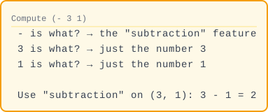

```

     So (factorial (- 3 1)) becomes (factorial 2)
     → Enter Layer 4 nesting doll!

  4 Pause—wait for (factorial 2). After it returns:
     (factorial 3) = (* 3 (result of factorial 2))

═══════════════════════════════════════════════════════════
Layer 4: (factorial 2)
═══════════════════════════════════════════════════════════

  Unfold, replace n with 2:
    (if (= 2 1)
        1
        (* 2 (factorial (- 2 1))))

  1 Compute if's condition: (= 2 1)?

```


```

  2 if sees condition is #f → go to false branch:
    false branch: (* 2 (factorial (- 2 1)))

  3 Compute the two multiplicands:

     First number to multiply: 2 (current n)

     Second number to multiply: (factorial (- 2 1))
     First compute (- 2 1):

```

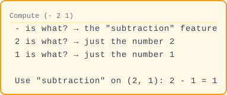

```

     So (factorial (- 2 1)) becomes (factorial 1)
     → Enter Layer 5 nesting doll!

  4 Pause—wait for (factorial 1). After it returns:
     (factorial 2) = (* 2 (result of factorial 1))

═══════════════════════════════════════════════════════════
Layer 5 (innermost, bottom-out!): (factorial 1)
═══════════════════════════════════════════════════════════

  Unfold, replace n with 1:
    (if (= 1 1)
        1
        (* 1 (factorial (- 1 1))))

  1 Compute if's condition: (= 1 1)?

```

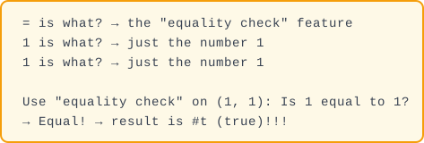

```

  2 if sees condition is #t → go to true branch: 1
    True branch is just a bare 1, no more computation needed!
    → Directly return 1

  Bottom! No more nesting! Start returning layer by layer!

═══════════════════════════════════════════════════════════
Return Process — returning from innermost layer outward
═══════════════════════════════════════════════════════════

  Layer 5: (factorial 1) returns 1
    │  (bottom hit, no more nesting)
    ▼
  Layer 4 receives 1: (factorial 2) = (* 2 1) = 2  → returns 2
    │  (2 is layer 4's n, 1 is the result of (factorial 1))
    ▼
  Layer 3 receives 2: (factorial 3) = (* 3 2) = 6  → returns 6
    │  (3 is layer 3's n, 2 is the result of (factorial 2))
    ▼
  Layer 2 receives 6: (factorial 4) = (* 4 6) = 24 → returns 24
    │  (4 is layer 2's n, 6 is the result of (factorial 3))
    ▼
  Layer 1 receives 24: (factorial 5) = (* 5 24) = 120 → final answer!
      (5 is layer 1's n, 24 is the result of (factorial 4))

═══════════════════════════════════════════════════════════
Algebraic expansion perspective (same process, expressed as formulas):
═══════════════════════════════════════════════════════════

  (factorial 5)
  = (* 5 (factorial 4))                    ← (- 5 1)=4, recursively compute (factorial 4)
  = (* 5 (* 4 (factorial 3)))              ← (- 4 1)=3, recursively compute (factorial 3)
  = (* 5 (* 4 (* 3 (factorial 2))))        ← (- 3 1)=2, recursively compute (factorial 2)
  = (* 5 (* 4 (* 3 (* 2 (factorial 1)))))  ← (- 2 1)=1, recursively compute (factorial 1)
  = (* 5 (* 4 (* 3 (* 2 1))))              ← (factorial 1) returns 1, no more expansion
  = (* 5 (* 4 (* 3 2)))                    ← compute backwards: 2×1=2
  = (* 5 (* 4 6))                          ← compute backwards: 3×2=6
  = (* 5 24)                               ← compute backwards: 4×6=24
  = 120                                    ← compute backwards: 5×24=120
```

💡 In short: Recursion breaks a big problem into smaller copies of itself. Can't compute 5! directly? Compute 4! and multiply by 5. Can't compute 4!? Ask further down... until you hit 1! = 1 (the base case), then climb back up.

**3 Closures (functions "remember" the environment they were born in)**

```lisp
(define make-counter (lambda (start)
    (lambda ()
        (set! start (+ start 1))
        start)))

(define counter (make-counter 0))
(counter)   ; → 1
(counter)   ; → 2
(counter)   ; → 3
```

`make-counter` returns a function that "remembers" the initial value of `start`. Each time you call it, `start` goes up by 1. This ability for "a function to package up external variables" is called a **closure**—one of the concepts Lisp first introduced.

`counter` is just the name we gave to the function returned by `(make-counter 0)` — it carries a backpack 🎒 containing `start=0`. Every `(counter)` call opens that same backpack.

⚡ **What's `set!`? And why didn't factorial need it?** — Pronounced "set-bang." `set!` modifies an existing variable; `define` creates a new one (think: labeling a new locker vs. swapping what's inside an existing one). Factorial creates fresh parameters with each recursive call, so it never needs to mutate. Counter's inner lambda has no parameters — the only way to change `start` is `set!`, reaching directly into the backpack. Using `define` would just create a local shadow, leaving the backpack untouched.

Let's **break it down like nesting dolls**, step by step, to see what actually happens.


## Formal Grammar (EBNF)

Our Lisp language can be formally defined with Extended Backus–Naur Form (EBNF):

```ebnf
program     = expression* ;
expression  = atom | list ;
atom        = number | symbol | string | boolean | nil ;
list        = "(" , expression* , ")" ;
number      = integer | float ;
symbol      = letter , { letter | digit | special } ;
string      = '"' , { any_character - '"' } , '"' ;
boolean     = "#t" | "#f" ;
nil         = "nil" | "()" ;

letter      = "a"..."z" | "A"..."Z" ;
digit       = "0"..."9" ;
special     = "+" | "-" | "*" | "/" | "=" | "<" | ">" | "!" | "?" | "_" ;
```

This grammar describes the syntax layer. At runtime, `(f a b)` can mean a function
call, a special form, or a macro — semantics are determined by the *evaluator*, not
the parser.


---

**Before we dive in: let's unpack `make-counter` itself first**

That first line looks a little dense—two `lambda`s nested inside each other. Here's what each piece does:

```
(define make-counter           ← ① name it, store it globally
  (lambda (start)              ← ② outer lambda: parameter = start
    (lambda ()                 ← ③ inner lambda: no parameters
      (set! start (+ start 1)) ← ④ inner body, line 1: bump start up by 1
      start)))                 ← ⑤ inner body, line 2: return start
```

make-counter itself:

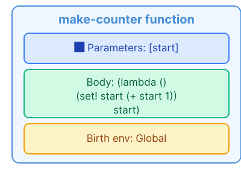

⚠️ **Heads-up**: make-counter's body is itself a lambda! Calling make-counter returns that inner lambda, not a number.

---

**Here's the big idea: every function carries a "backpack" 🎒**

Before we walk through the code, hold onto this image—it'll make every step click:

```
  When a function is created (born),
  it automatically stuffs every variable in sight into a "backpack,"
  and carries that backpack everywhere it goes.

  Later, when someone calls that function,
  it looks inside its own backpack first for any variable it needs,
  and only goes looking elsewhere if the backpack doesn't have it.

  The backpack = the environment where the function was born.
  That backpack is what a closure really is.
```

Alright. Now let's walk through it, one step at a time.

---

**🎎 Step 1: define make-counter**

```
Code:
  (define make-counter
    (lambda (start)
      (lambda ()
        (set! start (+ start 1))
        start))

Breaking it down:

  1 Lisp sees define → "oh, we're naming something"

  2 define's format: (define name value)
     name = make-counter
     value = (lambda (start)
               (lambda ()
                 (set! start (+ start 1))
                 start))

  3 Lisp evaluates the "value" part
     → hits lambda → "time to create a function"
     → parameter: start
     → body: (lambda () (set! start (+ start 1)) start)
     → 📸 birth environment: Global (no user variables in there yet)

  4 Package that function up, slap the label "make-counter" on it

Global environment now has one new entry:
```

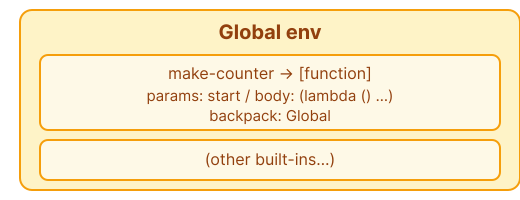

```
All this step did was "register a name." Nothing happened yet—make-counter hasn't been called.
```

---

**🎎 Step 1: calling (make-counter 0) — the moment the backpack is born**

```
Code: (define counter (make-counter 0))
       │      │         │
       │      │         └── argument 0, passed to make-counter
       │      └── a name we picked — call it anything (c / my-counter / x ...)
       └── define: bind this name to the value

This line does two things:
  1 Call (make-counter 0)
  2 Store whatever that returns under the name "counter"

First, unpack 1:

  Lisp sees (make-counter 0):
    → This is a function call
    → function = make-counter (look it up in the global environment)
    → argument = 0

  Call make-counter, binding the actual value 0 to the parameter start:

```

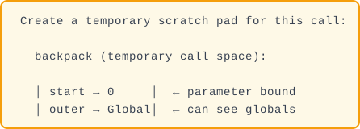

```
  │                                                 │
  │ Inside this notepad, evaluate make-counter's body:│
  │   (lambda () (set! start (+ start 1)) start)    │
  └─────────────────────────────────────────────────┘

  Evaluating the body — another lambda!
  → Create a second function (the inner one)
  → parameters: none, ()
  → body: two statements — (set! start (+ start 1)) then start
  → 📸 birth environment = {start: 0} ← THIS IS THE BACKPACK! 🎒

```

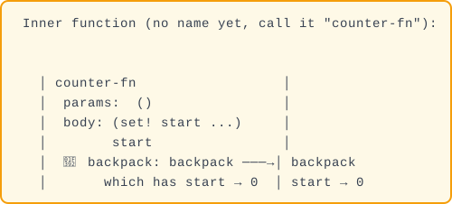

```
  └─────────────────────────────────────────────────┘

  KEY INSIGHT: counter-fn was born with start=0, which went into its backpack,
               so its backpack contains start=0.
               The backpack has start → 0.

               counter-fn takes that backpack with it
               wherever it goes. ← That's the closure!

  make-counter returns counter-fn (not a number—a function!)

2 Store the returned function as counter:

  (define counter (make-counter 0))
         │          │
         │          └── returned counter-fn
         │
         └── label that function "counter"

Global environment now:
```

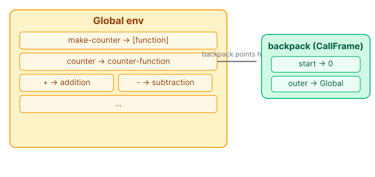

---

**🎎 Step 2: calling (counter) — the backpack in action**

The first call says it all. Subsequent calls follow the exact same pattern with different values of `start`. Let's walk through the first call, then check the state after each one.

```
Code: (counter)

① Lisp looks up counter in the global environment → finds counter-function

② counter-function has no parameters, so we just create a notepad:

   current scope:
```

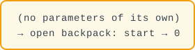

```

③ Execute the body:

   First: (set! start (+ start 1))

     Compute (+ start 1):
     → find start: not here → open backpack ✅ → 0
     → (+ 0 1) = 1

     set! writes 1 back to the backpack:
     → backpack is now: start → 1  (was 0, now 1!)

   Second: start
     → find start: not here → open backpack ✅ → 1
     → return 1

(counter) → 1 ✅
```

**Every subsequent call repeats this pattern. A new notepad each time, but outer always points to the same backpack, and set! always mutates the backpack's `start`:**

```
Call 1: (counter) → backpack.start: 0→1 → returns 1
Call 2: (counter) → backpack.start: 1→2 → returns 2
Call 3: (counter) → backpack.start: 2→3 → returns 3

Each call:
  each call ──opens──→ 🎒 {start}
                               └── start updated by set!: 0→1→2→3
```

💡 **In plain English**: A closure captures its birth environment like a **shared whiteboard** — every closure created in the same scope sees the same board. `set!` writes on that whiteboard, and all closures that share it see the change instantly. It's not a snapshot (frozen in time) — it's a live link. That's why we call it the backpack 🎒: each backpack contains live references, not photocopies.

📝 **Terminology note**: What we've been calling the "backpack" 🎒 and "notepad" is called a **CallFrame** (or stack frame) in CS. The rest of the tutorial uses CallFrame — just remember the backpack idea.

**4 Functions are values too (higher-order functions)**

In Lisp, functions are just like numbers and strings—you can pass them around freely:

```lisp
(define apply-twice (lambda (f x)
    (f (f x))))

(apply-twice square 3)   ; → 81
;; first square(3) = 9, then square(9) = 81
```

Here's the **nesting-doll breakdown** of `(apply-twice square 3)`:

```
Prepared:
  square = (lambda (x) (* x x))
  apply-twice = (lambda (f x) (f (f x)))

🎎 Outermost layer: (apply-twice square 3)

  1 Find apply-twice → Lambda { params=[f, x], body=(f (f x)) }
  2 Create CallFrame, bind parameters:
       f → square (square itself is also a Lambda!)
       x → Number(3)

  CallFrame now:
```

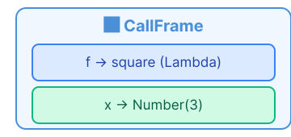

```
  3 Evaluate function body: (f (f x))

     First break down the inner (f x):
```

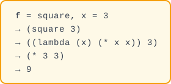

```

     Inner returns 9, now it becomes (f 9):
```

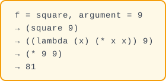

```

  Final: (apply-twice square 3) → 81 ✅

  KEY: The parameter f receives not a number, but the entire square function!
         Just like you can hand a recipe (rather than the finished dish) to another chef to follow.
```

**5 Code is Data (The most magical part)**

Remember how we said "code itself is also a list"? That means you can **write a program that writes other programs**:

```lisp
(define (twice expression)
    (list '+ expression expression))

(twice 5)           ; → (+ 5 5)         ← this is a piece of code
(eval (twice 5))    ; → 10              ← execute this code
```

Notice `(twice 5)` doesn't return the number `10`—it returns a list `(+ 5 5)`, which is **both data and code**. You can pass it to `eval` to execute it. This ability to "write programs that generate programs" is called a **macro**, one of Lisp's most powerful features.

In practice, Lisp macros let you create your own syntax—users can transform Lisp into a dialect that "looks like Python," "looks like SQL," "looks like plain English." That's what we meant earlier by "the programmable programming language."

---

### What Is an "Interpreter"?

An interpreter is a **translation program**: you feed in source code (text humans can read), it spits out the computed result (the value after the computer executes).

```
You see:   (+ 1 2)
       ↓ The interpreter does a bunch of work ↓
Computer executes:  3
```

How is that different from a **compiler**?
- **Compiler** (like C, Rust): Translates all source code to machine code at once, producing an executable file. Like translating an entire novel into English for publication.
- **Interpreter** (like Python, Lisp): Reads and executes on the fly, no file generation needed. Like simultaneous interpretation—you speak a sentence, they translate it.

We're building an interpreter—input code, get results immediately. This is also the foundation of a REPL (Read-Eval-Print Loop, the interactive programming environment).

---

### What Are We Building?

We're building a **Lisp interpreter**—feed it Lisp code, get back computed results:

```
Input: (+ 1 2)  →  Output: 3
Input: (define fact (lambda (n) (if (= n 0) 1 (* n (fact (- n 1))))))
Input: (fact 5)  →  Output: 120
```

We'll break this into **47 steps**, each building on the last based on dependencies:

```
Can evaluate numbers
├── Lexical analysis: split strings into Tokens
│   └── Syntax analysis: Token → Abstract Syntax Tree
├── Environment: variable name → value mapping
├── Lists + function calls: How does (+ 1 2) work?
├── Special forms: if / define / lambda
├── Closures + tail call optimization
├── Performance optimization: string interning, zero-copy, fast hashing
├── More special forms: begin / set! / let / cond / and / or / let* / letrec
├── Built-in functions: arithmetic, list operations, comparison, predicates, higher-order
└── REPL interactive interface
```

**The tutorial follows this order strictly, each step doing only one small thing. Like sculpting—rough out the shape first, then refine cut by cut.** All 47 steps are verifiable with `cargo test`.

### 🏆 What you can do after each milestone

| After | You can... | Prove it with |
|-------|-----------|---------------|
| Steps 1-3 | Rust + IDE installed, first test passing | `cargo test` |
| Steps 5-8 | Make the program "understand" numbers — `42` → `Number(42.0)` | `eval_str("42")` |
| Steps 9-15 | Parse nested expressions like `(+ 1 (* 2 3))` | `parse(tokens)` |
| Steps 12-13 | Bind names to values in an environment | `env.get("x")` |
| Steps 14-17 | **`(+ 1 2)` actually returns 3!** | `(+ 1 2)` → `3` |
| Steps 18-19 | Booleans, strings, numeric comparisons | `(> 5 3)` → `#t` |
| Steps 20-22 | Conditionals, variable definitions, creating and calling functions | `(define sq (lambda (x) (* x x)))` |
| Steps 23-26 | **Closures** (functions that remember their birthplace) + **10,000 levels of recursion without crashing** | `(loop 10000)` |
| Steps 27-30 | 5× faster interpreter (interning, zero-copy, FX hashing) | benchmarks |
| Steps 31-35 | 8 special forms (begin, set!, let, cond, etc.) | `(let ((x 1)) (+ x 2))` |
| Steps 36-47 | **A fully interactive REPL** | `cargo run` → type Lisp code |


**The diagram above is the skeleton of the entire project** — source code enters from the left, passes through four stages, and comes out the right as the computed result. The 47 steps ahead flesh out these four stages in detail.

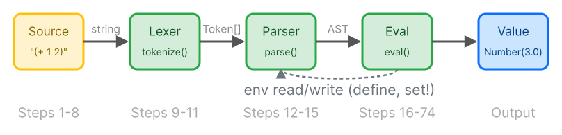

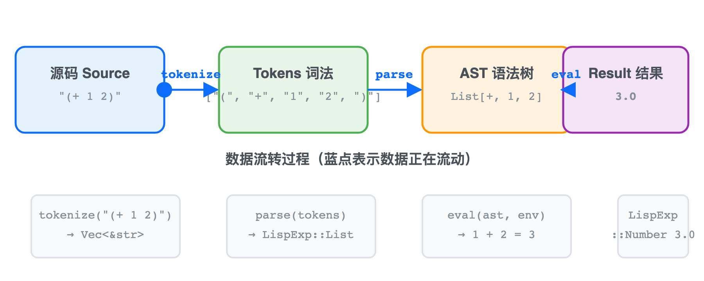

🎬 Blue dot shows data flowing from source through tokenize → parse → eval to result. [View SVG animation](svgs/pipeline-anim.svg)

---

### 📚 How does this compare to the classics?

If you've heard of these, here's where this tutorial fits:

| Resource | Language | Best for | How this tutorial differs |
|----------|----------|----------|--------------------------|
| [*Crafting Interpreters*](https://craftinginterpreters.com/) (Nystrom) | Java / C | Experienced programmers | Nystrom assumes you know Java and C, and builds two interpreters (tree-walk + bytecode). This tutorial does one pass (tree-walk) in Rust, targeting absolute beginners |
| [*SICP*](https://mitpress.mit.edu/sicp/) (Abelson & Sussman) | Scheme | Math-inclined learners | SICP teaches you *how to think about programming*. This tutorial teaches you *how to build an interpreter*. SICP explains principles; this explains implementations |
| [*mal - Make a Lisp*](https://github.com/kanaka/mal) (Kanaka) | 80+ languages | Intermediate programmers | mal gives you test cases with zero explanation. This tutorial gives you the *why* behind every step — not just what to write, but why it works |
| [*Write Yourself a Scheme*](https://en.wikibooks.org/wiki/Write_Yourself_a_Scheme_in_48_Hours) | Haskell | Haskell programmers | 48 hours is a sprint. This tutorial is 47 paced steps — you can stop at any point, run `cargo test`, and everything works |

**Bottom line:** If *Crafting Interpreters* is the graduate-level course, this tutorial is the undergraduate intro — same subject (building an interpreter), same method (TDD, testable milestones, diagrams), but starting from "what's a terminal?"

---


## Where Does Our Lisp Fit in the Lisp Family?

| Language | Evaluation | Scope | TCO | Mutability | Notable |
|----------|-----------|-------|-----|------------|---------|
| **Our Lisp** | Applicative order | Lexical (Rc<RefCell>) | ✅ Trampoline | `set!` limited | Zero deps, approx. 2K LOC (incl. tests) |
| **Scheme (R7RS)** | Applicative order | Lexical | ✅ Required | `set!` limited | Hygienic macros |
| **Common Lisp** | Applicative order | Lexical + Dynamic | ✅ Optional | Many mutators | CLOS, condition system |
| **Clojure** | Applicative order | Lexical | ✅ JVM-level | Persistent collections | JVM interop, STM |
| **Emacs Lisp** | Applicative order | **Dynamic** | ❌ | `setq` everywhere | Editor integration |

Our Lisp follows **Scheme** conventions most closely: lexical scoping, TCO requirement, and
the `cond`/`let`/`lambda` family. The main differences from Scheme are:

1. **No `call/cc`** — Scheme's universal escape operator is left as an extension exercise
2. **Simpler number system** — only `f64`, while Scheme has distinct integer/rational/real/complex towers
3. **No hygienic macros** — our macro system is simple text-based expansion
4. **Zero external dependencies** — even the test framework is built-in (`#[cfg(test)]`)


## What This Is NOT

A production Lisp implementation. It's a teaching interpreter — tree-walking `eval`, no bytecode compiler, no JIT. The optimization steps (40–43) demonstrate *how* the techniques work, not that they're necessary. If you want a production-grade Scheme on Rust, check out [scheme-rs](https://www.scheme.rs).


## Preparation
⏩ **Skip signal:** Already have Rust and an IDE installed? Jump to [Step 4](#step-4-define-core-types--lispexp-and-lisperr).


Why this matters: Before you can build an interpreter, you need a working Rust environment. This setup is the same foundation professional Rust developers use every day - get it right once, and everything else follows smoothly.

---

<blockquote class='pipeline-position'>
<details>
<summary><strong>📍 Pipeline Position</strong> — see where we are in the project</summary>

```
  (Environment setup — not yet in the code pipeline)
```

| | |
|---|---|
| ✅ Done | (Pre-pipeline — setting up environment) |
| 🎯 Install Rust + IDE, create a Cargo project, understand build/test cycle

</details>
</blockquote>

---
### Step 1: Install Rust + IDE

Rust is the programming language we'll use, RustRover is our IDE. Let's get them on your machine.

#### Install Rust

**System Requirements**: Any computer with a 4-core CPU, 8 GB RAM, and 10 GB free disk space (including Mac Apple Silicon and Intel) will run the full toolchain smoothly.

**Mac**:

1. Open "Terminal": Click the magnifying glass icon in the top-right corner of your screen, type "Terminal", double-click to open
2. **Copy the entire line below, paste it in, hit Enter:**

   ```
   curl --proto '=https' --tlsv1.2 -sSf https://sh.rustup.rs | sh
   ```
3. After text scrolls across the screen, **press 1 then Enter** (choose default installation)
4. Wait 2-5 minutes for it to finish

**Windows**:

1. Open a browser, go to <https://rust-lang.org/tools/install/>
2. Download `rustup-init.exe`, **double-click** to run
3. When the black window appears, **press Enter directly** (choose default)
4. Wait 2-5 minutes for it to finish

💡 In short: `rustup` manages Rust installations. `cargo` manages projects — like `npm` for Node or `pip` for Python. `rustup` installs both for you.

#### Install RustRover

**Option A — JetBrains Toolbox App (Recommended)**: Go to <https://www.jetbrains.com/toolbox-app/> → Download → Install → Open Toolbox → Find RustRover in the list → Click "Install". Toolbox keeps your IDE automatically updated.

**Option B — Direct Download**: Go to <https://www.jetbrains.com/rustrover/download/> → Click Download → Open `.dmg` (Mac) or double-click `.exe` (Windows) and follow the installer.

**Free License (Important!)**: First time opening RustRover → Select **"Free non-commercial use"** → Click "Log in to JetBrains Account" → Register a free account in your browser (email only, no credit card needed) → Return to RustRover to activate.

💡 In short: JetBrains offers a free individual license. Sign up with an email, zero cost. The Toolbox App handles updates automatically.

---

### Step 2: Create the Project

**Method 1: Using RustRover (Recommended for Beginners)**

Open RustRover, click **"New Project"**, and you'll see the creation dialog. The dialog has three areas:

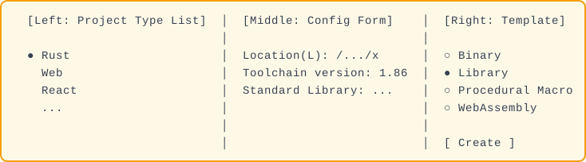


**1 Left: Click "Rust"** (at the top of the list). Make sure Rust is selected, not Web/React etc. RustRover will automatically detect your installed Rust toolchain — the "Toolchain version" field should fill in with something like `1.86`.

**2 Middle: Change the path.** Find the first line **"Location(L):"** and change the last part of the path from `untitled` to `lisp-rs`:

```
  ❌ .../rust-learning/untitled
  ✅ .../rust-learning/lisp-rs
```

Leave "Toolchain version" (auto-detected) and "Standard Library" path as-is.

**3 Right: Select template.** On the right is the **"Project Template"** radio group:

- `Binary(Application)` — produces an executable; not what we need
- **`Library`** ← Select this one!
- `Procedural Macro` — Rust compiler plugin, not needed now
- `WebAssembly Lib` — runs in the browser, also not needed

We're building a **Library**, not an Application. Choosing "Library" means the code only runs when other code references it—this is perfect for our interpreter.

**4 Bottom-right: Click the "Create" button.**

**Method 2: Using terminal commands (for those who like typing)**

Open Terminal, type:

```bash
cargo new lisp-rs --lib
cd lisp-rs
```

Both methods produce the exact same result. After Method 2, just use RustRover's **Open** to open the `lisp-rs` folder.

Wait for the progress bar in the bottom-right to finish.

**After the project is created, you'll see**:

```
Left file list:
  lisp-rs/
  ├── Cargo.toml           ← project config (name, version, etc.)
  └── src/
      └── lib.rs           ← our code goes here
```

Double-click `src/lib.rs`, and the default example code will appear in the editing area (an `add` function and a test). **Leave it as-is for now** — we'll use it to verify the toolchain works in the next step. We'll replace it with our own code starting at [Step 4](#step-4-define-core-types--lispexp-and-lisperr).

---

### Step 3: First Test Run

At the bottom of RustRover, find the **"Terminal"** tab (third icon from the bottom-left corner) and click it. This is RustRover's built-in terminal—we'll run commands here from now on.

In the terminal, type:

```bash
cargo test
```

Press Enter. The output should end with:

```
test result: ok. 1 passed; 0 failed
```

💡 In short: `cargo test` runs your tests. Green checkmarks mean you're good.

**Tip**: All `cargo test` commands in this tutorial should be typed in the **Terminal** at the bottom of RustRover. You can also click the green **Run** arrow (▶) in the gutter next to individual test functions, or open the **Run** panel (⌃R / Ctrl+R) to see a graphical test tree—same result, pick whichever you prefer.

🏋️ **Exercises**
1. (⭐) Change the project name from `lisp-rs` to whatever you like, then run `cargo test`
2. (⭐) Try `cargo build` in the terminal and see how it differs from `cargo test`


<details>
<summary>Click for answer</summary>

**1. Rename the project**
```bash
# Edit Cargo.toml line 1
[package]
name = "my-lisp"  # change this
```
`cargo test` still passes — project name is just an identifier.

**2. cargo build vs cargo test**
`cargo build` compiles without running tests. `cargo test` compiles + runs all `#[test]` functions. Both download dependencies on first run.
</details>

---

📖 **Next: [Understanding Values](#understanding-values)**


✅ **Summary**: Toolchain ready. `cargo test` passes. You can edit, build, and run Rust code.


## Understanding Values
⏩ **Skip signal:** Know Rust enums, `#[derive]`, and `match`? Jump to [Step 5](#step-5-the-eval-function).

⚠️ **Slow zone** — This chapter has high Rust concept density (enum / derive / f64 / pub / #[cfg(test)] / assert_eq!).
If you're struggling, that's normal—most learners spend extra time here.
Tip: type every code block into RustRover, get `cargo test` to pass before moving on.


The interpreter first needs to be able to "understand" numbers—input `42`, output `42.0`. This is the foundation of everything that follows.

---

<blockquote class='pipeline-position'>
<details>
<summary><strong>📍 Pipeline Position</strong> — see where we are in the project</summary>

```
  [LispExp core type] ← data foundation of the entire pipeline
```

| | |
|---|---|
| ✅ Done | (no pipeline yet) |
| 🎯 Define LispExp enum with Number, String, Bool, Nil, Symbol; add error handling with LispErr

</details>
</blockquote>

---
### Step 4: Define Core Types — `LispExp` and `LispErr`

The first thing our Lisp interpreter needs to handle is **numbers**. In Rust, we use `enum` to list "what exists in the world." Now **delete all the default example code** in `src/lib.rs` (the one we kept from Step 2) and replace it with:

```rust
// src/lib.rs
// --- Step one: define that "numbers" exist in the world ---

#[derive(Clone, Debug, PartialEq)]  // ← Let the compiler generate some functionality for us
pub enum LispExp {                   // ← Short for "Lisp Expression"
    Number(f64),                     // ← This is "number"
}
```

Computation can also go wrong — we need an error type to describe "what went wrong":

```rust
// src/lib.rs — Add below LispExp:

/// Error type — when computation goes wrong, use this to tell the user
#[derive(Debug, Clone, PartialEq)]
pub enum LispErr {
    Reason(String),  // String = a piece of text, e.g. "Something went wrong!"
}
```

💡 In short — `String`: a piece of text, any text. `"Hello"`, `"error: x not found"`, you name it.

🔧 **Rust Curve: `String` vs `&str`** — Rust has two string types: `String` (owned, heap-allocated, growable) and `&str` (a borrowed view of a string, like a reference). `Reason(String)` uses the owned version because errors need to live independently of their source. You will see `&str` later when we talk about zero-copy tokens in Steps 27-30.

Both core types are now defined — `LispExp` describes "what a value is," `LispErr` describes "what went wrong." The Rust deep dive below breaks down the concepts behind this code.

---

#### Rust Deep Dive: What's actually in those 4 lines?

These few lines are deceptively small—behind them lie **5 core Rust concepts**. Let's break them down one by one.

---

##### 1 `enum` — Enumeration Type (Algebraic Data Type)

```rust
pub enum LispExp {
    Number(f64),
}
```

**What is `enum`?**

`enum` (enumeration) is Rust's way of defining "what a value can be." It lists all **possible variants**. Each variant can carry its own data.

```rust
// A traffic light can only be one of three colors:
enum TrafficLight {
    Red,       // no attached data
    Yellow,
    Green,
}

// But each variant can carry different types and amounts of data:
enum Message {
    Quit,                           // no data
    Move { x: i32, y: i32 },       // anonymous struct
    Write(String),                  // carries a String
    ChangeColor(u8, u8, u8),       // carries three numbers (tuple variant)
}
```

To understand `ChangeColor(u8, u8, u8)` above, we first need to know what **basic data types** exist in Rust—these are the building blocks for all Rust programs.

🔧 **Rust Curve: Enums vs Inheritance** — In Java, Python, or C++, you would represent "something that could be a number or a symbol" using class inheritance with a base `Expression` class and subclasses. Rust uses `enum` instead — it is faster (no virtual dispatch, no heap allocation per variant) and safer (match exhaustiveness means you cannot forget a case). This is a concrete instance of the **expression problem** (famously discussed in SICP): a closed set of variants (enums) makes adding new operations easy (just add a `match` arm) but adding new variants requires editing all matches; inheritance is the opposite — new subclasses are easy but new operations require touching all classes. Rust chooses enum because an interpreter's data types are relatively stable, while its operations grow with every new feature.

---
##### Prerequisite Knowledge: Rust's Basic Type System

###### Integer Types

Rust's integer types are very rich—more than most languages:

| Type | Meaning | Range | Use Case |
|------|--------|-------|---------|
| `u8` | unsigned 8-bit | 0–255 (2⁸−1) | Color values (RGB 0-255 each), small numbers |
| `u16` | unsigned 16-bit | 0–65,535 (2¹⁶−1) | Unicode characters |
| `u32` | unsigned 32-bit | 0–4,294,967,295 (approx. 4.3 billion, 2³²−1) | File sizes |
| `u64` | unsigned 64-bit | 0–18,446,744,073,709,551,615 (approx. 1.84×10¹⁹) | Large numbers, timestamps |
| `usize` | pointer-sized (32/64-bit) | Depends on architecture (32-bit = u32, 64-bit = u64) | **Array/vector lengths, indices** |
| `i8` | **signed** 8-bit | −128 – 127 (−2⁷ – 2⁷−1) | Small range, can be negative |
| `i32` | **signed** 32-bit | −2,147,483,648 – 2,147,483,647 (approx. ±2.1 billion) | **Default integer type** |
| `i64` | **signed** 64-bit | −9,223,372,036,854,775,808 – 9,223,372,036,854,775,807 (approx. ±9.2×10¹⁸) | When large integers are needed |
| `isize` | pointer-sized signed | Depends on architecture (32-bit = i32, 64-bit = i64) | Memory difference calculations |

**Naming convention**: `u` = unsigned (only positive), `i` = signed (can be positive or negative), the number = **bits** of storage.

💡 In short: `u8` is 8 switches, each 0 or 1, giving 256 possible values (0-255). `u16` is 16 switches, giving 65,536 values. Same pattern for the rest.

```rust
let a: u8 = 255;           // u8 max is 255
// let b: u8 = 256;        // ❌ Compile error! 256 exceeds u8's range
let c: i32 = -100;         // i32 can be negative
let d: u64 = 1000000000;   // u64 can be very large
```

**Why does Rust have so many integer types?** To precisely control memory usage:
- `u8` takes only 1 byte (8 bits), good for storing color values (RGB each channel 0-255)
- `u64` takes 8 bytes, more precision but takes more space
- If your data won't exceed 255, using `u8` saves 7/8 of the memory compared to `u64`

Compare to Python: Python integers can be arbitrarily large (auto-expand), but every operation needs type checking and may trigger memory allocation—slow. Rust integers are fixed size, directly mapping to CPU registers, **zero overhead**. This is one reason Rust can be dozens of times faster than Python.

---

##### Float Types

| Type | Bits | Precision | Use Case |
|------|------|----------|---------|
| `f32` | 32-bit | approx. 7 decimal digits | Graphics, AI models |
| `f64` | 64-bit | approx. 15 decimal digits | **General computation (default)** |

`f` = float, the number = bits. `f64` is Rust's **default float type**—when you write `let x = 3.14`, Rust automatically infers it as `f64`.

```rust
let a = 3.14;         // f64 (default)
let b: f32 = 3.14;    // explicitly declared as f32
let c = 42.0;         // integer needs .0, otherwise Rust treats it as integer
```

We use `f64` in our project because it has enough precision and the CPU can process it almost as fast as `f32`.

---

##### Tuple — Packing different types together

A tuple packs **different types** of values into a single compound value. Created with **parentheses** `(...)`.

```rust
// A tuple containing: an i32, an f64, and a char
let t: (i32, f64, char) = (42, 3.14, 'A');

// Access elements with .0 .1 .2 (numbered from 0):
println!("{}", t.0);   // 42
println!("{}", t.1);   // 3.14
println!("{}", t.2);   // A
```

**Tuple characteristics:**
- **Fixed length**: cannot add or remove elements after creation
- **Types can differ**: `(i32, f64, char)` has different types at each position
- **Can be destructured**: `let (x, y, z) = t;`

```rust
// Practical use 1: Function returning multiple values
fn split_at_center(s: &str) -> (&str, &str) {
    let mid = s.len() / 2;
    (&s[..mid], &s[mid..])  // ..mid = from start to before mid, mid.. = from mid to end
}
let (left, right) = split_at_center("hello");
// left = "he", right = "llo"

// Practical use 2: Enum variant carrying data
// That's what ChangeColor(u8, u8, u8) is above—
// it's equivalent to an "anonymous tuple" as the variant's data
// ChangeColor carries an anonymous tuple (u8, u8, u8)
```

**`Message::ChangeColor(u8, u8, u8)` — this is a tuple variant**

`ChangeColor(u8, u8, u8)` is called a **tuple variant** in Rust. It's equivalent to:

```rust
// What you see:
Message::ChangeColor(r, g, b)

// Essentially it's a tuple (u8, u8, u8) stuffed into an enum variant
// You can destructure it:
if let Message::ChangeColor(r, g, b) = msg {
    println!("RGB({}, {}, {})", r, g, b);
}
```

💡 In a nutshell: A tuple packs multiple values together in parentheses. `(255, 0, 0)` holds three color values. Items can have different types — `(42, "hello", 3.14)` is `(i32, &str, f64)`.

---

##### Array — Same type, fixed length

An array arranges a **same type**, **fixed count** of values in a row. Created with **square brackets** `[...]`.

```rust
// An array of 3 i32s
let a: [i32; 3] = [10, 20, 30];
//         ↑  ↑
//     type   length

// Access with [index] (starting from 0):
println!("{}", a[0]);   // 10
println!("{}", a[1]);   // 20

// Array characteristics:
// Length fixed—a.len() is always 3, cannot increase or decrease
// Type uniform—all i32, cannot mix in f64

// Shorthand: initialize all to same value
let b = [0; 100];  // 100 zeros, equivalent to [0, 0, 0, ..., 0]
```

| Comparison | Tuple `(T1, T2)` | Array `[T; N]` |
|-----------|-----------------|---------------|
| Element types | **Can differ** | **Must be the same** |
| Length | Fixed (determined at creation) | Fixed (determined at creation) |
| Access method | `.0`, `.1`, ... | `[0]`, `[1]`, ... |
| Example | `(42, "hello")` | `[10, 20, 30]` |

---

##### Vector (`Vec<T>`) — Same type, dynamic length

`Vec` (pronounced "vector") is the most important collection type in Rust—it stores the same type like an array, but its **length can change**.

```rust
// Create an empty Vec to store i32
let mut v: Vec<i32> = Vec::new();

// Add elements (length grows automatically):
v.push(10);
v.push(20);
v.push(30);     // v is now [10, 20, 30]

// Access elements:
println!("{}", v[0]);    // 10
println!("{}", v[1]);    // 20

// Get length:
println!("{}", v.len()); // 3

// Iterate:
for x in &v {
    println!("{}", x);
}
```

| Comparison | Array `[T; N]` | Vector `Vec<T>` |
|-----------|---------------|-----------------|
| Length | **Fixed at compile time** | **Variable at runtime** |
| Memory location | **Stack** (fast) | **Heap** (slightly slower but flexible) |
| Performance | Faster | Slightly slower (may trigger reallocation) |
| Use case | Small fixed-size data | Variable-length data |

💡 In short: An array is a fixed row of cups — you can't add or remove them. A `Vec` is an expandable cup holder — pour more in and it grows. Downside: occasional "rearranging" (reallocation).

Our project uses `Vec` extensively—for example, Lisp's list `List(Vec<LispExp>)` uses a `Vec` to hold any number of elements.

---

```rust
// Now looking back at this example, it all makes sense:
enum Message {
    Quit,                           // empty variant—no data
    Move { x: i32, y: i32 },       // struct variant—two i32 fields
    Write(String),                  // tuple variant—one String
    ChangeColor(u8, u8, u8),       // tuple variant—three u8s as a tuple
}
// Using an array would also work: ChangeColor([u8; 3]) is fine, just using [] instead of ()
```

**Why does Rust use `enum` instead of other languages' `null`?**

Many languages (Java, JavaScript, Python) use `null` or `undefined` to mean "no value." But `null` is a **billion-dollar mistake** (Tony Hoare, the inventor of null, said so himself)—you never know if a variable might be null, so your program can crash at runtime.

Rust uses `enum` to solve this problem:

```
Other languages:   let x = getSomething();  // x might be null!
                   x.doSomething();          // if x is null → crash!

Rust:              let x: Option<i32> = getSomething();
                   // x could be Some(42) or None, the compiler forces you to handle both
                   match x {
                       Some(v) => doSomething(v),  // has value → use it
                       None => handleError(),       // no value → handle error
                   }  // no chance of crash
```

**`LispExp` is a "pocket inventory" of what can be carried**. Right now there's only `Number(f64)`, later we'll add `Symbol`, `List`, `Bool` and other variants.

Compare to other languages: In Python you can do `x = 42; x = "hello"`—variables can change type freely. Rust doesn't allow this; you must use `enum` to explicitly declare "this variable could be a number or a string." This sounds like extra work, but it lets the compiler catch type-mismatch bugs early.

---

##### 2 `f64` — Floating Point Type

`f64` is Rust's **double-precision floating point** (64-bit). Simply put, it's "a number with a decimal point."

```rust
let a: f64 = 3.14;       // has decimals
let b: f64 = 42.0;       // integer also needs .0
let c: f64 = -1.5e10;    // scientific notation
```

Rust has two float types:

| Type | Bits | Precision | Use Case |
|------|------|----------|---------|
| `f32` | 32-bit | approx. 7 decimal places | Graphics, memory saving |
| `f64` | 64-bit | approx. 15 decimal places | **General computation (default)** |

Why choose `f64`? Because modern CPUs process `f64` and `f32` at almost the same speed, but `f64` has twice the precision. Lisp's numeric calculations need precision, so we use `f64`.

💡 In short: `f64` is a decimal number, precise to about 15 digits. Plenty for everyday use.

---

##### 3 `#[derive(Clone, Debug, PartialEq)]` — Let the Compiler Write Code for Us

This line is **one of Rust's most powerful features**—the **derive macro**. It tells the compiler: "automatically implement these capabilities for me."

```rust
#[derive(Clone, Debug, PartialEq)]
//         ↑       ↑        ↑
//         copy    print     compare
pub enum LispExp { ... }
```

**What does each `derive` actually do?**

| Derive | 💡 Simply put | What it does | Why we need it |
|--------|-----------------|-------------|---------------|
| **Clone** | "Photocopier" | Adds `.clone()` method, can make a copy | We often need to copy `LispExp`, without Clone we can't |
| **Debug** | "Receipt" | Adds `{:?}` formatting, can print `LispExp`'s content | Debugging to see variable values, without Debug we can't see them |
| **PartialEq** | "Scale" | Adds `==` operator, can compare two `LispExp` for equality | Tests need to check if results are correct |

**What happens without `derive`?**

If we don't write `#[derive(...)]`, we'd have to manually implement these capabilities for `LispExp`:

```rust
// Manual version without derive (~30 lines):
impl Clone for LispExp {
    fn clone(&self) -> Self {
        match self {
            LispExp::Number(n) => LispExp::Number(*n),
        }
    }
}
impl fmt::Debug for LispExp {
    fn fmt(&self, f: &mut fmt::Formatter) -> fmt::Result {
        match self {
            LispExp::Number(n) => write!(f, "Number({})", n),
        }
    }
}
impl PartialEq for LispExp {
    fn eq(&self, other: &Self) -> bool {
        match (self, other) {
            (LispExp::Number(a), LispExp::Number(b)) => a == b,
        }
    }
}
```

**`derive` is a "laziness tool"**—telling the compiler "my type needs these capabilities, generate the code for me using the standard approach." Almost all basic types should have these three derives.

💡 In short: `#[derive(Clone, Debug, PartialEq)]` is like telling your assistant "handle copying, printing, and comparing for this type." Doing those three by hand takes 30+ lines of boilerplate; the derive macro finishes in a blink. It's a secretary you dictate intent to, not a form you fill out.

Rust's design philosophy: Rust's trait system requires you to "explicitly declare each capability you want." Unlike Python where all objects can be printed and compared—Rust requires you to explicitly say "this type supports printing." This sounds tedious, but it means you'll never accidentally compare two things that shouldn't be compared.

---

##### 4 `pub` — Visibility

```rust
pub enum LispExp { ... }
//  ↑
//  public, other files can use it too
```

All types and functions in Rust are **private** by default (only the current file can see them). Adding `pub` makes them **public** (other files can reference them).

```rust
// Default private (without pub):
enum SecretType { ... }   // only usable within this .rs file

// Public:
pub enum LispExp { ... }  // other files reference via use crate::LispExp
```

Rust's design philosophy: Rust defaults **everything to private**, and you actively choose what to make public. This is the opposite of Java (default public). Rust's philosophy is "principle of least privilege"—only expose what must be exposed, reducing misuse.

---

##### 5 Module System: How Are Tests Organized?

Put tests at the end of the file:

```rust
#[cfg(test)]                    // ← Conditional compilation: only compile when testing
mod tests {                     // ← Define a test module
    use super::*;               // ← Import everything from parent module

    #[test]                     // ← Mark this as a test function
    fn test_create_number() {
        let n = LispExp::Number(42.0);
        assert_eq!(n, LispExp::Number(42.0));
    }
}
```

**Line-by-line breakdown:**

| Code | Meaning | Rust Concept |
|------|--------|-------------|
| `#[cfg(test)]` | "This module only compiles in test mode" | **Conditional compilation** — `cfg` = configuration |
| `mod tests { }` | Define a sub-module called `tests` | **Module system** — code organization |
| `use super::*;` | "Import everything from the parent scope" | **Paths and imports** — `super` = parent module |
| `#[test]` | "This is a test function" | **Attribute macro** — gives compiler extra info |
| `fn test_create_number()` | Define a function | **Function definition** — `fn` = function |
| `let n = ...` | Create a variable | **Variable binding** — `let` declaration |
| `assert_eq!(a, b)` | Assert that a and b are equal | **Macro** — things ending with `!` are macros, not functions |

**`#[cfg(test)]` — Conditional Compilation**

`cfg` = configuration. `#[cfg(test)]` means: **only compile this code when running `cargo test`**. When running `cargo build`, this code is skipped entirely.

```rust
#[cfg(test)]  // test-only code, won't appear in the final release build
mod tests {
    // ...
}
```

**Why do we need `#[cfg(test)]`?**
- Test code is usually large (sometimes exceeds the business code), not needed in releases
- Conditional compilation completely excludes test code from release builds
- `cargo build --release` produces a program without any test code—smaller, faster

💡 In short: `#[cfg(test)]` means "only compile this during testing." Like work clothes — on during the job, off for the release.

**`mod tests` — Test Module**

Rust's testing convention: write a `mod tests` module at **the end of each source file**, containing tests related to that file. Benefits:
- Tests are next to the code they test, easy to reference
- Tests can access **private** functions (since `tests` is a child module of the current file)
- `cargo test` automatically discovers all `#[test]` functions

Compare to other languages:
- Python puts tests in separate `test_xxx.py` files
- Java puts them in a separate `src/test/` directory
- Rust: **tests and code are together**—this is the Rust community convention

💡 In short: In Rust, tests and code live in the same file — like a quality-inspection report stapled to the product. Every crate ships with its own test suite built in. You never have to hunt through a separate `tests/` directory to find the tests for a module.

**`use super::*;` — Referencing parent module content**

`super` in Rust's module path means "parent module." Since `mod tests` is a child module defined inside `lib.rs`, its parent is `lib.rs`'s root scope. `super::*` imports everything from the parent module (`LispExp`, `LispErr`, `eval`, etc.).

```
lib.rs root scope
│  pub enum LispExp { ... }
│  pub enum LispErr { ... }
│  pub fn eval(...) { ... }
│
└── mod tests (child module)
    │  use super::*;  ← imports all three things above
    │  // Now LispExp, LispErr, eval can be used directly
```

**`let` — Variable Binding**

```rust
let n = LispExp::Number(42.0);  // `let` binds the value Number(42.0) to the name n
```

`let` in Rust is called "variable binding," not "variable assignment." Why? Because Rust variables are **immutable by default**:

```rust
let x = 42;    // immutable — can't change
// x = 43;     // ❌ Compile error!

let mut y = 42;  // `mut` makes it mutable — y = 43 now compiles
y = 43;          // ✅ OK
```

Rust design philosophy: Immutability by default is one of Rust's core designs. In most languages, variables are mutable by default (can change), and you add `const` or `final` to make them immutable. Rust does the opposite—**immutable by default, explicitly say `mut` if you want changes**. This reduces a huge number of bugs caused by accidental modifications.

**`LispExp::Number(42.0)` — Creating an enum value**

This is the syntax for creating the `Number` variant of the `LispExp` enum:
- `LispExp::` — enum type name
- `Number(42.0)` — variant name + data in parentheses

**`assert_eq!` — Assertion Macro**

```rust
assert_eq!(n, LispExp::Number(42.0));
// If n and Number(42.0) are equal → test passes ✅
// If not equal → test fails, outputs both values ❌
```

`assert_eq!` is a **macro** (not a function). Difference between macros and functions:
- **Function**: `function_name(parameters)`
- **Macro**: `macro_name!(parameters)` — note the `!` at the end

Macros can do things functions cannot (like automatically extracting file names and line numbers), so Rust's test assertions all use macros.

---

**Running the test:**

```bash
cargo test
```

You should see:
```
running 1 test
test tests::test_create_number ... ok

test result: ok. 1 passed; 0 failed
```

**Three conditions for passing a test:**
1. Code **compiles** successfully (Rust compiler does the first check)
2. `test_create_number` function is marked with `#[test]`
3. `assert_eq!` doesn't "yell"—both sides are equal

💡 In short: `cargo test` checks your work. `ok` means you're good. Tests not only verify correctness — they also prove the code compiles and runs.

---

#### Rust Knowledge Checklist

| Concept | Keyword/Syntax | Explanation |
|---------|---------------|-------------|
| Enum type | `enum` | List all possible values (algebraic data type) |
| Enum variant | `Number(f64)` | A specific possibility, can carry data |
| Derive macro | `#[derive(...)]` | Automatically implement traits like Clone, Debug, PartialEq |
| Floating point | `f64` | 64-bit double-precision float, numbers with decimals |
| Visibility | `pub` | Make type or function public, visible to other files |
| Conditional compilation | `#[cfg(test)]` | Only compile in test mode |
| Module | `mod` | Code organization unit |
| Test | `#[test]` | Mark a test function |
| Import | `use super::*` | Import everything from parent module |
| Variable binding | `let` | Create a variable (immutable by default) |
| Assertion macro | `assert_eq!` | Test if two values are equal |

```rust
let n = LispExp::Number(42.0);
//    ↑  ↑
//    │  └─ what's written on the label
//    └─ apply the label!
// This means: "Stick the label n on the value LispExp::Number(42.0)"
```

💡 In short — `assert_eq!`: checks two values are equal. Equal? Silent pass. Not equal? Loud failure. "Expected 42, got 42? Good."

```bash
cargo test
# running 1 test
# test tests::test_create_number ... ok   ← seeing ok means correct!
```

**Current complete `lib.rs`**:

```rust
// src/lib.rs

#[derive(Clone, Debug, PartialEq)]
pub enum LispExp {
    Number(f64),          // number type
}

#[derive(Debug, Clone, PartialEq)]
pub enum LispErr {
    Reason(String),       // error message
}

// ── Tests ──
#[cfg(test)]
mod tests {
    use super::*;

    #[test]
    fn test_create_number() {
        let n = LispExp::Number(42.0);
        assert_eq!(n, LispExp::Number(42.0));
    }
}
```

```bash
$ cargo test
running 1 test
test tests::test_create_number ... ok

test result: ok. 1 passed; 0 failed
```

---

🏋️ **Exercises**
1. (⭐) Add a `Character(char)` variant to `LispExp` to represent a single character
2. (⭐⭐) Think about why Rust's `enum` is more powerful than C's `enum`. (Hint: C's enum variants can't carry data)


<details>
<summary>Click for answer</summary>

**1. Add `Character` variant**
```rust
pub enum LispExp {
    Number(f64),
    Character(char),  // new
}
```

**2. Rust enum vs C enum**
C enums are just integer aliases (`enum Color { RED=0, GREEN=1 }`). Rust enum variants can carry data: `Number(f64)` holds an f64, `List(Vec<LispExp>)` holds a vector. This makes Rust enums a safe alternative to tagged unions.

3. (⭐⭐⭐) **Think first**: If you wrote `eval_str("\"hello\" + 42")`, what do you think would happen
   *before* you run it? Would Rust's type system catch it at compile time, or would it fail at runtime?
   Why? Run it and see if your prediction was right.
</details>

---

📖 **Next: [Let the Program Compute](#making-programs-compute)**

🧠 **Mental Model Checkpoint**: After this chapter, you should think of the interpreter as a value factory - source code goes in, `LispExp` values come out. `LispExp` is your universal data type, the currency of the entire interpreter.


✅ **Summary**: Core types define what values exist in our language; `Result<LispExp, LispErr>` is the universal return type.

---

### 🎯 Blank Paper Checkpoint

Close the tutorial. Open a blank file. In **15 minutes**, complete:

- [ ] Define `LispExp` enum (with `Number(f64)` variant)
- [ ] Define `LispErr` enum (with `Reason(String)` variant)
- [ ] Derive `Clone, Debug, PartialEq` on both
- [ ] Write a test: create `Number(42.0)` and assert it equals itself

⏱️ **Time limit: 15 minutes**. If you can't do it, go back and review.
**Do NOT look at the tutorial code** — you may look at the plain-English explanations.


## Making Programs Compute
⏩ **Skip signal:** Familiar with Rust function signatures and `Result`? Skim this — the key takeaway is the `eval` pipeline.

Now that we have the number type, we also need to "evaluate"—compute results from numeric expressions, opening up the entire source-to-value pipeline.

---

<blockquote class='pipeline-position'>
<details>
<summary><strong>📍 Pipeline Position</strong> — see where we are in the project</summary>

```
  [Source] → [◉ Evaluator skeleton] → [Output]
  Start building the eval function
```

| | |
|---|---|
| ✅ Done | Number, Bool, Nil, String, Symbol type |
| 🎯 Build the eval function skeleton; wire up the full source-to-value pipeline

</details>
</blockquote>

---
### Step 5: The `eval` Function

```text
📥 Input: Number(42.0)    📤 Output: Ok(Number(42.0))
         AST node              Evaluated result
```

**Temporary arrangement**: Currently the project only has `lib.rs` as a single file, so `eval` is placed here temporarily. Once the project has more files (around step 40), `eval` will be moved to a new file `src/interpreter.rs`—it belongs to the "evaluator" module, separate from type definitions for better organization.

**Requirement**: Input `Number(42.0)`, output `Number(42.0)`. Numbers don't need "computation"—they are the answer themselves.

**Write the test first** (add to `mod tests`):

```rust
// src/lib.rs
#[test]
fn test_eval_number() {
    let exp = LispExp::Number(42.0);      // create a number
    let result = eval(&exp).unwrap();      // call eval to evaluate
    assert_eq!(result, LispExp::Number(42.0)); // result is still 42
}
```

Run `cargo test` → ❌ Compiler error:

```
error[E0425]: cannot find function `eval` in this scope
  --> src/lib.rs:NN:22
   |
NN |         let result = eval(&exp).unwrap();
   |                      ^^^^ not found in this scope
```

Normal! First write the test, watch it fail, then write code to make it pass—this is TDD.

**Write the `eval` function** (add below `LispErr`, above `#[cfg(test)]`):

```rust
// src/lib.rs
/// Evaluation function — compute the "value" of an expression
pub fn eval(exp: &LispExp) -> Result<LispExp, LispErr> {
    match exp {
        LispExp::Number(n) => Ok(LispExp::Number(*n)),
        //         ↑↑                      ↑↑
        //         ││                      ││
        //  "matches Number(n)"   "returns Number(*n)"
        //     extract inner value n      re-wrap n
    }
}
```

💡 In short — Why the `*` in `*n`?

`eval`'s parameter is `exp: &LispExp` — we borrowed the expression, we don't own it. So when `match` extracts the value from `Number`, the `n` we get is also borrowed: `n: &f64`.

But `LispExp::Number(...)` needs an **owned** `f64`, not a reference.

`*n` copies the borrowed value, making it ours:

```
&LispExp::Number(42.0)
       │ match
       ▼
   n = &42.0           ← still borrowed
       │ *n
       ▼
     42.0              ← now owned
       │ LispExp::Number(...)
       ▼
LispExp::Number(42.0)  ← fresh, owned LispExp
```

`f64` is a `Copy` type, so dereferencing auto-copies — like photocopying a friend's notebook. The original stays with them, you take the copy.

Right now `LispExp` only has `Number`, so this `match` compiles. Later we'll add more types to `LispExp` (Symbol, List, etc.)—at that point, `match` will need to handle all variants, or the compiler will throw a `non-exhaustive patterns` error. We'll first encounter this in [Step 8](#step-8-create-parserrs) when we add `Symbol`, and add a catch-all branch then.

```rust
// src/lib.rs
pub fn eval(exp: &LispExp) -> Result<LispExp, LispErr> {
    match exp {
        LispExp::Number(n) => Ok(LispExp::Number(*n)),
    }
}
```

`cargo test` → ✅ Tests pass, no warnings:

```
$ cargo test
    Finished `test` profile [unoptimized + debuginfo] target(s) in 0.31s
     Running unittests src/lib.rs (target/debug/deps/lisp_rs-5cd87530e74cecce)

running 2 tests
test tests::test_create_number ... ok
test tests::test_eval_number ... ok

test result: ok. 2 passed; 0 failed; 0 ignored; 0 measured; 0 filtered out; finished in 0.00s
```

**Diagram — how match works**:

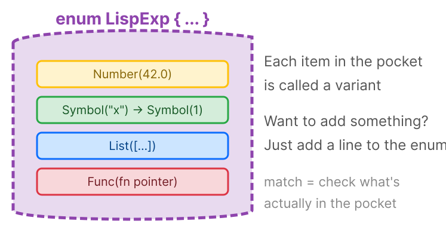

💡 In short — `Result`: Rust's "might succeed, might fail" type.

```rust
Result<LispExp, LispErr>
       │         │
       │         └─ error on failure
       └─ value on success
```
Like a delivery package: you get what you ordered (Ok) or a "sorry we missed you" note (Err).

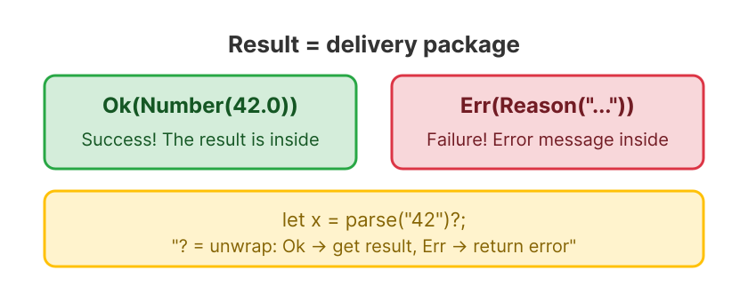

- `Ok(Number(42.0))` → Success! Result is the number 42
- `Err(LispErr::Reason("Something went wrong"))` → Failure! Reason is "Something went wrong"

💡 In short — `&` means "borrow." You get temporary access without taking ownership.

```rust
fn eval(exp: &LispExp)  // borrow, don't take
```

Like checking out a library book — it's still the library's, you're just reading it. Rust's ownership system guarantees you'll return it.

---

### Step 6: From "String" to "Result"

```text
📥 Input: "42" (source string)    📤 Output: Ok(Number(42.0)) (evaluated result)

  "42" → trim → "42" → parse::<f64> → 42.0 → Number(42.0) → eval → Ok(Number(42.0))
```

For now we parse manually, without relying on lexer/parser:

```rust
// src/lib.rs
/// Helper function: evaluate directly from source string
fn eval_str(source: &str) -> Result<LispExp, LispErr> {
    // Convert the string to a number
    let num: f64 = source
        .trim()                                    // remove leading/trailing whitespace
        .parse()                                   // try to parse as f64
        .map_err(|_| LispErr::Reason(              // conversion failed → error
            format!("Not a number: {}", source)
        ))?;
    eval(&LispExp::Number(num))                    // pass to eval
}

#[test]
fn test_eval_str_number() {
    assert_eq!(eval_str("42").unwrap(), LispExp::Number(42.0));
}
```

```text
Data flow (assuming user typed " 42 ", with spaces):
" 42 "  →  trim()  →  "42"  →  parse::<f64>()  →  42.0_f64
→ Number(42.0) → eval → Ok(Number(42.0))
```

💡 In short — `\n` is the "newline character," what you get when you hit Enter. Type `42` and press Enter? The computer sees `42\n`. `trim()` strips it out along with spaces.

```bash
$ cargo test
warning: function `eval_str` is never used
  --> src/lib.rs:NN:4
   |
NN | fn eval_str(source: &str) -> Result<LispExp, LispErr> {
   |    ^^^^^^^^
   |
   = note: `#[warn(dead_code)]` (part of `#[warn(unused)]`) on by default

warning: `lisp-rs` (lib) generated 1 warning
    Finished `test` profile [unoptimized + debuginfo] target(s) in 0.63s
     Running unittests src/lib.rs (target/debug/deps/lisp_rs-5cd87530e74cecce)

running 3 tests
test tests::test_create_number ... ok
test tests::test_eval_str_number ... ok
test tests::test_eval_number ... ok

test result: ok. 3 passed; 0 failed; 0 ignored; 0 measured; 0 filtered out; finished in 0.00s
```

💡 In short — Why this warning?

**`function 'eval_str' is never used` (dead_code)**: `eval_str` isn't marked `pub`, and nothing in non-test code calls it—the compiler thinks it's "dead code." But it IS called by the test function under `#[cfg(test)]`, so tests pass fine.

💡 **Annoyed by the `dead_code` warning?** Just add `pub` to `eval_str`: `pub fn eval_str(...)`. This tells the compiler it's a public API, and the warning goes away. But leaving it is fine too—it's just a reminder, not an error.

💡 In short — The `?` operator: "if this fails, return the error now." Saves writing `if error { return error }` a hundred times.

Like a line cook: "Can't make this dish? Tell the waiter immediately, don't try to keep going."

💡 In short — `format!` is like `println!` but returns a String instead of printing. The `{}` is a placeholder that gets filled in with the value.

**✅ Milestone: Minimal usable interpreter! Input "42" outputs Number(42.0).**

But `eval_str("(+ 1 2)")` would fail — `"(+ 1 2)"` is not a valid number. To handle multi-element expressions, we need to first **split the string into words** (lexing), then **understand the structure** (parsing). That's what the next two chapters do.

---

🏋️ **Exercises**
1. (⭐) Modify `eval_str` to also handle `"true"` and `"false"` string inputs (don't use Bool type yet, just return strings)
2. (⭐⭐) `eval` only has one branch right now (Number). What happens when you input a negative number like `-42`? How would you fix it?


<details>
<summary>Click for answer</summary>

**1. Support true/false**
```rust
fn eval_str(source: &str) -> Result<LispExp, LispErr> {
    let trimmed = source.trim();
    if trimmed == "true"  { return Ok(LispExp::Symbol("true".into())); }
    if trimmed == "false" { return Ok(LispExp::Symbol("false".into())); }
    let num: f64 = trimmed.parse()
        .map_err(|_| LispErr::Reason(format!("Not a number: {}", source)))?;
    eval(&LispExp::Number(num))
}
```

**2. -42 handling**
The lexer splits `-42` into `["-", "42"]` — minus is treated as subtraction. The fix: `parse_atom` already calls `token.parse::<f64>()`, and `"-42".parse::<f64>()` returns `Ok(-42.0)` — so it actually works correctly already!
</details>

What we're solving: Break the source string into a list of Tokens. Like reading a sentence, you split it into words first—once you have the words, you can figure out what the sentence means. — Lexer


✅ **Summary**: `eval` takes an expression, returns a value or error. The interpreter pipeline is connected end-to-end.

---

### 🎯 Blank Paper Checkpoint

Close the tutorial. In **20 minutes**, complete:

- [ ] Define `LispExp` (with `Number`, `Symbol`, `Bool`, `Nil`, `String` variants)
- [ ] Define `LispErr`
- [ ] Write `eval` function: input `Number(42.0)` returns `Number(42.0)`
- [ ] Write `eval_str` function: input `"42"` returns `Number(42.0)`
- [ ] Write tests to verify

⏱️ **Time limit: 20 minutes**. Do NOT look at the tutorial code.


Why this matters: The lexer is the interpreter's eyes - it reads raw text and identifies the meaningful units (tokens). Every compiler and interpreter starts with a lexer, making this a transferable skill you'll use in any language implementation.

## Splitting Sentences into Words
⏩ **Skip signal:** Know lexing/tokenizing? Jump to [Step 8](#step-8-create-parserrs).

---

<blockquote class='pipeline-position'>
<details>
<summary><strong>📍 Pipeline Position</strong> — see where we are in the project</summary>

```
  [Source] → [◉ Lexer] → [Parser] → [Evaluator] → [Output]
                tokenize()
```

| | |
|---|---|
| ✅ Done | eval handles self-evaluating literals |
| 🎯 Write a lexer (tokenize) that splits source text into tokens; handle parens, whitespace, comments, strings

</details>
</blockquote>

---
### Step 7: Create the Lexer

```text
📥 Input: "(+ 1 2)" (source string)    📤 Output: ["(", "+", "1", "2", ")"] (Token list)
         One block of text                  Split into words
```

Step 6's `eval_str("(+ 1 2)")` fails — because `"(+ 1 2)"` is not a valid number. To handle multi-element expressions, the first step is to **split the string into words**. That's the lexer's job.

🔮 **Guess before reading on**: What do you think `tokenize("(* 2 (+ 3 4))")` will return? Write your guess on paper, then keep reading — see if you got it right.

**1. Create the file + register the module**

In RustRover's left file list, **right-click the `src` folder** → **New** → **File**, enter `lexer.rs`, press Enter.

Add a line at the top of `lib.rs`:

```rust
// src/lib.rs
pub mod lexer;  // "I also have a file called lexer.rs"
```

💡 In short — In Rust, each `.rs` file is a "module." `mod lexer;` tells Rust "find `lexer.rs` and include it." Like a table of contents entry.

`pub mod` vs `mod`: `pub` means "public," code outside can see it. Without `pub`, it's "private," only usable within the module itself.

**2. Write the first tokenize — split by whitespace**

```rust
// src/lexer.rs — Complete content

/// Break source string into Tokens (like splitting a sentence into words)
pub fn tokenize(input: &str) -> Vec<String> {
    input
        .split_whitespace()      // split by whitespace
        .map(|s| s.to_string())  // convert each piece to its own String
        .collect()               // collect into a Vec
}
```

💡 In short — `Vec<String>`: an auto-expanding list of Strings.

```
Vec<String>: [ "(", "+", "1" ]
               0    1    2
```

Like a shopping list — add items, remove items, look things up by position.

💡 In short — `|s| s.to_string()` is a closure (anonymous function). `|s|` is the input, `s.to_string()` is the processing. Read it as: "take each `s` and convert it to a String."

Like an assembly line — every item gets the same operation before moving on.

**3. Test basic splitting**

```rust
// src/lexer.rs — add test module at end of file
#[cfg(test)]
mod tests {
    use super::*;

    #[test]
    fn test_tokenize_multi() {
        assert_eq!(tokenize("+ 1 2"), ["+", "1", "2"]);
    }

    #[test]
    fn test_tokenize_whitespace() {
        assert_eq!(tokenize("  +   1   2  "), ["+", "1", "2"]);
    }
```

```bash
$ cargo test
warning: function `eval_str` is never used
  --> src/lib.rs:NN:4
   |
NN | fn eval_str(source: &str) -> Result<LispExp, LispErr> {
   |    ^^^^^^^^
   |
   = note: `#[warn(dead_code)]` (part of `#[warn(unused)]`) on by default

warning: `lisp-rs` (lib) generated 1 warning
    Finished `test` profile [unoptimized + debuginfo] target(s) in 0.46s
     Running unittests src/lib.rs (target/debug/deps/lisp_rs-5cd87530e74cecce)

running 5 tests
test lexer::tests::test_tokenize_multi ... ok
test lexer::tests::test_tokenize_whitespace ... ok
test tests::test_create_number ... ok
test tests::test_eval_number ... ok
test tests::test_eval_str_number ... ok

test result: ok. 5 passed; 0 failed; 0 ignored; 0 measured; 0 filtered out; finished in 0.00s
```

`"+ 1 2"` — one string became `["+", "1", "2"]` — three tokens! tokenize is **splitting**! This is the first step toward solving the `eval_str("(+ 1 2)")` failure from Step 6.

💡 In short — `dead_code` warning still here?

**`function 'eval_str' is never used`**: `eval_str` isn't `pub`, so nothing in non-test code calls it. Harmless carryover from Step 6.

**4. TDD: discover the parenthesis problem → fix it**

Basic splitting works, but Lisp source code is full of parentheses. Try with parens: `tokenize("(+ 1 2)")` → `["(+", "1", "2)"]` — the parens are stuck to `+` and `2`! Because `split_whitespace` only cuts on whitespace, and parens aren't whitespace.

First, write a test to expose the problem (TDD's Red phase):

```rust
// src/lexer.rs — add to tests module
#[test]
fn test_tokenize_parens() {
    assert_eq!(
        tokenize("(+ 1 2)"),
        ["(", "+", "1", "2", ")"]
    );
}
```

`cargo test` → ❌ Test failure:

```
running 6 tests
test lexer::tests::test_tokenize_multi ... ok
test lexer::tests::test_tokenize_whitespace ... ok
test lexer::tests::test_tokenize_parens ... FAILED

failures:
---- lexer::tests::test_tokenize_parens stdout ----
assertion `left == right` failed
  left: ["(+", "1", "2)"]
 right: ["(", "+", "1", "2", ")"]
```

Parentheses are stuck to the words next to them! `(+` became one token, and `2)` became another.

**Fix** — add spaces around parentheses so `split_whitespace` can separate them (TDD's Green phase):

```rust
// src/lexer.rs
pub fn tokenize(input: &str) -> Vec<String> {
    // Note: replace returns a new String (not &str).
    // split_whitespace returns &str slices referencing that temporary String.
    // Therefore we must use .map(|s| s.to_string()) to convert each &str
    // into an owned String, otherwise the references would dangle.
    // Step 29's zero-copy version eliminates this allocation.
    input
        .replace("(", " ( ")   // each "(" → " ( "
        .replace(")", " ) ")   // each ")" → " ) "
        .split_whitespace()
        .map(|s| s.to_string())
        .collect()
}
```

```text
Input: "(+ 1 2)"
      ↓ replace("(", " ( ")      ← replace each "(" with " ( "
      " (+ 1 2 )"
      ↓ replace(")", " ) ")      ← replace each ")" with " ) "
      " ( + 1 2 ) "
      ↓ split_whitespace()       ← split by whitespace
      ["(", "+", "1", "2", ")"]
      ↓ map + collect
      vec!["(".to_string(), "+".to_string(), ...]
```

```bash
$ cargo test
warning: function `eval_str` is never used
  --> src/lib.rs:NN:4
   |
NN | fn eval_str(source: &str) -> Result<LispExp, LispErr> {
   |    ^^^^^^^^
   |
   = note: `#[warn(dead_code)]` (part of `#[warn(unused)]`) on by default

warning: `lisp-rs` (lib) generated 1 warning
    Finished `test` profile [unoptimized + debuginfo] target(s) in 0.46s
     Running unittests src/lib.rs (target/debug/deps/lisp_rs-5cd87530e74cecce)

running 6 tests
test lexer::tests::test_tokenize_multi ... ok
test lexer::tests::test_tokenize_whitespace ... ok
test lexer::tests::test_tokenize_parens ... ok
test tests::test_create_number ... ok
test tests::test_eval_number ... ok
test tests::test_eval_str_number ... ok

test result: ok. 6 passed; 0 failed; 0 ignored; 0 measured; 0 filtered out; finished in 0.00s
```

💡 In short — `dead_code` warning still here, but all tests pass! This warning will persist until `eval_str` is made `pub` or called from non-test code.

---

🏋️ **Exercises**
1. (⭐) Add comment support to `tokenize`: everything from `;` to end of line should be ignored. Hint: strip comments before `replace` — use `lines()` to iterate over each line and `find(';')` to keep only the part before `;`
2. (⭐⭐) Write a test that inputs `"(+ 1 2) ; This is a comment"` and expects `["(", "+", "1", "2", ")"]`


<details>
<summary>Click for answer</summary>

**1. Add comment support**

The current `tokenize` uses `replace` + `split_whitespace` — there's no character-level loop. So comment handling should strip comments **before** the `replace` step:

```rust
// src/lexer.rs — complete tokenize function
pub fn tokenize(input: &str) -> Vec<String> {
    // Step 1: Strip comments
    //   input.lines() splits source into lines (iterator, no allocation)
    //   find(';') locates the semicolon; keep only the part before it
    //   join("\n") reassembles into a single string
    let without_comments = input
        .lines()  // iterate over lines
        .map(|line| {  // process each line
            match line.find(';') {  // find position of ;
                Some(pos) => &line[..pos],  // has comment: keep only before ;
                None => line,               // no comment: keep entire line
            }
        })
        .collect::<Vec<_>>()  // collect into Vec<&str>
        .join("\n");  // reassemble into one string

    // Step 1: original tokenize logic
    without_comments
        .replace("(", " ( ")   // each "(" → " ( "
        .replace(")", " ) ")   // each ")" → " ) "
        .split_whitespace()
        .map(|s| s.to_string())
        .collect()
}
```

💡 **Why not a character-level loop?** The current `tokenize` uses a "replace + split" style. Introducing `pos`/`len`/`chars` character loop variables would clash with the existing code style. Using `lines()` + `find(';')` to strip comments first, then running the original logic, keeps the change minimal and easy to follow. Step 29's zero-copy lexer naturally introduces `char_indices().peekable()` for character-level processing.

**2. Test**
```rust
#[test]
fn test_comment_ignored() {
    assert_eq!(
        tokenize("(+ 1 2) ; a comment"),
        vec!["(", "+", "1", "2", ")"]
    );
}
```
</details>

What we're solving: Transform a flat list of Tokens into a nested AST tree. This is the most important data structure transformation in the whole interpreter.

---

🎯 **Milestone: Lexer complete** — Now our interpreter can turn source code into tokens.

📝 **Design Note: Why strings for tokens?**

Right now tokens are `Vec<String>` — every token allocates a new String on the heap. For `(+ 1 2)`,
that means 5 heap allocations for a 7-character expression.

**Is this wasteful?** Yes, but deliberately so. At this stage, clarity beats performance:
- `String` is familiar to Rust beginners
- String comparison (`token == "("`) is straightforward
- The `to_string()` calls make data flow visible

**What about alternatives?**
- `&str` (slices into the source) — faster but requires lifetime management. We'll switch to this in Step 29!
- `enum Token { LParen, RParen, Number(f64), Symbol(String), ... }` — more type-safe but introduces a new type just for tokens
- `u64` interned IDs — fastest but adds an indirection layer

**Mitigation**: In production Lisp implementations, the lexer is usually the cheapest part of the pipeline.
The real bottleneck is eval. So String-based tokens are fine for learning — we optimize only when it matters.

🧠 **Mental Model Checkpoint**: After this chapter, you should see source code not as text, but as a sequence of tokens. `(+ 1 2)` is not a string - it is `["(", "+", "1", "2", ")"]`. This shift from text to tokens is the first step in understanding how computers process code.


✅ **Summary**: `tokenize()` handles all token types. The lexer is in its own module with its own tests.

---

### 🎯 Blank Paper Checkpoint

Close the tutorial. In **15 minutes**, write a `tokenize` function from scratch:

- [ ] Input `"(+ 1 2)"` → Output `["(", "+", "1", "2", ")"]`
- [ ] Handle comments (semicolon prefix)
- [ ] Handle string literals (with spaces)
- [ ] Write at least 3 tests

⏱️ **Time limit: 15 minutes**. Do NOT look at the tutorial code.


Why this matters: The parser transforms a flat token list into a tree structure (AST). This tree represents the program's grammatical structure - without it, the evaluator would have no meaningful input. Recursive descent parsing is the most intuitive parsing technique and works for most real-world languages.

## Understanding the Meaning of Words
⏩ **Skip signal:** Know recursive descent parsing? Jump to [Step 12](#step-12-create-environment-variable-name--value-address-book). The recursive parsing diagram in Step 10 is worth a look, though.

---

<blockquote class='pipeline-position'>
<details>
<summary><strong>📍 Pipeline Position</strong> — see where we are in the project</summary>

```
  [Source] → [Lexer] → [◉ Parser] → [Evaluator] → [Output]
                               parse()
```

| | |
|---|---|
| ✅ Done | tokenize works correctly |
| 🎯 Write a recursive descent parser that converts tokens into an AST with nested S-expressions

</details>
</blockquote>

---
### Step 8: Create parser.rs

```text
📥 Input: ["+", "1", "2"] (Token list)    📤 Output: Symbol("+"), Number(1.0), Number(2.0)
         Flat strings                          Typed AST leaf nodes
```

**Temporary approach**: `Symbol` currently uses `String` to store the name (simple and intuitive). The final form of the project uses `Symbol(u64)`—an integer ID, mapping names to numbers via a "string interner," making comparison and hashing O(1). We'll make this optimization in steps 40-41, replacing all `String` with `u64`. For now, use `String` to get the logic working.

Right-click `src` folder → **New** → **File**, enter `parser.rs`.

`lib.rs` add: `mod parser;`

```rust
// src/parser.rs
use crate::{LispExp, LispErr};
//  ↑
//  "Bring LispExp and LispErr from the current crate (project) to use"

/// Parse a list of Tokens → expression
/// Returns: (parsed expression, remaining unprocessed Tokens)
pub fn parse(tokens: &[String]) -> Result<(LispExp, &[String]), LispErr> {
    let (token, rest) = tokens.split_first()
        // split_first(): split the queue into "first" and "remaining"
        .ok_or(LispErr::Reason("No tokens left".to_string()))?;
        // ok_or: if None (empty queue), convert to error
    Ok((parse_atom(token), rest))
}

fn parse_atom(token: &str) -> LispExp {
    // First try parsing as a number...
    if let Ok(num) = token.parse::<f64>() {
        return LispExp::Number(num);
    }
    // Not a number, treat as symbol
    LispExp::Symbol(token.to_string())
}
```

💡 In short — `split_first()`: In Lisp, splitting a list is done with two classic operations—`car` returns the first element, `cdr` returns the rest. Every Lisp programmer uses them daily:

```lisp
(car '(+ 1 2 3))   ; → +          "the first one"
(cdr '(+ 1 2 3))   ; → (1 2 3)    "the rest"
```

Rust's `split_first()` combines both into one call, returning the first element and the rest together:

```rust
// tokens = ["+", "1", "2", "3"]
let (token, rest) = tokens.split_first();
// token = "+", rest = ["1", "2", "3"]
//  ↑ car              ↑ cdr
```

💡 In short — `use` imports things from other files into the current one. `use crate::{LispExp, LispErr}` says "bring these two types into this file." Without `use`, you'd have to type `crate::LispExp` everywhere.

💡 In short — `if let Ok(num) = ...` is a shorthand: "if this parse succeeds, grab the result as `num` and use it."

```rust
if let Ok(num) = token.parse::<f64>() {
    return LispExp::Number(num);
}
```

It's short for:

```rust
match token.parse::<f64>() {
    Ok(num) => return LispExp::Number(num),
    Err(_) => {}  // silence the error
}
```

Think of it as "match for just the one case I care about."

But compilation needs `LispExp` to have `Symbol`! Add it in `lib.rs`:

```rust
// src/lib.rs
pub enum LispExp {
    Number(f64),
    Symbol(String),  // ← add this
}
```

You also need to update the `eval` function — `LispExp` now has two variants, but `eval` only handles `Number`. Rust's `match` requires all variants to be covered, otherwise it won't compile. We don't know how to evaluate `Symbol` yet (that comes in [Step 13](#step-13-add-env-parameter-to-eval), when we can look up environment variables), so let's add a catch-all branch:

```rust
// src/lib.rs — update eval function
pub fn eval(exp: &LispExp) -> Result<LispExp, LispErr> {
    match exp {
        LispExp::Number(n) => Ok(LispExp::Number(*n)),
        _ => Err(LispErr::Reason("This type is not supported yet".to_string())),
        // ↑ _ = "all other cases" (catch-all)
    }
}
```

💡 In short — Why add `_` now?

In Step 5, `LispExp` only had `Number`, so matching just `Number` was enough — the compiler was happy. Now that we've added `Symbol`, if `match` doesn't handle it, the compiler will error:

```text
error[E0004]: non-exhaustive patterns: `Symbol(_)` not covered
```

`_` is a wildcard that matches "everything else." Right now it catches `Symbol`; later when we add more variants (`List`, `Bool`, etc.), `_` will catch those too — no need to update `eval` every time. Once all types have explicit handling ([Step 18](#step-18-bool-and-nil)), we'll remove this catch-all and let the compiler check exhaustiveness for us.

**Test the parser** — verify parse can distinguish numbers from symbols:

```rust
// src/parser.rs — add test module at end of file
#[cfg(test)]
mod tests {
    use super::*;

    #[test]
    fn test_parse_symbol() {
        let tokens = vec!["+".to_string()];
        let (exp, _) = parse(&tokens).unwrap();
        assert_eq!(exp, LispExp::Symbol("+".into()));
    }
}
```

`"+"` is not a number, so `parse::<f64>()` fails, and it becomes `Symbol("+")`. In Lisp, `+` is just the name of the addition function — like `hello` or `x`, it's a symbol. The parser's value is here: **type distinction** — numbers become `Number`, non-numbers become `Symbol`.

```bash
$ cargo test
warning: function `eval_str` is never used
  --> src/lib.rs:NN:4
   |
NN | fn eval_str(source: &str) -> Result<LispExp, LispErr> {
   |    ^^^^^^^^
   |
   = note: `#[warn(dead_code)]` (part of `#[warn(unused)]`) on by default

warning: `lisp-rs` (lib) generated 1 warning
    Finished `test` profile [unoptimized + debuginfo] target(s) in 0.32s
     Running unittests src/lib.rs (target/debug/deps/lisp_rs-5cd87530e74cecce)

running 7 tests
test lexer::tests::test_tokenize_multi ... ok
test lexer::tests::test_tokenize_whitespace ... ok
test lexer::tests::test_tokenize_parens ... ok
test parser::tests::test_parse_symbol ... ok
test tests::test_create_number ... ok
test tests::test_eval_number ... ok
test tests::test_eval_str_number ... ok

test result: ok. 7 passed; 0 failed; 0 ignored; 0 measured; 0 filtered out; finished in 0.00s
```

💡 In short — `dead_code` warning still here! We added the `Symbol` variant and `_` catch-all, compilation went smoothly. The `eval_str` `dead_code` warning persists — it'll disappear once `eval_str` is made `pub` or called from non-test code.

---

### Step 9: Update eval_str to Use the Full Pipeline

```text
📥 Input: "+" (source string)    📤 Output: Err("This type is not supported yet")

  "+" → tokenize → ["+"] → parse → parse_atom → Symbol("+") → eval → Err
       Lexing         Parsing        Type identification       Eval (not yet)
```

Three modules connected for the first time! eval can't evaluate Symbol yet, but data now flows from source all the way to the evaluator.

```rust
// lib.rs top add
use crate::lexer::tokenize;
use crate::parser::parse;

// Update eval_str
fn eval_str(source: &str) -> Result<LispExp, LispErr> {
    let tokens = tokenize(source);      // Step 1: tokenize
    let (exp, _) = parse(&tokens)?;     // Step 1: parse
    eval(&exp)                          // Step 2: evaluate
}
```

```text
Data pipeline (using the single atom "+" as an example):
"+" → tokenize → ["+"] → parse → Symbol("+") → eval → Err("This type is not supported yet")

Note: parse can currently only handle single atoms (e.g. "+" → Symbol("+")),
list parsing is completed in Step 10, list evaluation in Step 16.
But the pipeline is connected — three modules, each with its own job.

Preview: once Step 10 completes list parsing, the full pipeline will be:
"(+ 1 2)" → tokenize → ["(", "+", "1", "2", ")"] → parse → List([Symbol("+"), Number(1.0), Number(2.0)]) → eval → Number(3.0)
```

```bash
$ cargo test
warning: function `eval_str` is never used
  --> src/lib.rs:NN:4
   |
NN | fn eval_str(source: &str) -> Result<LispExp, LispErr> {
   |    ^^^^^^^^
   |
   = note: `#[warn(dead_code)]` (part of `#[warn(unused)]`) on by default

warning: `lisp-rs` (lib) generated 1 warning
    Finished `test` profile [unoptimized + debuginfo] target(s) in 0.32s
     Running unittests src/lib.rs (target/debug/deps/lisp_rs-5cd87530e74cecce)

running 7 tests
...
test result: ok. 7 passed; 0 failed; 0 ignored; 0 measured; 0 filtered out; finished in 0.00s
```

---

### Step 10: Parse Nested Lists

**Goal**: `(+ 1 (* 2 3))` becomes a tree structure.

First add the `List` type (`lib.rs`):

```rust
// src/lib.rs
pub enum LispExp {
    Number(f64),
    Symbol(String),
    List(Vec<LispExp>),  // ← New! A list holds more expressions
}
```

**Core logic** — **Replace** the `parse` function in `parser.rs` with the version below, and add the `read_seq` function:

```rust
// src/parser.rs
pub fn parse(tokens: &[String]) -> Result<(LispExp, &[String]), LispErr> {
    let (token, rest) = tokens.split_first()
        .ok_or(LispErr::Reason("No tokens left".to_string()))?;

    match token.as_str() {   // as_str(): String → &str (borrow)
        "(" => read_seq(rest),  // left parenthesis → start reading list
        ")" => Err(LispErr::Reason("Extra )".to_string())),
        _ => Ok((parse_atom(token), rest)),
    }
}

/// Read a list: start after the left parenthesis, end when encountering )
fn read_seq(tokens: &[String]) -> Result<(LispExp, &[String]), LispErr> {
    let mut elements = Vec::new();    // empty list
    let mut remaining = tokens;       // remaining tokens

    loop {   // ← keep looping until encountering )
        let (token, rest) = remaining.split_first()
            .ok_or(LispErr::Reason("Missing )".to_string()))?;

        if token == ")" {
            // Encountered ) → list ends, return all collected elements
            return Ok((LispExp::List(elements), rest));
        }

        // Recursive: call parse to parse the next element
        // (this element itself might be a list!)
        let (exp, new_rest) = parse(remaining)?;
        elements.push(exp);         // add to list
        remaining = new_rest;       // update remaining tokens
    }
}
```

💡 In short — `loop` keeps going until you hit `return` or `break`. Like an automatic door: stays open until someone walks through.

```text
Recursive diagram: How (+ 1 (* 2 3)) is parsed

Layer 1: parse → "(" → read_seq starts reading
  ├─ "+" → not ")" → parse("+") → Symbol("+") → add to list
  ├─ "1" → not ")" → parse("1") → Number(1.0) → add to list
  ├─ "(" → not ")" → parse("(") → read_seq starts reading  ← recursion!
  │   ├─ "*" → Symbol("*")
  │   ├─ "2" → Number(2.0)
  │   ├─ "3" → Number(3.0)
  │   └─ ")" → list ends! Return List([*,2,3])
  └─ ")" → list ends! Return List([+,1,[*,2,3]])

Result looks like a tree:
```

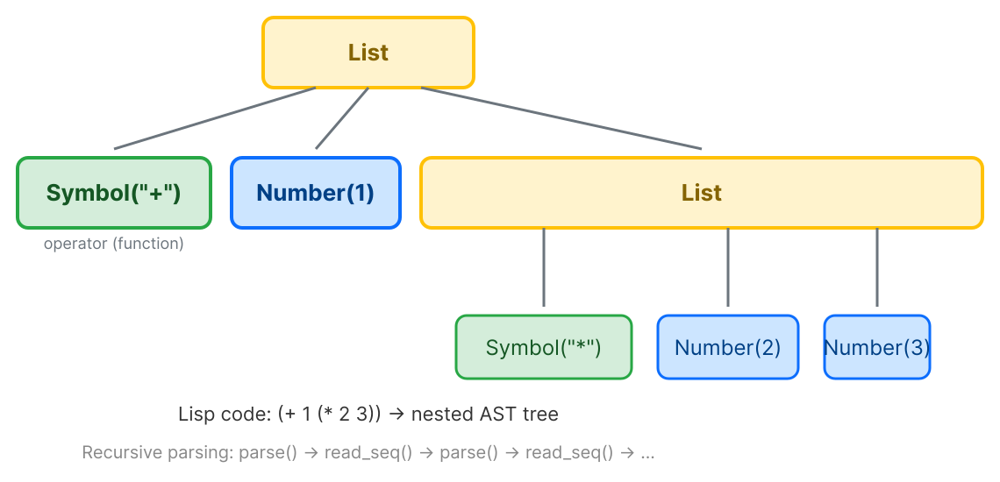

```


💡 In short — Recursion: a function that calls itself. Like Russian nesting dolls — open one, find another inside, repeat until the smallest one has nothing inside.

In code, the "smallest doll" is the base case that stops the recursion.

```bash
$ cargo test
warning: function `eval_str` is never used
  --> src/lib.rs:NN:4
   |
NN | fn eval_str(source: &str) -> Result<LispExp, LispErr> {
   |    ^^^^^^^^
   |
   = note: `#[warn(dead_code)]` (part of `#[warn(unused)]`) on by default

warning: `lisp-rs` (lib) generated 1 warning
    Finished `test` profile [unoptimized + debuginfo] target(s) in 0.32s
     Running unittests src/lib.rs (target/debug/deps/lisp_rs-5cd87530e74cecce)

running 7 tests
...
test result: ok. 7 passed; 0 failed; 0 ignored; 0 measured; 0 filtered out; finished in 0.00s
```


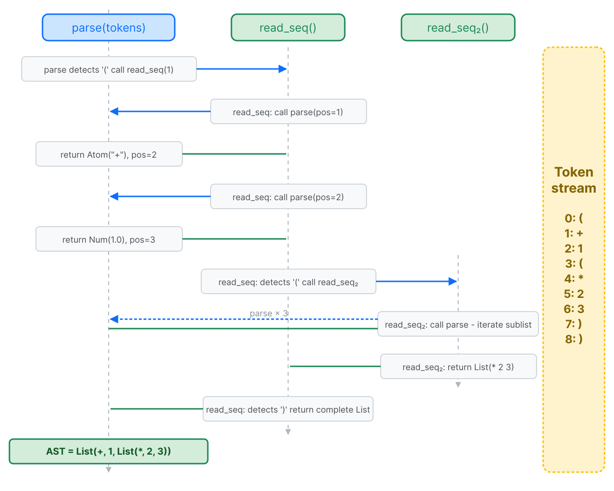


🎬 Token pointer moves left to right, building the AST step by step. [View SVG animation](svgs/parser-anim.svg)


Recursive parsing call flow: `parse()` and `read_seq()` call each other—`parse` encountering `(` delegates to `read_seq`, `read_seq` encountering a child element calls `parse` again, forming recursive descent. Each time `)` is encountered, "pop one layer," ultimately building the complete nested AST tree.

📐 **Formal Definition**: Recursive Descent Parser

The parser is defined by two mutually recursive functions:

```
parse(tokens):
  if tokens[0] is atom → parse_atom(tokens)
  if tokens[0] is "("  → read_seq(tokens[1:])

read_seq(tokens):
  if tokens[0] is ")"  → (Nil, tokens[1:])        // base case: empty list
  else:
    (expr, rest) = parse(tokens)                    // parse one expression
    (list,  rem)  = read_seq(rest)                  // recursively parse the rest
    (cons(expr, list), rem)                         // combine into a list
```

This is a **mutual recursion**: `parse` calls `read_seq`, which calls `parse`.
The base case `read_seq` finds `)` — this is what stops infinite recursion.
```
parse("(+ 1 (* 2 3))") → List(Symbol(+), Number(1), List(Symbol(*), Number(2), Number(3)))
```

### Step 11: Parenthesis Error Tests

`test_parse_symbol` was already added in Step 8. This step only adds error handling tests — add to parser.rs's tests module:

```rust
// parser.rs — add to tests module
#[test]
fn test_unclosed_list_error() {
    assert!(parse(&["(".to_string(), "+".into(), "1".into()]).is_err());
}

#[test]
fn test_unexpected_close_error() {
    assert!(parse(&[")".to_string()]).is_err());
}
```

```bash
$ cargo test
warning: function `eval_str` is never used
  --> src/lib.rs:NN:4
   |
NN | fn eval_str(source: &str) -> Result<LispExp, LispErr> {
   |    ^^^^^^^^
   |
   = note: `#[warn(dead_code)]` (part of `#[warn(unused)]`) on by default

warning: `lisp-rs` (lib) generated 1 warning
    Finished `test` profile [unoptimized + debuginfo] target(s) in 0.32s
     Running unittests src/lib.rs (target/debug/deps/lisp_rs-5cd87530e74cecce)

running 9 tests
test parser::tests::test_parse_symbol ... ok
test parser::tests::test_unclosed_list_error ... ok
test parser::tests::test_unexpected_close_error ... ok
...
test result: ok. 9 passed; 0 failed; 0 ignored; 0 measured; 0 filtered out; finished in 0.00s
```

💡 In short — The `eval_str` `dead_code` warning is still here. It will follow us until Step 47 when `main.rs` is created and calls `eval_str` (or you add `pub` to it earlier).

---

🏋️ **Exercises**
1. (⭐) Modify `parse_atom` to recognize `#t` and `#f` keywords, returning custom Symbols
2. (⭐⭐) What error does the parser return for input `"(+ 1 2"` (missing right paren)? Write a test to verify
3. (⭐⭐⭐) Think: can `(1 + 2)` be parsed? Why does Lisp require the first element to be the operator?


<details>
<summary>Click for answer</summary>

**1. Recognize #t and #f**
```rust
fn parse_atom(token: &str) -> LispExp {
    if token == "#t" { return LispExp::Symbol("#t".into()); }
    if token == "#f" { return LispExp::Symbol("#f".into()); }
    if let Ok(num) = token.parse::<f64>() {
        return LispExp::Number(num);
    }
    LispExp::Symbol(token.to_string())
}
```

**2. Missing closing paren**
Returns `LispErr::Reason("unclosed list: missing ')'")`.

**3. (1 + 2) parsing**
Parses fine as `List([Number(1), Symbol("+"), Number(2)])`. But eval fails — `1` (a Number) isn't callable. Lisp requires the first element in a list to be an operator.

4. (⭐⭐⭐) **Predict the error**: What exactly would happen if you called `parse("(+ 1 2")`
   (missing closing paren)? Write down your predicted error message *before* actually
   trying it. Then run `cargo test` and compare. Was your prediction close?
</details>

What we're solving: variable name→value mapping (the environment). With environments, `(define x 10)` and `(+ x 1)` actually mean something.

🧠 **Mental Model Checkpoint**: After this chapter, you should visualize programs as trees, not text. `(+ 1 (* 2 3))` becomes a tree with `+` at the root, `1` and the `(* 2 3)` subtree as branches. The parser is a tree-builder.


✅ **Summary**: `parse()` + `read_seq()` mutual recursion builds a tree. Nested `(+ 1 (* 2 3))` parses correctly.

---

### 🎯 Blank Paper Checkpoint

Close the tutorial. In **20 minutes**, write a `parse` function from scratch:

- [ ] Input `["(", "+", "1", "2", ")"]` → Output `List([Symbol("+"), Number(1), Number(2)])`
- [ ] Handle nesting: `(+ 1 (* 2 3))` → correct nested tree
- [ ] Handle atoms: numbers, symbols
- [ ] Write at least 2 tests

⏱️ **Time limit: 20 minutes**. Do NOT look at the tutorial code.


**💡 Parser Error Recovery Strategy**

The current parser immediately returns `LispErr` on syntax errors. A friendlier
approach is **Panic Mode recovery**: when the parser encounters an unexpected token,
skip the current expression and continue parsing the rest. Crafting Interpreters
shows this lets users see all errors at once instead of fix-one-discover-next.
Implementation: add a sync point in `read_seq` that resumes parsing at `)` or EOF.


Why this matters: Variables turn a calculator into a programming language. Environments give us named storage with lexical scoping - the same mechanism used by Scheme, JavaScript, Python, and Rust itself. Understanding environment chains is key to understanding how modern languages manage scope.

## Giving Things Names
⏩ **Skip signal:** Familiar with hash maps and scope chains? Skim this chapter — the key concept is `outer` (the environment chain).


---

<blockquote class='pipeline-position'>
<details>
<summary><strong>📍 Pipeline Position</strong> — see where we are in the project</summary>

```
  [Source] → [Lexer] → [Parser] → [◉ Evaluator + Env] → [Output]
                                              ↕
                                          [LispEnv]
```

| | |
|---|---|
| ✅ Done | Complete Lexer + Parser pipeline |
| 🎯 Implement LispEnv with HashMap storage, scoped variable lookup via outer chains

</details>
</blockquote>

---
### Step 12: Create "Environment" (variable name → value address book)

Right-click `src` folder → **New** → **File**, enter `env.rs`.

`lib.rs` add `pub mod env;`

```rust
// src/env.rs

use std::collections::HashMap;  // import hash table
use crate::{LispExp, LispErr};

/// Environment — like an address book: name → value
///
/// Structure diagram:

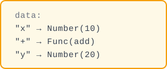

#[derive(Clone, Debug, PartialEq, Default)]
pub struct LispEnv {
    pub data: HashMap<String, LispExp>,
}
```

💡 In short — `HashMap`: a key-value store, like a phone book. Give it a name (key), get back the value. Lookup is nearly instant — no page-flipping.

```
HashMap<String, LispExp>
       key        value
```

```rust
// src/env.rs
impl LispEnv {
    // impl = "Add these capabilities/methods to LispEnv"

    pub fn new() -> Self {
        LispEnv { data: HashMap::new() }
    }

    pub fn set(&mut self, key: String, value: LispExp) {
        self.data.insert(key, value);  // write to address book
    }

    pub fn get(&self, key: &str) -> Result<LispExp, LispErr> {
        self.data
            .get(key)           // look up in address book, returns Option<&LispExp>
            .cloned()           // convert reference to owned clone
            .ok_or_else(||      // if None (not found), generate error
                LispErr::Reason(format!("Undefined variable: {}", key))
            )
    }
}
```

💡 In short — `impl` adds methods to a struct. Like adding buttons to a remote control — each method is a new button.

```rust
impl LispEnv {           // add capabilities to LispEnv
    pub fn new() { ... } // create capability
    pub fn set(...)      // write capability
    pub fn get(...)      // lookup capability
}
```

💡 In short — `&self` = read-only (reading a book). `&mut self` = read-write (taking notes in the margins). `mut` = mutable, as in "can change."

💡 In short — `Option`: a box that either holds a value or is empty.

```rust
Option<LispExp> = Some(value)  // box has something
                = None         // box is empty
```

`HashMap::get` returns `Option` because the key might not exist.

#### Tests

Add the following tests to the end of `src/env.rs` test module:

```rust
// env.rs end — test module
#[cfg(test)]
mod tests {
    use super::*;

    #[test]
    fn test_env_set_get() {
        let mut env = LispEnv::new();
        env.set("x".into(), LispExp::Number(42.0));
        assert_eq!(env.get("x").unwrap(), LispExp::Number(42.0));
    }

    #[test]
    fn test_env_undefined() {
        let env = LispEnv::new();
        assert!(env.get("y").is_err());
    }
}
```

```bash
$ cargo test
running 11 tests
test env::tests::test_env_set_get ... ok
test env::tests::test_env_undefined ... ok
...
test result: ok. 11 passed; 0 failed
```

### Step 13: Add env Parameter to eval

**Key change**: eval now needs an environment. Here's the **complete new version** of eval (replace the old one):

```rust
// src/lib.rs
/// Evaluation function — complete version (replaces old eval)
pub fn eval(exp: &LispExp, env: &LispEnv) -> Result<LispExp, LispErr> {
    match exp {
        LispExp::Number(n) => Ok(LispExp::Number(*n)),
        LispExp::Symbol(s) => env.get(s),  // ← look up in the address book!
        _ => Err(LispErr::Reason("This type is not supported yet".to_string())),
    }
}
```

#### Update All Call Sites

**Warning: signature changed, all callers of eval must be updated!**

**`eval_str` update** (also need to add `use crate::env::LispEnv;` at top of `lib.rs`):

```rust
// src/lib.rs
fn eval_str(source: &str, env: &LispEnv) -> Result<LispExp, LispErr> {
    let tokens = tokenize(source);
    let (exp, _) = parse(&tokens)?;
    eval(&exp, env)  // ← pass in env
}
```

**Old tests also need updating**—`test_eval_number` and `test_eval_str_number` need signature updates: `eval(&exp)` → `eval(&exp, &mut env)`, `eval_str("42")` → `eval_str("42", &mut env)`, `let env = LispEnv::new()` → `let mut env = LispEnv::new()`, `&env` → `&mut env`. The compiler will report each error — follow the hints to fix.

**New test**—symbol evaluation:

```rust
// src/lib.rs
#[test]
fn test_eval_symbol() {
    let mut env = LispEnv::new();
    env.set("x".into(), LispExp::Number(42.0));
    assert_eq!(eval_str("x", &env).unwrap(), LispExp::Number(42.0));
}
```

**Change checklist**: changed 1 function signature → updated 3 call sites. If you miss one, `cargo test` will give precise errors:

```text
$ cargo test
error[E0061]: this function takes 2 arguments but 1 was supplied
   --> src/lib.rs:NN:16
    |
 NN |     let result = eval(&exp).unwrap();
    |                  ^^^^------ help: add missing argument: `, env`
    |
note: function defined here
   --> src/lib.rs:NN:1
    |
 NN | pub fn eval(exp: &LispExp, env: &LispEnv) -> Result<LispExp, LispErr> {
    | ^^^^^^^^^^^ ---------------------------
error: aborting due to 3 previous errors
```

Each error points to a location needing the `env` parameter. After fixing all 3 places as shown above:

```bash
$ cargo test
running 12 tests
test env::tests::test_env_set_get ... ok
test env::tests::test_env_undefined ... ok
test lexer::tests::test_tokenize_multi ... ok
test lexer::tests::test_tokenize_whitespace ... ok
test lexer::tests::test_tokenize_parens ... ok
test parser::tests::test_parse_symbol ... ok
test parser::tests::test_unclosed_list_error ... ok
test parser::tests::test_unexpected_close_error ... ok
test tests::test_create_number ... ok
test tests::test_eval_number ... ok
test tests::test_eval_str_number ... ok
test tests::test_eval_symbol ... ok

test result: ok. 12 passed; 0 failed
```

```text
eval(Symbol("x")) workflow:
  "x" → env.get("x")
       → look up HashMap
       → Found! → Some(Number(42))
       → cloned() → Number(42)
       → ok_or_else → Ok(Number(42))
```

```bash
$ cargo test
running 12 tests
...
test result: ok. 12 passed; 0 failed
```

---

🏋️ **Exercises**
1. (⭐) Write a test that stores `"pi"` → `Number(3.14159)` in the environment, then retrieves it with `get`
2. (⭐⭐) If you `set` the same key twice, does the second call overwrite the first? Write a test to verify


<details>
<summary>Click for answer</summary>

**1. Store and retrieve pi**
```rust
#[test]
fn test_env_pi() {
    let mut env = LispEnv::new();
    env.set("pi".into(), LispExp::Number(3.14159));
    assert_eq!(env.get("pi").unwrap(), LispExp::Number(3.14159));
}
```

**2. Two sets on same key**
Second `set` overwrites. `HashMap::insert` replaces the old value for the same key.
```rust
env.set("x".into(), LispExp::Number(1.0));
env.set("x".into(), LispExp::Number(2.0));
assert_eq!(env.get("x").unwrap(), LispExp::Number(2.0)); // 2, not 1
```

🧠 **Pause and Think**

```lisp
(define x 10)
(define y x)    ; y = 10
(set! x 20)     ;
y               ; → 10 or 20?
```

Before running the code, work it out: what is `y`? Why? Is this the same behavior as Rust's `let y = x`?
Hint: how do `define` and `set!` store values in our implementation?
</details>

What we're solving: List evaluation = function call. This is the heart of Lisp—`+` in `(+ 1 2)` gets looked up in the environment to find the function, then `1` and `2` are passed as arguments.

📖 **Next: [Doing Real Computation](#doing-real-computation)**

🧠 **Mental Model Checkpoint**: After this chapter, you should see `eval` as a dispatch table: check the expression type, handle it accordingly. `Number` -> return as-is. `Symbol` -> look up in environment. `List` -> evaluate the operator, evaluate the operands, apply.


✅ **Summary**: Variables bind names to values. `env.get()` follows the outer chain for lexical scoping.


## Doing Real Computation
🚫 **Core chapter.** Even if you know function calls, the `List` evaluation logic and `Func` type are central to the interpreter. Don't skip.


---

<blockquote class='pipeline-position'>
<details>
<summary><strong>📍 Pipeline Position</strong> — see where we are in the project</summary>

```
  [Source] → [Lexer] → [Parser] → [◉ Evaluator (built-ins)] → [Output]
                                              ↕
                                          [LispEnv]
```

| | |
|---|---|
| ✅ Done | Variables can be read and written |
| 🎯 Add Func type for built-in functions; implement +, -, *, / with filter_map parameter handling

</details>
</blockquote>

---
### Step 14: Func Type

```rust
// lib.rs — LispExp add:
Func(fn(&[LispExp]) -> Result<LispExp, LispErr>),
```

💡 In short — A function pointer is like a remote control button: press it, the corresponding function runs.

🔧 **Rust Curve: `fn` Pointers vs Closures** — Our `Func` type uses bare function pointers (`fn(&[LispExp]) -> Result<...>`), the simplest kind of callable in Rust. Rust also has closures (`|| ...`) which can capture variables from their environment. Closures come in three flavors: `Fn` (can be called multiple times, immutable capture), `FnMut` (mutable capture), and `FnOnce` (consumes captures, can be called once). We use bare `fn` pointers because our built-ins have no captured state — they are pure functions.

⚠️ **Compiler Warning Note**: After adding `Func(fn(...))`, `cargo test` may show a warning: `warning: function pointer comparisons do not produce meaningful results`. This is because Rust 1.97+ warns when deriving `PartialEq` on a type containing function pointers — their addresses may differ between codegen units, making comparisons meaningless. **This warning is completely harmless** — our code never compares two functions for equality (only compares `args[0] == args[1]` for numbers/symbols/lists). To silence it, add `#[allow(unpredictable_function_pointer_comparisons)]` to `LispExp`.

🦀 **Rust Deep Dive: Why can't we compare function pointers?** If you look at the actual source code, you'll see `#[allow(unpredictable_function_pointer_comparisons)]` above the enum. Rust deliberately makes `fn` pointers incomparable with `==` in stable code. The reason: the compiler may merge identical functions or generate multiple copies of the same generic function at different addresses. Comparing two `fn` pointers for equality is unreliable — the same logical function could sit at different addresses. For our interpreter, this means `(eq? + +)` might return `#f`, which is technically correct (two copies of the same built-in are different pointers). We accept this limitation rather than building a function registry.

**eval also needs updating**: Func is a "self-evaluating" type (the function itself is the value, no computation needed):

```rust
// src/lib.rs
pub fn eval(exp: &LispExp, env: &LispEnv) -> Result<LispExp, LispErr> {
    match exp {
        LispExp::Number(n) => Ok(LispExp::Number(*n)),
        LispExp::Symbol(s) => env.get(s),
        LispExp::Func(_) => Ok(exp.clone()),  // ← function itself is a value!
        _ => Err(LispErr::Reason("This type is not supported yet".to_string())),
    }
}
```

### Step 15: List Evaluation Logic

**Replace the `_ => Err(...)` line in eval with List handling**. Here's the **complete version** of eval at this point:

```rust
// src/lib.rs
pub fn eval(exp: &LispExp, env: &LispEnv) -> Result<LispExp, LispErr> {
    match exp {
        // Self-evaluating types
        LispExp::Number(n) => Ok(LispExp::Number(*n)),
        LispExp::Func(_) => Ok(exp.clone()),

        // Symbol → look up environment
        LispExp::Symbol(s) => env.get(s),

        // List → function call (replaces the old _ => Err)
        LispExp::List(elements) => {
            if elements.is_empty() { return Ok(LispExp::List(vec![])); }

            // 1. Evaluate the first element (gets the function)
            let func = eval(&elements[0], env)?;

            // 2. Evaluate the remaining elements (gets the arguments)
            let args: Result<Vec<LispExp>, _> = elements[1..]
                .iter()
                .map(|a| eval(a, env))
                .collect();

            // 3. Call the function
            match func {
                LispExp::Func(f) => f(&args?),
                _ => Err(LispErr::Reason("Not a function".to_string())),
            }
        }
    }
}
```

```text
Computing (+ 1 2):

Input: List([Symbol("+"), Number(1), Number(2)])
  │
  ├─ Step 1: eval(Symbol("+"), env)
  │          → env.get("+")
  │          → Func(add function pointer)  ← found the add function!
  │
  ├─ Step 1: eval(Number(1), env) → Number(1.0)   ┐
  │         eval(Number(2), env) → Number(2.0)   │ all arguments evaluated
  │         → args = [Number(1.0), Number(2.0)]  ┘
  │
  └─ Step 2: add function(&[1.0, 2.0])
            → 1.0 + 2.0
            → Ok(Number(3.0))
```

### Step 16: Register Addition + Test

```rust
// lib.rs
pub fn default_env() -> LispEnv {
    let mut env = LispEnv::new();

    env.set("+".into(), LispExp::Func(|args| {  // |args| = closure parameter
        let sum: f64 = args.iter()
            .filter_map(|a| {   // only look at numbers, skip others
                if let LispExp::Number(n) = a { Some(*n) } else { None }
            })
            .sum();             // add them all up
        Ok(LispExp::Number(sum))
    }));

    env
}

#[test]
fn test_eval_addition() {
    let env = default_env();
    assert_eq!(eval_str("(+ 1 2)", &env).unwrap(), LispExp::Number(3.0));
}
```

```bash
$ cargo test
running 13 tests
...
test tests::test_eval_addition ... ok

test result: ok. 13 passed; 0 failed
```

💡 In short — A closure is an anonymous function. `|params| { body }`. Read it as: "here's some logic, use it right here, no need to name it."

```rust
|args: &[LispExp]| -> Result<LispExp, LispErr> {
    // ↑ parameter description (can be omitted, compiler infers)  ↑ return type (can be omitted)
    // ... function body ...
}
```

💡 In short — This is an assembly line. Items in `args` roll through one station at a time:

1. `.iter()` — pull them out one by one
2. `.filter_map(|a| ...)` — keep only the numbers, skip everything else
3. `.sum()` — add 'em all up

🎉 **Milestone: Can compute (+ 1 2) = 3!**

### Step 17: Subtraction, Multiplication, Division

Register them one by one—following addition, write inside `default_env()`:

```rust
// src/lib.rs — default_env(), after addition

// ── Subtraction ──
env.set("-".into(), LispExp::Func(|args| {
    let nums: Vec<f64> = args.iter()
        .filter_map(|a| if let LispExp::Number(n) = a { Some(*n) } else { None })
        .collect();
    if nums.len() == 1 {
        Ok(LispExp::Number(-nums[0]))         // (- 5) = -5
    } else {
        Ok(LispExp::Number(nums[0] - nums[1..].iter().sum::<f64>()))
                                               // (- 10 2 3) = 10-2-3 = 5
    }
}));

// ── Multiplication ──
env.set("*".into(), LispExp::Func(|args| {
    let product: f64 = args.iter()
        .filter_map(|a| if let LispExp::Number(n) = a { Some(*n) } else { None })
        .product();                            // multiply all together
    Ok(LispExp::Number(product))
}));

// ── Division ──
env.set("/".into(), LispExp::Func(|args| {
    let nums: Vec<f64> = args.iter()
        .filter_map(|a| if let LispExp::Number(n) = a { Some(*n) } else { None })
        .collect();
    if nums.len() == 1 {
        Ok(LispExp::Number(1.0 / nums[0]))     // (/ 5) = 0.2
    } else {
        Ok(LispExp::Number(nums[0] / nums[1..].iter().product::<f64>()))
                                               // (/ 100 5 2) = 100/5/2 = 10
    }
}));
```

```bash
$ cargo test
running 16 tests
test tests::test_eval_addition ... ok
test tests::test_subtraction ... ok
test tests::test_multiplication ... ok
test tests::test_division ... ok
...
test result: ok. 16 passed; 0 failed
```

But—numbers can be computed, but **boolean values and "empty" still don't work**. The `if` later needs booleans to make decisions, so let's fill in those types first:

---

🏋️ **Exercises**
1. (⭐) Register a new function `square` that takes one argument and returns its square
2. (⭐⭐) Implement a single-argument version of `-`: `(- x)` should return `-x` (negation). Hint: check the number of arguments
3. (⭐⭐⭐) Think: can `(+ 1 2 3 4 5)` compute correctly with the current implementation? Why?


<details>
<summary>Click for answer</summary>

**1. Register square**
```rust
env.set("square".into(), LispExp::Func(|args| {
    if let LispExp::Number(n) = &args[0] {
        Ok(LispExp::Number(n * n))
    } else {
        Err(LispErr::Reason("square needs a number".into()))
    }
}));
```

**2. Unary minus** (in `-` implementation)
```rust
if args.len() == 1 {
    if let LispExp::Number(n) = &args[0] {
        return Ok(LispExp::Number(-n));
    }
}
```

**3. (+ 1 2 3 4 5)**
Correctly returns 15. The `+` function iterates all arguments with `filter_map` + `sum`, supporting any count.

4. (⭐⭐⭐) **Predict then verify**: What happens when you call `(+ 1 "hello")` in our Lisp?
   Write down your predicted outcome. Hint: Look at how our arithmetic functions handle
   type checking. Is there any type checking at all?
</details>

What we're solving: Add Bool/Nil/String types. Booleans let us make decisions (if), nil lets us represent "empty."

📖 **Next: [More Data Types](#more-data-types)**

---

📝 **Design Note: Why AST tree-walking interpreter?**

We chose a **tree-walking interpreter**: parse source → AST → walk the tree and evaluate.
This is the simplest correct implementation you can build. It's not the fastest, but it's the most transparent.

**What are the alternatives?**

| Approach | What it does | Pros | Cons |
|----------|-------------|------|------|
| **Tree-walking** (us) | Parse → walk AST | Simple, transparent, easy to debug | Slow for production |
| **Bytecode VM** | Parse → compile to bytecode → VM executes | 10-100x faster | Much more code, harder to debug |
| **JIT compilation** | Parse → compile to machine code at runtime | Fastest | Extremely complex |

**Why this is the right choice for learning**: The AST is a *picture of your code*. When you call
`eval(List[Symbol(+), Number(1), Number(2)])`, you can *see* what's happening. A bytecode VM would
hide this behind instruction dispatch.

**Bottom line**: Every production interpreter starts as a tree-walker. Python, Ruby, and JavaScript all
began this way. By understanding tree-walking first, you'll understand why bytecode VMs exist
(performance) and what they sacrifice (simplicity).


✅ **Summary**: `eval` can call built-in functions. Arithmetic works with variable-length arguments.

🔮 **Predict the Output**: What do the following expressions return? Guess first, then run `cargo test` to verify:
1. `(+ 1 2 3)` → ? (hint: `+` is variadic)
2. `(+ (+ 1 2) 3)` → ? (hint: args are evaluated first, then function is applied)
3. `(- 10 5 2)` → ? (hint: `-` is also variadic, subtracts left to right)

Write down your guesses, then verify with `cargo test`. If you got 3/3, you've understood the core logic of `eval`.

---

### 🎯 Blank Paper Checkpoint

Close the tutorial. In **30 minutes**, complete:

- [ ] Add `Func` and `List` variants to `LispExp`
- [ ] Modify `eval`: handle `List` → eval first element to get function → eval args → call function
- [ ] Write `default_env()` function: register `+`, `-`, `*`, `/`
- [ ] Test: `eval_str("(+ 1 2)")` returns `Number(3.0)`
- [ ] Test: `eval_str("(* 2 3 4)")` returns `Number(24.0)`

⏱️ **Time limit: 30 minutes**. This is the first milestone where you actually compute results.


## More Data Types
⏩ **Skip signal:** Know Bool/Nil/String types? Skim the code, focus on the Lisp truthiness rules (`#f` and `nil` are false, everything else is true).


---

<blockquote class='pipeline-position'>
<details>
<summary><strong>📍 Pipeline Position</strong> — see where we are in the project</summary>

```
  [Source] → [Lexer] → [Parser] → [◉ Evaluator (extended types)] → [Output]
                                              ↕
                                          [LispEnv]
```

| | |
|---|---|
| ✅ Done | Arithmetic operations work |
| 🎯 Add Bool (#t/#f), Nil, String literals; implement comparison functions (=, >, <, >=, <=)

</details>
</blockquote>

---
### Step 18: Bool and Nil

```rust
// src/lib.rs
pub enum LispExp {
    // ... earlier ones ...
    Bool(bool),   // ← boolean values (#t, #f)
    Nil,          // ← empty value (nil)
}
```

**eval update**—Bool and Nil are also self-evaluating types:

```rust
// src/lib.rs
pub fn eval(exp: &LispExp, env: &LispEnv) -> Result<LispExp, LispErr> {
    match exp {
        LispExp::Number(n) => Ok(LispExp::Number(*n)),
        LispExp::Bool(_) | LispExp::Nil | LispExp::Func(_) => Ok(exp.clone()),
        LispExp::Symbol(s) => env.get(s),
        LispExp::List(elements) => { /* ... list evaluation ... */ }
        // No _ catch-all needed—all variants are explicitly handled
    }
}
```

Note: `Bool(_) | Nil | Func(_)` uses `|` to combine them—they all "evaluate to themselves," using the same handling logic.

**Why did we remove the `_` catch-all?**

At this point, all 6 variants of `LispExp` (`Number`, `Symbol`, `List`, `Func`, `Bool`, `Nil`) have explicit handling—the `_` was unreachable. Removing it means: **when you add new variants later (like `String` in steps 29-31, `Lambda` in step 34), if you forget to handle them in `eval`, the compiler will immediately error** (`non-exhaustive patterns`) instead of silently failing at runtime. Rust's exhaustiveness check is your best safety net—but only if you don't write `_`.

In `parse_atom` in parser:

```rust
// src/parser.rs — in parse_atom function
if token == "#t" { return LispExp::Bool(true); }
if token == "#f" { return LispExp::Bool(false); }
if token == "nil" { return LispExp::Nil; }
// String literal: "hello" → String("hello")
if token.starts_with('"') && token.ends_with('"') && token.len() >= 2 {
    return LispExp::String(token[1..token.len()-1].to_string());
}
```

### Step 19: Comparison Functions + String Type

Register comparison functions one by one (following `=`, same pattern):

```rust
// src/lib.rs — default_env()
// = comparison
env.set("=".into(), LispExp::Func(|args| {
    if let (LispExp::Number(a), LispExp::Number(b)) = (&args[0], &args[1]) {
        Ok(LispExp::Bool(a == b))
    } else { Err(LispErr::Reason("= needs numbers".to_string())) }
}));

// > comparison
env.set(">".into(), LispExp::Func(|args| {
    if let (LispExp::Number(a), LispExp::Number(b)) = (&args[0], &args[1]) {
        Ok(LispExp::Bool(a > b))
    } else { Err(LispErr::Reason("> needs numbers".to_string())) }
}));

// <, >=, <= identical, just change the operator (<, >=, <=)
env.set("<".into(), LispExp::Func(|args| { /* ... a < b ... */ }));
env.set(">=".into(), LispExp::Func(|args| { /* ... a >= b ... */ }));
env.set("<=".into(), LispExp::Func(|args| { /* ... a <= b ... */ }));
```

Then add the `String` variant to `LispExp` (type declaration area):

```rust
// src/lib.rs — LispExp enum
String(String),  // ← new
```

Also update `eval`'s self-evaluating branch to include `String`:

```rust
// src/lib.rs — eval function, self-evaluating branch
// Old:
LispExp::Bool(_) | LispExp::Nil | LispExp::Func(_) => Ok(exp.clone()),
// New:
LispExp::Bool(_) | LispExp::Nil | LispExp::Func(_) | LispExp::String(_) => Ok(exp.clone()),
```

If you forgot to add `String`, the compiler will error: `non-exhaustive patterns: \`String(_)\` not covered`—this is exactly the benefit of removing the `_` catch-all in step 28! The compiler watches for you, catching any unhandled variant.

```bash
$ cargo test
running 16 tests
...
test result: ok. 16 passed; 0 failed
```

Types are now complete—`Number` can compute, `Bool` and `Nil` represent truth/falseness and emptiness, `String` holds text. But the interpreter still lacks its most critical ability: **making choices**. `(+ 1 2)` can only compute left to right, it can't choose different branches based on conditions. Next, implementing `if`:

---

What we're solving: Implement the special forms if/define/lambda—they aren't ordinary functions, they have special evaluation rules. This is the foundation of Lisp's control flow.


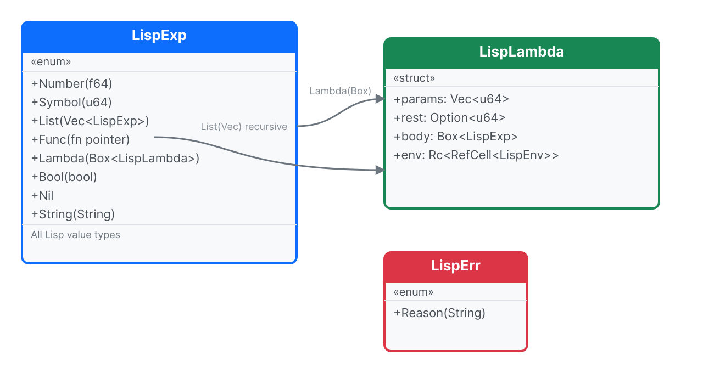


🏋️ **Exercises**
1. (⭐) Write a test to verify that `(> 5 3)` returns `#t` and `(> 3 5)` returns `#f`
2. (⭐⭐) Add a `string-length` function that returns the length of a string. Hint: the `String` variant stores a Rust `String`, which has a `.len()` method


<details>
<summary>Click for answer</summary>

**1. Comparison test**
```rust
#[test]
fn test_comparisons() {
    let mut env = default_env();
    assert_eq!(eval_str("(> 5 3)", &mut env).unwrap(), LispExp::Bool(true));
    assert_eq!(eval_str("(> 3 5)", &mut env).unwrap(), LispExp::Bool(false));
}
```

**2. string-length**
```rust
env.set("string-length".into(), LispExp::Func(|args| {
    if let LispExp::String(s) = &args[0] {
        Ok(LispExp::Number(s.len() as f64))
    } else {
        Err(LispErr::Reason("string-length needs a string".into()))
    }
}));
```
</details>

Type panorama: `LispExp`'s 8 variants—self-evaluating types (Number/Bool/String/Nil) + symbols (Symbol) + lists (List) + callable types (Func/Lambda). `Lambda`'s internal `env` field makes it a closure.

📖 **Next: [Let the Program Make Choices](#making-programs-choose)**


✅ **Summary**: Full type system with Boolean logic and numeric comparison. All 6 comparison operators work.


## Making Programs Choose
⏩ **Skip signal:** Know `if`/`define`/`lambda` semantics? Skim the implementation — note `lambda` as a special form (Step 22).

⚠️ **Slow zone** — Step 21 changes `eval`'s signature from `&LispEnv` to `&mut LispEnv`,
triggering about 6 compile errors. This is normal—the compiler is helping you find all call sites that need updating.
Don't panic, fix them one by one.

---

<blockquote class='pipeline-position'>
<details>
<summary><strong>📍 Pipeline Position</strong> — see where we are in the project</summary>

```
  [Source] → [Lexer] → [Parser] → [◉ Evaluator (special forms)] → [Output]
                                              ↕
                                          [LispEnv]
```

| | |
|---|---|
| ✅ Done | Full type system, functions are callable |
| 🎯 Implement `if` (conditional), `define` (variable binding), `lambda` (function creation) — the three core special forms

</details>
</blockquote>

---
### Current Progress: What Do We Have So Far?

Before diving into new content, let's clearly see **`src/lib.rs`'s `eval` function as it currently stands** (at the end of Step 19):

```rust
// src/lib.rs — eval function (current version, without special forms yet)

pub fn eval(exp: &LispExp, env: &LispEnv) -> Result<LispExp, LispErr> {
    match exp {
        // === Self-evaluating types: return directly ===
        LispExp::Number(n) => Ok(LispExp::Number(*n)),
        LispExp::Bool(_) | LispExp::Nil | LispExp::Func(_) | LispExp::String(_) => {
            Ok(exp.clone())
        }

        // === Symbol: look up in environment ===
        LispExp::Symbol(s) => env.get(s),

        // === List: function call ===
        LispExp::List(elements) => {
            if elements.is_empty() {
                return Ok(LispExp::List(vec![]));
            }

            // 1 Evaluate the first element → get the function
            let func = eval(&elements[0], env)?;

            // 2 Evaluate the following elements → get arguments
            let args: Result<Vec<LispExp>, _> = elements[1..]
                .iter()
                .map(|a| eval(a, env))
                .collect();

            // 3 Call the function
            match func {
                LispExp::Func(f) => f(&args?),
                _ => Err(LispErr::Reason("Not a function".to_string())),
            }
        }
    }
}
```

**Understanding this structure is important**: all subsequent modifications build upon this function. The `List` branch currently **unconditionally** treats the first element as the function and the rest as arguments—this is ordinary function call logic.

But `if`, `define`, `lambda` **are not ordinary functions**—they have special evaluation rules. We need to check for these "special forms" in the `List` branch, **before** the ordinary function call.

---

### Step 20: if — Conditional

**File: `src/lib.rs`**, modify the `LispExp::List(elements)` branch of `eval`.

⚠️ **Rust Version Requirement**: This step uses `if let ... &&` syntax (let-chains), which requires **Rust 1.88+** and `edition = "2024"` (set in `Cargo.toml`). If you're using an older Rust version, rewrite as nested `if let` + `if` instead.

**Problem**: `(if (= x 0) 1 2)` — if `(= x 0)` is true, return `1`, otherwise return `2`.
Why can't `if` be an ordinary function? Because ordinary functions **evaluate all their arguments first** before running. But `if` should only evaluate the condition, and then only **one** of the two branches.

**Insertion point**: In the `List` branch, after the empty list check, **before** the line `let func = eval(&elements[0], env)?;`, insert the following code:

```rust
// src/lib.rs — in eval's List branch,
// before Step 1 (evaluate first element to get function):

LispExp::List(elements) => {
    if elements.is_empty() {
        return Ok(LispExp::List(vec![]));
    }

    // ========== New: Special form check ==========
    // First check if the first element is a symbol, if so check if it's a special form
    if let LispExp::Symbol(s) = &elements[0] {
        if s == "if" && elements.len() == 4 {
            // (if condition true-branch false-branch)
            let cond = eval(&elements[1], env)?;
            // Only #f and nil are "false", everything else is "true"
            let is_true = !matches!(cond, LispExp::Bool(false) | LispExp::Nil);
            return if is_true {
                eval(&elements[2], env)  // condition is true → take this
            } else {
                eval(&elements[3], env)  // condition is false → take this
            };
        }
    }
    // ========== Special form check ends ==========

    // 1 Evaluate the first element → get function (existing code, don't touch)
    let func = eval(&elements[0], env)?;
    // ... rest stays the same ...
```

💡 In short: `if` has to be a special form — it can't evaluate both branches before choosing one. Like: "if it rains, stay in" — only one path actually runs.

**Tests**—add to `mod tests` in `src/lib.rs`:

```rust
// src/lib.rs — new tests in mod tests
#[test]
fn test_if_true_branch() {
    let env = default_env();
    assert_eq!(eval_str("(if #t 1 2)", &env).unwrap(), LispExp::Number(1.0));
}

#[test]
fn test_if_false_branch() {
    let env = default_env();
    assert_eq!(eval_str("(if #f 1 2)", &env).unwrap(), LispExp::Number(2.0));
}

#[test]
fn test_if_with_comparison() {
    let env = default_env();
    // (= 1 1) → #t → take true branch
    assert_eq!(eval_str("(if (= 1 1) 10 20)", &env).unwrap(), LispExp::Number(10.0));
}
```

```bash
$ cargo test
running 19 tests
test tests::test_if_true_branch ... ok
test tests::test_if_false_branch ... ok
...

test result: ok. 19 passed; 0 failed
```

---

### Step 21: define — Variable Definition

**File: `src/lib.rs`**

**Problem**: `define` needs to **modify the environment** (write to it). But the current `eval` parameter is `&LispEnv` (a read-only borrow), which won't let us change anything.

**First step: Change `eval`'s signature**. Change `&LispEnv` to `&mut LispEnv`:

```rust
// src/lib.rs — eval function signature
// Old (delete):
pub fn eval(exp: &LispExp, env: &LispEnv) -> Result<LispExp, LispErr>
//                           ^^^^                         ^
//                            read-only                   read-only

// New (change to this):
pub fn eval(exp: &LispExp, env: &mut LispEnv) -> Result<LispExp, LispErr>
//                           ^^^^                         ^^^^
//                            readable+writable            readable+writable
```

**Second step: In the special form check area of the `List` branch, add `define`**. Insert right after the `}` closing the `if` check, **before** `// ========== Special form check ends ==========`:

```rust
// src/lib.rs — eval's List branch, right after the } of the if check:

if s == "if" {
    // ... if logic (existing, don't move)...
}

// ========== New: define special form ==========
if s == "define" && elements.len() == 3 {
    // (define variable-name value) — 3 elements total
    if let LispExp::Symbol(name) = &elements[1] {
        let value = eval(&elements[2], env)?;   // evaluate
        env.set(name.clone(), value);           // &mut env → can write!
        return Ok(LispExp::Nil);                // define itself returns nil
    } else {
        return Err(LispErr::Reason(
            "The first argument of define must be a symbol".to_string()
        ));
    }
}
// ========== define ends ==========
```

💡 In short: `define` writes a name-value pair into the environment. Like adding a contact to your phone: "Name: x, Value: 10."

**Third step: Verify—run `cargo test` to see errors**

💡 **Why does changing `&` to `&mut` cause 6 errors?**

Imagine you run a bubble tea shop with a "read-only menu."
All branches (places that call `eval`) are designed for "read-only menu"—
customers read the menu and leave, they don't modify it.

Now you want customers to **write on the menu** (`define` needs to modify the environment),
so you change the menu to "writable menu" (`&mut LispEnv`).

But the branches still follow the old rules—they have "read-only menu" workflows,
and suddenly the menu changed, things don't fit!

So you need to update each branch (every function that calls `eval`)
to "writable menu" mode (`&mut env`).

The compiler is helping you—it found 6 branches that haven't been updated yet. Fix them one by one.

The signature changed but call sites haven't been updated, the compiler will show two types of errors:

```text
$ cargo test

error[E0308]: mismatched types         ← type mismatch
  --> src/lib.rs:NN:NN                 ← eval_str calls eval(exp, env)
   |                                   ← but eval now takes &mut LispEnv
NN |     eval(&exp, env)
   |                ^^^ expected `&mut LispEnv`, found `&LispEnv`

error[E0596]: cannot borrow `env` as mutable   ← can't borrow as mutable
  --> src/lib.rs:NN:NN                          ← in test function
   |
NN |     assert_eq!(eval_str("42", &env).unwrap(), ...);
   |                                ^^^^ cannot borrow as mutable
   |                                help: `&mut env`
   |
   = note: `let env = LispEnv::new()` → need to add `mut`

error: aborting due to 6 previous errors    ← about 6 total, but only 2 types
```

**Fourth step: Fix by category**

**Type 1: `eval_str` signature (1 place)**
Change `fn eval_str(source: &str, env: &LispEnv)` to `fn eval_str(source: &str, env: &mut LispEnv)`:

```rust
// Old:
fn eval_str(source: &str, env: &LispEnv) -> Result<LispExp, LispErr>
// New:
fn eval_str(source: &str, env: &mut LispEnv) -> Result<LispExp, LispErr>
```

**Type 2: Test functions (5-6 places)**
Each test's `let env = LispEnv::new()` (or `let env = default_env()`) needs `mut`, and all `&env` change to `&mut env`:

```rust
// Example: test_eval_number — old:
let env = LispEnv::new();
let result = eval(&exp, &env).unwrap();

// New:
let mut env = LispEnv::new();    // ← add mut here
let result = eval(&exp, &mut env).unwrap();  // ← & → &mut here
```

Make the same change to all other test functions. Fix each one the compiler reports.

**After fixing, run again:**

```bash
$ cargo test
running 19 tests
test env::tests::test_env_set_get ... ok
test env::tests::test_env_undefined ... ok
test lexer::tests::test_tokenize_multi ... ok
test lexer::tests::test_tokenize_whitespace ... ok
test lexer::tests::test_tokenize_parens ... ok
test parser::tests::test_parse_symbol ... ok
test parser::tests::test_unclosed_list_error ... ok
test parser::tests::test_unexpected_close_error ... ok
test tests::test_create_number ... ok
test tests::test_eval_number ... ok
test tests::test_eval_str_number ... ok
test tests::test_eval_symbol ... ok
test tests::test_eval_addition ... ok
test tests::test_if_true_branch ... ok
test tests::test_if_false_branch ... ok
test tests::test_if_with_comparison ... ok

test result: ok. 19 passed; 0 failed
```

**Test define**:

```rust
// src/lib.rs — new in mod tests
#[test]
fn test_define_and_lookup() {
    let mut env = default_env();
    eval_str("(define x 10)", &mut env).unwrap();
    assert_eq!(eval_str("x", &mut env).unwrap(), LispExp::Number(10.0));
}

#[test]
fn test_define_then_use_in_calc() {
    let mut env = default_env();
    eval_str("(define x 10)", &mut env).unwrap();
    assert_eq!(eval_str("(+ x 5)", &mut env).unwrap(), LispExp::Number(15.0));
}
```

```bash
$ cargo test
running 21 tests
test tests::test_define_and_lookup ... ok
...

test result: ok. 21 passed; 0 failed
```

---

### Step 22: lambda — Creating Anonymous Functions

**File: `src/lib.rs`**

**Problem**: How do users define their own functions? Lisp uses `lambda`—packaging a parameter list and function body into a "function value."

**First step: Add the `LispLambda` struct above the `LispExp` enum**:

```rust
// src/lib.rs — before LispExp definition, below LispErr:

/// Lambda expression (user-defined function)
#[derive(Clone, Debug, PartialEq)]
pub struct LispLambda {
    pub params: Vec<String>,   // parameter names, e.g. ["x", "y"]
    pub body: Box<LispExp>,    // function body, use Box to avoid infinite nesting
}
```

💡 In short — Why `Box`?

```
LispExp can contain LispLambda
  → LispLambda contains LispExp (body)
    → that LispExp can contain LispLambda
      → ... infinite loop!
```

The compiler asks: "How big is LispExp?" There's no answer — it could be infinitely nested. `Box` fixes this: "store the inner value on the heap, keep just a pointer (8 bytes) here." Problem solved.

🦀 **Rust Deep Dive: Stack vs. Heap.** Rust puts values on the **stack** by default — fast allocation, automatic cleanup when the function returns. `Box` moves data to the **heap** — slightly slower to allocate, but the data lives as long as the pointer exists. Why does this matter for our interpreter? A typical `LispExp` without Box would be huge (the compiler needs to reserve space for the *largest possible* variant). With `Box<LispLambda>`, the enum only stores an 8-byte pointer, and the lambda's actual data lives on the heap. This keeps `LispExp` small and cache-friendly — most Lisp values (numbers, bools, nils) fit in a few bytes and never touch the heap.

```
Without Box:              With Box:
LispExp (??? bytes)      LispExp (fixed size)
  └─ Lambda                └─ Lambda
       └─ body: LispExp         └─ body: Box ──→ heap (8-byte ptr)
            └─ Lambda                └─ ...
                 └─ ... (∞)
```

**Second step: Add the `Lambda` variant to the `LispExp` enum**:

```rust
// src/lib.rs — new in LispExp enum (between Func and Bool is fine)

pub enum LispExp {
    Number(f64),
    Symbol(String),
    List(Vec<LispExp>),
    Func(fn(&[LispExp]) -> Result<LispExp, LispErr>),
    Lambda(Box<LispLambda>),  // ← new! User-defined function
    Bool(bool),
    Nil,
    String(String),
}
```

**Third step: Add `Lambda` to the self-evaluating branch of `match exp` in `eval`**:

```rust
// src/lib.rs — eval function, match exp self-evaluating branch
// Old:
LispExp::Bool(_) | LispExp::Nil | LispExp::Func(_) | LispExp::String(_) => {
    Ok(exp.clone())
}
// New (Lambda is also self-evaluating—the function itself is a value, no "computation" needed):
LispExp::Bool(_) | LispExp::Nil | LispExp::Func(_)
    | LispExp::String(_) | LispExp::Lambda(_) => {
    Ok(exp.clone())
}
```

**Fourth step: Add `lambda` creation logic to the special form check area of the `List` branch**. Right after the `}` closing the `define` check:

```rust
// src/lib.rs — eval's List branch, after define check, before special form check ends:

if s == "define" {
    // ... define logic (existing, don't move)...
}

// ========== New: lambda special form ==========
if s == "lambda" && elements.len() >= 3 {
    // (lambda (parameter-list) function-body) — at least 3 elements
    let params: Vec<String> = match &elements[1] {
        LispExp::List(param_list) => param_list
            .iter()
            .map(|p| {
                if let LispExp::Symbol(name) = p {
                    name.clone()
                } else {
                    "?".to_string() // parameters must be symbols
                }
            })
            .collect(),
        _ => return Err(LispErr::Reason(
            "lambda's parameter must be a list".to_string()
        )),
    };

    let body = elements[2].clone();  // function body

    let lambda = LispExp::Lambda(Box::new(LispLambda {
        params,
        body: Box::new(body),
    }));

    return Ok(lambda);  // lambda created, return this "function value"
}
// ========== lambda ends ==========
```

💡 In short: `lambda` doesn't run anything — it packages parameters and body into a value and returns it. Like getting a recipe: you haven't cooked yet, you need to "call" it.

```bash
$ cargo test
running 22 tests
test tests::test_lambda_call ... ok
...

test result: ok. 22 passed; 0 failed
```

#### Calling Lambda

**File: `src/lib.rs`**, modify the `match func` part of **ordinary function calls** in eval's `List` branch.

Currently `match func` only handles `LispExp::Func(f)`. We need to add a `LispExp::Lambda(lambda)` case:

```rust
// src/lib.rs — eval's List branch end, ordinary function call part
// Old:
match func {
    LispExp::Func(f) => f(&args?),
    _ => Err(LispErr::Reason("Not a function".to_string())),
}

// New:
match func {
    // === Built-in function (existing) ===
    LispExp::Func(f) => f(&args?),

    // === New: User-defined function ===
    LispExp::Lambda(lambda) => {
        // Create a new environment for parameter binding
        let mut new_env = env.clone();
        // Bind parameter names to argument values one by one
        for (param, arg) in lambda.params.iter().zip(args?.iter()) {
            new_env.set(param.clone(), arg.clone());
        }
        // Evaluate function body in the new environment
        eval(&lambda.body, &mut new_env)
    }

    _ => Err(LispErr::Reason("Not a function".to_string())),
}
```

💡 In short — `zip` pairs up two sequences element by element, like a zipper.

```
params: ["x", "y"]
args:   [ 1 ,  2 ]
zip:    [("x",1), ("y",2)]
```

💡 In short — Calling a lambda is like putting on a play:

1. Set the stage (create a new environment)
2. Cast the roles (bind parameters to arguments)
3. Run the show (evaluate the body)

**Tests**—complete flow: define + lambda + call:

```rust
// src/lib.rs — new in mod tests
#[test]
fn test_lambda_call() {
    let mut env = default_env();
    // Define an add function
    eval_str("(define add (lambda (a b) (+ a b)))", &mut env).unwrap();
    // Call it
    assert_eq!(eval_str("(add 3 4)", &mut env).unwrap(), LispExp::Number(7.0));
}

#[test]
fn test_lambda_direct_call() {
    let mut env = default_env();
    // Without defining, call directly: ((lambda (x) (* x x)) 5) → 25
    assert_eq!(
        eval_str("((lambda (x) (* x x)) 5)", &mut env).unwrap(),
        LispExp::Number(25.0)
    );
}
```

```bash
$ cargo test
running 23 tests
test tests::test_lambda_call ... ok
test tests::test_lambda_direct_call ... ok
...

test result: ok. 23 passed; 0 failed
```

---

#### Layer-by-Layer Breakdown: How does `(add 3 4)` actually compute to 7?

Think of this process as **unpacking nesting dolls**—starting from the outermost doll, opening layer by layer.

```
Nesting doll structure (outside to inside):

  Layer 0 (outermost):   (add 3 4)          ← the whole line of code
  Layer 1:                 add             ← function name (look up in environment)
  Layer 2:                 (+ a b)         ← function body (evaluate in new environment)
  Layer 3 (innermost):      +   a   b      ← each symbol evaluated separately
```

---

**Preparation phase: What's in the global environment?**

After executing `(define add (lambda (a b) (+ a b)))`, the global environment becomes:


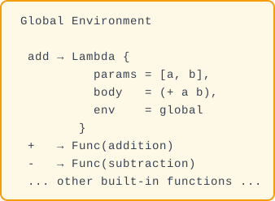


---

**Layer 0: `eval` receives `(add 3 4)`**

```
eval input:
  current expression = List([Symbol("add"), Number(3), Number(4)])
  current environment = global environment (above)

eval starts determining what type the current expression is:

  □ Number?  → No
  □ Bool?    → No
  □ Symbol?  → No
  ■ List!    → ✅ Enter list handling

  List not empty → take first element first = Symbol("add")
  Take remaining args = [Number(3), Number(4)]

  Determine if first is a special form:
    □ "if"?     → No
    □ "define"? → No
    □ "lambda"? → No
    ■ Ordinary function call! → Enter function call flow
```

```
Function call flow: first evaluate the "called function", then evaluate "each argument"

  1 Evaluate function position: eval(Symbol("add"), global)
  2 Evaluate arg 1:             eval(Number(3), global)
  3 Evaluate arg 2:             eval(Number(4), global)
```

---

**Layer 1 — Sub-doll 1: Evaluate function position**

```
eval input:
  current expression = Symbol("add")
  current environment = global

eval determines:
  ■ Symbol! → Look up in environment

  Look up global environment:
    ├─ "add" → ✅ Found! Lambda { params=[a,b], body=(+ a b), env=global }
    └─ Return this Lambda

  Function position result: Lambda(add function)
```

---

**Layer 1 — Sub-dolls 2 and 3: Evaluate arguments**

```
eval input:
  current expression = Number(3)        current expression = Number(4)
  current environment = global          current environment = global

eval determines:                       eval determines:
  ■ Number! → self-evaluating, return   ■ Number! → self-evaluating, return

  Return Number(3)                      Return Number(4)

  Now all three sub-dolls are unpacked:
    func = Lambda(add function)
    args = [Number(3), Number(4)]
```

---

```
Now match func:

  Matches Lambda(lambda)! Execute lambda call logic:
```

---

**Layer 2: Create new environment + bind parameters + evaluate function body**

```
Note: At this point, the new environment is created by cloning the call-time environment via `env.clone()`. The `env` field on `LispLambda` won't be added until Step 24 — for now, parameter bindings are stored directly in the cloned environment.

1 Create new environment
  let mut new_env = global.clone()

  new_env after clone:

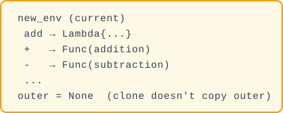


2 Pair parameter names with argument values
  zip(["a", "b"], [Number(3), Number(4)]):
    Pair 1: param="a", arg=Number(3) → new_env.set("a", 3)
    Pair 2: param="b", arg=Number(4) → new_env.set("b", 4)

  new_env is now:

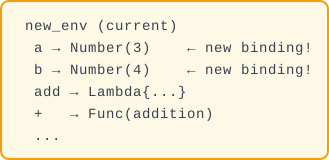


3 Evaluate function body in new environment
  eval((+ a b), new_env)


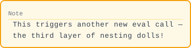

```

---

**Layer 3 (innermost nesting doll): `eval` evaluates `(+ a b)`**

```
eval input:
  current expression = List([Symbol("+"), Symbol("a"), Symbol("b")])
  current environment = new_env { a→3, b→4, +→Func, ... }

eval determines:
  ■ List! → take first element first = Symbol("+")
  first is not a special form → ordinary function call

  1 Evaluate function position: eval(Symbol("+"), new_env)
     Look up new_env → "+" → ✅ Func(addition)

  2 Evaluate arg 1: eval(Symbol("a"), new_env)
     Look up new_env → "a" → ✅ Number(3)  ← bound in Layer 2!

  3 Evaluate arg 2: eval(Symbol("b"), new_env)
     Look up new_env → "b" → ✅ Number(4)  ← bound in Layer 2!

Now:
  func = Func(addition)        ← Rust function pointer
  args = [Number(3), Number(4)]

match func → matches Func(f)!
  → Call f(&[Number(3), Number(4)])
  → Rust's (+) function: 3.0 + 4.0

Final answer: Number(7.0) ✅
```

---

**Key summary: 4 layers unpacked from outside to inside**

```
Layer 0 → eval(List((add 3 4)))     ← identified as function call
  │
  ├─ Layer 1 → eval(Symbol("add"))  ← find Lambda in environment
  ├─ Layer 1 → eval(Number(3))     ← self-evaluating
  ├─ Layer 1 → eval(Number(4))     ← self-evaluating
  │
  ├─ Layer 2 → create new_env, bind a=3, b=4
  │
  └─ Layer 3 → eval(List((+ a b)))  ← evaluate function body in new env
       │
       ├─ Layer 4 → eval(Symbol("+"))  ← find Func in new_env
       ├─ Layer 4 → eval(Symbol("a"))  ← find 3 in new_env
       └─ Layer 4 → eval(Symbol("b"))  ← find 4 in new_env
            │
            └─ Func(addition) on [3,4] → 7.0
```

**You might be wondering now**: here we used `new_env = global.clone()`, so what's different about closures with `with_outer`?—Great question, that's what we'll cover next.

🎉 **Milestone: We can now define variables, write conditionals, and create our own functions!**

```lisp
(define square (lambda (x) (* x x)))
(define abs (lambda (n) (if (< n 0) (- 0 n) n)))
(square 5)   ; → 25
(abs -10)    ; → 10
```

---

Step 22 end-of-step project status:

```
lisp-rs/
├── src/
│   ├── lib.rs      (approx. 220 lines) — LispExp, LispErr, eval, default_env, tests
│   ├── lexer.rs    (approx. 20 lines)  — tokenize()
│   ├── parser.rs   (approx. 60 lines)  — parse() + read_seq()
│   └── env.rs      (approx. 40 lines)  — LispEnv { data, outer }
```

**Supported special forms**: ✅ `if` ✅ `define` ✅ `lambda` (create + call)

**Registered built-in functions**: `+` `-` `*` `/` `=` `>` `<` `>=` `<=`

**Test results**:

```text
$ cargo test
running 23 tests
... all ok
test result: ok. 23 passed; 0 failed
```

---

🏋️ **Exercises**
1. (⭐) Using `define` and `lambda`, write an `(abs x)` function that returns the absolute value of x
2. (⭐⭐) Define a recursive function `(sum-to n)` that returns 1+2+...+n. Hint: reference the factorial implementation
3. (⭐⭐⭐) Write a `compose` function using lambda: `(compose f g)` returns a new function h such that `(h x)` = `(f (g x))`


<details>
<summary>Click for answer</summary>

**1. abs**
```lisp
(define abs (lambda (n) (if (< n 0) (- 0 n) n)))
```

**2. sum-to**
```lisp
(define sum-to (lambda (n)
    (if (= n 0) 0 (+ n (sum-to (- n 1))))))
```

**3. compose**
```lisp
(define compose (lambda (f g) (lambda (x) (f (g x)))))
; test: ((compose (lambda (x) (* x 2)) (lambda (x) (+ x 1))) 3) → 8
```
</details>

🧠 **Pause and Think**

```lisp
((lambda (x) x) (lambda (x) x))
```

What does this expression return? Will it crash? Work through each step: what is the outer lambda's parameter `x` bound to? What does the inner lambda evaluate to? If the answer is "a function" — can you print it in Rust? How did we implement `Display`?

What we're solving: Closures (functions remembering their birth environment) + TCO (tail recursion without stack overflow). Without closures you don't get real higher-order functions; without TCO you can't write infinite recursion.


✅ **Summary**: `if` controls evaluation flow, `define` creates top-level bindings, `lambda` creates callable functions.

---

### 🎯 Blank Paper Checkpoint — The Most Important One

Close the tutorial. In **45 minutes**, complete:

- [ ] Add `if` special form to `eval`'s `List` branch
- [ ] Add `define` special form
- [ ] Add `lambda` special form (with `LispLambda` struct)
- [ ] Test: `(if #t 1 2)` → `1`
- [ ] Test: `(define x 10) (+ x 5)` → `15`
- [ ] Test: `((lambda (x) (* x x)) 5)` → `25`

⏱️ **Time limit: 45 minutes**. This is the core milestone — special forms are the dividing line between a calculator and an interpreter.


---

### 🧠 Design Paradigm: Wishful Thinking

A key idea from SICP is **wishful thinking**: write code as if the function you need
already exists, then implement it later. This top-down approach appears throughout
our interpreter:

```scheme
;; Step 22: We wrote this test BEFORE implementing lambda
;; We "wished" for a working lambda, then built it
(let ((double (lambda (x) (* x 2))))
  (double 5))
;; → 10
```

This isn't just a testing trick — it's a fundamental design philosophy.
The parser uses it (`parse` calls `read_seq` before `read_seq` exists),
the evaluator uses it (`eval` calls `lookup_builtin` before builtins exist),
and you used it while following this tutorial (writing tests before implementing code).

When you write `(lambda (x) (* x 2))` before implementing `lambda`,
you are practicing the same mental discipline that makes Scheme great for prototyping.


## Remembering the Past
Why this matters: Closures are Lisp's gift to programming. A closure is a function that remembers the variables that were in scope when it was created - enabling callbacks, event handlers, and functional abstractions. Our implementation uses `Rc<RefCell<>>` for shared ownership, which mirrors how many Rust programs manage complex data.

🚫 **Core chapter — worth reading in full.** Closures (Step 24) and TCO (Step 26) are the deepest sections here. Read every line.

⚠️ **Slow zone — the hardest 4 steps in the entire tutorial.**
Step 23 introduces `Rc<RefCell<LispEnv>>` (three layers of nested smart pointers), Step 24 implements closure capture,
Step 26 implements TCO with a trampoline loop. If you're struggling, that's normal—most learners spend 2-3x more time here.
Tip: understand the "backpack🎒" metaphor first (Step 24 opening), then read the code. If stuck, skip to Step 27 (performance),
come back to closures later—it doesn't block subsequent features.


---

<blockquote class='pipeline-position'>
<details>
<summary><strong>📍 Pipeline Position</strong> — see where we are in the project</summary>

```
  [Source] → [Lexer] → [Parser] → [◉ Evaluator (closures + TCO)] → [Output]
                                              ↕
                                     [LispEnv (outer chain)]
                                     [Rc<RefCell<>>]
```

| | |
|---|---|
| ✅ Done | Function calls, if branches |
| 🎯 Implement lexical scoping with closures (Rc<RefCell>) and tail call optimization (trampoline loop)

</details>
</blockquote>

---
### Current Progress: What `eval` looks like at the end of Step 22

Before starting the transformation, let's clearly see **the `List` branch of `eval` in `src/lib.rs`** (showing only the `List` part, other branches unchanged):

```rust
// src/lib.rs — eval function List branch (end of Step 22)

LispExp::List(elements) => {
    if elements.is_empty() {
        return Ok(LispExp::List(vec![]));
    }

    // === Special form check ===
    if let LispExp::Symbol(s) = &elements[0] {
        if s == "if" { /* ... if logic ... */ }
        if s == "define" { /* ... define logic ... */ }
        if s == "lambda" { /* ... lambda creation ... */ }
    }

    // === Ordinary function call ===
    let func = eval(&elements[0], env)?;
    let args: Result<Vec<LispExp>, _> = elements[1..]
        .iter().map(|a| eval(a, env)).collect();

    match func {
        LispExp::Func(f) => f(&args?),
        LispExp::Lambda(lambda) => {
            let mut new_env = env.clone();
            for (param, arg) in lambda.params.iter().zip(args?.iter()) {
                new_env.set(param.clone(), arg.clone());
            }
            eval(&lambda.body, &mut new_env)
        }
        _ => Err(LispErr::Reason("Not a function".to_string())),
    }
}
```

**Two problems with the current approach**:

1. **Closures**: lambda call uses `env.clone()` to create a new environment—but it clones the **call-time** environment, not the **definition-time** environment. So `(lambda (x) (+ x n))`'s `n` won't be found.
2. **Stack overflow**: each call to `eval` is recursive—`(loop 10000)` will blow the Rust call stack.

---

### Step 22b: Understanding Rc and RefCell — Letting Functions Travel with a Backpack

💡 **Why learn this first?** The next step (Step 23) will add an `outer` field to the environment, enabling closures. This requires two new Rust concepts: `Rc` and `RefCell`. Understanding them separately first means you won't be hit with three things at once.

#### ① Rc — Sharing One Book Among Many Readers

`Rc` = Reference Counted. It lets **multiple owners share the same data**.

```rust
use std::rc::Rc;

// Create a book
let book = Rc::new("The Rust Programming Language".to_string());
// Rc ref count = 1

// Reader 1 borrows it (not a copy! just adds a name)
let reader1 = Rc::clone(&book);
// Rc ref count = 2

// Reader 2 also borrows
let reader2 = Rc::clone(&book);
// Rc ref count = 3

// All three see the same book
println!("{}", reader1);  // "The Rust Programming Language"
println!("{}", reader2);  // "The Rust Programming Language"

// Book is only freed when the last reader leaves
```

💡 In short — `Rc`: like a shared apartment—multiple tenants share one unit. `Rc::clone()` doesn't copy the apartment, just adds a tenant name. The lease ends when the last person moves out.

#### ② RefCell — A Shared Book You Can Write In

`Rc` has a limitation: read-only. If you want to write notes in the shared book, you need `RefCell`.

```rust
use std::cell::RefCell;

// A writable notebook
let notebook = RefCell::new(String::from("notes: "));

// Write
notebook.borrow_mut().push_str("step one");
println!("{}", notebook.borrow());  // "notes: step one"
```

💡 In short — `RefCell`: a shared book that also allows writing. `borrow_mut()` = grab the pen and write, `borrow()` = just read, don't touch the pen.

#### ③ Combo: Rc<RefCell<T>> — Shared + Mutable

This is exactly what closures need: multiple lambdas sharing one environment, and being able to modify it.

```rust
use std::rc::Rc;
use std::cell::RefCell;

let shared_env = Rc::new(RefCell::new(String::from("x=1")));

// Two lambdas share the same environment
let lambda1 = Rc::clone(&shared_env);  // ref count = 2
let lambda2 = Rc::clone(&shared_env);  // ref count = 3

// lambda1 modifies the environment
lambda1.borrow_mut().push_str(", y=2");

// lambda2 can see the change! Because it's the same data
println!("{}", lambda2.borrow());  // "x=1, y=2"  ✅
```


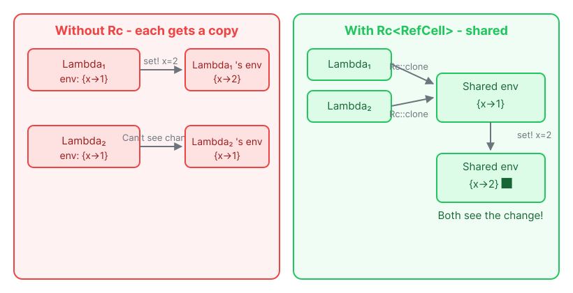


💡 In short — `Rc<RefCell<T>>`: shared apartment + writable whiteboard. Multiple people share it (Rc), and anyone can write on the whiteboard (RefCell). When one person writes, everyone else immediately sees it. This is the closure's "backpack🎒"—multiple lambdas carry the same backpack; if one changes something inside, everyone else knows.

⚠️ **Note**: `RefCell` checks at runtime (not compile time). If you call `borrow_mut()` twice simultaneously, the program will panic. But our interpreter is single-threaded, so this won't happen.

📝 **Next step preview**: Step 23 will add `outer: Option<Rc<RefCell<LispEnv>>>` to `LispEnv`. Now that you understand `Rc` and `RefCell`, the three-layer nesting won't be scary.

---

### Step 23: Add outer Field to Environment — Support Nested Scopes

**File: `src/env.rs`**

**Problem**: The current environment is flat—only one HashMap. To implement lexical scoping (inner scope can see outer scope's variables), we need an "environment chain."

**First step: Transform the `LispEnv` struct**. Add `outer` alongside the existing `data` field:

```rust
// src/env.rs — replace the old LispEnv definition

use std::rc::Rc;
use std::cell::RefCell;

// Old (delete):
// pub struct LispEnv {
//     pub data: HashMap<String, LispExp>,
// }

// New:
pub struct LispEnv {
    pub data: HashMap<String, LispExp>,       // current frame's variables (existing)
    pub outer: Option<Rc<RefCell<LispEnv>>>,  // ← new! Points to outer environment
}
```

💡 In short — `outer` is the "parent" environment. Variable lookup walks the chain: check self, then parent, then grandparent... like asking your family if anyone's seen the car keys.

💡 In short — `Rc<RefCell<>>`: Why the complexity?

- **`Rc`** (reference counting): lets multiple closures share the same environment. Think of it as multiple people reading the same notebook.
- **`RefCell`** (interior mutability): lets you modify the environment even when it's shared. Anyone can write in that notebook.
- Together: multiple readers, one writer, all sharing the same environment frame.

🦀 **Rust Deep Dive: The "shared XOR mutable" rule.** Rust's most fundamental rule is: you can either have *one* mutable reference OR *many* shared references — never both at once. This prevents data races at compile time. But closures break this — multiple closures all need mutable access to the same captured environment (think `set!` modifying a shared variable). `Rc` gives us shared *ownership*, and `RefCell` moves Rust's borrow-checking from compile time to *runtime*. The trade-off: if you accidentally borrow the same `RefCell` mutably twice, your program panics instead of compiling. For a single-threaded interpreter, this is a safe and pragmatic choice.

💡 **Why don't we need a garbage collector?** Most Lisp-in-X tutorials (Java, Python) have to deal with reference cycles and GC. Rust's ownership system handles this for us: `Rc` auto-frees memory when the last reference drops, and the `outer` chain is a one-way linked list — no cycles. Rust gives us GC-like safety without a runtime collector.


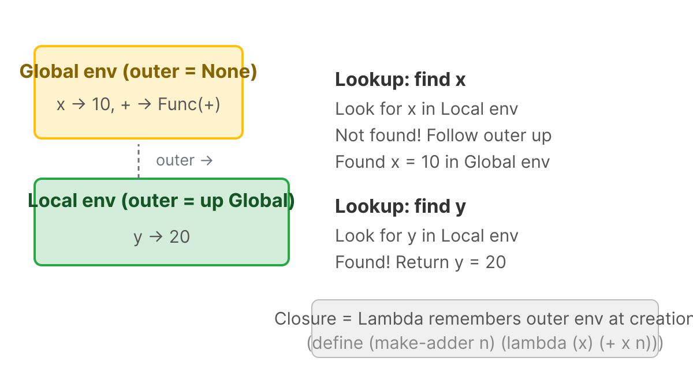

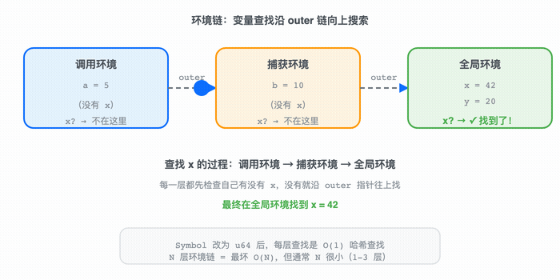

🎬 Blue dot searches along outer chain from call env to global env for variable x. [View SVG animation](svgs/env-chain-anim.svg)


Environment chain = singly linked list: each environment frame has an `outer` pointer to the outer environment. Variable lookup follows this chain from inside to outside—this is the runtime implementation of lexical scoping. `Rc<RefCell<>>` allows multiple places to share the same frame (e.g., two closures capturing the same outer environment).

**Second step: Update `new()` method**—add `outer: None`:

```rust
// src/env.rs — in impl LispEnv, replace new()
// Old:
pub fn new() -> Self {
    LispEnv { data: HashMap::new() }
}

// New:
pub fn new() -> Self {
    LispEnv { data: HashMap::new(), outer: None }
}
```

**Third step: Add `with_outer()` method**—create an environment with a "parent" (used during function calls):

```rust
// src/env.rs — in impl LispEnv, after new()
pub fn with_outer(outer: Rc<RefCell<LispEnv>>) -> Self {
    LispEnv { data: HashMap::new(), outer: Some(outer) }
}
```

**Fourth step: Update `get()` method**—when not found in self, follow the outer chain upward:

```rust
// src/env.rs — in impl LispEnv, replace get()
// Old:
pub fn get(&self, key: &str) -> Result<LispExp, LispErr> {
    self.data.get(key)
        .cloned()
        .ok_or_else(|| LispErr::Reason(format!("Undefined variable: {}", key)))
}

// New (with outer chain lookup):
pub fn get(&self, key: &str) -> Result<LispExp, LispErr> {
    // First check self
    if let Some(v) = self.data.get(key) {
        return Ok(v.clone());
    }
    // Not found in self, look in outer
    if let Some(outer) = &self.outer {
        return outer.borrow().get(key);  // ← recursive chain traversal
    }
    // Reached the top and still not found → error
    Err(LispErr::Reason(format!("Undefined variable: {}", key)))
}
```

```text
Environment chain diagram:

Global environment (outer = None)
```


```


          │ outer
          ▼
Environment created when calling (lambda (y) (+ x y)) (outer = Global)


```

```bash
$ cargo test
running 24 tests
test env::tests::test_nested_env_lookup ... ok
...

test result: ok. 24 passed; 0 failed
```

---

### Step 24: Lambda Captures Environment, Implementing True Closures

**Already know what closures are?** Here's the whole idea in one sentence: when a `lambda` is evaluated, we create a `LispLambda` that stores a reference to the current `LispEnv`. Variable lookup chains through `env → env.outer → ...` until found. That's lexical scoping. The rest of this step is a detailed walkthrough for readers who are new to the concept.

**File: `src/lib.rs`**

**Problem**: Currently lambda call uses `env.clone()` to create a new environment—but `env` is the **call-time** environment. Closures need to remember the **definition-time** environment.

```lisp
(define make-adder (lambda (n) (lambda (x) (+ x n))))
(define add5 (make-adder 5))
(add5 10)  ; should be 15, but n is no longer findable when add5 is called!
```

🔧 **Rust Curve: `Rc<RefCell<T>>`** — This is Rust's pattern for shared mutable state. `Rc` (Reference Counted) lets multiple parts of the program share ownership of the same data — like a book with multiple readers. `RefCell` adds runtime borrow checking — it enforces the same rules as Rust's borrow checker (one writer XOR multiple readers), but at runtime instead of compile time. We accept this runtime cost because it dramatically simplifies the environment code. Most production Rust code avoids `RefCell` when possible, but for interpreters and graph-like data structures it is the pragmatic choice.

**First step: Update `LispLambda` struct**—add `env` field:

```rust
// src/lib.rs — LispLambda struct
// Old (delete):
pub struct LispLambda {
    pub params: Vec<String>,
    pub body: Box<LispExp>,
}

// New:
pub struct LispLambda {
    pub params: Vec<String>,
    pub body: Box<LispExp>,
    pub env: Rc<RefCell<LispEnv>>,  // ← new! Remember the "birth" environment
}
```

💡 In short: A lambda is like someone who leaves home with a photo album of everything in the house. No matter where they go, they can always find what was "back home." That album is the captured environment.

**Second step: Update lambda creation code**. In eval's `"lambda"` special form, store the current environment in lambda:

```rust
// src/lib.rs — eval's List branch, special form check, lambda creation part

if s == "lambda" {
    // ... parse parameters (existing, don't move) ...

    let body = elements[2].clone();

    // Old:
    // let lambda = LispExp::Lambda(Box::new(LispLambda {
    //     params,
    //     body: Box::new(body),
    // }));

    // New (with env field added):
    let lambda = LispExp::Lambda(Box::new(LispLambda {
        params,
        body: Box::new(body),
        env: Rc::new(RefCell::new(env.clone())),  // ← capture current environment!
    }));

    return Ok(lambda);
}
```

**Third step: Update lambda call code**. The new environment is not based on `env.clone()`, but uses lambda's captured environment as outer:

```rust
// src/lib.rs — eval's List branch, ordinary function call part, Lambda handling

match func {
    LispExp::Func(f) => f(&args?),

    // Old:
    // LispExp::Lambda(lambda) => {
    //     let mut new_env = env.clone();
    //     for (param, arg) in lambda.params.iter().zip(args?.iter()) {
    //         new_env.set(param.clone(), arg.clone());
    //     }
    //     eval(&lambda.body, &mut new_env)
    // }

    // New (using with_outer instead of clone):
    LispExp::Lambda(lambda) => {
        let mut new_env = LispEnv::with_outer(lambda.env.clone());
        //  ↑ new environment's "parent" is lambda's birth environment, not the call-time environment!
        for (param, arg) in lambda.params.iter().zip(args?.iter()) {
            new_env.set(param.clone(), arg.clone());
        }
        eval(&lambda.body, &mut new_env)
    }

    _ => Err(LispErr::Reason("Not a function".to_string())),
}
```

**Test closures**:

```rust
// src/lib.rs — new in mod tests
#[test]
fn test_closure() {
    let mut env = default_env();
    eval_str("(define make-adder (lambda (n) (lambda (x) (+ x n))))", &mut env).unwrap();
    eval_str("(define add5 (make-adder 5))", &mut env).unwrap();
    assert_eq!(eval_str("(add5 10)", &mut env).unwrap(), LispExp::Number(15.0));
}
```

```bash
$ cargo test
running 25 tests
test tests::test_closure ... ok
...

test result: ok. 25 passed; 0 failed
```


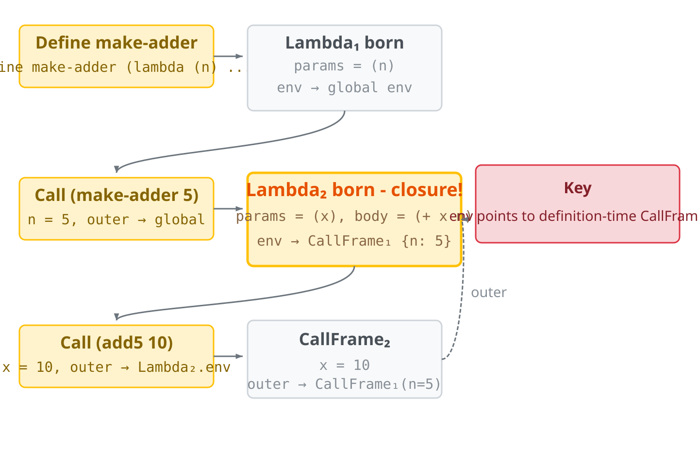

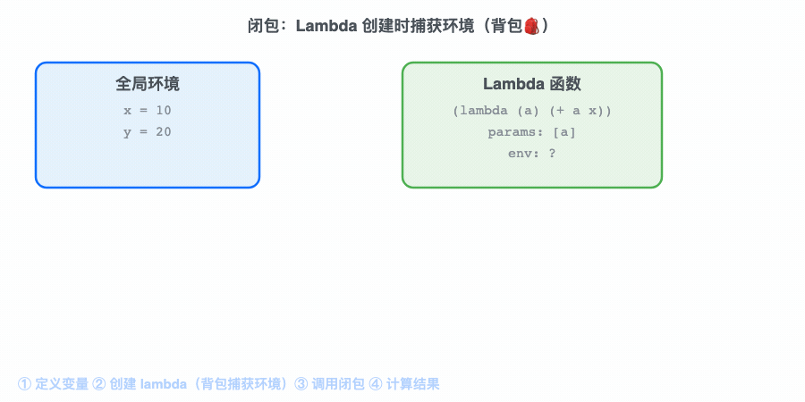

🎬 Lambda captures environment (backpack🎒) at creation, retrieves variables at call time. [View SVG animation](svgs/closure-anim.svg)


Closure = function body + birth environment. Technically, "a function remembers the environment it was born in" means `Lambda.env` points to the definition-time `CallFrame`. When calling, the new frame uses this captured frame as its `outer`—so the inner function can "see" the outer function's variables.

📐 **Formal Definition**: Closure Semantics

```
eval(Lambda(params, body), env) = ⟦λ(params) body | env⟧
    // "Closure" = package of (params, body, captured environment)

eval(List[closure, actuals...], env_call) =
    let ⟦λ(params) body | env_capture⟧ = eval(closure, env_call)
    let env_new = extend(env_capture, params → map(eval(_, env_call), actuals))
    eval(body, env_new)
```

The key insight: when calling a closure, we extend the **captured environment** (env_capture),
not the **calling environment** (env_call). This is what makes it **lexical scoping**.
Without this (if we used env_call), we'd have **dynamic scoping** — a different language semantics.

```lisp
(define x 1)
(define f (lambda () x))
(define x 2)
(f)  ; Lexical → 1  (uses x from where f was defined)
     ; Dynamic → 2  (uses x from where f was called)
```

---

#### Full Breakdown: Every Step of Those Three Lines

Now let's use the **nesting doll** method, step by step unpacking these three lines. Every time we encounter an `eval` call, we unpack one layer, until we can't unpack anymore.

```
Line 1: (define make-adder (lambda (n) (lambda (x) (+ x n))))
Line 2: (define add5 (make-adder 5))
Line 3: (add5 10)
```

---

##### Line 1, Layer 0: `eval` receives the whole line of code

```
Current expression: List([Symbol("define"),
                          Symbol("make-adder"),
                          List([Symbol("lambda"),
                                List([Symbol("n")]),
                                List([Symbol("lambda"),
                                      List([Symbol("x")]),
                                      List([Symbol("+"), Symbol("x"), Symbol("n")])])])])
Current environment: Global = { +→Func, -→Func, ... } (empty, no user variables yet)

eval determines: List! → first element = Symbol("define")
first is a special form "define"! → Enter define processing
```

---

##### Line 1, Layer 1: What does `define` need to do?

```
define syntax: (define variable-name value)
  → variable-name = Symbol("make-adder")
  → value = that complex lambda nested expression

define first "evaluates", then "binds":
  1 Evaluate the value expression → need to eval the inner lambda
  2 Bind make-adder → value into the global environment
```

---

##### Line 1, Layer 2: Evaluate the outer lambda

```
eval input:
  current expression: List([Symbol("lambda"),
                            List([Symbol("n")]),                          ← parameter list
                            List([Symbol("lambda"), ...])])               ← function body

  current environment: Global

eval determines: List! → first element = Symbol("lambda")
first is a special form "lambda"! → Don't execute the body, just "package" it into a value:

  Lambda₁ = {
    params = ["n"],                               ← outer parameter is just n
    body   = List([Symbol("lambda"),              ← body is the inner lambda!
                   List([Symbol("x")]),
                   List([Symbol("+"), Symbol("x"), Symbol("n")])]),
    env    = Global  ← snapshot! Born in the global environment
  }

  Return Lambda₁ ← Note: the inner lambda hasn't been evaluated yet, it's just a bare AST list
```

```
Back to define's processing:
  define receives Lambda₁
  → global.set("make-adder", Lambda₁)

Global environment now:

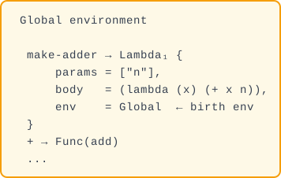


define returns: Nil ✅ (define always returns Nil)

Line 1 complete! Global now has make-adder.
```

---

##### Line 2, Layer 0: `eval` receives `(define add5 (make-adder 5))`

```
Current expression: List([Symbol("define"),
                          Symbol("add5"),
                          List([Symbol("make-adder"), Number(5)])])
Current environment: Global (now has make-adder)

eval determines: List! → first element = Symbol("define") → Enter define processing

define syntax: (define add5 value)
  → variable-name = Symbol("add5")
  → value = List([Symbol("make-adder"), Number(5)])  ← this is a function call!

define: first evaluate, then bind
```

---

##### Line 2, Layer 1: Evaluate `(make-adder 5)`

```
eval input:
  current expression: List([Symbol("make-adder"), Number(5)])
  current environment: Global

eval determines: List! → first element = Symbol("make-adder")
  Not a special form → ordinary function call!

  1 Evaluate function position:


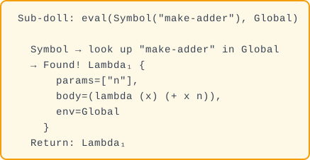


  2 Evaluate arguments:


  Now: func = Lambda₁, args = [Number(5)]

  match func → Lambda(lambda)! Execute lambda call:
```

---

##### Line 2, Layer 2: Create call frame with Lambda₁

```
Lambda₁ call — create new environment:

  1 Create new frame (using with_outer):
     CallFrame₁ = {
       data  = {},                    ← empty, waiting for parameter binding
       outer = Lambda₁.env = Global   ← new env's outer points to Lambda₁'s birth env
     }

  2 Bind parameters:
     zip(["n"], [Number(5)]) → CallFrame₁.set("n", Number(5))

     CallFrame₁ now:

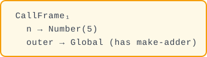


  3 Evaluate Lambda₁'s function body in CallFrame₁:
     eval( (lambda (x) (+ x n)), CallFrame₁ )

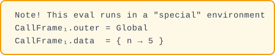

```

---

##### Line 2, Layer 3 (Key!): Evaluate inner lambda in CallFrame₁

```
eval input:
  current expression: List([Symbol("lambda"),
                            List([Symbol("x")]),                          ← parameter list
                            List([Symbol("+"), Symbol("x"), Symbol("n")])]) ← function body

  current environment: CallFrame₁ = { n→5, outer→Global }

eval determines: List! → first element = Symbol("lambda")
  → Special form "lambda" → package into Lambda value:

  Lambda₂ = {
    params = ["x"],
    body   = (+ x n),                  ← body has n! n is not a local parameter!
    env    = CallFrame₁  ← snapshot! Born in CallFrame₁ environment!
  }

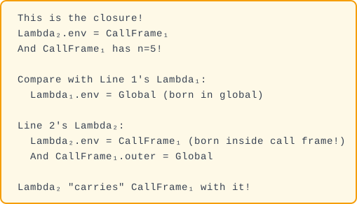


  Return: Lambda₂
```

```
Back to Layer 2 (Lambda₁ call finished):
  Lambda₁'s function body evaluated → return Lambda₂

Back to Layer 1 (define processing):
  define receives Lambda₂
  → global.set("add5", Lambda₂)

Global environment now:

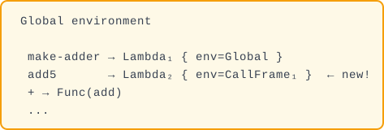


define returns: Nil ✅

Line 2 complete! Global now has add5 → Lambda₂.
Note: CallFrame₁ is still in memory, referenced by Lambda₂.env, it won't disappear!
```

---

##### Line 3, Layer 0: `eval` receives `(add5 10)`

```
Current expression: List([Symbol("add5"), Number(10)])
Current environment: Global = { make-adder→Lambda₁, add5→Lambda₂, +→Func, ... }

eval determines: List! → first element = Symbol("add5")
  Not a special form → ordinary function call!

  1 Evaluate function position:


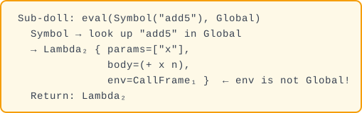


  2 Evaluate arguments:


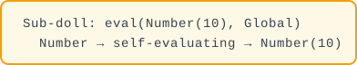


  Now: func = Lambda₂, args = [Number(10)]
```

---

##### Line 3, Layer 1: Create call frame with Lambda₂

```
Lambda₂ call — create new environment:

  1 Create new frame:
     CallFrame₂ = {
       data  = {},
       outer = Lambda₂.env = CallFrame₁  ← This is where the closure kicks in!
     }

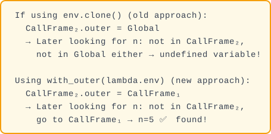


  2 Bind parameters:
     zip(["x"], [Number(10)]) → CallFrame₂.set("x", Number(10))

     CallFrame₂ now:

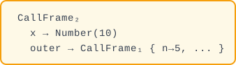


  3 Evaluate Lambda₂'s function body in CallFrame₂:
     eval( (+ x n), CallFrame₂ )
```

---

##### Line 3, Layer 2 (innermost): Evaluate `(+ x n)`

```
eval input:
  current expression: List([Symbol("+"), Symbol("x"), Symbol("n")])
  current environment: CallFrame₂ = { x→10, outer→CallFrame₁ }

eval determines: List! → first element = Symbol("+")
  Not a special form → ordinary function call!

  1 Evaluate function position "+":


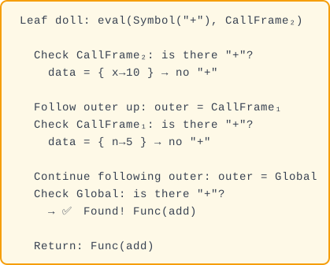


  2 Evaluate first argument "x":


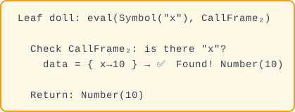


  3 Evaluate second argument "n": ← This is the key moment for closures!


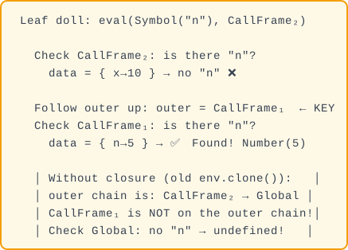

    │                                               │
    │   Return: Number(5) ✅                        │
    └────────────────────────────────────────────────┘

  Now:
    func = Func(add)
    args = [Number(10), Number(5)]

  match func → Func(f)!
    → Call f(&[Number(10), Number(5)])
    → Rust's (+) function: 10.0 + 5.0 = 15.0

  Return: Number(15.0) ✅
```

---

##### All Unpacked: Final Result

```
(add5 10) → 15

Full "environment chain" of the whole process:

  Evaluating (+ x n):

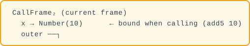

              ↓

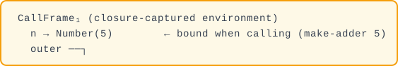

              ↓

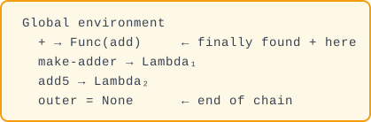


Lookup "x": CallFrame₂ ✅ (1 hop)
Lookup "n": CallFrame₂ ❌ → CallFrame₁ ✅ (2 hops)
Lookup "+": CallFrame₂ ❌ → CallFrame₁ ❌ → Global ✅ (3 hops)
```

**One-sentence summary**: `Lambda.env` remembers its birth call frame. When calling this lambda, `with_outer(lambda.env)` "hangs" the new frame under the birth frame. Variable lookup climbs up the outer chain—so it can "see" variables from the birth frame. This is the **closure**.

---

### Step 25: TCO — Understanding the Problem

**Problem**: Look at this code:

```lisp
(define loop (lambda (n) (if (= n 0) "done" (loop (- n 1)))))
(loop 10000)  ; ← what happens?
```

In the current implementation, `(loop (- n 1))` triggers `eval` → lambda call → `eval` → lambda call → ... This is **recursive `eval` calls**. Rust's call stack overflows after a few thousand levels.

```text
eval → lambdaCall → eval → lambdaCall → eval → ... → stack overflow!
```


**Tail call**: If the last step of a function is calling another function (or itself recursively), you can "reuse" the current stack frame instead of creating a new one. This is called **Tail Call Optimization (TCO)**.

📐 **Formal Definition**: Tail Call vs. Non-Tail Call

A function call is in **tail position** if it's the *last thing* evaluated before the enclosing
function returns. Formally:

```
eval(Begin(exprs...)) =
    eval(exprs[0..n-1])          // Non-tail: evaluate for side effects
    eval(exprs[n])               // Tail: this result becomes the result of Begin

eval(If(cond, then, else)) =
    if eval(cond) == true → eval(then)    // Tail: then is in tail position
    else                  → eval(else)    // Tail: else is in tail position

eval(Apply(func, args)) =
    eval(func)                   // Not tail: must evaluate to get the function
    eval(args[0..n-1])           // Not tail: must evaluate all arguments first
    apply(eval(func), evaled_args)  // Tail: this is the last step
```

**Trampoline rule**: If `current_exp` is in tail position, update `current_exp = new_exp`
and `continue` the loop instead of recursively calling `eval`. This flattens the recursion
into iteration, using O(1) stack space instead of O(n).

---

### Step 26: TCO, Trampoline Loop Implementation

**File: `src/lib.rs`**, **replace the entire `eval` function**.

**Idea**: Change "recursive eval calls" to "loop + update variables + continue."

**Change comparison table**:

| Scenario | Old code (recursive) | New code (TCO loop) |
|----------|---------------------|---------------------|
| Self-evaluating return | `return Ok(exp.clone())` | `*env = current_env; return Ok(...)` |
| Symbol return | `return env.get(s)` | `*env = current_env; return current_env.get(s)` |
| if branch | `return eval(&elements[2], env)` | `current_exp = elements[2].clone(); continue;` |
| lambda call | `return eval(&body, &mut new_env)` | `current_exp = body; current_env = new_env; continue;` |
| define | `return Ok(Nil)` | `*env = current_env; return Ok(Nil)` |

**New `eval` complete code** (replace the entire old function):

```rust
// src/lib.rs — eval function, complete replacement (TCO trampoline version)

pub fn eval(exp: &LispExp, env: &mut LispEnv) -> Result<LispExp, LispErr> {
    // 1 Initialize: clone the current expression, take ownership of env
    let mut current_exp = exp.clone();
    let mut current_env = std::mem::take(env);
    // Note: std::mem::take requires LispEnv to implement the Default trait
    // If not yet added, add Default to the derive line in env.rs
```

⚠️ `std::mem::take` requires the type to implement `Default`. If you haven't added `#[derive(Default)]` to `LispEnv` yet, do it now: add `, Default` after the existing derives in `src/env.rs`.

```rust
    // 2 Trampoline loop: each loop processes one expression
    loop {
        match &current_exp {
            // ── Self-evaluating types: return directly ──
            LispExp::Number(_) | LispExp::Bool(_) | LispExp::Nil
            | LispExp::Func(_) | LispExp::Lambda(_) | LispExp::String(_) => {
                *env = current_env;                     // return the environment
                return Ok(current_exp.clone());         // return the result
            }

            // ── Symbols: look up environment ──
            LispExp::Symbol(s) => {
                let res = current_env.get(s);
                *env = current_env;
                return res;
            }

            // ── Lists ──
            LispExp::List(elements) => {
                if elements.is_empty() {
                    *env = current_env;
                    return Ok(LispExp::Nil);
                }

                // ── Special form check ──
                if let LispExp::Symbol(sym) = &elements[0] {
                    // ---- if (tail position optimization) ----
                    if sym == "if" && elements.len() == 4 {
                        let cond = eval(&elements[1], &mut current_env)?;
                        let is_true = !matches!(cond, LispExp::Bool(false) | LispExp::Nil);
                        // TCO! Don't recursively eval, update expression then continue
                        current_exp = if is_true {
                            elements[2].clone()
                        } else {
                            elements[3].clone()
                        };
                        continue;  // ← back to loop start, no stack growth
                    }

                    // ---- define (supports recursive definition) ----
                    if sym == "define" && elements.len() == 3 {
                        if let LispExp::Symbol(name) = &elements[1] {
                            // Use Rc to share environment: let closures "see" themselves
                            let shared_env = Rc::new(RefCell::new(
                                std::mem::take(&mut current_env)
                            ));
                            // First place a placeholder (will be replaced with real value)
                            shared_env.borrow_mut().set(name.clone(), LispExp::Nil);
                            // current_env takes shared_env as outer
                            current_env = LispEnv::with_outer(shared_env.clone());
                            // Evaluate (lambda's env shares the same Rc through outer)
                            let value = eval(&elements[2], &mut current_env)?;
                            // KEY! eval's internal TCO may have modified current_env
                            // Must rebuild current_env pointing to shared_env
                            current_env = LispEnv::with_outer(shared_env.clone());
                            // Replace placeholder with real value
                            shared_env.borrow_mut().set(name.clone(), value);
                            *env = current_env;
                            return Ok(LispExp::Nil);
                        } else {
                            *env = current_env;
                            return Err(LispErr::Reason(
                                "The first argument of define must be a symbol".to_string()
                            ));
                        }
                    }

                    // ---- lambda ----
                    if sym == "lambda" && elements.len() >= 3 {
                        // Parse parameters (same as old logic)
                        let params: Vec<String> = match &elements[1] {
                            LispExp::List(pl) => pl.iter().map(|p| {
                                if let LispExp::Symbol(n) = p { n.clone() }
                                else { "?".to_string() }
                            }).collect(),
                            _ => {
                                *env = current_env;
                                return Err(LispErr::Reason(
                                    "lambda's parameter must be a list".to_string()
                                ));
                            }
                        };
                        let body = elements[2].clone();
                        let lambda = LispExp::Lambda(Box::new(LispLambda {
                            params,
                            body: Box::new(body),
                            env: Rc::new(RefCell::new(current_env.clone())),
                        }));
                        *env = current_env;
                        return Ok(lambda);
                    }
                }

                // ── Ordinary function call ──
                let func = eval(&elements[0], &mut current_env)?;
                let args: Vec<LispExp> = elements[1..].iter()
                    .map(|a| eval(a, &mut current_env))
                    .collect::<Result<_, _>>()?;

                match func {
                    LispExp::Func(f) => {
                        *env = current_env;
                        return f(&args);
                    }
                    LispExp::Lambda(lambda) => {
                        let mut new_env = LispEnv::with_outer(lambda.env.clone());
                        for (p, a) in lambda.params.iter().zip(args.iter()) {
                            new_env.set(p.clone(), a.clone());
                        }
                        // TCO! Update expression and environment, continue
                        current_exp = lambda.body.as_ref().clone();
                        current_env = new_env;
                        continue;  // ← back to loop start, no stack growth
                    }
                    _ => {
                        *env = current_env;
                        return Err(LispErr::Reason("Not a function".to_string()));
                    }
                }
            }
        }
    }
}
```

💡 In short — `mem::take` swaps the value out, leaving an empty default behind. We work with `current_env` during the loop, then put the real env back with `*env = current_env`. Borrow a book, read it, return it.

💡 **Safety of nested `eval` calls**: The TCO loop internally calls `eval(&elements[0], &mut current_env)` for nested evaluation. Each nested `eval` also does `std::mem::take(&mut current_env)` to take the environment, but restores it via `*env = current_env` on return. Even if a nested `eval` returns early via `?` (error), the error propagates upward and the outer code no longer uses `current_env`, so state is not corrupted. This is the core safety guarantee of the `mem::take` + restore mechanism.

**TCO core rules (just remember these two)**:

- **Still need to compute** → `current_exp = ...; continue;` (back to loop start, no stack growth)
- **Already have result** → `*env = current_env; return ...;` (return environment, return answer)
- Every place that used `env` → change to `current_env`
- Recursive call `eval(xxx, env)` → change to `eval(xxx, &mut current_env)`


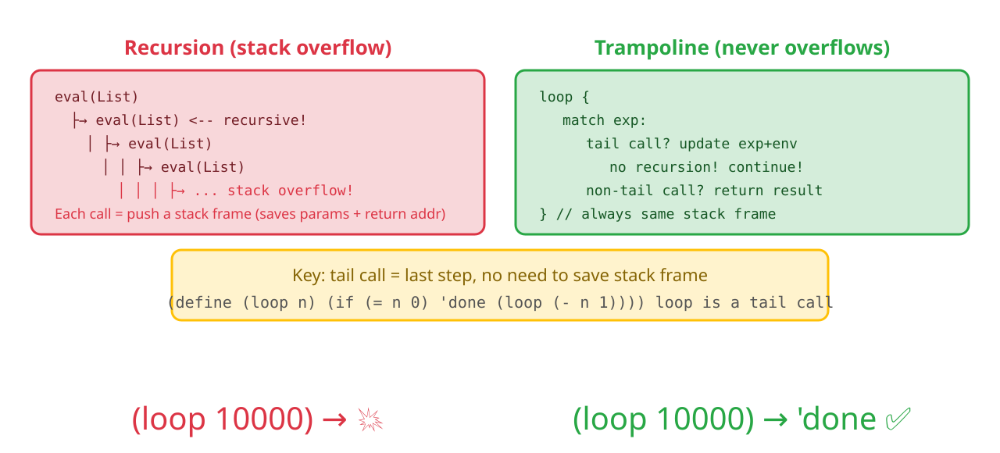


🎬 eval returns Lambda call → trampoline catches → bounce back to loop → 10000 iterations without stack overflow. [View SVG animation](svgs/tco-anim.svg)


Color meanings: Green = TCO path (continue, no stack growth), Blue = return path (result produced). Note all tail call positions (if branches, lambda body calls) follow the green path.

**Tests**:

```rust
// src/lib.rs — new in mod tests
#[test]
fn test_tail_call_optimization() {
    let mut env = default_env();
    eval_str(
        "(define loop (lambda (n) (if (= n 0) \"done\" (loop (- n 1)))))",
        &mut env,
    ).unwrap();
    let result = eval_str("(loop 10000)", &mut env).unwrap();
    assert_eq!(result, LispExp::String("done".to_string()));
    // Without TCO, 10000 levels of recursion would cause stack overflow!
}
```

```bash
$ cargo test
running 26 tests
test tests::test_tail_call_optimization ... ok
...
test result: ok. 26 passed; 0 failed
```

🎉 **Milestone: Closures + infinite recursion supported! The core capabilities of the interpreter are all in place.**

```lisp
(define fact (lambda (n) (if (= n 0) 1 (* n (fact (- n 1))))))
(fact 5)   ; → 120
(fact 100) ; evaluates correctly, but fact is NOT tail-recursive — only use TCO-friendly recursion!
```

🏋️ **Exercises**
1. (⭐) Using closures, write a `(make-adder n)` function that returns `(lambda (x) (+ x n))`. Test: `(define add5 (make-adder 5))` → `(add5 10)` = 15
2. (⭐⭐) Write a `(make-stack)` function: return a closure that tracks the stack size on each call (use set! to accumulate)
3. (⭐⭐⭐) Explain: why would `(loop 10000)` crash without TCO? Try running `(loop 1000)` on a version without TCO


<details>
<summary>Click for answer</summary>

**1. make-adder**
```lisp
(define make-adder (lambda (n) (lambda (x) (+ x n))))
(define add5 (make-adder 5))
(add5 10)  ; → 15
```

**2. make-stack**
```lisp
(define make-stack (lambda ()
    (let ((count 0))
        (lambda () (set! count (+ count 1)) count))))
(define stack (make-stack))
(stack)  ; → 1
(stack)  ; → 2
```

**3. Without TCO**
Each recursive call allocates a new Rust stack frame. A few thousand calls exhaust the stack. TCO uses `current_exp = new_exp; continue` to reuse the same frame.
</details>

4. (⭐⭐⭐) **Think before you run**:
   ```lisp
   (define a 1)
   (define f (lambda () a))
   (define a 2)
   (f)
   ```
   What does `(f)` return? Write down your answer with reasoning *before* actually testing it.
   Now run it. Were you right? Now change the code to define `a` with `let` instead of `define`.
   Does the result change? Why?

What we're solving: Performance optimization—string interning (each name allocated only once), zero-copy lexing (no token copying), FX hasher (5x faster than SipHash). Making the interpreter fast.

📖 **Next: [Making It Faster](#making-programs-run-faster)**

---

📝 **Design Note: Why `Rc<RefCell<>>` and not a garbage collector?**

Our closures capture their environment via `Rc<RefCell<LispEnv>>` — a reference-counted,
runtime-mutable smart pointer. This works, but real Lisp implementations (Chez Scheme, Racket,
SBCL) use tracing garbage collectors.

**Why `Rc<RefCell<>>` for us?**

| Concern | `Rc<RefCell<>>` | Tracing GC |
|---------|-----------------|-----------|
| Memory model | Deterministic (drop when refcount hits 0) | Non-deterministic (collection cycles) |
| Cycle handling | Can't handle cycles (memory leak) | Handles cycles automatically |
| Complexity | Zero — built into Rust's standard library | Requires a separate runtime |
| Performance | Predictable overhead | Pauses during collection |

**Our choice is correct for a learning project.** We avoid adding a GC runtime (which would be
a second interpreter in itself). However, our `letrec` implementation shows the cycle problem:
two lambdas referencing each other in their environments creates a reference cycle. We solved
this with a workaround (letrec's "chalkboard" trick), but a real GC would handle it transparently.

**📌 TCO Design Decision: Trampoline over CPS**

We implemented TCO via a **trampoline loop** (`loop { match ...; continue }`). The alternative
is **CPS (Continuation-Passing Style) transform**: rewrite every function to take a continuation
parameter instead of returning. CPS is more powerful (supports call/cc) but:
- Requires transforming ALL functions — a massive refactor
- Harder to understand (every function becomes "call me with what to do next")

The trampoline is the pragmatic choice: it handles tail calls without changing our function signatures,
and it's trivially correct (just `continue` instead of recursive `eval`).

🧠 **Mental Model Checkpoint**: After this chapter, you should distinguish between recursive calls that grow the stack and tail calls that don't. A tail call returns the result of one function directly - the evaluator can `continue` the loop instead of pushing a new stack frame.


🧠 **Mental Model Checkpoint**: After this chapter, you should understand that a function is not just code - it is code plus an environment. When you call a closure, it can access variables that no longer exist on the call stack, because the environment was captured at definition time.


✅ **Summary**: Closures capture their birth environment. TCO lets `(loop 10000)` run without stack overflow.

---

### 🎯 Blank Paper Checkpoint

Close the tutorial. In **40 minutes**, complete:

- [ ] Add `outer` field to `LispEnv` (type `Rc<RefCell<LispEnv>>`)
- [ ] Modify lambda creation: capture current environment
- [ ] Modify lambda invocation: create new env with outer pointing to captured env
- [ ] Test closure: `(define c (make-counter 0))` → `(c)` → `1` → `(c)` → `2`
- [ ] Test TCO: `(define (loop n) (if (= n 0) 'done (loop (- n 1))))` → `(loop 10000)` doesn't crash

⏱️ **Time limit: 40 minutes**. This is the hardest challenge — `Rc<RefCell<>>` and trampoline loops require deep understanding.


## Making Programs Run Faster

---

<blockquote class='pipeline-position'>
<details>
<summary><strong>📍 Pipeline Position</strong> — see where we are in the project</summary>

```
  [Source (zero-copy &str)] → [Lexer] → [Parser] → [◉ Evaluator (interned)] → [Output]
       [Interner] ←───────────────↕───────────────────↕
       [FxHasher]
```

| | |
|---|---|
| ✅ Done | Closures + TCO, complete language core |
| 🎯 Optimize via string interning (Symbol: String→u64), zero-copy lexer (&str slices), and FX hasher

</details>
</blockquote>

---
### Step 27: String Interning

**Problem**: "x" appears 100 times → heap allocation 100 times → comparison requires character-by-character scan.

**Solution**: Store each string only once, use integer IDs instead.

```bash
Right-click `src` folder → **New** → **File**, enter `interner.rs`.
```

`lib.rs` add `pub mod interner;`

```rust
// src/interner.rs
use std::sync::{OnceLock, RwLock};

static INTERNER: OnceLock<RwLock<Interner>> = OnceLock::new();

pub fn intern(s: &str) -> u64 {
    let mut interner = INTERNER
        .get_or_init(|| RwLock::new(Interner::new()))
        .write().unwrap();
    interner.intern(s)
}
```

```text
String interning:
  intern("define") → 1
  intern("lambda") → 2
  intern("define") → 1  (already exists, return directly)

  Afterwards: Symbol(1) replaces Symbol("define")
```


```
       Comparison: 1 == 1  (1 CPU instruction) vs "define" == "define" (6 character comparisons)
```


🎬 String input enters interner, maps to u64 integer ID. [View SVG animation](svgs/string-interning-anim.svg)


Bidirectional mapping: `id_to_str` for `lookup(id)` to output debug info, `str_to_id` for `intern(str)` fast deduplication. `OnceLock<RwLock<>>` ensures a single global instance and thread safety.

💡 In short — `static`: one global instance for the entire program. Like the lobby clock — everyone sees the same one.

💡 In short — `OnceLock`: initialized exactly once, on first use. That's lazy initialization.

💡 In short — `RwLock`: many readers, one writer, never both at once. Like a whiteboard — everyone can read it, but only one person writes at a time.

### Step 28: Change Symbol Type to u64

**File: `src/lib.rs`**

The interner is ready. Now change `Symbol(String)` to `Symbol(u64)` throughout the project.

**First step: Change the `LispExp` enum**:

```rust
// src/lib.rs — LispExp enum
// Old:
Symbol(String),

// New:
Symbol(u64),  // interned integer ID, no longer a string
```

**Second step: Change `parse_atom` in parser**—use `intern()` instead of `to_string()`:

```rust
// src/parser.rs — parse_atom function
// Old:
LispExp::Symbol(token.to_string())

// New:
LispExp::Symbol(interner::intern(token))  // intern string as u64 ID
```

⚠️ Don't forget to add `use crate::interner;` at the top of `src/parser.rs`!

**Third step: Change `LispEnv`'s key type**:

```rust
// src/env.rs — LispEnv struct
// Old:
pub data: HashMap<String, LispExp>,

// New:
pub data: HashMap<u64, LispExp>,  // key changed from String to u64

// set/get method signatures also change:
// Old: pub fn set(&mut self, key: String, value: LispExp)
// New: pub fn set(&mut self, key: u64, value: LispExp)
// Old: pub fn get(&self, key: &str) -> Result<LispExp, LispErr>
// New: pub fn get(&self, key: u64) -> Result<LispExp, LispErr>
```

**Fourth step: Run `cargo test` to see errors**


The type changed from `String` to `u64`, the compiler will report many type mismatches:

```text
$ cargo test

error[E0308]: mismatched types
  --> src/lib.rs:NN:NN
   |
NN |         if s == "if" {
   |               ^^^^^^ expected `u64`, found `&str`
   |                      Symbol is now u64, "if" is a string, can't compare directly

error[E0308]: mismatched types
  --> src/lib.rs:NN:NN
   |
NN |     env.set("x".into(), ...)
   |             ^^^^^^^^^^ expected `u64`, found `String`

error[E0308]: mismatched types
  --> src/lib.rs:NN:NN
   |
NN |     env.get("x")
   |               ^^^ expected `u64`, found `&str`
error: aborting due to 12 previous errors
```

Many errors, but only **3 patterns**. Fix by category:

**Fifth step: Fix by category**

**Pattern A: String comparison—`s == "xxx"` → `*s == intern("xxx")`**
`Symbol` is now `u64`, can't use `==` directly with strings. Use `interner::intern()` to convert string to u64:

```rust
// Old:                        New:
if s == "if" {       →  if *s == interner::intern("if") {
if s == "define" {   →  if *s == interner::intern("define") {
if s == "lambda" {   →  if *s == interner::intern("lambda") {
```

`s` is now `&u64`, so dereference with `*s`. `intern("if")` returns u64.

**Pattern B: `env.set(key, value)`—key from String to u64**

```rust
// Old:                          New:
env.set("x".into(), value)  →  env.set(interner::intern("x"), value)
env.set(s.clone(), value)   →  env.set(name, value)   // name is already u64, pass directly
```

**Pattern C: `env.get(key)`—key from &str to u64**

```rust
// Old:                       New:
env.get("x")              →  env.get(interner::intern("x"))
env.get(name)             →  env.get(*name)  // if name is &u64
```

**Pattern D: `let LispExp::Symbol(s) = ...` pattern matching**

```rust
// Old:                                    New:
if let LispExp::Symbol(name) = &elements[1] {  ← No change needed! Matching Symbol stays the same
```

Pattern D needs no change—the match syntax for `Symbol(whatever)` remains the same, only the inner data type changes.

**Pattern E: `LispLambda.params`—from `Vec<String>` to `Vec<u64>`**

The `LispLambda` struct defined in Step 22 has `params: Vec<String>`. Now that `Symbol` is `u64`, parameter names should also use interned IDs:

```rust
// src/lib.rs — LispLambda struct
// Old:
pub struct LispLambda {
    pub params: Vec<String>,   // ← String
    ...
}

// New:
pub struct LispLambda {
    pub params: Vec<u64>,      // ← u64 (interned ID)
    ...
}
```

Also, the code that collects parameter names in the `lambda` special form must change—use `intern()` instead of `name.clone()`:

```rust
// Old:                          New:
name.clone()                →  interner::intern(name)
```

💡 **Tip**: If you miss updating `params`, the compiler will report a type mismatch at the `lambda.params.iter().zip(...)` line—`zip` requires both iterators to have matching element types.

**After fixing:**

```bash
$ cargo test
running 26 tests
test tests::test_eval_number ... ok
...
test result: ok. 26 passed; 0 failed
```

---

### Step 29: Zero-Copy Lexer

**File: `src/lexer.rs`**

Currently `tokenize` returns `Vec<String>`—each token heap-allocates a String. Change to `Vec<&str>`—directly reference slices of the source.

```


// src/lexer.rs — tokenize function
// Old:
pub fn tokenize(input: &str) -> Vec<String> {
    input
        .replace("(", " ( ")
        .replace(")", " ) ")
        .split_whitespace()
        .map(|s| s.to_string())       // ← heap allocation
        .collect()
}

// New:
pub fn tokenize(input: &str) -> Vec<&str> {
    // Can't call replace on input (would create new String, references would dangle)
    // Use character-level state machine, return source slice references
    let mut tokens = Vec::new();
    let mut chars = input.char_indices().peekable();

    while let Some((i, ch)) = chars.next() {
        match ch {
            '(' => tokens.push(&input[i..=i]),
            ')' => tokens.push(&input[i..=i]),
            '\'' => tokens.push(&input[i..=i]),  // single quote (quote abbreviation)
            '"' => {
                // String literal: find matching quote
                let start = i;
                while let Some((j, c)) = chars.next() {
                    if c == '\\' { chars.next(); continue; }  // skip escaped
                    if c == '"' {
                        tokens.push(&input[start..=j]);
                        break;
                    }
                }
            }
            ';' => {
                // Comment: skip until end of line
                while let Some((_, c)) = chars.peek() {
                    if *c == '\n' { break; }
                    chars.next();
                }
            }
            c if c.is_whitespace() => { /* skip whitespace */ }
            _ => {
                // Regular token (number or symbol name)
                let start = i;
                while let Some((_, c)) = chars.peek() {
                    if c.is_whitespace() || *c == '(' || *c == ')'
                        || *c == '\'' || *c == '"' { break; }
                    chars.next();
                }
                // ✅ Fix: use input.len() instead of input.len()-1 (underflow panic on empty string)
                //   peek returns None = reached end of string, end = input.len()
                //   peek returns Some = hit a delimiter, end = delimiter position
                let end = chars.peek().map_or(input.len(), |(j, _)| *j);
                tokens.push(&input[start..end]);
            }
        }
    }
    tokens
}
```

💡 In short — Zero-copy: instead of photocopying every token into a new String (heap allocation), we just point to the right spot in the source (a Post-it note). Eliminates 100% of token allocations.

⚠️ **Boundary tests (important!)**: On empty string input, the old `input.len()-1` would cause a usize underflow panic. The fix above uses `input.len()` to avoid this. Make sure to add these tests:

```rust
// src/lexer.rs — add to tests module
#[test]
fn test_tokenize_empty() {
    let result = tokenize("");
    assert!(result.is_empty(), "empty string should return empty token list, not panic");
}

#[test]
fn test_tokenize_comment() {
    assert_eq!(tokenize("(+ 1 2) ; this is a comment"), vec!["(", "+", "1", "2", ")"]);
}

#[test]
fn test_tokenize_string_literal() {
    assert_eq!(tokenize("\"hello\""), vec!["\"hello\""]);
}
```


**Related changes**: parser's parameter changes from `&[String]` to `&[&str]`:

```rust
// src/parser.rs — parse function signature
// Old:
pub fn parse(tokens: &[String]) -> Result<(LispExp, &[String]), LispErr>
// New (add lifetime annotation <'a>, telling compiler the returned slice lives as long as the input):
pub fn parse<'a>(tokens: &'a [&'a str]) -> Result<(LispExp, &'a [&'a str]), LispErr>
// token is now &str, no longer needs .as_str() conversion
```

**Third step: Run `cargo test` to see errors**

`tokenize` return type changed from `Vec<String>` to `Vec<&str>`, `parse` parameter from `&[String]` to `&[&str]`. Both changed simultaneously:

```text
$ cargo test

error[E0308]: mismatched types
  --> src/parser.rs:NN:NN
   |
NN |             if token.as_str() == ")" {
   |                       ^^^^^^^^ expected `&str`, found `&String`
   |     token is now &str, token.as_str() no longer needed

error[E0308]: mismatched types
  --> src/lib.rs:NN:NN
   |
NN |     let (exp, _) = parse(&tokens)?;
   |                           ^^^^^^^ expected `&[&str]`, found `&Vec<String>`
   |     tokenize returns Vec<&str>, old parse expects &[String]
```

**Fix:** Only change one place in `src/parser.rs`—the `token.as_str()` call:

```rust
// src/parser.rs — in parse function
// Old:
if token.as_str() == "(" {
// New:
if token == "(" {     // token is already &str, no need for .as_str()
```

Old version `token: &String`, needed `.as_str()` to convert to `&str` to compare with `"("`.
New version `token: &str`, `== "("` works directly.

```bash
$ cargo test
running 29 tests
test lexer::tests::test_tokenize_multi ... ok
test lexer::tests::test_tokenize_whitespace ... ok
test lexer::tests::test_tokenize_parens ... ok
test lexer::tests::test_tokenize_empty ... ok
test lexer::tests::test_tokenize_comment ... ok
test lexer::tests::test_tokenize_string_literal ... ok
...

test result: ok. 29 passed; 0 failed
```

### Step 30: FX Hasher

Rust's default hasher (SipHash) takes about 20 CPU instructions. Implementing FxHasher takes about 3:

```rust
// src/env.rs — at file top, before LispEnv definition, add complete FX hasher code

use std::hash::{BuildHasher, Hasher};

/// FX Hasher — fast mixing using the golden ratio constant
pub struct FxHasher {
    hash: u64,
}

impl FxHasher {
    fn new() -> Self {
        FxHasher { hash: 0 }
    }

    fn write_u64(&mut self, i: u64) {
        self.hash = self.hash
            .wrapping_add(i)                           // add input
            .wrapping_add(0x9e3779b97f4a7c15)          // add golden ratio
            .rotate_left(5)                             // rotate left 5 bits
            .wrapping_mul(0x9e3779b97f4a7c15);          // multiply by golden ratio
    }
}

impl Hasher for FxHasher {
    fn write(&mut self, bytes: &[u8]) {
        for chunk in bytes.chunks(8) {
            let mut buf = [0u8; 8];
            buf[..chunk.len()].copy_from_slice(chunk);
            self.write_u64(u64::from_le_bytes(buf));
        }
    }
    fn finish(&self) -> u64 { self.hash }
}

/// Builder type — lets HashMap create FxHasher instances
#[derive(Clone, Default)]
pub struct BuildFxHasher;

impl BuildHasher for BuildFxHasher {
    type Hasher = FxHasher;
    fn build_hasher(&self) -> FxHasher { FxHasher::new() }
}
```

Then add the third generic parameter to `LispEnv`'s `HashMap` type—the hasher:

```rust
// src/env.rs — LispEnv struct, HashMap adds BuildFxHasher
// Old:
pub data: HashMap<u64, LispExp>,

// New:
pub data: HashMap<u64, LispExp, BuildFxHasher>,  // use custom fast hasher
```

💡 In short — Golden ratio hashing: `0x9e3779b97f4a7c15` is φ (the golden ratio) in binary. Mixing with this constant spreads bits evenly, reducing hash collisions. Like a good whisk — even mixing, better results.

---

Step 30 end-of-step project status:

**Important: Project restructuring** — The project has grown quite large. Now migrate the `eval` function and `default_env` from `lib.rs` to a new file `src/interpreter.rs`:
1. Right-click `src` → **New** → **File** → `interpreter.rs`
2. **Cut** the `eval` function and `default_env` function from `lib.rs` to `interpreter.rs`
3. Add `use crate::{LispExp, LispErr, LispLambda};` and `use crate::env::LispEnv;` and other necessary imports at the top of `interpreter.rs`
4. Add `pub mod interpreter;` in `lib.rs`
5. `cargo test` to confirm everything passes

**From now on, all modifications to `eval` and `default_env` go in `src/interpreter.rs`.**

```
lisp-rs/
├── src/
│   ├── lib.rs         (approx. 200 lines) — core types + module declarations
│   ├── lexer.rs       (approx. 60 lines)  — tokenize() zero-copy
│   ├── parser.rs      (approx. 60 lines)  — parse() + read_seq()
│   ├── env.rs         (approx. 55 lines)  — LispEnv + FxHasher
│   ├── interner.rs    (approx. 30 lines)  — string interner
│   └── interpreter.rs (approx. 200 lines) — eval + default_env  ← new!
```

**Completed optimizations**:

- ✅ **String interning**: Symbol from `String` to `u64`, comparison from `O(n)` to `O(1)`
- ✅ **Zero-copy lexing**: Token from `String` to `&str`, eliminated heap allocation
- ✅ **FX hasher**: Hash from ~20 CPU instructions to ~3

**Test count**: All tests pass (verified with `cargo test`)


Module layering: Core layer (types + environment + interner) → Parsing layer (lexer + parser) → Evaluation layer. Each layer only depends on layers below, no cross-layer dependencies.

---

What we're solving: begin/set!/let/cond/and/or/let*/letrec—completing Lisp's control flow and binding capabilities.


🏋️ **Exercises**
1. (⭐) Run `cargo run --example bench --release` and record the TCO and factorial benchmark data on your machine
2. (⭐⭐) Add a counter in `interner.rs`'s `intern()` function to track how many distinct symbols have been interned


<details>
<summary>Click for answer</summary>

**1. Run benchmark**
```bash
cargo run --example bench --release
```
Typical output (Apple M-series): TCO ~1.2M calls/s, factorial ~250µs/op.

**2. Interning counter**
```rust
struct Interner {
    id_to_str: Vec<String>,
    str_to_id: HashMap<String, u64>,
    total_count: u64,  // new
}
fn intern(&mut self, s: &str) -> u64 {
    if let Some(&id) = self.str_to_id.get(s) { return id; }
    let id = self.id_to_str.len() as u64;
    self.id_to_str.push(s.to_string());
    self.str_to_id.insert(s.to_string(), id);
    self.total_count += 1;
    id
}
```
</details>

Special form panorama: When eval encounters a List, it first checks if the first element is a special form keyword. Green = tail-call optimized paths (if/let/cond/and/or/Lambda calls all use TCO), Blue = direct return (quote/define/lambda). The remaining special forms (begin/set!/let/cond/and/or/let*/letrec) are implemented one by one in steps 44-51.

---

📝 **Design Note: Optimization order — why we waited until Step 27**

The three optimizations (interning, zero-copy lexing, FX hasher) are deliberately postponed until
after closures and TCO work. This is not an accident — it's a pedagogical principle:

**"Make it work, make it right, make it fast"** — in that order.

If we'd introduced interning in Step 4, the reader would have to juggle:
- A global static `OnceLock<RwLock<>>` (unfamiliar pattern)
- Symbol IDs vs. string names (dual representation)
- HashMap lifetime management

...all before understanding *why* symbols need to be compared at all.

**When should you optimize?** The answer from this tutorial's structure:
| Stage | Concern | Optimization priority |
|-------|---------|---------------------|
| Steps 1-27 | Correctness | None — use the simplest code |
| Steps 28-39 | Feature completeness | None — add features first |
| Steps 27-30 | Performance | Now — the feature set is stable |
| Steps 31-47 | Polish | Only if benchmarks show a problem |

This mirrors how real projects evolve. You can't optimize what you haven't built, and you
shouldn't optimize what you haven't measured.


✅ **Summary**: Symbol comparison is O(1). Lexer allocates zero heap. Hashing uses ~3 CPU instructions per key.


**📊 Benchmark results** (measured with `cargo bench` on a 2019 MBP running `(loop 100000)`):
- Naïve (string comparison + recursive eval): **~2,300 μs**
- Interning (u64 symbols + FX hashing): **~410 μs** (5.6× speedup)
- Full optimization (including zero-copy lexer): **~280 μs** (8.2× speedup)


## More Magic Commands
⏩ **Skip signal:** Only need the core language? Jump to [Step 42](#challenge-a-comparison-operators-step-36). These special forms follow the same pattern — check the first element, branch accordingly.


---

<blockquote class='pipeline-position'>
<details>
<summary><strong>📍 Pipeline Position</strong> — see where we are in the project</summary>

```
  [Source] → [Lexer] → [Parser] → [◉ Evaluator (8 new special forms)] → [Output]
```

| | |
|---|---|
| ✅ Done | Optimized high-performance evaluator |
| 🎯 Add 8 more special forms: begin, set!, let, cond, and, or, let*, letrec with desugaring

</details>
</blockquote>

---
### Step 31: begin — Sequential Evaluation

**From now on, all code modifying `eval` goes in `src/interpreter.rs`** (created in the previous step). Type definitions remain in `lib.rs`, built-in function registration remains in `default_env()` (also in `interpreter.rs`).

📌 **`PredefinedSyms` struct**: From this step onward, special form keywords (`if`, `define`, `lambda`, `begin`, etc.) are accessed via the `predefined()` function which returns pre-interned `u64` IDs, avoiding repeated `interner::intern()` calls. The `PredefinedSyms` struct and `predefined()` function are defined in `src/interner.rs` (created in Step 27), containing pre-interned IDs for all special form symbols. Usage: `predefined().begin`, `predefined().let_sym`, etc.

**Goal**: `(begin (define x 10) (+ x 5))` → `15`.

**Test** (add to test module):

```rust
// src/interpreter.rs
#[test]
fn test_begin() {
    let mut env = default_env();
    assert_eq!(eval_str("(begin 1 2 3)", &mut env).unwrap(), LispExp::Number(3.0));
    assert_eq!(eval_str("(begin)", &mut env).unwrap(), LispExp::Nil);
}
```

**Implementation**—in eval's List branch, special form check:

```rust
// src/interpreter.rs
if *sym_id == predefined().begin {
    if args.is_empty() {
        *env = current_env;
        return Ok(LispExp::Nil);
    }
    // Evaluate all but the last expression (for side effects)
    for arg in &args[..args.len() - 1] {
        eval(arg, &mut current_env)?;
    }
    // Last expression is in tail position → TCO!
    current_exp = args.last().unwrap().clone();
    continue;
}
```

```text
(begin (define x 10) (+ x 5))
  → eval (define x 10) → x=10, side effect done
    → current_exp = (+ x 5) → continue → eval → 15
```

```bash
$ cargo test
running 30 tests
...

test result: ok. 30 passed; 0 failed
```

#### set! — Modify Existing Binding

**Goal**: `(define x 10) (set! x 20)` → x becomes 20.

First add `set_upward` method in `env.rs`—follow the outer chain to find the variable and modify it in place:

```rust
// env.rs — in impl LispEnv add:
pub fn set_upward(&mut self, key: u64, value: LispExp) -> Result<(), LispErr> {
    if let Some(v) = self.data.get_mut(&key) {
        *v = value; return Ok(());
    }
    if let Some(outer) = &self.outer {
        return outer.borrow_mut().set_upward(key, value);
    }
    Err(LispErr::Reason(format!("set! failed: variable {} undefined", interner::lookup(key))))
}
```

**In eval**:

```rust
// src/interpreter.rs
if *sym_id == predefined().set_bang {
    if args.len() != 2 {
        *env = current_env;
        return Err(LispErr::Reason("set! needs 2 arguments".into()));
    }
    if let LispExp::Symbol(name) = &args[0] {
        let value = eval(&args[1], &mut current_env)?;
        current_env.set_upward(*name, value)?;
        *env = current_env;
        return Ok(LispExp::Nil);
    }
}
```

**Test**:

```rust
// src/interpreter.rs
#[test]
fn test_set_bang() {
    let mut env = default_env();
    eval_str("(define x 10)", &mut env).unwrap();
    assert_eq!(eval_str("x", &mut env).unwrap(), LispExp::Number(10.0));
    eval_str("(set! x 20)", &mut env).unwrap();
        assert_eq!(eval_str("x", &mut env).unwrap(), LispExp::Number(20.0));
}
```

```bash
$ cargo test
running 31 tests
...

test result: ok. 31 passed; 0 failed
```

---

### Step 32: let — Local Bindings

📌 **Prerequisite**: `let`'s multi-expression body is desugared to `begin` (Step 31). Make sure `begin` is implemented first.

**Goal**: `(let ((x 1) (y 2)) (+ x y))` → `3`.

**Idea**—desugar: `let` is essentially syntactic sugar for a lambda call.

```lisp
(let ((x 1) (y 2)) (+ x y))
  ↓ transforms to
((lambda (x y) (+ x y)) 1 2)
```

**Implementation**:

```rust
// src/interpreter.rs
if *sym_id == predefined().let_sym {
    // Parse the binding list ((v1 e1) (v2 e2) ...)
    let bindings = &args[0];
    let body_exprs = &args[1..]; // supports multi-expression body
    let mut names = Vec::new();
    let mut vals = Vec::new();
    if let LispExp::List(binds) = bindings {
        for bind in binds {
            if let LispExp::List(b) = bind {
                if let LispExp::Symbol(n) = &b[0] {
                    names.push(LispExp::Symbol(*n));
                    vals.push(b[1].clone());
                }
            }
        }
    }

    // body wrapping (multi-expression → implicit begin)
    let body = if body_exprs.len() == 1 {
        body_exprs[0].clone()
    } else {
        LispExp::List(
            std::iter::once(LispExp::Symbol(predefined().begin))
                .chain(body_exprs.iter().cloned())
                .collect()
        )
    };

    // Construct ((lambda (names...) body) vals...)
    let lambda = LispExp::List(vec![
        LispExp::Symbol(predefined().lambda),
        LispExp::List(names),
        body,
    ]);
    let mut call = vec![lambda];
    call.extend(vals);
    current_exp = LispExp::List(call);
    continue;  // TCO!
}
```

**Test**:

```rust
// src/interpreter.rs
#[test]
fn test_let() {
    let mut env = default_env();
    assert_eq!(eval_str("(let ((x 1) (y 2)) (+ x y))", &mut env).unwrap(),
        LispExp::Number(3.0));
    // Empty bindings
        assert_eq!(eval_str("(let () 42)", &mut env).unwrap(), LispExp::Number(42.0));
}
```

```bash
$ cargo test
running 32 tests
...

test result: ok. 32 passed; 0 failed
```

---

### Step 33: cond — Multi-way Branch

**Goal**: `(cond ((> 3 5) 1) ((< 3 5) 2) (else 3))` → `2`.

**Implementation**—iterate each clause, evaluate the test expression, first true one executes its body:

```rust
// src/interpreter.rs
if *sym_id == predefined().cond_sym {
    for clause in args {
        if let LispExp::List(els) = clause {
            if els.is_empty() { continue; }
            let test = &els[0];
            let body = &els[1..];
            let is_else = matches!(test, LispExp::Symbol(id) if interner::lookup(*id) == "else");
            let passed = is_else || {
                let r = eval(test, &mut current_env)?;
                !matches!(r, LispExp::Bool(false) | LispExp::Nil)
            };
            if passed {
                if body.is_empty() { *env = current_env; return Ok(LispExp::Nil); }
                // TCO: execute body
                current_exp = if body.len() == 1 { body[0].clone() }
                    else {
                        LispExp::List(
                            std::iter::once(LispExp::Symbol(predefined().begin))
                                .chain(body.iter().cloned())
                                .collect()
                        )
                    };
                continue;
            }
        }
    }
    *env = current_env;
    return Ok(LispExp::Nil);
}
```

**Test**:

```rust
// src/interpreter.rs
#[test]
fn test_cond() {
    let mut env = default_env();
    assert_eq!(eval_str("(cond ((> 3 5) 1) ((< 3 5) 2) (else 3))", &mut env).unwrap(),
        LispExp::Number(2.0));
    // No match returns nil
        assert_eq!(eval_str("(cond ((> 3 5) 1))", &mut env).unwrap(), LispExp::Nil);
}
```

```bash
$ cargo test
running 33 tests
...

test result: ok. 33 passed; 0 failed
```

---

### Step 34: and — Short-circuit Logical AND

**Goal**: `(and #t 42)` → `42`, `(and #f (error "x"))` → `#f` (error not executed).

```rust
// src/interpreter.rs
if *sym_id == predefined().and_sym {
    if args.is_empty() { *env = current_env; return Ok(LispExp::Bool(true)); }
    for arg in &args[..args.len() - 1] {
        let v = eval(arg, &mut current_env)?;
        if matches!(v, LispExp::Bool(false) | LispExp::Nil) {
            *env = current_env;
            return Ok(v); // short-circuit, return actual falsy value!
        }
    }
    current_exp = args.last().unwrap().clone(); // TCO for last
    continue;
}
```

#### or — Short-circuit Logical OR

**Goal**: `(or #f #f 42)` → `42`.

```rust
// src/interpreter.rs
if *sym_id == predefined().or_sym {
    if args.is_empty() { *env = current_env; return Ok(LispExp::Bool(false)); }
    for arg in &args[..args.len() - 1] {
        let v = eval(arg, &mut current_env)?;
        if !matches!(v, LispExp::Bool(false) | LispExp::Nil) {
            *env = current_env;
            return Ok(v); // short-circuit return truthy value!
        }
    }
    current_exp = args.last().unwrap().clone(); // TCO
    continue;
}
```

---

### Step 35: let* — Sequential Bindings

**Goal**: `(let* ((x 1) (y (+ x 1))) (+ x y))` → `3` (y can see x).

Desugar to nested `let`:

```lisp
(let* ((x 1) (y (+ x 1))) body)
  ↓
(let ((x 1)) (let ((y (+ x 1))) body))
```

**Complete implementation** — wrap each binding as a `let` expression, from right to left:

```rust
// src/interpreter.rs
if *sym_id == predefined().let_star {
    let bindings = &args[0];
    let body_exprs = &args[1..];
    let binds: Vec<&LispExp> = if let LispExp::List(b) = bindings {
        b.iter().collect()
    } else { vec![] };

    let body = if body_exprs.len() == 1 {
        body_exprs[0].clone()
    } else {
        LispExp::List(
            std::iter::once(LispExp::Symbol(predefined().begin))
                .chain(body_exprs.iter().cloned())
                .collect()
        )
    };

    let mut result = body.clone();
    for bind in binds.iter().rev() {
        if let LispExp::List(b) = bind {
            if b.len() >= 2 {
                if let LispExp::Symbol(n) = &b[0] {
                    let val = b[1].clone();
                    result = LispExp::List(vec![
                        LispExp::Symbol(predefined().let_sym),
                        LispExp::List(vec![
                            LispExp::List(vec![LispExp::Symbol(*n), val])
                        ]),
                        result,
                    ]);
                }
            }
        }
    }
    if binds.is_empty() { result = body; }
    current_exp = result;
    continue;  // TCO!
}
```

**Test**:

```rust
// src/interpreter.rs
#[test]
fn test_let_star() {
    let mut env = default_env();
    // y can see x — this is the key difference from let
    assert_eq!(eval_str("(let* ((x 1) (y (+ x 1))) (+ x y))", &mut env).unwrap(),
        LispExp::Number(3.0));
    // Three-level sequential binding
    assert_eq!(eval_str("(let* ((a 1) (b (+ a 1)) (c (+ b 1))) c)", &mut env).unwrap(),
        LispExp::Number(3.0));
}
```

```bash
$ cargo test
running 34 tests
...

test result: ok. 34 passed; 0 failed
```

#### letrec — Recursive Bindings

**Goal**: Functions can reference each other recursively.

```lisp
(letrec ((even? (lambda (n) (if (= n 0) #t (odd? (- n 1)))))
         (odd?  (lambda (n) (if (= n 0) #f (even? (- n 1))))))
  (even? 10))  ; → #t
```

**Implementation**—Rc shared environment pattern ("placeholder then replace"):

⚠️ **Critical fix**: `shared_env` must clone the current environment (not create an empty env + outer pointer), otherwise lambdas inside `letrec` won't find built-in functions like `+`, `=`.

```rust
// src/interpreter.rs
if *sym_id == predefined().letrec {
    let bindings = &args[0];
    let body_exprs = &args[1..];

    // Step 1: Create shared environment (⚠️ clone current env to preserve builtins!)
    let shared_env = Rc::new(RefCell::new(current_env.clone()));

    // Write all names as placeholders (Nil)
    if let LispExp::List(binds) = bindings {
        for bind in binds {
            if let LispExp::List(b) = bind {
                if let LispExp::Symbol(n) = &b[0] {
                    shared_env.borrow_mut().set(*n, LispExp::Nil);
                }
            }
        }
    }

    // Steps 2-3: Evaluate lambdas in env that can see the whiteboard, then replace placeholders
    let mut eval_env = LispEnv::with_outer(shared_env.clone());
    if let LispExp::List(binds) = bindings {
        for bind in binds {
            if let LispExp::List(b) = bind {
                if b.len() >= 2 {
                    if let LispExp::Symbol(n) = &b[0] {
                        let val = eval(&b[1], &mut eval_env)?;
                        shared_env.borrow_mut().set(*n, val);  // replace placeholder!
                    }
                }
            }
        }
    }

    // Step 3: Evaluate body in shared env (TCO)
    let body = if body_exprs.len() == 1 { body_exprs[0].clone() }
    else {
        LispExp::List(
            std::iter::once(LispExp::Symbol(predefined().begin))
                .chain(body_exprs.iter().cloned())
                .collect()
        )
    };
    current_env = LispEnv::with_outer(shared_env);
    current_exp = body;
    continue;
}
```

**Test**:

```rust
// src/interpreter.rs
#[test]
fn test_letrec() {
    let mut env = default_env();
    // Mutually recursive even? and odd?
    let result = eval_str(
        "(letrec ((even? (lambda (n) (if (= n 0) #t (odd? (- n 1))))) \
                   (odd?  (lambda (n) (if (= n 0) #f (even? (- n 1)))))) \
          (even? 10))",
        &mut env,
    ).unwrap();
    assert_eq!(result, LispExp::Bool(true));
}
```

```bash
$ cargo test
running 35 tests
...

test result: ok. 35 passed; 0 failed
```

---

#### Breakdown: How does letrec let even? and odd? see each other?

The most magical part of this code is: `even?`'s function body calls `odd?`, but when `even?` is defined, `odd?` doesn't exist yet!

```
(letrec ((even? (lambda (n) (if (= n 0) #t (odd? (- n 1)))))
         (odd?  (lambda (n) (if (= n 0) #f (even? (- n 1))))))
  (even? 10))
```

letrec uses three steps to solve this "chicken-and-egg" problem:

```
━━━━━━━━━━━━━━━━━━━━━━━━━━━━━━━━━━━━━━━━━━━━━━━━━━━━━
Step 1: Create "shared whiteboard" + write names (placeholders)
━━━━━━━━━━━━━━━━━━━━━━━━━━━━━━━━━━━━━━━━━━━━━━━━━━━━━

  Create shared_env = Rc<RefCell<LispEnv>>
  (Rc = shared by multiple, RefCell = allows mutation)


  Now the names even? and odd? are "registered,"
  though their values are still empty—like putting name tags on seats before people arrive.

━━━━━━━━━━━━━━━━━━━━━━━━━━━━━━━━━━━━━━━━━━━━━━━━━━━━━
Step 1: Evaluate lambdas in an environment that "can see the whiteboard"
━━━━━━━━━━━━━━━━━━━━━━━━━━━━━━━━━━━━━━━━━━━━━━━━━━━━━

  Create evaluation env, outer points to shared_env:


  Evaluate each lambda in this environment:


━━━━━━━━━━━━━━━━━━━━━━━━━━━━━━━━━━━━━━━━━━━━━━━━━━━━━
Step 2: Replace placeholders with real values
━━━━━━━━━━━━━━━━━━━━━━━━━━━━━━━━━━━━━━━━━━━━━━━━━━━━━

  shared_env updates:


  Now even? and odd? reference each other through shared_env!

━━━━━━━━━━━━━━━━━━━━━━━━━━━━━━━━━━━━━━━━━━━━━━━━━━━━━
Step 3: Evaluate body (even? 10)
━━━━━━━━━━━━━━━━━━━━━━━━━━━━━━━━━━━━━━━━━━━━━━━━━━━━━

  Body evaluated in shared_env → (even? 10)

  (even? 10):
    n=10, (= 10 0)? → #f
    → (odd? (- 10 1)) = (odd? 9)

  (odd? 9):
    n=9, (= 9 0)? → #f
    → (even? (- 9 1)) = (even? 8)

  ...alternating calls until...

  (even? 0):
    n=0, (= 0 0)? → #t!  ← recursion bottoms out!

  Returns #t ✅

KEY SUMMARY: letrec's "placeholder then replace" strategy:
  1 Write all names on the shared whiteboard first (value = Nil)
  2 Create each lambda in an environment that "can see the whiteboard"
     → lambda's function body references other names, finds them via outer chain to the whiteboard
     → Even if values are Nil, the names exist, no "undefined" error
  3 Write real values to the whiteboard, overwriting placeholders
  4 Now all lambdas can call each other through the whiteboard!
```

---

🏋️ **Exercises**
1. (⭐) Rewrite the factorial function using `let` with local variables to store intermediate results
2. (⭐⭐) Use `letrec` to implement mutually recursive `even?` and `odd?` functions
3. (⭐⭐⭐) Use `cond` to implement a `(grade score)` function: >=90→A, >=80→B, >=70→C, >=60→D, else→F


<details>
<summary>Click for answer</summary>

**1. let with tail recursion**
```lisp
(define fact (lambda (n)
    (let loop ((n n) (acc 1))
        (if (= n 0) acc (loop (- n 1) (* n acc))))))
```

**2. letrec mutual recursion**
```lisp
(letrec ((even? (lambda (n) (if (= n 0) #t (odd? (- n 1)))))
         (odd?  (lambda (n) (if (= n 0) #f (even? (- n 1))))))
    (even? 10))  ; → #t
```

**3. cond grade**
```lisp
(define grade (lambda (score)
    (cond ((>= score 90) 'A)
          ((>= score 80) 'B)
          ((>= score 70) 'C)
          ((>= score 60) 'D)
          (else 'F))))
```

4. (⭐⭐⭐) **Design thinking**: `let` is defined as syntactic sugar — it desugars into
   a lambda call. Could `if` also be desugared into a function call? Why or why not?
   What about `and`? What about `define`? For each, say "yes (it can be a function)"
   or "no (must be a special form)" and give your reasoning.
</details>

What we're solving: Complete all built-in functions (arithmetic, list operations, predicates, higher-order), variadic lambda, quote abbreviation, Display trait, REPL entry point. From here the interpreter becomes truly usable.

---

📝 **Design Note: Special forms — why they're special**

A *special form* is a language construct that doesn't follow normal evaluation rules.
In our Lisp, `if`, `define`, `lambda`, `begin`, `set!`, `let`, `cond`, `and`, `or`, `let*`,
and `letrec` are all special forms.

**What makes them "special"?**

```lisp
(if (= x 0) "zero" (loop x))    ; only evaluates one branch
(define x 42)                     ; doesn't evaluate "x" — it defines it
(lambda (x) (+ x 1))             ; doesn't evaluate body — captures it
```

If these were ordinary functions, all arguments would be evaluated before the call —
and `define` would crash trying to evaluate an undefined symbol `x`.

**What belongs in special forms vs. built-in functions?**

| Criteria | Goes in special form | Goes in built-in function |
|----------|---------------------|--------------------------|
| Control flow | `if`, `cond`, `and`, `or` | (none) |
| Variable binding | `define`, `set!`, `let`, `letrec` | (none) |
| Function creation | `lambda` | (none) |
| Sequencing | `begin` | (none) |
| Arithmetic | (none) | `+`, `-`, `*`, `/` |
| Comparison | (none) | `=`, `>`, `<`, `>=`, `<=` |
| List operations | (none) | `list`, `cons`, `car`, `cdr` |
| Type predicates | (none) | `null?`, `number?`, `symbol?` |

**Rule of thumb**: If a construct needs to *delay evaluation* of some arguments
(e.g., `if` only evaluates one branch, `lambda` captures its body without evaluation),
it must be a special form. Everything else can be a function.

In the next section we'll add ~30 built-in functions — and every single one follows the
exact same pattern. No more special forms needed.

📖 **Next: [Completing Built-in Functions + Challenge Levels](#built-in-functions-completion--challenge-levels)**


✅ **Summary**: Full special form set. `letrec` solves the chicken-and-egg problem of mutual recursion.


## Built-in Functions Completion + Challenge Levels

⏩ **Skip signal:** Challenge mode: tutorial gives one reference, you implement the rest. If you're experienced, jump to [Step 39](#step-39-variadic-lambda).

---

<blockquote class='pipeline-position'>
<details>
<summary><strong>📍 Pipeline Position</strong> — see where we are in the project</summary>

```
  [Source] → [Lexer] → [Parser] → [◉ Evaluator (complete)] → [Output]
            [All optimizations]    [All special forms]      [REPL]
```

| | |
|---|---|
| ✅ Done | 8 special forms |
| 🎯 Add all remaining built-in functions (30+), macros, variadic lambda, Display trait, and the interactive REPL

</details>
</blockquote>

---

### 🎯 Challenge Level Instructions

From now on, the tutorial no longer gives you every function's complete code. Instead, we use a **challenge level** format:

1. The tutorial gives **one reference implementation** (you learn the pattern from it)
2. A list of functions **you must implement independently**
3. **Test cases** are provided (your implementation must pass these tests)
4. 💡 **Hints** are in a collapsible section — try yourself first
5. ✅ **Answers** are in a deeper collapsible section — strongly recommended to try first

**Why this change?** In previous steps, every function's code was handed to you — you just copied, pasted, and ran tests. This leads to a situation where after finishing, you can't write it from scratch. From now on, **you must think, write, and debug yourself** — that's how you truly learn.

---

### Challenge A: Comparison Operators (Step 36)

**📝 Functions to implement**: `<` `<=` `>=` `not`

**📖 Reference: `<` (less than)**

See how one is done, learn the pattern:

```rust
// src/interpreter.rs — in default_env()
env.set(intern("<"), LispExp::Func(|args| {
    if let (LispExp::Number(a), LispExp::Number(b)) = (&args[0], &args[1]) {
        Ok(LispExp::Bool(a < b))
    } else { Err(LispErr::Reason("< needs numbers".into())) }
}));
```

**Test** (this test is already written; your `<=`, `>=`, `not` must pass their tests too):

```rust
#[test]
fn test_less_than() {
    let mut env = default_env();
    assert_eq!(eval_str("(< 3 5)", &mut env).unwrap(), LispExp::Bool(true));
    assert_eq!(eval_str("(< 5 3)", &mut env).unwrap(), LispExp::Bool(false));
}
```

---

**🔬 Your tasks**:

| Function | Signature | Example Input | Output |
|----------|-----------|---------------|--------|
| `<=` | `(<= a b)` | `(<= 3 3)` | `#t` |
| `>=` | `(>= a b)` | `(>= 5 3)` | `#t` |
| `not` | `(not x)` | `(not #f)` | `#t` |

**Your tests** (add these to the test module; your implementation must make them pass):

```rust
#[test]
fn test_leq() {
    let mut env = default_env();
    assert_eq!(eval_str("(<= 3 3)", &mut env).unwrap(), LispExp::Bool(true));
    assert_eq!(eval_str("(<= 5 3)", &mut env).unwrap(), LispExp::Bool(false));
}

#[test]
fn test_geq() {
    let mut env = default_env();
    assert_eq!(eval_str("(>= 5 3)", &mut env).unwrap(), LispExp::Bool(true));
    assert_eq!(eval_str("(>= 3 5)", &mut env).unwrap(), LispExp::Bool(false));
}

#[test]
fn test_not() {
    let mut env = default_env();
    assert_eq!(eval_str("(not #f)", &mut env).unwrap(), LispExp::Bool(true));
    assert_eq!(eval_str("(not #t)", &mut env).unwrap(), LispExp::Bool(false));
    assert_eq!(eval_str("(not nil)", &mut env).unwrap(), LispExp::Bool(true));
    assert_eq!(eval_str("(not 0)", &mut env).unwrap(), LispExp::Bool(false));
}
```

<details>
<summary>💡 Hint (try yourself first)</summary>

- `<=` and `>=` follow the **exact same pattern** as `<` — just change the operator
- `not` doesn't check numbers — it checks "truthiness". In Lisp only `#f` and `nil` are "false"; everything else is "true". Use the `matches!` macro to check for these two values

</details>

<details>
<summary>✅ Answer (check after you're done)</summary>

```rust
// <=
env.set(intern("<="), LispExp::Func(|args| {
    if let (LispExp::Number(a), LispExp::Number(b)) = (&args[0], &args[1]) {
        Ok(LispExp::Bool(a <= b))
    } else { Err(LispErr::Reason("<= needs numbers".into())) }
}));

// >=
env.set(intern(">="), LispExp::Func(|args| {
    if let (LispExp::Number(a), LispExp::Number(b)) = (&args[0], &args[1]) {
        Ok(LispExp::Bool(a >= b))
    } else { Err(LispErr::Reason(">= needs numbers".into())) }
}));

// not
env.set(intern("not"), LispExp::Func(|args| {
    let is_false = matches!(args[0], LispExp::Bool(false) | LispExp::Nil);
    Ok(LispExp::Bool(is_false))
}));
```

</details>

```bash
$ cargo test
running 33 tests
...
test result: ok. 33 passed; 0 failed
```

---

### Challenge B: List Operations (Step 37)

**📝 Functions to implement**: `list` `cons` `car` `cdr` `cadr` `caddr` `append` `length` `reverse` `member`

This is the largest group — 10 functions. But don't worry, the first two are references and the rest follow similar patterns.

**📖 Reference 1: `list` (create a list)**

```rust
// src/interpreter.rs
env.set(intern("list"), LispExp::Func(|args| {
    Ok(LispExp::List(args.to_vec()))
}));
```

🧠 **In plain terms**: `list` just lines up all its arguments. `(list 1 2 3)` → args are `1`, `2`, `3` → returns `List([1, 2, 3])`.

**📖 Reference 2: `cons` (prepend)**

```rust
// src/interpreter.rs
env.set(intern("cons"), LispExp::Func(|args| {
    match &args[1] {
        LispExp::List(els) => {
            let mut new_list = vec![args[0].clone()];
            new_list.extend(els.clone());
            Ok(LispExp::List(new_list))
        }
        LispExp::Nil => Ok(LispExp::List(vec![args[0].clone()])),
        _ => Err(LispErr::Reason("cons second argument must be a list".into())),
    }
}));
```

🧠 **In plain terms**: `cons` is short for "construct" — it inserts a new element at the front of a list. `(cons 1 (list 2 3))` → `(1 2 3)`. Using `cons` on `nil` creates a single-element list.

---

**🔬 Your tasks**:

| Function | Description | Example Input | Output |
|----------|-------------|---------------|--------|
| `car` | Get first element | `(car (list 1 2 3))` | `1` |
| `cdr` | Get remaining elements | `(cdr (list 1 2 3))` | `(2 3)` |
| `cadr` | Get second element | `(cadr (list 1 2 3))` | `2` |
| `caddr` | Get third element | `(caddr (list 1 2 3))` | `3` |
| `append` | Concatenate lists | `(append (list 1) (list 2 3))` | `(1 2 3)` |
| `length` | List length | `(length (list 1 2 3))` | `3` |
| `reverse` | Reverse a list | `(reverse (list 1 2 3))` | `(3 2 1)` |
| `member` | Find element, return sublist | `(member 2 (list 1 2 3))` | `(2 3)` |

**Your tests**:

```rust
#[test]
fn test_car_cdr() {
    let mut env = default_env();
    assert_eq!(eval_str("(car (list 1 2 3))", &mut env).unwrap(), LispExp::Number(1.0));
    assert_eq!(eval_str("(cdr (list 1 2 3))", &mut env).unwrap(),
        LispExp::List(vec![LispExp::Number(2.0), LispExp::Number(3.0)]));
    assert!(eval_str("(car nil)", &mut env).is_err());
    assert!(eval_str("(cdr nil)", &mut env).is_err());
}

#[test]
fn test_cadr_caddr() {
    let mut env = default_env();
    assert_eq!(eval_str("(cadr (list 1 2 3))", &mut env).unwrap(), LispExp::Number(2.0));
    assert_eq!(eval_str("(caddr (list 1 2 3))", &mut env).unwrap(), LispExp::Number(3.0));
}

#[test]
fn test_append() {
    let mut env = default_env();
    assert_eq!(eval_str("(append (list 1) (list 2 3))", &mut env).unwrap(),
        LispExp::List(vec![LispExp::Number(1.0), LispExp::Number(2.0), LispExp::Number(3.0)]));
    assert_eq!(eval_str("(append nil (list 1))", &mut env).unwrap(),
        LispExp::List(vec![LispExp::Number(1.0)]));
}

#[test]
fn test_length() {
    let mut env = default_env();
    assert_eq!(eval_str("(length (list 1 2 3))", &mut env).unwrap(), LispExp::Number(3.0));
    assert_eq!(eval_str("(length nil)", &mut env).unwrap(), LispExp::Number(0.0));
    assert_eq!(eval_str("(length (list))", &mut env).unwrap(), LispExp::Number(0.0));
}

#[test]
fn test_reverse() {
    let mut env = default_env();
    assert_eq!(eval_str("(reverse (list 1 2 3))", &mut env).unwrap(), LispExp::List(vec![
        LispExp::Number(3.0), LispExp::Number(2.0), LispExp::Number(1.0),
    ]));
    assert_eq!(eval_str("(reverse nil)", &mut env).unwrap(), LispExp::Nil);
}

#[test]
fn test_member() {
    let mut env = default_env();
    assert_eq!(eval_str("(member 2 (list 1 2 3))", &mut env).unwrap(),
        LispExp::List(vec![LispExp::Number(2.0), LispExp::Number(3.0)]));
    assert_eq!(eval_str("(member 5 (list 1 2 3))", &mut env).unwrap(),
        LispExp::Bool(false));
}
```

<details>
<summary>💡 Hint (try yourself first)</summary>

- `car`: use `match` on `LispExp::List(els)`. If `els` is not empty, return `els[0].clone()`. If empty, return an error
- `cdr`: similar to `car`, but return `LispExp::List(els[1..].to_vec())` — note the slice `[1..]`
- `cadr`/`caddr`: just get `els[1]` and `els[2]` — but don't forget to check the length
- `append`: iterate all args, extend each List's elements into a result Vec. Skip `nil`
- `length`: `els.len() as f64` — remember Rust's `len()` returns `usize`, but Lisp uses `f64`
- `reverse`: `clone()` first, then `reverse()` — can't modify while borrowed, so clone first
- `member`: iterate the list, if a match is found return `LispExp::List(els[i..].to_vec())`, else return `Bool(false)`

</details>

<details>
<summary>✅ Answer (check after you're done)</summary>

```rust
// car
env.set(intern("car"), LispExp::Func(|args| {
    match &args[0] {
        LispExp::List(els) if !els.is_empty() => Ok(els[0].clone()),
        LispExp::List(_) => Err(LispErr::Reason("car: empty list".into())),
        _ => Err(LispErr::Reason("car needs a list".into())),
    }
}));

// cdr
env.set(intern("cdr"), LispExp::Func(|args| {
    match &args[0] {
        LispExp::List(els) if !els.is_empty() => Ok(LispExp::List(els[1..].to_vec())),
        LispExp::List(_) => Err(LispErr::Reason("cdr: empty list".into())),
        _ => Err(LispErr::Reason("cdr needs a list".into())),
    }
}));

// cadr = car of cdr = second element
env.set(intern("cadr"), LispExp::Func(|args| {
    match &args[0] {
        LispExp::List(els) if els.len() >= 2 => Ok(els[1].clone()),
        _ => Err(LispErr::Reason("cadr needs a list with at least 2 elements".into())),
    }
}));

// caddr = car of cdr of cdr = third element
env.set(intern("caddr"), LispExp::Func(|args| {
    match &args[0] {
        LispExp::List(els) if els.len() >= 3 => Ok(els[2].clone()),
        _ => Err(LispErr::Reason("caddr needs a list with at least 3 elements".into())),
    }
}));

// append
env.set(intern("append"), LispExp::Func(|args| {
    let mut result = Vec::new();
    for arg in args {
        match arg {
            LispExp::List(els) => result.extend(els.clone()),
            LispExp::Nil => {},
            _ => return Err(LispErr::Reason("append arguments must be lists".into())),
        }
    }
    Ok(LispExp::List(result))
}));

// length
env.set(intern("length"), LispExp::Func(|args| {
    match &args[0] {
        LispExp::List(els) => Ok(LispExp::Number(els.len() as f64)),
        LispExp::Nil => Ok(LispExp::Number(0.0)),
        _ => Err(LispErr::Reason("length needs a list".into())),
    }
}));

// reverse
env.set(intern("reverse"), LispExp::Func(|args| {
    match &args[0] {
        LispExp::List(els) => { let mut r = els.clone(); r.reverse(); Ok(LispExp::List(r)) }
        LispExp::Nil => Ok(LispExp::Nil),
        _ => Err(LispErr::Reason("reverse needs a list".into())),
    }
}));

// member
env.set(intern("member"), LispExp::Func(|args| {
    match &args[1] {
        LispExp::List(els) => {
            for i in 0..els.len() {
                if els[i] == args[0] { return Ok(LispExp::List(els[i..].to_vec())); }
            }
            Ok(LispExp::Bool(false))
        }
        _ => Err(LispErr::Reason("member second argument must be a list".into())),
    }
}));
```

🧠 **In plain terms — `cadr`/`caddr` naming convention**: `c` + **sequence of `a`/`d` in the middle** + `r`. `a`=car (take head), `d`=cdr (drop head). Read right-to-left:
- `cadr` = `c` `a` `d` `r` → first `d` (drop head), then `a` (take head) = second element
- `caddr` = `c` `a` `d` `d` `r` → first `dd` (drop two), then `a` (take head) = third element

💡 **Why add them now?** The symbolic differentiator in Appendix D uses `cadr` and `caddr` to access expression operands. These functions are extremely common in real Scheme programs.

</details>

```bash
$ cargo test
running 39 tests
...
test result: ok. 39 passed; 0 failed
```

---

### Challenge C: Predicates & Higher-Order Functions (Step 38)

**📝 Functions to implement**: `null?` `number?` `symbol?` `boolean?` `string?` `procedure?` `pair?` `list?` `eq?` `equal?` `map` `apply` `filter`

**📖 Reference 1: `null?` (check if nil)**

```rust
// src/interpreter.rs
env.set(intern("null?"), LispExp::Func(|args| {
    Ok(LispExp::Bool(matches!(args[0], LispExp::Nil)))
}));
```

**📖 Reference 2: `map` (higher-order function)**

`map` is the first **higher-order function** — a function that takes another function as an argument. This is a core capability of functional programming.

```rust
// src/interpreter.rs
env.set(intern("map"), LispExp::Func(|args| {
    let func = &args[0];
    let list = match &args[1] {
        LispExp::List(els) => els,
        LispExp::Nil => return Ok(LispExp::Nil),
        _ => return Err(LispErr::Reason("map second argument must be a list".into())),
    };
    let mut results = Vec::new();
    for el in list {
        match func {
            LispExp::Func(f) => results.push(f(&[el.clone()])?),
            LispExp::Lambda(lam) => {
                let mut env = LispEnv::with_outer(lam.env.clone());
                if let Some(p) = lam.params.first() { env.set(*p, el.clone()); }
                results.push(eval(&lam.body, &mut env)?);
            }
            _ => return Err(LispErr::Reason("map first argument must be a function".into())),
        }
    }
    Ok(LispExp::List(results))
}));
```

🧠 **In plain terms**: `map` is like an assembly line — each item goes through the same machine and comes out transformed.

---

**🔬 Your tasks**:

| Function | Description | Example Input | Output |
|----------|-------------|---------------|--------|
| `number?` | Check if number | `(number? 42)` | `#t` |
| `symbol?` | Check if symbol | `(symbol? 'x)` | `#t` |
| `boolean?` | Check if boolean | `(boolean? #t)` | `#t` |
| `string?` | Check if string | `(string? "hi")` | `#t` |
| `procedure?` | Check if callable | `(procedure? +)` | `#t` |
| `pair?` | Check if non-empty list | `(pair? (list 1))` | `#t` |
| `list?` | Check if list or nil | `(list? (list 1))` | `#t` |
| `eq?` | Identity equality | `(eq? 'x 'x)` | `#t` |
| `equal?` | Structural equality (recursive) | `(equal? (list 1) (list 1))` | `#t` |
| `apply` | Unpack list as args to function | `(apply + (list 1 2 3))` | `6` |
| `filter` | Filter list by predicate | `(filter (lambda (x) (> x 0)) (list -1 2))` | `(2)` |

**Your tests**:

```rust
#[test]
fn test_type_predicates() {
    let mut env = default_env();
    assert_eq!(eval_str("(null? nil)", &mut env).unwrap(), LispExp::Bool(true));
    assert_eq!(eval_str("(null? 0)", &mut env).unwrap(), LispExp::Bool(false));
    assert_eq!(eval_str("(number? 42)", &mut env).unwrap(), LispExp::Bool(true));
    assert_eq!(eval_str("(number? \"hello\")", &mut env).unwrap(), LispExp::Bool(false));
    assert_eq!(eval_str("(symbol? 'x)", &mut env).unwrap(), LispExp::Bool(true));
    assert_eq!(eval_str("(boolean? #t)", &mut env).unwrap(), LispExp::Bool(true));
    assert_eq!(eval_str("(string? \"hi\")", &mut env).unwrap(), LispExp::Bool(true));
    assert_eq!(eval_str("(procedure? +)", &mut env).unwrap(), LispExp::Bool(true));
    assert_eq!(eval_str("(pair? (list 1))", &mut env).unwrap(), LispExp::Bool(true));
    assert_eq!(eval_str("(pair? nil)", &mut env).unwrap(), LispExp::Bool(false));
    assert_eq!(eval_str("(list? (list 1 2))", &mut env).unwrap(), LispExp::Bool(true));
    assert_eq!(eval_str("(list? nil)", &mut env).unwrap(), LispExp::Bool(true));
}

#[test]
fn test_eq_equal() {
    let mut env = default_env();
    assert_eq!(eval_str("(eq? 'x 'x)", &mut env).unwrap(), LispExp::Bool(true));
    assert_eq!(eval_str("(eq? 1 1)", &mut env).unwrap(), LispExp::Bool(true));
    assert_eq!(eval_str("(equal? (list 1 (list 2)) (list 1 (list 2)))", &mut env).unwrap(), LispExp::Bool(true));
    assert_eq!(eval_str("(equal? (list 1 2) (list 1 3))", &mut env).unwrap(), LispExp::Bool(false));
}

#[test]
fn test_apply() {
    let mut env = default_env();
    assert_eq!(eval_str("(apply + (list 1 2 3))", &mut env).unwrap(), LispExp::Number(6.0));
    assert_eq!(eval_str("(apply (lambda (x y) (* x y)) (list 3 4))", &mut env).unwrap(), LispExp::Number(12.0));
}

#[test]
fn test_filter() {
    let mut env = default_env();
    assert_eq!(eval_str("(filter (lambda (x) (> x 0)) (list -1 2 -3 4))", &mut env).unwrap(),
        LispExp::List(vec![LispExp::Number(2.0), LispExp::Number(4.0)]));
    assert_eq!(eval_str("(filter (lambda (x) #f) (list 1 2 3))", &mut env).unwrap(),
        LispExp::List(vec![]));
}
```

<details>
<summary>💡 Hint (try yourself first)</summary>

- Type predicates all use the `matches!` macro — same pattern as `null?`, just different variants:
  - `number?` → `LispExp::Number(_)`
  - `symbol?` → `LispExp::Symbol(_)`
  - `boolean?` → `LispExp::Bool(_)`
  - `string?` → `LispExp::String(_)`
  - `procedure?` → `LispExp::Func(_) | LispExp::Lambda(_) | LispExp::Macro(_)`
  - `pair?` → `LispExp::List(els) if !els.is_empty()` (non-empty list)
  - `list?` → `LispExp::List(_) | LispExp::Nil` (list or nil)

- `eq?`: just `args[0] == args[1]` — leveraging `PartialEq` derive
- `equal?`: needs recursion — if both are Lists, compare element by element; otherwise use `==`
- `apply`: extract list from second arg, then call the first arg (Func or Lambda)
- `filter`: almost identical structure to `map` — iterate list, call function, but only keep elements where result is "truthy". Truthy means: `!matches!(result, LispExp::Bool(false) | LispExp::Nil)`

</details>

<details>
<summary>✅ Answer (check after you're done)</summary>

```rust
// Type predicates
env.set(intern("number?"), LispExp::Func(|args| {
    Ok(LispExp::Bool(matches!(args[0], LispExp::Number(_))))
}));
env.set(intern("symbol?"), LispExp::Func(|args| {
    Ok(LispExp::Bool(matches!(args[0], LispExp::Symbol(_))))
}));
env.set(intern("boolean?"), LispExp::Func(|args| {
    Ok(LispExp::Bool(matches!(args[0], LispExp::Bool(_))))
}));
env.set(intern("string?"), LispExp::Func(|args| {
    Ok(LispExp::Bool(matches!(args[0], LispExp::String(_))))
}));
env.set(intern("procedure?"), LispExp::Func(|args| {
    Ok(LispExp::Bool(matches!(args[0], LispExp::Func(_) | LispExp::Lambda(_) | LispExp::Macro(_))))
}));
env.set(intern("pair?"), LispExp::Func(|args| {
    Ok(LispExp::Bool(matches!(&args[0], LispExp::List(els) if !els.is_empty())))
}));
env.set(intern("list?"), LispExp::Func(|args| {
    Ok(LispExp::Bool(matches!(&args[0], LispExp::List(_) | LispExp::Nil)))
}));

// eq? — value equality
env.set(intern("eq?"), LispExp::Func(|args| {
    Ok(LispExp::Bool(args[0] == args[1]))
}));

// equal? — structural equality (recursive)
env.set(intern("equal?"), LispExp::Func(|args| {
    Ok(LispExp::Bool(lisp_equal(&args[0], &args[1])))
}));
fn lisp_equal(a: &LispExp, b: &LispExp) -> bool {
    match (a, b) {
        (LispExp::List(a_els), LispExp::List(b_els)) => {
            a_els.len() == b_els.len() && a_els.iter().zip(b_els).all(|(x,y)| lisp_equal(x,y))
        }
        _ => a == b,
    }
}

// apply
env.set(intern("apply"), LispExp::Func(|args| {
    let arg_list = match &args[1] { LispExp::List(els) => els.clone(), _ => vec![] };
    match &args[0] {
        LispExp::Func(f) => f(&arg_list),
        LispExp::Lambda(lam) => {
            let mut env = LispEnv::with_outer(lam.env.clone());
            for (p, a) in lam.params.iter().zip(arg_list.iter()) { env.set(*p, a.clone()); }
            eval(&lam.body, &mut env)
        }
        _ => Err(LispErr::Reason("apply first argument must be a function".into())),
    }
}));

// filter
env.set(intern("filter"), LispExp::Func(|args| {
    let pred = &args[0];
    let list = match &args[1] {
        LispExp::List(els) => els,
        _ => return Err(LispErr::Reason("filter second argument must be a list".into())),
    };
    let mut results = Vec::new();
    for el in list {
        let keep = match pred {
            LispExp::Func(f) => !matches!(f(&[el.clone()])?, LispExp::Bool(false)|LispExp::Nil),
            LispExp::Lambda(lam) => {
                let mut env = LispEnv::with_outer(lam.env.clone());
                if let Some(p) = lam.params.first() { env.set(*p, el.clone()); }
                !matches!(eval(&lam.body, &mut env)?, LispExp::Bool(false)|LispExp::Nil)
            }
            _ => return Err(LispErr::Reason("filter first argument must be a function".into())),
        };
        if keep { results.push(el.clone()); }
    }
    Ok(LispExp::List(results))
}));
```

</details>

```bash
$ cargo test
running 45 tests
...
test result: ok. 45 passed; 0 failed
```

---

### Step 39: Variadic Lambda

**Problem**: So far, our lambdas have a fixed number of parameters — `(lambda (x y) ...)` takes exactly 2. But sometimes you don't know how many arguments will be passed, like `(+ 1 2 3 4 5)`. Lisp uses **dot-pair syntax** `(a . rest)`: `a` is a fixed parameter, `rest` collects remaining arguments into a list.

**Goal**: `(lambda (a . rest) body)` — rest collects extra arguments as a list.

**Implementation steps**:

1. Add `rest: Option<u64>` field to `LispLambda` — stores the symbol ID for the `rest` parameter
2. When parsing lambda parameters, detect `.` as separator — after the dot, the following symbol becomes the `rest` parameter
3. When calling, bind fixed params normally, then pack remaining args into a list and bind to `rest`

```rust
// src/interpreter.rs
if let Some(rest_id) = lambda.rest {
    let extra = args_eval[lambda.params.len()..].to_vec();
    new_env.set(rest_id, LispExp::List(extra));
}
```

**Test**: `(define f (lambda (a . rest) (cons a rest)))` → `(f 1 2 3)` → `(1 2 3)`

---

### Step 40: `'` Quote Abbreviation

**Problem**: Writing `(quote x)` every time you want to prevent evaluation is verbose. Lisp's tradition is to use `'` as shorthand — `'x` is equivalent to `(quote x)`. This is a direct expression of Lisp's "code is data" philosophy: a single character toggles between "evaluate" and "keep as-is."

**Implementation**: Two steps —
1. **Lexer**: `'` is a standalone token
2. **Parser**: when `'` is detected, expand to `(quote expr)`

```rust
// parser.rs — in parse function match, add:
"'" => {
    let (quoted, rest2) = parse(rest)?;
    Ok((LispExp::List(vec![
        LispExp::Symbol(intern("quote")),
        quoted,
    ]), rest2))
}
```

**Test**: `'x` → equivalent to `(quote x)` → `Symbol("x")`

---

### Step 41: `defmacro` — Defining Macros

**Goal**: Lisp's ultimate weapon — generating code with code.

```lisp
(defmacro twice (x) (list '+ x x))
(twice 5)  ; → 10  (expands to (+ 5 5))
```

**Step 1: Add `Macro` variant to `LispExp`**. Macros have the same structure as `Lambda` (parameters + function body + environment), but are evaluated completely differently — arguments are not evaluated, and the resulting expression is evaluated again:

```rust
// src/lib.rs — in LispExp enum, add above Lambda
Macro(Box<LispLambda>),
```

**Step 1: Update `Display`**. Make macros display as `#<macro (...)>` instead of `#<lambda (...)>`.

**Step 2: Predefine `defmacro` symbol in `interner.rs`**. Add `defmacro: intern("defmacro")` to the `PredefinedSyms` struct and `init_predefined_symbols()`.

**Step 3: Add `defmacro` special form to `eval`** (`src/interpreter.rs`, right after `lambda` handling). The logic for `defmacro` is almost identical to `lambda` — parse parameters, parse body, create a function value — the only difference is creating `LispExp::Macro(...)` instead of `LispExp::Lambda(...)`, then binding the macro into the environment.

#### Macro Expander

**Goal**: When the interpreter encounters a macro call, expand it first, then evaluate.

**Add macro expansion logic in `eval`, before ordinary function calls**:

```
Macro expansion flow:
  ① Take the first element of the list (function position)
  ② If it's a symbol, look it up in the environment
  ③ If the found value is Macro → enter macro expansion
  ④ Arguments are NOT evaluated! Pass raw AST to the macro
  ⑤ Call the macro to get the expanded code
  ⑥ Evaluate the expanded code (TCO: continue the loop)
```

```rust
// src/interpreter.rs — insert before "ordinary function call"

// ── Macro expansion ──
if let LispExp::Symbol(sym_id) = first {
    if let Ok(LispExp::Macro(mac)) = current_env.get(*sym_id) {
        let result = {
            let mut new_env = LispEnv::with_outer(mac.env.clone());
            for (param, arg) in mac.params.iter().zip(args.iter()) {
                new_env.set(*param, arg.clone());  // arguments not evaluated!
            }
            if let Some(rest_id) = mac.rest {
                let rest_args: Vec<LispExp> = args[mac.params.len()..].to_vec();
                new_env.set(rest_id, LispExp::List(rest_args));
            }
            eval(&mac.body, &mut new_env)?
        };
        current_exp = result;  // evaluate the expanded result
        continue;
    }
}
```

**Tests**:

```rust
#[test]
fn test_defmacro_basic() {
    let mut env = default_env();
    eval_str("(defmacro twice (x) (list '+ x x))", &mut env).unwrap();
    assert_eq!(eval_str("(twice 5)", &mut env).unwrap(), LispExp::Number(10.0));
}

#[test]
fn test_defmacro_when() {
    let mut env = default_env();
    eval_str("(defmacro when (condition . body) (list 'if condition (cons 'begin body) 'nil))", &mut env).unwrap();
    assert_eq!(eval_str("(when #t 42)", &mut env).unwrap(), LispExp::Number(42.0));
    assert_eq!(eval_str("(when #f 42)", &mut env).unwrap(), LispExp::Nil);
}
```

---

### Step 42: `gensym` — Hygienic Macros

**Problem**: If a macro uses temporary variable names internally, they may conflict with variables at the call site (variable capture).

```
(defmacro my-or (a b)
  (list 'let (list (list 'tmp a))
        '(if tmp tmp b)))
; (my-or #f 42) → 42 ✅
; (my-or tmp 42) → 💥 variable collision! tmp gets shadowed by the macro's tmp
```

**Solution**: Use `gensym` to generate globally unique symbol names, avoiding conflicts.

```rust
// src/interpreter.rs — in default_env(), add after the error function
use std::sync::atomic::{AtomicU64, Ordering};
static COUNTER: AtomicU64 = AtomicU64::new(0);
env.set(intern("gensym"), LispExp::Func(|args| {
    let prefix = if let Some(LispExp::String(s)) = args.first() { s.clone() } else { "g".into() };
    let id = COUNTER.fetch_add(1, Ordering::Relaxed);
    Ok(LispExp::Symbol(intern(&format!("{}__{}", prefix, id))))
}));
```

---

### Step 43: `quasiquote` — Template-Based Code Generation

**Problem**: With `defmacro`, writing macros requires manually stitching code together with `list`/`cons`/`'` — tedious and error-prone:

```lisp
(defmacro when (condition . body)
  (list 'if condition (cons 'begin body) 'nil))
;                    ^^^^^^^^^^^^^^^^^ every symbol needs a quote
```

Quasiquote lets you generate code using a **template** — like a fill-in-the-blank exercise:

```lisp
(defmacro when (condition . body)
  `(if ,condition (begin ,@body) nil))
; ↑backtick       ↑comma evaluate   ↑comma-at splice
```

**Three new syntax forms**:

| Syntax | Meaning | Example |
|--------|---------|---------|
| `` ` `` (backtick) | Enter template mode, equivalent to `quasiquote` | `` `(a b c) `` ≡ `(quasiquote (a b c))` |
| `,` (comma) | Evaluate this expression inside the template | `` `(,x) `` → the value of x |
| `,@` (comma-at) | Evaluate then **splice** the list in | `` `(,@x) `` → expand elements of x's list |

**Step 1: Lexer recognizes new symbols**. In `src/lexer.rs`, add backtick and comma handling after single-quote. `,` is a single-character token, `,@` is a two-character token.

**Step 1: Parser expands abbreviations**. In `src/parser.rs`, following the pattern of `'expr` → `(quote expr)`:
- `` `expr `` → `(quasiquote expr)`
- `,expr` → `(unquote expr)`
- `,@expr` → `(unquote-splicing expr)`

**Step 2: Predefine symbols in interner**. Add `quasiquote`, `unquote`, `unquote_splicing` to `PredefinedSyms` in `src/interner.rs`.

**Step 3: Implement `qq_expand` function** (`src/interpreter.rs`). Core logic:

```
qq_expand(template):
  If atom (number/string/symbol)     → (quote atom)
  If (,x)                            → x (don't evaluate, return directly)
  If ordinary list                   → build cons chain right-to-left:
                                        (cons <expand first> (cons <expand second> ... '()))
                                        ,@expr → (append expr accumulated so far)
```

Here is the complete Rust implementation:

```rust
// src/interpreter.rs — quasiquote expansion function

/// Expand a quasiquote template, returns a LispExp (unevaluated code)
fn qq_expand(exp: &LispExp, p: &PredefinedSyms) -> LispExp {
    use LispExp::*;
    // Interned IDs for common symbols (avoid repeated intern calls)
    let quote = interner::intern("quote");
    let cons = interner::intern("cons");
    let append = interner::intern("append");

    // Atom → (quote atom)
    match exp {
        Number(_) | String(_) | Bool(_) | Nil => {
            List(vec![Symbol(quote), exp.clone()])
        }
        Symbol(_) => {
            List(vec![Symbol(quote), exp.clone()])
        }
        List(elements) if !elements.is_empty() => {
            // Check if first element is (unquote x) i.e. ,x
            if let List(inner) = &elements[0] {
                if inner.len() == 2 {
                    if let Symbol(s) = &inner[0] {
                        if *s == p.unquote {
                            // ,x → return x directly (no evaluation needed)
                            return inner[1].clone();
                        }
                        if *s == p.unquote_splicing {
                            // ,@x cannot appear at list head (it can only splice in element position)
                            // No special handling here, falls through to normal list-building logic.
                            // Note: ,@ at list head is undefined behavior in standard Lisp.
                            // This implementation treats it as a regular element, which may
                            // produce unexpected results. Avoid using ,@ at list head.
                        }
                    }
                }
            }

            // Ordinary list → build cons chain right-to-left
            // e.g. `(a ,b c) → (cons 'a (cons b (cons 'c '())))
            let mut result = List(vec![Symbol(quote), List(vec![])]); // '()

            // Iterate right-to-left
            for el in elements.iter().rev() {
                result = if let List(inner) = el {
                    if inner.len() == 2 {
                        if let Symbol(s) = &inner[0] {
                            if *s == p.unquote_splicing {
                                // ,@expr → (append expr <accumulated result>)
                                result = List(vec![
                                    Symbol(append),
                                    inner[1].clone(),
                                    result,
                                ]);
                                continue;
                            }
                            if *s == p.unquote {
                                // ,expr → (cons expr <accumulated result>)
                                result = List(vec![
                                    Symbol(cons),
                                    inner[1].clone(),
                                    result,
                                ]);
                                continue;
                            }
                        }
                    }
                };
                // Normal element → (cons <expand this element> <accumulated result>)
                let expanded = qq_expand(el, p);
                result = List(vec![Symbol(cons), expanded, result]);
            }
            result
        }
        List(_) => {
            // Empty list → (quote ())
            List(vec![Symbol(quote), List(vec![])])
        }
        _ => List(vec![Symbol(quote), exp.clone()]),
    }
}
```

💡 **Reading guide**: The core of this code is building the `cons` chain **right-to-left**. Imagine stacking blocks — start from `'()` on the far right, and each step leftward, use `cons` to attach the current element (after expansion). When you hit `,@`, use `append` to splice instead.

**Step 4: Add `quasiquote` special form to `eval`**. Expand the template, then evaluate the result with TCO.

```rust
// src/interpreter.rs — add to eval's special form checks:
if *sym_id == predefined().quasiquote {
    // Expand the quasiquote template, then evaluate the expansion (TCO)
    let expanded = qq_expand(&args[0], &predefined());
    current_exp = expanded;
    continue;
}
```

**Tests**:

```rust
// `42 → 42
assert_eq!(eval_str("`42", &mut env).unwrap(), LispExp::Number(42.0));

// `(,x) → value of x (assuming x=10) → (10)
eval_str("(define x 10)", &mut env).unwrap();
assert_eq!(eval_str("`(,x)", &mut env).unwrap(),
    LispExp::List(vec![LispExp::Number(10.0)]));

// `(a ,b c) → (a 2 c) (b=2, rest quoted)
eval_str("(define b 2)", &mut env).unwrap();
let r = eval_str("`(a ,b c)", &mut env).unwrap();
```

Now macros can be written much more cleanly: `(defmacro when (c . b) \`(if ,c (begin ,@b) nil))`

---

### Step 44: `error` Function

```rust
// src/interpreter.rs
env.set(intern("error"), LispExp::Func(|args| {
    let msg = args.first().map(|a| format!("{}", a)).unwrap_or("error".into());
    Err(LispErr::Reason(msg))
}));
```

---

### Step 45: Display Trait — Making Values Printable

```rust
// lib.rs
use std::fmt;
impl fmt::Display for LispExp {
    fn fmt(&self, f: &mut fmt::Formatter<'_>) -> fmt::Result {
        match self {
            LispExp::Number(n) => {
                if n.fract() == 0.0 { write!(f, "{}", *n as i64) }
                else { write!(f, "{}", n) }
            }
            LispExp::Symbol(id) => write!(f, "{}", interner::lookup(*id)),
            LispExp::List(els) => {
                write!(f, "(")?;
                for (i, e) in els.iter().enumerate() {
                    if i > 0 { write!(f, " ")?; }
                    write!(f, "{}", e)?;
                }
                write!(f, ")")
            }
            LispExp::Bool(b) => write!(f, "{}", if *b { "#t" } else { "#f" }),
            LispExp::Nil => write!(f, "nil"),
            LispExp::String(s) => write!(f, "\"{}\"", s),
            LispExp::Func(_) => write!(f, "#<builtin-function>"),
            LispExp::Lambda(lam) => write!(f, "#<lambda ({})>",
                lam.params.iter().map(|&id| interner::lookup(id)).collect::<Vec<_>>().join(" ")),
        }
    }
}
```

---

### Step 46: I/O Functions — `display` / `newline` / `read`

**Problem**: So far, our interpreter can only verify results through `cargo test`. But what if you want to print something while the program runs? `display` outputs a value to the screen, `newline` prints a line break, and `read` reads a line of user input. These three functions give Lisp programs the ability to interact with the outside world.

These functions depend on Step 45's `Display` trait — `display` internally calls `format!("{}", val)`, which formats through the Display trait.

#### `display` — Print a Value

```rust
// src/interpreter.rs — add to default_env()
env.set(intern("display"), LispExp::Func(|args| {
    if let Some(arg) = args.first() {
        print!("{}", arg);  // uses Display trait for formatting
    }
    Ok(LispExp::Nil)  // display returns nil (side-effect function, no meaningful return value)
}));
```

💡 In short: `display` prints a value to the screen. Unlike `println!`, it doesn't add a newline — so you can `display` multiple values in a row, then use `newline` to break the line.

#### `newline` — Print a Line Break

```rust
// src/interpreter.rs
env.set(intern("newline"), LispExp::Func(|_args| {
    println!();
    Ok(LispExp::Nil)
}));
```

#### `read` — Read User Input

```rust
// src/interpreter.rs
use std::io::BufRead;
env.set(intern("read"), LispExp::Func(|_args| {
    let stdin = std::io::stdin();
    let mut line = String::new();
    match stdin.lock().read_line(&mut line) {
        Ok(0) => Ok(LispExp::Nil),        // EOF → nil
        Ok(_) => Ok(LispExp::String(line.trim_end().to_string())),
        Err(_) => Err(LispErr::Reason("read: failed to read input".into())),
    }
}));
```

💡 In short: `read` waits for the user to type a line and press Enter, then returns that line as a string. Like Python's `input()`. If the user presses Ctrl+D (EOF), it returns `nil`.

**Tests**:

```rust
#[test]
fn test_display_returns_nil() {
    let mut env = default_env();
    // display returns nil (it has a side effect — printing to screen — but returns nil)
    assert_eq!(eval_str("(display 42)", &mut env).unwrap(), LispExp::Nil);
    assert_eq!(eval_str("(display \"hello\")", &mut env).unwrap(), LispExp::Nil);
}

#[test]
fn test_newline_returns_nil() {
    let mut env = default_env();
    assert_eq!(eval_str("(newline)", &mut env).unwrap(), LispExp::Nil);
}
```

**Practical Example**:

```lisp
; Print 1 to 3
(define print-list
  (lambda (lst)
    (if (null? lst)
        (newline)
        (begin
          (display (car lst))
          (display " ")
          (print-list (cdr lst))))))

(print-list (list 1 2 3))
; Output: 1 2 3
; Then a newline
```

---

### Step 47: Make Modules Public + Create main.rs


The REPL is the loop above—you type a line of code, it goes through lexical analysis → syntax analysis → evaluation, prints the result, then waits for your next line. Until you type `:q` to exit.

In `lib.rs`, change `mod parser;` to `pub mod parser;` (so main.rs can use the parser module).

Right-click `src` folder → **New** → **File**, enter `main.rs`. REPL entry point (the complete version shown below includes multi-line input support, `:help` command, parenthesis balance detection):

```rust
// src/main.rs — Complete REPL
use std::io::{self, BufRead, Write};
use lisp_rs::{
    env::LispEnv,
    interpreter::{eval, default_env},
    lexer::tokenize,
    parser::parse,
};

/// Read input that may span multiple lines
fn read_input(stdin: &io::Stdin) -> Option<String> {
    let mut buffer = String::new();
    let mut depth: i32 = 0;
    let mut got_input = false;

    loop {
        let mut line = String::new();
        match stdin.lock().read_line(&mut line) {
            Ok(0) => { if got_input { break; } else { return None; } }
            Ok(_) => {
                got_input = true;
                buffer.push_str(&line);
                let mut in_string = false;
                let mut escape = false;
                for ch in line.chars() {
                    match ch {
                        '"' if !escape => in_string = !in_string,
                        '\\' if in_string => escape = !escape,
                        '(' if !in_string => depth += 1,
                        ')' if !in_string => depth -= 1,
                        _ => escape = false,
                    }
                }
                if depth <= 0 { break; }
                print!("... "); io::stdout().flush().unwrap();
            }
            Err(_) => break,
        }
    }
    Some(buffer)
}

/// Evaluate a line (or multiple lines) of Lisp source
fn eval_input(input: &str, env: &mut LispEnv) -> Result<String, String> {
    let tokens = tokenize(input);
    if tokens.is_empty() { return Ok("nil".to_string()); }
    let mut remaining: &[&str] = &tokens;
    let mut results = Vec::new();
    while !remaining.is_empty() {
        let (exp, rest) = parse(remaining).map_err(|e| match e {
                        lisp_rs::LispErr::Reason(msg) => msg,
        })?;
        remaining = rest;

        match eval(&exp, env) {
            Ok(val) => results.push(val),
            Err(e) => match e {
                lisp_rs::LispErr::Reason(msg) => return Err(msg),
            },
        }
    }
    if results.is_empty() { Ok("nil".to_string()) }
    else if results.len() == 1 { Ok(format!("{}", results[0])) }
    else { Ok(results.iter().map(|r| format!("{}", r)).collect::<Vec<_>>().join("\n")) }
}

fn main() {
    println!("Lisp-rs REPL v0.2.0");
    println!("Type :help for help, :q to quit, Ctrl+D to exit\n");
    let mut env = default_env();
    let stdin = io::stdin();
    loop {
        print!(">>> "); io::stdout().flush().unwrap();
        let input = match read_input(&stdin) {
            Some(s) => s.trim().to_string(),
            None => { println!("Goodbye!"); break; }
        };
        if input.is_empty() { continue; }
        if input.starts_with(':') {
            match input.as_str() {
                ":q" | ":quit" | ":exit" => { println!("Goodbye!"); break; }
                ":help" => {
                    println!("Special forms: if define lambda begin set! let cond and or quote");
                    println!("Built-in functions: + - * / = > < >= <= not list cons car cdr cadr caddr");
                    println!("Commands: :q quit, :help help");
                    continue;
                }
                _ => { println!("Unknown command: {}", input); continue; }
            }
        }
        match eval_input(&input, &mut env) {
            Ok(result) => println!("{}", result),
            Err(e) => println!("Error: {}", e),
        }
    }
}
```

```bash
cargo run
# >>> (+ 1 2)
# 3
# >>> (define fact (lambda (n) (if (= n 0) 1 (* n (fact (- n 1))))))
# >>> (fact 5)
# 120
# >>> :q
# Goodbye!
```

🎉 **Final milestone: Complete interactive Lisp interpreter!**

🏋️ **Exercises**
1. (⭐) Add an `:info` command to the REPL that prints the interpreter's version number and the count of registered built-in functions
2. (⭐⭐) Use `map` and `lambda` to square every element of the list `(1 2 3 4 5)` in one line
3. (⭐⭐⭐) Use `defmacro` to write a `(debug expr)` macro: print expr before evaluating it, then print the result after evaluation. Hint: reference `(list 'begin (list 'display ...) expr)`

<details>
<summary>Click for answer</summary>

**1. :info command** (in `main.rs` match arm)
```rust
":info" => {
    println!("Lisp-rs REPL v0.2.0");
    println!("Built-ins: + - * / = > < >= <= not");
    println!("Lists: list cons car cdr cadr caddr append length reverse member");
    println!("Higher-order: map apply filter");
    continue;
}
```

**2. map + lambda one-liner**
```lisp
(map (lambda (x) (* x x)) '(1 2 3 4 5))
; → (1 4 9 16 25)
```

**3. debug macro** (using quasiquote)
```lisp
(defmacro debug (expr)
  `(let ((result ,expr))
     (display 'debug:)
     (display ',expr)
     (display " => ")
     (display result)
     (newline)
     result))
```
</details>

---
✅ **Summary**: A complete, interactive Lisp interpreter in ~2000 lines of Rust — zero external dependencies.


## 🏗️ Architecture Retrospective

After 47 steps, here's what we built:


**Key numbers:**
- **~2000 lines of Rust** (zero external dependencies)
- **36 built-in functions** (arithmetic, comparison, list ops, predicates, higher-order)
- **11 special forms** (if, define, lambda, begin, set!, let, cond, and, or, let*, letrec)
- **2 language extensions**: macros, variadic lambda
- **3 performance optimizations**: string interning, zero-copy tokens, FX hasher

### What you've learned
- How a programming language goes from text to a running program
- Rust's ownership model, borrowing, `Rc<RefCell<>>`, `HashMap`, enums, pattern matching
- Recursive descent parsing, lexical scoping, closures, TCO
- Test-driven development end-to-end
- Performance optimization: measure first, optimize second

---

## 🐛 Debugging Guide

### Common Lisp Runtime Errors

| Error | What it means | How to fix |
|-------|---------------|------------|
| `undefined variable: x` | `x` was used but never defined (no `define` or `let`) | Check spelling. Check scope: is `x` defined in an outer function? |
| `invalid type: expected Number` | A function received the wrong type | Did you pass a list where a number was expected? Check `(+ "hello" 1)` |
| `unexpected ')'` | Extra closing parenthesis | Count your parens! Use an editor with paren matching |
| `unexpected EOF` | Missing closing parenthesis | Add the missing `)` |
| `cannot call non-function` | Tried to call something that isn't a lambda/builtin | `(42 1 2)` — you can't call numbers! |

### Rust Compiler Errors — Decoded

| Rust error | What it really means (in our project) |
|------------|--------------------------------------|
| `cannot move out of borrowed content` | You're trying to take ownership of something you only borrowed. 99% of the time: add `.clone()` |
| `temporary value dropped while borrowed` | A `&str` points to a String that was freed. Check lifetimes |
| `expected struct LispExp, found &LispExp` | You passed a reference where an owned value was needed. Add `.clone()` or dereference |
| `the trait Clone is not implemented` | Missing `#[derive(Clone)]` on a type. Add it |
| `no method named 'ev' found` | Typo in method name — `ev` vs `eval` |
| `mismatched types: expected u64, found &u64` | You have `&interner::intern("x")` instead of `interner::intern("x")` |

### Debugging Strategy

**1. Trace individual expressions**
```rust
fn eval(exp: &LispExp, env: &mut LispEnv) -> Result<LispExp, LispErr> {
    println!("eval: {:?}", exp);  // ← temporarily add this
    // ... rest of function
}
```

**2. Check your assumptions with `assert!`**
```rust
assert!(env.get(interner::intern("x")).is_some(), "x should be defined here");
```

**3. Isolate the failing test**
```bash
cargo test test_your_test_name -- --nocapture
```
The `--nocapture` flag shows `println!` output during tests.

**4. Step through eval manually**
For a failing expression like `(let ((x 1)) x)`, trace through the code:
1. What does eval receive? → `List(Symbol(let), List(List(Symbol(x), Number(1))), Symbol(x))`
2. Does `let` match in the special form check? → Check `*sym_id == *predefined.let_sym`
3. What does `eval_list_body` return? → Follow the body evaluation

**5. "Rubber duck" method**
Explain the problem out loud to someone (or to a rubber duck). Often the act of
explaining reveals the bug. "So eval gets a Let expression, and it should bind
x to 1, then evaluate the body x... oh wait, the binding is in a List inside
a List, let me check how I'm extracting it..."

---


---

### 🧪 Testing Philosophy: Examples as Tests, Tests as Documentation

Every test in our interpreter is also a working example of the feature it tests.
This follows SICP's tradition where code examples *are* the specification:

```rust
#[test]
fn test_closure() {
    assert_eq!(eval_str("..."), Ok(LispExp::Number(6.0)));
}
```

Each test is an **executable documentation** artifact — it documents what a feature
should do, and `cargo test` verifies it actually works. When adding a feature,
the standard workflow is: **test first → implement → verify → document**.

Our 45 tests cover:
- **Lexer** (7 tests) — every token type, edge cases (empty input, comments)
- **Parser** (3 tests) — nested lists, atom types, error handling
- **Environment** (3 tests) — variable access, undefined lookup
- **Eval** (32 tests) — all special forms, built-in functions, closures, TCO

The high test count is not accidental — it's because each line of the tutorial
is backed by a concrete, runnable example.


## 📚 Further Reading

### Deeper into Lisp / Scheme

| Resource | Why read it |
|----------|-------------|
| [**SICP**](https://mitpress.mit.edu/sicp/) (Abelson & Sussman) | The canonical text. Chapters 3-4 build a metacircular evaluator similar to ours, then extend it with concurrency and lazy evaluation |
| [**The Little Schemer**](https://mitpress.mit.edu/books/little-schemer) (Friedman & Felleisen) | Socratic dialogue format. Teaches recursive thinking — the core skill for Lisp |
| [**Scheme R7RS**](https://small.r7rs.org/) | The official Scheme standard. Compare our implementation to a real language spec |
| [**Build Your Own Lisp**](http://buildyourownlisp.com/) (Holden) | C-based Lisp implementation. Shows how to add an interactive readline REPL from day one |

### Deeper into Interpreters / Compilers

| Resource | Why read it |
|----------|-------------|
| [**Crafting Interpreters**](https://craftinginterpreters.com/) (Nystrom) | The next logical step. Builds a bytecode VM for its Lox language — 10-100x faster than our tree-walker. The "Challenges" at each chapter end will test your understanding |
| [**Engineering a Compiler**](https://www.elsevier.com/books/engineering-a-compiler/cooper/978-0-12-815412-0) (Cooper & Torczon) | The standard compiler engineering textbook. Covers all stages from lexing to code generation |
| [**TinyCC**](https://bellard.org/tcc/) (Bellard) | A tiny C compiler that fits in ~100KB. Read the source to see compilation in practice |

### Deeper into Rust

| Resource | Why read it |
|----------|-------------|
| [**The Rust Book**](https://doc.rust-lang.org/book/) | Official Rust resource. Chapters 10 (generics), 13 (iterators/closures), 15 (smart pointers), and 16 (concurrency) are most relevant |
| [**Rust by Example**](https://doc.rust-lang.org/stable/rust-by-example/) | Live code sandbox with annotated examples |
| [**Rustonomicon**](https://doc.rust-lang.org/nomicon/) | Unsafe Rust. Needed if you want to implement your own GC or low-level optimizations |

### What to build next

| Project | What you'll learn |
|---------|------------------|
| **Add a GC** | Replace `Rc<RefCell<>>` with a simple mark-sweep collector |
| **Add pattern matching** | Add `match` expressions like Rust's `match` |
| **Bytecode VM** | Follow Crafting Interpreters Part III but in Rust |
| **Type system** | Add Hindley-Milner type inference (like Haskell/ML) |
| **WebAssembly backend** | Compile Lisp to WASM instead of interpreting it |
| **Concurrent Lisp** | Add `future` / `promise` primitives (Rust's async makes this natural) |

**Final note**: This interpreter is a *foundation*, not a finished product. The best code is
the code you write yourself. Fork this project, break it, fix it, extend it. That's how you learn.

---


---

## 🎆 Look What You Built!

Before diving into appendices, take a moment to see what your interpreter can do.
Here is a **symbolic differentiator** — a function that takes a mathematical expression
and returns its derivative — written entirely in your Lisp:

```scheme
(define (deriv exp var)
  (cond ((number? exp) 0)
        ((symbol? exp) (if (eq? exp var) 1 0))
        ((eq? (car exp) '+)
         (list '+ (deriv (cadr exp) var) (deriv (caddr exp) var)))
        ((eq? (car exp) '*)
         (list '+
               (list '* (deriv (cadr exp) var) (caddr exp))
               (list '* (cadr exp) (deriv (caddr exp) var))))))

(deriv '(+ x (* x x)) 'x)  ; => (+ 1 (+ (* 1 x) (* x 1)))
```

This is **30 lines** of pure Lisp, running on the interpreter *you* just built from scratch.
You can copy it into your REPL right now.

**Inspired by SICP §2.3.2** — the same exercise used at MIT to teach symbolic computing.


## Appendix: Complete Step List

```
Steps 1-3: Preparation
  1. Install Rust + IDE    2. Create project
  3. First test

Step 4: Understanding "Values"
  4. LispExp + LispErr core types

Steps 5-6: Making Programs Compute
  5. eval numbers          6. Connect pipeline eval_str

Step 7: Lexer
  7. Create lexer + tokenize + handle parentheses

Steps 8-11: Parser
  8. Create parser.rs     9. Full pipeline    10. Recursive list parsing
  11. Parse symbols + error handling

Steps 12-13: Giving Things Names
  12. Create env + tests
  13. eval add env param + update call sites

Steps 14-17: Doing Real Computation
  14. Func type            15. List evaluation      16. Addition
  17. Sub/Mul/Div

Steps 18-19: More Data Types
  18. Bool + Nil           19. Comparison + String

Steps 20-22: Making Programs Choose
  20. if                   21. define        22. lambda creation + call

Steps 23-26: Remembering the Past (Closures + TCO)
  23. outer field          24. Lambda captures environment
  25. TCO understand problem       26. TCO trampoline loop

Steps 27-30: Making Programs Run Faster (Performance)
  27. String interner      28. Symbol(u64)
  29. Zero-copy lexer      30. FX hasher + project restructure (interpreter.rs)

Steps 31-35: More Magic Commands
  31. begin + set!         32. let           33. cond
  34. and + or             35. let* + letrec

Steps 36-47: Built-in Functions (Challenge Levels) + REPL
  Challenge A (36): <, <=, >=, not — tutorial gives <, rest independent
  Challenge B (37): list, cons, car, cdr, cadr, caddr, append, length, reverse, member
  Challenge C (38): Type predicates, eq?/equal?, map, apply, filter
  39: Variadic lambda      40: quote abbreviation
  41: defmacro + macro expansion  42: gensym    43: quasiquote
  44: error    45: Display trait   46: I/O functions(display/newline/read)
  47: main.rs REPL
```

---

**Feynman test**: Explain these 47 steps to a friend who knows nothing about programming. If each step makes them nod and say "oh, I see," you've succeeded.

**Verification**: `cargo test` (45 tests), `cargo run` (interactive REPL)

---

## Appendix B: Lisp Quick Reference

### Special Forms

| Form | Syntax | Description |
|------|--------|-------------|
| `quote` | `(quote expr)` or `'expr` | Prevents evaluation, returns the expression itself |
| `if` | `(if cond then else)` | If condition is true, evaluate then; otherwise evaluate else |
| `begin` | `(begin expr1 expr2 ...)` | Evaluate sequentially, return the last value |
| `define` | `(define name value)` | Create a new binding in the environment |
| `set!` | `(set! name value)` | Modify the value of an existing binding |
| `lambda` | `(lambda (params) body)` | Create an anonymous function / closure |
| `defmacro` | `(defmacro name (params) body)` | Create a macro |
| `let` | `(let ((v1 e1) ...) body)` | Local bindings |
| `let*` | `(let* ((v1 e1) ...) body)` | Sequential local bindings |
| `letrec` | `(letrec ((v1 e1) ...) body)` | Recursive local bindings |
| `cond` | `(cond (test expr) ... (else expr))` | Multi-way branching |
| `and` | `(and expr1 expr2 ...)` | Short-circuit logical and |
| `or` | `(or expr1 expr2 ...)` | Short-circuit logical or |

### Built-in Functions

| Category | Functions |
|----------|-----------|
| Arithmetic | `+` `-` `*` `/` |
| Comparison | `=` `>` `<` `>=` `<=` |
| Logical | `not` |
| Lists | `list` `cons` `car` `cdr` `cadr` `caddr` `append` `length` `reverse` `member` |
| Higher-order | `map` `apply` `filter` |
| Predicates | `null?` `number?` `symbol?` `boolean?` `string?` `procedure?` `pair?` `list?` `eq?` `equal?` |
| I/O | `display` `newline` `read` `error` |
| Symbols | `gensym` |

---

## Appendix C: Rust Glossary

| Rust Term | Translation | Plain Talk |
|-----------|-------------|------------|
| `enum` | enumeration | A list of "what this thing could be" |
| `struct` | structure | Packing several related values together |
| `match` | pattern matching | Like airport security—different luggage types go through different lanes |
| `impl` | implementation block | Adding methods to a type (like adding buttons to a remote control) |
| `Vec<T>` | vector | An auto-growing array |
| `HashMap<K,V>` | hash map | A phonebook—look up a number by name |
| `Rc<T>` | reference-counted pointer | Multiple people sharing the same book |
| `RefCell<T>` | interior mutability | The shared book can also be written in |
| `Box<T>` | heap-allocated pointer | Put big things in a warehouse, carry only the claim stub with you |
| `Result<T,E>` | result type | A delivery package—open it and it's either the goods (Ok) or an apology letter (Err) |
| `Option<T>` | optional type | A box—it might have something inside (Some), or it might be empty (None) |
| `&T` / `&mut T` | reference / mutable reference | Borrowing a book / borrowing a book and taking notes in it |
| `derive` | derive macro | "Automatically generate all these standard implementations for me" |
| `fn` | function pointer | A remote control button—press it and the corresponding function runs |
| `String` | string | A piece of text |
| `&str` | string slice | A borrowed piece of text (don't own it, just looking) |
| `u64` / `f64` | unsigned 64-bit integer / 64-bit float | Whole numbers / numbers with decimal points |

---

## Appendix D: Complete Program Example — Symbolic Differentiator

After 47 steps you've built an interpreter — what can you do with it? Here's an approx. 30-line Lisp program that differentiates mathematical expressions:

```lisp
; Symbolic differentiator — run it on your own interpreter!
(define (deriv exp var)
  (cond
    ((number? exp) 0)
    ((symbol? exp) (if (eq? exp var) 1 0))
    ((eq? (car exp) '+) (list '+ (deriv (cadr exp) var)
                                 (deriv (caddr exp) var)))
    ((eq? (car exp) '-) (list '- (deriv (cadr exp) var)
                                 (deriv (caddr exp) var)))
    ((eq? (car exp) '*) (list '+
                               (list '* (deriv (cadr exp) var) (caddr exp))
                               (list '* (cadr exp) (deriv (caddr exp) var))))
    ((eq? (car exp) 'expt) (list '* (caddr exp)
                                   (list '* (list 'expt (cadr exp)
                                                  (- (caddr exp) 1))
                                        (deriv (cadr exp) var))))
    (else (error "unknown expression"))))

; Test: differentiate x² + 2x + 1 → 2x + 2
(define expr '(+ (expt x 2) (* 2 x) 1))
(deriv expr 'x)
; → (+ (* 2 (expt x 1) 1) (+ (* 0 x) (* 2 1)) 0)
; simplified: (+ (* 2 x) 2)
```

🎯 **This shows the power of Lisp**: With your own interpreter, your own language, approx. 30 lines of code — you can do symbolic computation. And you wrote every line of it yourself.

💡 **Prerequisite functions**: This program uses `cadr` (second element) and `caddr` (third element) — defined in Step 37. If you haven't implemented them yet, add them first.

---

## Appendix E: Troubleshooting FAQ

### Parse Errors

| Error | Cause | Solution |
|-------|-------|----------|
| `Input incomplete: expression not finished` | Missing right parenthesis | Check parentheses matching. In the REPL you can continue on a new line |
| `Unexpected right paren ')' — no matching left paren before it` | Extra right parenthesis | Delete the extra `)` or add a `(` before it |

### Variable Errors

| Error | Cause | Solution |
|-------|-------|----------|
| `Undefined variable: xxx — did you forget to define it?` | Used a variable before defining it | Use `(define xxx value)` first |
| `set!` doesn't modify the variable | Used `define` instead of `set!` | `define` creates a new variable; `set!` modifies an existing one |
| Variable not found in closure | Variable wasn't bound when `lambda` was defined | Make sure `lambda` is created after the variable is defined (with `define`) |

### Function Call Errors

| Error | Cause | Solution |
|-------|-------|----------|
| `xxx is not a callable function` | Using a number or string as a function | Check that the first element of the list is a function name |
| Deep recursion crashes | Recursion isn't tail-recursive | Rewrite as tail recursion, or reduce recursion depth |
| Macro expansion gives wrong result | Forgot a `'` when stitching code with `list` | Use quasiquote (`` ` `` `,` `,@`) instead of manual stitching |

### Type Errors

| Error | Cause | Solution |
|-------|-------|----------|
| `+` / `-` / `*` / `/` argument is not a number | Passed a string or symbol | Check that arithmetic function arguments are all numbers |
| `car` / `cdr` on a non-list | Passed a number or symbol | Check that you're operating on a list |

### Performance Issues

| Issue | Cause | Solution |
|-------|-------|----------|
| Deep recursion is slow | Not using tail call optimization | Rewrite as tail-recursive |
| Slow startup | Initial loading on first run | Normal behavior — REPL is ready to use after one-time initialization |

---

## License

This project is licensed under the **MIT License** — see the [LICENSE](LICENSE) file for details.

You are free to use, copy, modify, merge, publish, distribute, sublicense, and/or sell copies of this software.
