**[English](README.md) | [中文](README_zh.md)**

<p>
  <a href="https://github.com/lisering/lisp-rs/stargazers"></a>
  <a href="https://github.com/lisering/lisp-rs/network/members"></a>
  <a href="https://github.com/lisering/lisp-rs/blob/main/LICENSE"></a>
  
  
  
  <a href="https://github.com/lisering/lisp-rs/issues"></a>
</p>

# 从零构建 Lisp 解释器 — Rust 实战教程

> **零基础、零依赖。** 74 步，173 个测试，最终得到一个完整的 Lisp 解释器。每一步先说清楚**要解决什么问题**，再写代码。

### TCO 效果演示 — 100 万次递归 vs 栈溢出

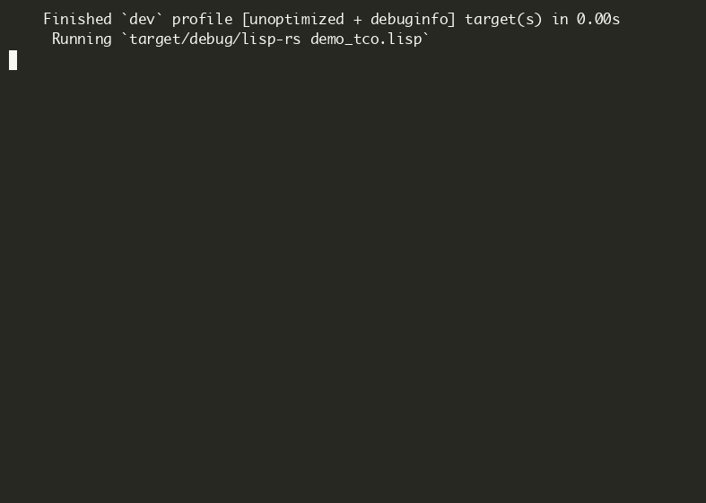

---

## 🧭 选择你的路径

你不必从头读到尾。根据你的情况选择起点：

| 如果你是... | 从这里开始 | 大约 |
|-----------|----------|------|
| **完全没接触过编程** | [我们要做什么](#我们要做什么) | 15 分钟到写代码 |
| 会 **Python/JS/Java，但不会 Rust** | [步骤 5：定义数字类型](#步骤-5-定义数字类型-number) | 5 分钟到写代码 |
| 已懂 **Rust 基础**（enum、match、HashMap） | [步骤 9：词法分析](#步骤-9-创建新文件) | 直接开始 |
| **写过解释器** | 快速跳到[步骤 37：闭包](#步骤-37-lambda-捕获环境-实现真正的闭包)和[步骤 39：TCO](#步骤-39-tco-蹦床循环实现) | ~30 分钟 |
| 只想看 **闭包是怎么实现的** | 直接跳到[步骤 37：闭包](#步骤-37-lambda-捕获环境-实现真正的闭包) | ~10 分钟 |

> **已经做过类似项目？** 如果你做过类似项目，仍可能从中找到新东西：闭包的背包追踪（步骤 37）、蹦床循环 TCO 拆解（步骤 39）、三个教学性质的优化步骤（步骤 40-43）。其余可快速浏览。

---

---

## 目录

- [准备工作](#准备工作) — 步骤 1-4
- [认识"值"](#认识值) — 步骤 5-6
- [让程序"算"东西](#让程序算东西) — 步骤 7-8
- [把句子拆成单词](#把句子拆成单词) — 步骤 9-11
- [理解单词的意思](#理解单词的意思) — 步骤 12-15
- [给东西起名字](#给东西起名字) — 步骤 16-19
- [做真正的计算](#做真正的计算) — 步骤 20-27
- [更多数据类型](#更多数据类型) — 步骤 28-31
- [让程序做选择](#让程序做选择) — 步骤 32-35
- [记住过去的事情](#记住过去的事情) — 步骤 36-39
- [让程序跑得更快](#让程序跑得更快) — 步骤 40-43
- [更多魔法命令](#更多魔法命令) — 步骤 44-51
- [内置函数补全 + 宏 + REPL](#内置函数补全) — 步骤 52-74

---


## 我们要做什么

---

### 先说说"编程"是怎么回事

编程就是**告诉电脑做什么**。但你不会跟电脑说中文——它听不懂。你只能说电脑能理解的"语言"。

问题是，电脑的母语是 **0 和 1**（机器码），正常人没法看。所以有人发明了"中间人"：你用**人类能读的语言**写代码，然后**解释器**（我们即将做的这个东西）负责把它翻译成电脑能执行的东西。

> 🧠 **大白话**：你写"红烧肉怎么做"，解释器就是那个读菜谱、然后实际动手做菜的大厨。

---

### 什么是 Lisp？

Lisp 是第**二**古老的编程语言（仅次于 Fortran，1958 年诞生）。它是一种特殊的语言，特殊在哪？

**几乎所有的编程语言都长得像数学公式：**
```
if (x > 0) { return x + 1; }
```

**但 Lisp 长得像购物清单：**
```
(if (> x 0) (+ x 1))
```

这不是故意标新立异。Lisp 的核心思想是：**代码和数据是同一个东西——都是列表。**

你看上面的 `(+ x 1)` —— 它既是一段"代码"（让电脑把 x 加 1），也是一个"列表"（三个东西：`+`、`x`、`1`排在一起）。后面你会看到，这一点让它拥有其他语言难以企及的灵活性。

> 🧠 **大白话**：普通编程语言就像一本固定的菜谱——只能做上面写的菜。Lisp 像一间厨房——你可以在做菜的过程中改写菜谱本身。这也是为什么 Lisp 被称为"可编程的编程语言"。

---

### Lisp 的语法只有两条规则

读完整本教程你会发现，Lisp 的语法规则就两条：

**规则 1：括号表示"调用"**
```
(+ 1 2)      →  把 1 和 2 传给 + 函数，结果是 3
(if a b c)   →  如果 a 为真，执行 b，否则执行 c
```
括号里的第一样东西是"操作"，后面的是"参数"。

**规则 2：可以嵌套**
```
(+ 1 (* 2 3))   →  1 + (2 × 3) = 7
```
里面的列表算完，结果再给外面的用——就像套娃。

就这两条。你没看错——整个 Lisp 语言的全部语法规则，到这儿就说完了。

> 🧠 **大白话 — 为什么叫 Lisp？** 名字来自 **Lis**t + **P**rocessing（列表处理）——取了 "List" 的前三个字母，加上 "Processing" 的首字母，拼成 **LISP**。它不是标准的逐字母缩写，而是"音节缩写"（syllabic abbreviation）。早期论文里写作全大写 **LISP**，现代习惯写成 **Lisp**。核心意思就是"处理列表的语言"——因为 Lisp 的一切都是列表。

---

### 🗺️ 路线图：各章节的依赖关系

动手之前，先看看各章节之间的依赖关系：

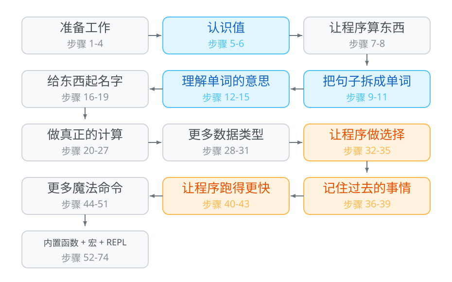


每章都建立在前一章的基础上。蓝色高亮章节（认识值、词法分析、语法分析）是核心基础；橙色高亮章节（闭包、TCO）是最深的功能。感到迷茫时，可以回到这个图确认自己的位置。

---

### 看几个真实例子就明白了

语法虽然简单，但表达力很强。下面这几个例子，你现在看不懂没关系——它们展示了 Lisp 到底能做什么。

**① 定义函数（lambda）**

计算平方：

```lisp
(define square (lambda (x) (* x x)))
(square 5)    ; → 25
(square 12)   ; → 144
```

`lambda` 就是"创建一个函数"——它不计算任何东西，只是打包成一个值等着被调用。

我们来**拆开**这个 `lambda`，看看它到底由哪几块组成：

```
(lambda (x) (* x x))
   │     │     │
   │     │     └── 函数体（body）：这个函数要做什么？
   │     │           拿到 x 之后，算 (* x x)，也就是 x 乘 x
   │     │
   │     └── 参数列表（params）：这个函数接收什么东西？
   │           只有一个参数，名字叫 x
   │
   └── lambda 关键字：告诉 Lisp "我要创建一个函数"
```

```
完整拆解：

  (define square             ← 给函数起个名字叫 square，存到全局环境里
    (lambda (x)              ← "我要做一个函数，它接收一个参数，叫 x"
      (* x x)))              ← "这个函数要做的事：把 x 和自己相乘"
```


```
调用过程：

  (square 5)           ← 把 5 传给 square

  ① 把参数 x 换成 5：(* 5 5)
  ② 算 (* 5 5) → 25

  (square 12)          ← 把 12 传给 square

  ① 把参数 x 换成 12：(* 12 12)
  ② 算 (* 12 12) → 144
```

> 🧠 **大白话**：`lambda` 就像在纸上设计一台机器——"输入 x，输出 x 乘 x"。`(square 5)` 就是"按这个蓝图把机器造出来，喂它个 5，看它吐出什么"。和菜谱不同：菜谱只是说明，机器是**实实在在的东西**——你可以把它存进变量、传给另一个函数、或者作为返回值。lambda 创造的是"东西"，不是"说明书"。

**② 递归（Lisp 没有循环，只有自己调用自己）**

计算阶乘（5! = 5×4×3×2×1 = 120）：

```lisp
(define factorial (lambda (n)
    (if (= n 1)
        1
        (* n (factorial (- n 1))))))
(factorial 5)   ; → 120
```

注意到什么没有？Lisp **没有 for 循环、没有 while 循环**。重复做事只能靠"函数调用自己"（递归）。这是因为 Lisp 比 for 循环还早发明了十几年——那时候还没有循环这个概念。

下面是 `(factorial 5)` 的**套娃式拆解**，看它是怎么一层层算出 120 的。

关键是看懂：每层假分支 `(* n (factorial (- n 1)))` 里，`(- n 1)` 要先算出结果，`(factorial ...)` 也要先算出结果，然后 `*` 才能乘。

```
回顾 factorial 的定义:
  (define factorial (lambda (n)
      (if (= n 1)                          ← 条件
          1                                ← 真分支 (n=1 时返回 1)
          (* n (factorial (- n 1))))))     ← 假分支 (n≠1 时走这里)

═══════════════════════════════════════════════════════════
🎎 第 1 层: 开始算 (factorial 5)
═══════════════════════════════════════════════════════════

  先把 factorial 的函数体"展开"——
  把参数 n 换成 5, 得到:
    (if (= 5 1)
        1
        (* 5 (factorial (- 5 1))))

  ① 算 if 的条件: (= 5 1)?
     这是三个东西: =、5、1。分别看它们是什么:

     ┌───────────────────────────────────────┐
     │ = 是什么? → 是"判断相等"这个功能         │
     │ 5 是什么? → 就是数字 5                  │
     │ 1 是什么? → 就是数字 1                  │
     │                                       │
     │ 用"判断相等"比较 (5, 1): 5 等于 1 吗?    │
     │ → 不等! → 结果是 #f (假)                │
     └───────────────────────────────────────┘

  ② if 看到条件是 #f → 不走进真分支, 走假分支:
     假分支: (* 5 (factorial (- 5 1)))

  ③ 这是一个乘法。乘法需要两个数, 所以要分别算出:

     要乘的第 1 个数: 5 (就是现在的 n)

     要乘的第 2 个数: (factorial (- 5 1))
     这还是个嵌套! 先算最里面的 (- 5 1):

     ┌─ 算 (- 5 1) ──────────────────┐
     │ - 是什么? → "做减法"这个功能    │
     │ 5 是什么? → 就是数字 5         │
     │ 1 是什么? → 就是数字 1         │
     │                              │
     │ 用"减法"对 (5, 1): 5 - 1 = 4  │
     └──────────────────────────────┘

     所以 (factorial (- 5 1)) 变成了 (factorial 4)
     → 但 (factorial 4) 是多少? 需要再调用 factorial!
     → 进入第 2 层套娃! 🎎

  ④ 暂停——要先等 (factorial 4) 算完。等它返回后:
     (factorial 5) = (* 5 (factorial 4 的结果))

🎎 第 2~4 层: (factorial 4) → (factorial 3) → (factorial 2)

  这三层和第一层完全一样的模式，只是 n 不同。快速过一遍：

  ┌─ ┬ ──────────────────────────────────────────────────────────────────────┐
  │ 层      │ 展开 n│ (= n 1)? │ (- n 1) = ? │ 暂停，等下一层                 │
  ├────────────────────────────────────────────────────────────────────────┤
  │ 第 2 层 │ n = 4 │ #f       │ 4-1 = 3     │ (fact 4)=(* 4 (fact 3 的结果))│
  │ 第 3 层 │ n = 3 │ #f       │ 3-1 = 2     │ (fact 3)=(* 3 (fact 2 的结果))│
  │ 第 4 层 │ n = 2 │ #f       │ 2-1 = 1     │ (fact 2)=(* 2 (fact 1 的结果))│
  └─────────┴────────┴──────────┴─────────────┴────────────────────────────────┘

  每一层都在"等下一层的结果回来再乘"——直到第 5 层触底。

🎎 第 5 层 (最内层, 触底反弹!): (factorial 1)
═══════════════════════════════════════════════════════════

  同样先展开, 把 n 换成 1:
    (if (= 1 1)
        1
        (* 1 (factorial (- 1 1))))

  ① 算 if 的条件: (= 1 1)?

     ┌───────────────────────────────────────┐
     │ = 是什么? → “判断相等”这个功能           │
     │ 1 是什么? → 就是数字 1                  │
     │ 1 是什么? → 就是数字 1                  │
     │                                       │
     │ 用“判断相等”比较 (1, 1): 1 等于 1 吗?    │
     │ → 等于! → 结果是 #t (真)!!!            │
     └───────────────────────────────────────┘

  ② if 看到条件是 #t → 走真分支: 1
     真分支就是一个光秃秃的 1, 不需要再算了!
     → 直接返回 1

  🛑 到底了! 不再往下套娃! 开始一层层往回"收"!

═══════════════════════════════════════════════════════════
📤 收回过程 — 从最内层一层层往外返回
═══════════════════════════════════════════════════════════

  第 5 层: (factorial 1) 返回 1
    │  (触底反弹, 不再套娃)
    ▼
  第 4 层收到 1: (factorial 2) = (* 2 1) = 2  → 返回 2
    │  (2 是第 4 层的 n,  1 是 (factorial 1) 的结果)
    ▼
  第 3 层收到 2: (factorial 3) = (* 3 2) = 6  → 返回 6
    │  (3 是第 3 层的 n,  2 是 (factorial 2) 的结果)
    ▼
  第 2 层收到 6: (factorial 4) = (* 4 6) = 24 → 返回 24
    │  (4 是第 2 层的 n,  6 是 (factorial 3) 的结果)
    ▼
  第 1 层收到 24: (factorial 5) = (* 5 24) = 120 → 🏁 最终答案!
      (5 是第 1 层的 n, 24 是 (factorial 4) 的结果)

═══════════════════════════════════════════════════════════
📐 代数展开视角（同样的过程, 用式子表示）:
═══════════════════════════════════════════════════════════

  (factorial 5)
  = (* 5 (factorial 4))                    ← (- 5 1)=4, 递归算 (factorial 4)
  = (* 5 (* 4 (factorial 3)))              ← (- 4 1)=3, 递归算 (factorial 3)
  = (* 5 (* 4 (* 3 (factorial 2))))        ← (- 3 1)=2, 递归算 (factorial 2)
  = (* 5 (* 4 (* 3 (* 2 (factorial 1)))))  ← (- 2 1)=1, 递归算 (factorial 1)
  = (* 5 (* 4 (* 3 (* 2 1))))              ← (factorial 1) 返回 1, 不再展开
  = (* 5 (* 4 (* 3 2)))                    ← 往回算: 2×1=2
  = (* 5 (* 4 6))                          ← 往回算: 3×2=6
  = (* 5 24)                               ← 往回算: 4×6=24
  = 120                                    ← 往回算: 5×24=120 🏁
```

> 🧠 **大白话**：递归就是"大事化小"——5 的阶乘不知道？没关系，先算 4 的阶乘再乘 5。4 的也不知道？再往下问……一直问到 1 的阶乘（1 的阶乘就是 1，这是"底线"），然后一层层往回算。

**③ 闭包（函数"记住"它诞生时的环境）**

```lisp
(define make-counter (lambda (start)
    (lambda ()
        (set! start (+ start 1))
        start)))

(define counter (make-counter 0))
(counter)   ; → 1
(counter)   ; → 2
(counter)   ; → 3
```

`make-counter` 返回一个函数，这个函数"记住"了 `start` 的初始值。每次调用它，`start` 就加 1。这种"函数打包了外部变量"的能力就叫**闭包**，是 Lisp 最早引入的概念之一。

> `counter` 就是 `(make-counter 0)` 返回的那个函数的名字——它背着装有 `start=0` 的背包 🎒。之后每次 `(counter)` 都是在叫这个函数打开背包。

> ⚡ **`set!` 是什么？为什么前面的阶乘没用它？** — `set!`（读作 "set-bang"）就是**修改一个已经存在的变量**。`define` 是"买新柜子贴标签"，`set!` 是"打开已有柜子换东西"。阶乘每次递归都创建新的参数 `n`，不需要改已有的——counter 的内层函数没有参数，必须靠 `set!` 直接改背包里的 `start`。如果用 `define` 再定义一次 `start`，只会在局部作用域创建一个同名新变量（遮蔽），背包里的那个纹丝不动。

下面我们**像拆套娃一样**，一步一步拆开这三行代码，看看到底发生了什么。

## 正式语法规范（EBNF）

我们的 Lisp 语言可通过扩展巴科斯-瑙尔范式（EBNF）来形式化定义：

```ebnf
program     = expression* ;
expression  = atom | list ;
atom        = number | symbol | string | boolean | nil ;
list        = "(" , expression* , ")" ;
number      = integer | float ;
symbol      = letter , { letter | digit | special } ;
string      = '"' , { any_character - '"' } , '"' ;
boolean     = "#t" | "#f" ;
nil         = "nil" | "()" ;

letter      = "a"..."z" | "A"..."Z" ;
digit       = "0"..."9" ;
special     = "+" | "-" | "*" | "/" | "=" | "<" | ">" | "!" | "?" | "_" ;
```

这个文法仅描述语法层。运行时 `(f a b)` 可以是函数调用、特殊形式或宏——
语义由*求值器*决定，而非语法分析器。


---

**🧭 在开始之前：先拆解 `make-counter` 本身的结构**

第一行代码看起来有点复杂——里面套了两个 `lambda`。我们先用箭头把它逐块拆开：

```
(define make-counter           ← ① 给函数起个名字, 存到全局
  (lambda (start)              ← ② 外层 lambda: 参数 = start
    (lambda ()                 ← ③ 内层 lambda: 参数 = () 空
      (set! start (+ start 1)) ← ④ 内层函数体的第一句: 把 start 加 1
      start)))                 ← ⑤ 内层函数体的第二句: 返回 start
```

make-counter 这个函数本身:

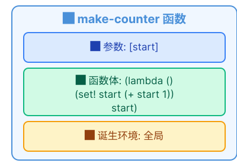

> ⚠️ **注意**: make-counter 的函数体本身又是一个 lambda! 调用 make-counter 会返回这个内层 lambda, 而不是一个数字。

---

**💡 核心比喻：函数背了一个"背包" 🎒**

在往下看之前，先记住这个比喻——后面每一步都会用到：

```
  当一个函数被创建（诞生）时,
  它会自动把当时周围的所有变量塞进一个"背包",
  然后背着这个背包去任何地方。

  以后不管谁调用这个函数,
  它都先从自己的背包里找变量,
  找不到才去外面找。

  这个"背包"= 函数诞生时的环境
  这个"背包"就是闭包的核心。
```

好了，现在一步一步拆。

---

**🎎 第 1 步: 定义 make-counter**

```
代码:
  (define make-counter
    (lambda (start)
      (lambda ()
        (set! start (+ start 1))
        start)))

拆解:

  ① Lisp 看到 define → "哦, 要定义变量"

  ② define 的格式: (define 变量名 值)
     变量名 = make-counter
     值     = (lambda (start)
                (lambda ()
                  (set! start (+ start 1))
                  start))

  ③ Lisp 开始求值 "值" 部分
     → 遇到 lambda → "要创建一个函数"
     → 参数: start
     → 函数体: (lambda () (set! start (+ start 1)) start)
     → 📸 诞生环境: 全局（此时全局里还没有用户变量）

  ④ 把这个函数打包好, 贴上标签 "make-counter"

全局环境里多了一条记录:
```


```
这一步只是"注册了一个名字", 什么都没发生。make-counter 还没被调用过。
```

---

**🎎 第 2 步: 调用 (make-counter 0) — 背包诞生的时刻**

```
代码: (define counter (make-counter 0))
       │      │         │
       │      │         └── 参数 0, 传给 make-counter
       │      └── 临时起的名字, 叫啥都行 (c / my-counter / x ...)
       └── define: 把这个名字和值绑定

这行要做两件事:
  ① 调用 (make-counter 0)
  ② 把调用结果存到 counter

先拆 ①:
调用 make-counter(start=0):
    ① 参数绑定: start → 0
    ② 求值函数体: (lambda () (set! start (+ start 1)) start)
    ③ 又遇到 lambda → 创建内层函数 "counter-函数" (参数=(), 函数体两句话)
    ④ 📸 诞生环境 = {start: 0}  ← 这就是背包! 🎒

  🔑 counter-函数 诞生时, start=0 被塞进了背包. 之后走到哪, 背包跟到哪. ← 这就是闭包!

  make-counter 返回 counter-函数（不是数字, 是一个函数！）

② 把返回值存到 counter:
```

全局环境现在:

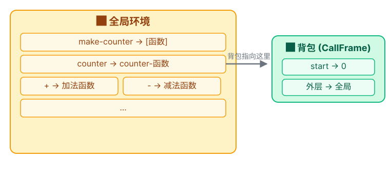

---

**🎎 第 3 步: 调用 (counter) — 背包发挥作用的时刻

第一次调用最能说明问题。后面调用过程完全一样, 只是 `start` 的当前值不同——我们就看第一次, 然后直接看状态变化。

```
代码: (counter)

① Lisp 去全局环境找 counter → 找到 counter-函数

② 调用 counter-函数。它没有参数:

   当前环境:
   ┌────────────────────────────┐
   │ (空的)                      │
   │ → 打开背包: start → 0       │
   └────────────────────────────┘

③ 执行函数体:

   第一句: (set! start (+ start 1))

     算 (+ start 1):
     → 找 start: 当前没有 → 打开背包 ✅ → 0
     → (+ 0 1) = 1

     set! 把 1 写回背包:
     → 背包现在是: start → 1  (从 0 变成了 1!)

   第二句: start
     → 找 start: 当前没有 → 打开背包 ✅ → 1
     → 返回 1

(counter) → 1 ✅
```

**后续调用完全重复这个模式。每次都创建新的调用环境, 但每次都打开**同一个背包**, set! 改的永远是背包里的 start:**

```
第 1 次: (counter) → 背包.start: 0→1 → 返回 1
第 2 次: (counter) → 背包.start: 1→2 → 返回 2
第 3 次: (counter) → 背包.start: 2→3 → 返回 3

每次都是:
  每次调用 ──打开──→ 🎒 {start}
                         └── start 被 set! 不断更新: 0→1→2→3
```

> 🧠 **大白话**：闭包捕获的是**实时白板**而不是冻结的照片——同一个作用域里创建的所有闭包共享同一块白板。`set!` 就是在这块白板上写字：一个人写了，所有人都能看到变化。这不是一张冻结的全家福 📸——而是一条**活着的链接**。所以它叫背包 🎒：每个背包装的是可以随时读写的"实时引用"，不是复印的纸片。

> 📝 **术语对照**："背包"🎒 在计算机里叫 **CallFrame（调用帧）**。后面教程统一用 CallFrame——现在记住背包即可。

**④ 函数也是值（高阶函数）**

Lisp 里函数跟数字、字符串一样，可以传来传去：

```lisp
(define apply-twice (lambda (f x)
    (f (f x))))

(apply-twice square 3)   ; → 81
;; 先 square(3) = 9, 再 square(9) = 81
```

下面是 `(apply-twice square 3)` 的**套娃拆解**:

```
准备好:
  square = (lambda (x) (* x x))
  apply-twice = (lambda (f x) (f (f x)))

🎎 最外层: (apply-twice square 3)

  ① 找到 apply-twice → Lambda { params=[f, x], body=(f (f x)) }
  ② 创建 CallFrame, 绑定参数:
       f → square (square 本身也是一个 Lambda!)
       x → Number(3)

  CallFrame 现在:
```

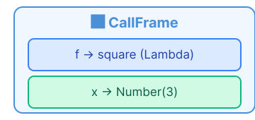

```
  ③ 求值函数体: (f (f x))

     先拆内层 (f x):
     ┌────────────────────────────────────┐
     │ f = square, x = 3                  │
     │ → (square 3)                       │
     │ → ((lambda (x) (* x x)) 3)         │
     │ → (* 3 3)                          │
     │ → 9                                │
     └────────────────────────────────────┘

     内层返回 9, 现在变成 (f 9):
     ┌────────────────────────────────────┐
     │ f = square, 参数 = 9                │
     │ → (square 9)                       │
     │ → ((lambda (x) (* x x)) 9)         │
     │ → (* 9 9)                          │
     │ → 81                               │
     └────────────────────────────────────┘

  最终: (apply-twice square 3) → 81 ✅

🔑 关键: f 这个参数位置上, 传进来的不是一个数字, 而是整个 square 函数!
       就像你可以把菜谱 (而非做好的菜) 交给另一个厨师让他照着做。
```

**⑤ 代码即数据（最神奇的部分）**

还记得前面说的"代码本身也是列表"吗？这意味着你可以**写一个程序来写程序**：

```lisp
(define (twice expression)
    (list '+ expression expression))

(twice 5)           ; → (+ 5 5)         ← 这是一段代码
(eval (twice 5))    ; → 10              ← 执行这段代码
```

注意 `(twice 5)` 返回的不是数字 `10`，而是一个列表 `(+ 5 5)`——这**既是数据，也是代码**。你可以把它传给 `eval` 让它执行。这种"写程序来生成程序"的能力叫做**宏**（macro），是 Lisp 最强大的特性之一。

现实中，Lisp 宏被用来创造自己的语法——使用者可以用宏把 Lisp 改造成"看起来像 Python"、"看起来像 SQL"、"看起来像英文句子"的方言。这就是前面说的"可编程的编程语言"。

---

### 什么是"解释器"？

解释器就是一个**翻译程序**：你输入源码（人类懂的文本），它输出计算结果（电脑执行后的值）。

```
你看到:   (+ 1 2)
       ↓ 解释器做了一堆工作 ↓
电脑执行:  3
```

它跟**编译器**的区别：
- **编译器**（如 C、Rust）：一次性把源码翻译成机器码，生成可执行文件。就像把整本小说翻译成英文出版。
- **解释器**（如 Python、Lisp）：边读边执行，不需要生成文件。就像同声传译——你说一句，他翻一句。

我们做的是解释器——输入代码，当场出结果。这也是 REPL（Read-Eval-Print Loop，交互式编程环境）的基础。

---

### 我们要做什么？

我们要做一个 **Lisp 解释器**——输入 Lisp 代码，输出计算结果：

```
输入: (+ 1 2)  →  输出: 3
输入: (define fact (lambda (n) (if (= n 0) 1 (* n (fact (- n 1))))))
输入: (fact 5)  →  输出: 120
```

为了实现这个目标，我们把它拆成 **74 个步骤**，按依赖关系逐步实现：

```
能求值数字
├── 词法分析: 把字符串拆成 Token
│   └── 语法分析: Token → 抽象语法树
├── 环境: 变量名 → 值的映射
├── 列表 + 函数调用: (+ 1 2) 怎么算?
├── 特殊形式: if / define / lambda
├── 闭包 + 尾调用优化
├── 性能优化: 字符串驻留、零拷贝、快速哈希
├── 更多特殊形式: begin / set! / let / cond / and / or / let* / letrec
├── 内置函数: 算术、列表、比较、谓词、高阶函数
└── REPL 交互界面
```

**本教程严格按照这个顺序，每一步只做一件小事。就像雕塑——先粗胚，再一刀一刀精修。** 共 74 步，每步都能用 `cargo test` 验证。

### 🏆 每个阶段学完后你能做什么

| 学完 | 你能... | 验证方式 |
|------|--------|---------|
| 步骤 1-4 | 装好 Rust，跑通第一个测试 | `cargo test` |
| 步骤 5-8 | 让程序"理解"数字 —— `42` → `Number(42.0)` | `eval_str("42")` |
| 步骤 9-15 | 看懂 `(+ 1 (* 2 3))` 的嵌套结构 | `parse(tokens)` |
| 步骤 16-19 | 给变量起名字，在环境中查值 | `env.get("x")` |
| 步骤 20-27 | **`(+ 1 2)` 真的算出 3 了！** | `(+ 1 2)` → `3` |
| 步骤 28-31 | 布尔判断、字符串、数字比较 | `(> 5 3)` → `#t` |
| 步骤 32-35 | 条件分支、定义变量、创建和调用函数 | `(define sq (lambda (x) (* x x)))` |
| 步骤 36-39 | **闭包**（函数记住诞生环境）+ **一万层递归不崩溃** | `(loop 10000)` |
| 步骤 40-43 | 解释器快 5 倍（驻留/零拷贝/FX 哈希） | 性能基准 |
| 步骤 44-51 | 8 种特殊形式（begin/set!/let/cond...） | `(let ((x 1)) (+ x 2))` |
| 步骤 52-74 | **完整的交互式 REPL** | `cargo run` → 输入 Lisp 代码 |


> **🔍 上图就是整个项目的骨架**——源码从左边进去，经过四个阶段，从右边出来就变成了计算结果。后面 74 个步骤就是对这四个阶段的一刀一刀精修。

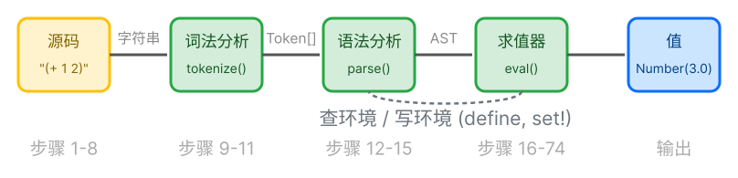

---

### 📚 跟其他经典教程有什么区别？

如果你听说过以下资源，这里简单对比一下，帮你判断本教程是否适合你：

| 教程 | 语言 | 适合谁 | 本教程的不同 |
|------|------|--------|-------------|
| [*Crafting Interpreters*](https://craftinginterpreters.com/) (Nystrom) | Java / C | 有编程经验的人 | Nystrom 假设你会 Java 和 C，两遍实现（树遍历 + 字节码）。本教程只做一遍（树遍历），但用 Rust，且假设你**零基础** |
| [*SICP*](https://mitpress.mit.edu/sicp/) (Abelson & Sussman) | Scheme | 数学底子好的人 | SICP 教你"如何思考编程"，本教程教你"如何做一个解释器"。SICP 讲原理，本教程讲实现 |
| [*mal - Make a Lisp*](https://github.com/kanaka/mal) (Kanaka) | 80+ 种语言 | 中级程序员 | mal 只给测试用例，没有解释。本教程每一步都有"为什么"——不仅告诉你怎么写，还告诉你为什么这么写 |
| [*Write Yourself a Scheme*](https://en.wikibooks.org/wiki/Write_Yourself_a_Scheme_in_48_Hours) | Haskell | Haskell 程序员 | 48 小时太赶了。本教程 74 步，每步都能停下来跑 `cargo test`，节奏由你控制 |

> **一句话：** 如果说 *Crafting Interpreters* 是研究生课程，本教程就是本科入门——同样的主题（写一个解释器），同样的方法（TDD、每步可验证、图解），但从"什么是终端"开始讲。

---


## 我们的 Lisp 在 Lisp 家族中的定位

| 语言 | 求值策略 | 作用域 | TCO | 可变性 | 特点 |
|------|---------|--------|-----|--------|------|
| **我们的 Lisp** | 应用序 | 词法 (Rc<RefCell>) | ✅ 蹦床 | 有限 `set!` | 零依赖，~2K 行（含测试） |
| **Scheme (R7RS)** | 应用序 | 词法 | ✅ 必须 | 有限 `set!` | 卫生宏 |
| **Common Lisp** | 应用序 | 词法+动态 | ✅ 可选 | 大量变值函数 | CLOS, 条件系统 |
| **Clojure** | 应用序 | 词法 | ✅ JVM 级 | 持久化集合 | JVM 互操作, STM |
| **Emacs Lisp** | 应用序 | **动态** | ❌ | `setq` 随处 | 编辑器集成 |

我们的 Lisp 最接近 **Scheme** 规范：词法作用域、强制 TCO、`cond`/`let`/`lambda` 家族。
与 Scheme 的主要区别：

1. **无 `call/cc`**——Scheme 的通用逃逸操作符留作扩展练习
2. **数字系统简化**——仅 `f64`，而 Scheme 拥有整数/有理数/实数/复数的分层塔
3. **无卫生宏**——宏系统是简单的文本展开
4. **零外部依赖**——甚至连测试框架都是内置的（`#[cfg(test)]`）


## 这不是什么

这不是生产级 Lisp 实现。这是一个教学解释器——树遍历 `eval`，没有字节码编译器，没有 JIT。优化步骤（40-43）展示的是这些技术*如何*工作，而非它们不可或缺。如果你需要生产级 Scheme on Rust，请看 [scheme-rs](https://www.scheme.rs)。


## 准备工作
> ⏩ **跳过信号：** 已经装了 Rust 和 IDE？直接跳到[步骤 5](#步骤-5-定义数字类型-number)。


> 为什么要学：在构建解释器之前，你需要一个可用的 Rust 开发环境。这个搭建步骤和专业 Rust 开发者每天使用的基础设施相同 - 一次配置好，后面就畅通无阻。

---

<blockquote class='pipeline-position'>
<details>
<summary><strong>📍 管线位置</strong> — 查看我们在整个项目中的进度</summary>

```
  (环境准备阶段 — 尚未进入代码管线)
```

| | |
|---|---|
| ✅ 已完成 | （尚未进入管线——搭建环境） |
| 🎯 安装 Rust + IDE，创建 Cargo 项目，理解构建和测试流程

</details>
</blockquote>

---
### 步骤 1: 安装 Rust

Rust 是我们要用的编程语言。先给电脑装上它。

**系统要求**：任何 4 核 CPU、8 GB 内存、10 GB 可用磁盘的电脑（包括 Mac Apple Silicon 和 Intel）都能流畅运行完整工具链。

**Mac**：

1. 打开"终端"：点屏幕右上角 🔍 搜索图标，输入"终端"，双击打开
2. 把下面这行**完整复制 → 粘贴**进去，回车：

   ```
   curl --proto '=https' --tlsv1.2 -sSf https://sh.rustup.rs | sh
   ```
3. 屏幕上跑过很多字后，**按 1 再回车**（选默认安装）
4. 等 2-5 分钟跑完

**Windows**：

1. 打开浏览器，访问 <https://rust-lang.org/tools/install/>
2. 下载 `rustup-init.exe`，**双击**运行
3. 黑色窗口出现后，**直接按 Enter**（选默认）
4. 等 2-5 分钟跑完

🧠 **大白话**：`rustup` 是 Rust 的"安装管家"，`cargo` 是 Rust 的"项目管家"。`rustup` 会同时安装这两者。

---

### 步骤 2: 安装 RustRover

我们要用 **RustRover** 来写代码——它能自动补全、查错、高亮，就像写 Word 有拼写检查一样。

**方式 A — JetBrains Toolbox 应用（推荐）**：访问 <https://www.jetbrains.com/toolbox-app/> → 下载 → 安装 → 打开 Toolbox → 在列表中找到 RustRover → 点 Install。Toolbox 会自动帮你更新 IDE。

**方式 B — 直接下载**：访问 <https://www.jetbrains.com/rustrover/download/> → 点 Download → 打开 `.dmg`（Mac）或双击 `.exe`（Windows）并按提示安装。

**🔑 免费许可（重要！）**：首次打开 RustRover → 选 **"Free non-commercial use"** → 点 "Log in to JetBrains Account" → 浏览器注册免费账号（只需邮箱，不绑卡）→ 回到 RustRover 激活。

🧠 **大白话**：JetBrains 允许个人免费使用。注册个邮箱就行，不花一分钱。Toolbox 应用会自动处理更新。

---

### 步骤 3: 创建项目

**方式一：用 RustRover（推荐新手）**

打开 RustRover，点 **"新建项目"**，你会看到创建对话框。对话框分三块区域：

```
┌───────────────────────────────────────────────────────────────┐
│  [左侧: 项目类型列表]  │  [中间: 配置表单]  │  [右侧: 模板]        │
│                        │                    │                 │
│  ● Rust                │  位置(L): /.../x   │  ○ 二进制文件     │
│    Web                 │  工具链版本: 1.86  │  ● 库            │
│    React               │  标准库: /.../src  │  ○ 过程宏        │
│    ...                 │                    │  ○ WebAssembly  │
│                        │                    │                 │
│                        │                    │  [ Create ]     │
└───────────────────────────────────────────────────────────────┘
```

**① 左侧：点 "Rust"**（在列表最上面）。确保选中的是 Rust，不是下面的 Web/React 等。RustRover 会自动检测已安装的 Rust 工具链——"工具链版本"字段会自动填入类似 `1.86` 的版本号。

**② 中间：改路径。** 找到第一行 **"位置(L):"**，把路径最后的 `untitled` 改成 `lisp-rs`：

```
  ❌ .../rust-learning/untitled
  ✅ .../rust-learning/lisp-rs
```

> 下面的"工具链版本"（自动检测）和"标准库"路径不用动。

**③ 右侧：选模板。** 右侧有一个 **"项目模板"** 单选列表，共四项：

- `二进制文件(应用程序)` — 可执行程序，我们不要
- **`库`** ← 选这个！
- `过程宏` — Rust 编译器插件，暂时用不到
- `WebAssembly Lib` — 浏览器里跑的，也不需要

> 我们做的是一个**库**（Library），不是应用程序。选"库"意味着代码被别人引用时才会运行——这正好适合我们的解释器。

**④ 右下角：点 "创建"按钮。**

**方式二：用终端命令（喜欢敲命令的）**

打开终端，输入：

```bash
cargo new lisp-rs --lib
cd lisp-rs
```

> 两种方式结果完全一样。方式二创建完后，用 RustRover 的 **Open** 打开 `lisp-rs` 文件夹即可。

等右下角的进度条跑完。

**项目创建好后，你会看到**：

```
左侧文件列表:
  lisp-rs/
  ├── Cargo.toml           ← 项目配置（名字、版本等）
  └── src/
      └── lib.rs           ← 我们的代码写在这里
```

双击 `src/lib.rs`，中间编辑区会出现默认的示例代码。**把它全部删掉**（后面我们会从头写）。

---

### 步骤 4: 第一次运行测试

在 RustRover 底部，找到 **"终端"** 标签(左下角第三个图标)，点它。这就是 RustRover 内嵌的终端——我们后面都在这里敲命令。

在终端里输入：

```bash
cargo test
```

回车。应该看到输出末尾有：

```
test result: ok. 1 passed; 0 failed
```

🧠 **大白话**：`cargo test` 是"检查作业"命令。看到 `ok` 就是对了。

**💡 提示**：后面教程中所有的 `cargo test` 命令，都在 RustRover 底部的 **终端** 里敲。你也可以点击代码行旁边的绿色 ▶ 箭头单独跑某个测试函数，或者打开 **Run** 面板（⌃R / Ctrl+R）查看图形化的测试树——怎么顺手怎么来。

---

> 🏋️ **练习**
> 1. (⭐) 把项目名称从 `lisp-rs` 改成你喜欢的名字，跑通 `cargo test`
> 2. (⭐) 在终端里试试 `cargo build`，看和 `cargo test` 有什么不同


<details>
<summary>点击查看答案</summary>

**1. 改名项目**
```bash
# 编辑 Cargo.toml 第一行
[package]
name = "my-lisp"  # 改这里
```
然后 `cargo test` 仍通过——项目名只是标识。

**2. cargo build vs cargo test**
`cargo build` 只编译不测试，`cargo test` 编译+跑所有 `#[test]`。首次运行都会下载依赖（几秒到几分钟）。
</details>


> 📖 **下一章：[认识值](#认识值)**


> ✅ **本章总结**: 工具链准备就绪，`cargo test` 通过，可以编辑、构建和运行 Rust 代码。


## 认识值
> ⏩ **跳过信号：** 已经知道 Rust 的 enum、`#[derive]` 和 `match`？跳到[步骤 7](#步骤-7-求值函数-eval)。

> ⚠️ **慢速通过区** — 本章 Rust 概念密度较高（enum / derive / f64 / pub / #[cfg(test)] / assert_eq!）。
> 如果你感到困难，这是正常的——大多数学习者在这里会花更多时间。
> 建议：把每个代码块都在 RustRover 里敲一遍，`cargo test` 通过了再往下走。


> 解释器首先要能"理解"数字——输入 `42`，输出 `42.0`。这是整个大厦的地基。

---

<blockquote class='pipeline-position'>
<details>
<summary><strong>📍 管线位置</strong> — 查看我们在整个项目中的进度</summary>

```
  [LispExp 核心类型] ← 整个管线的数据基础
```

| | |
|---|---|
| ✅ 已完成 | （尚无管线） |
| 🎯 定义 LispExp 枚举（Number/String/Bool/Nil/Symbol）；添加 LispErr 错误处理

</details>
</blockquote>

---
### 步骤 5: 定义数字类型 `Number`

我们的 Lisp 解释器要处理的第一样东西就是**数字**。在 Rust 里，我们用 `enum` 列出"世界上有什么"。把 `src/lib.rs` 清空，写入：

```rust
// src/lib.rs
// --- 第一步: 定义世界上有"数字"这种东西 ---

#[derive(Clone, Debug, PartialEq)]  // ← 让编译器帮我们生成一些功能
pub enum LispExp {                   // ← "Lisp表达式"的缩写
    Number(f64),                     // ← 这就是"数字"
}
```

---

#### 🔧 Rust 深度解析：这 4 行代码到底包含了什么？

这是一段非常小的代码，但它背后涉及了 Rust 中**5 个核心概念**。我们一个一个拆开看。

---

##### ① `enum` — 枚举类型（代数数据类型：变体像"加号"一样组合，定义"值有多少种可能"）

```rust
pub enum LispExp {
    Number(f64),
}
```

**`enum` 是什么？**

`enum`（枚举）是 Rust 中定义"一个值可能是什么"的方式。它列出所有**可能的变体（variant）**。每个变体可以携带自己的数据。

```rust
// 一个交通信号灯只能是三种颜色之一：
enum TrafficLight {
    Red,       // 没有附加数据
    Yellow,
    Green,
}

// 但枚举的每个变体可以带不同类型、不同数量的数据：
enum Message {
    Quit,                           // 不带数据
    Move { x: i32, y: i32 },       // 带匿名结构体
    Write(String),                  // 带一个 String
    ChangeColor(u8, u8, u8),       // 带三个数字（元组变体）
}
```

为了理解上面的 `ChangeColor(u8, u8, u8)`，我们需要先知道 Rust 里有哪几种**基本数据类型**——这些东西是搭建所有 Rust 程序的积木。

> 🔧 **Rust Curve: Enum vs 继承** — 在 Java、Python、C++ 中，你要表示"可能是数字也可能是符号"的东西，会用类继承：一个 `Expression` 基类，若干子类。Rust 用 `enum` — 更快（没有虚函数派发、每个变体不需要堆分配）且更安全（match 穷尽性检查让你不会漏掉某个情况）。这个取舍是 Rust 最独特的设计选择之一。

---

#### 前置知识：Rust 的基本数据类型体系

##### 🔢 整数类型

Rust 的整数类型非常丰富，比大多数语言都多：

| 类型 | 含义 | 取值范围 | 使用场景 |
|------|------|---------|---------|
| `u8` | 无符号 8 位 | 0 ~ 255 (2⁸−1) | 颜色值（RGB 各 0-255）、小数字 |
| `u16` | 无符号 16 位 | 0 ~ 65,535 (2¹⁶−1) | Unicode 字符 |
| `u32` | 无符号 32 位 | 0 ~ 4,294,967,295 (约 43 亿, 2³²−1) | 文件大小 |
| `u64` | 无符号 64 位 | 0 ~ 18,446,744,073,709,551,615 (约 1844 京) | 大数字、时间戳 |
| `usize` | 指针大小（32/64位） | 取决于架构（32位同 u32, 64位同 u64） | **数组/向量的长度、索引** |
| `i8` | **有**符号 8 位 | −128 ~ 127 (−2⁷ ~ 2⁷−1) | 小范围内可正可负 |
| `i32` | **有**符号 32 位 | −2,147,483,648 ~ 2,147,483,647 (约 ±21 亿) | **整数默认类型** |
| `i64` | **有**符号 64 位 | −9,223,372,036,854,775,808 ~ 9,223,372,036,854,775,807 (约 ±922 京) | 需要大整数时 |
| `isize` | 指针大小的有符号 | 取决于架构（32位同 i32, 64位同 i64） | 内存差值计算 |

**命名规则**：`u` = unsigned（无符号，只有正数），`i` = signed（有符号，可正可负），后面的数字 = 占用的**比特数**。

> 🧠 **大白话**：`u8` 就是"8 个开关"——每个开关是 0 或 1，8 个开关能表示 0~255 共 256 种状态。`u16` 是 16 个开关，能表示 0~65535。以此类推。

```rust
let a: u8 = 255;           // u8 最大就是 255
// let b: u8 = 256;        // ❌ 编译错误！256 超过了 u8 的范围
let c: i32 = -100;         // i32 可以是负数
let d: u64 = 1000000000;   // u64 可以很大
```

**为什么 Rust 要分这么多种整数？** 为了精确控制内存占用：
- `u8` 只占 1 字节（8 位），适合存颜色值（RGB 每个通道 0-255）
- `u64` 占 8 字节，精度高但占空间大
- 如果你的数据不会超过 255，用 `u8` 比 `u64` 省 7/8 的内存

> 💡 **对比 Python**：Python 的整数可以无限大（自动扩容），但每次运算都需要检查类型、可能触发内存分配——速度慢。Rust 的整数是固定大小的，直接映射到 CPU 的寄存器，**零开销**。这是 Rust 比 Python 快几十倍的原因之一。

---

##### 🧮 浮点数类型

| 类型 | 位数 | 精度 | 使用场景 |
|------|------|------|---------|
| `f32` | 32 位 | 约 7 位小数 | 图形学、AI 模型 |
| `f64` | 64 位 | 约 15 位小数 | **通用计算（默认）** |

`f` = float（浮点），数字 = 比特数。`f64` 是 Rust 的**浮点数默认类型**——你写 `let x = 3.14`，Rust 会自动推断为 `f64`。

```rust
let a = 3.14;         // f64（默认）
let b: f32 = 3.14;    // 显式声明为 f32
let c = 42.0;         // 整数也要加 .0，否则 Rust 会认为是整数
```

我们项目里用 `f64`，因为它的精度够高且和 CPU 的运算效率几乎和 `f32` 一样快。

---

##### 📦 元组（Tuple）— 不同类型打包在一起

元组是把**不同类型**的值打包成一个复合值。用**圆括号** `(...)` 创建。

```rust
// 一个元组包含：一个 i32、一个 f64、一个 char
let t: (i32, f64, char) = (42, 3.14, 'A');

// 用 .0 .1 .2 访问元素（从 0 开始编号）：
println!("{}", t.0);   // 42
println!("{}", t.1);   // 3.14
println!("{}", t.2);   // A
```

**元组的特点：**
- **长度固定**：创建后不能增加或删除元素
- **类型可以不同**：`(i32, f64, char)` 三个位置类型不同
- **可以解构**（destructure）：`let (x, y, z) = t;`

```rust
// 元组的实际用途 1：函数返回多个值
fn split_at_center(s: &str) -> (&str, &str) {
    let mid = s.len() / 2;
    (&s[..mid], &s[mid..])  // ..mid=从头到mid之前, mid..=从mid到末尾
}
let (left, right) = split_at_center("hello");
// left = "he", right = "llo"

// 元组的实际用途 2：枚举变体携带数据
// 这就是上面的 ChangeColor(u8, u8, u8) ——
// 它等价于一个"匿名元组"作为变体的数据
// ChangeColor 携带的是一个匿名元组 (u8, u8, u8)
```

**`Message::ChangeColor(u8, u8, u8)` — 这就是个元组变体**

`ChangeColor(u8, u8, u8)` 在 Rust 里叫作**元组变体（tuple variant）**。它等价于：

```rust
// 你看到的是：
Message::ChangeColor(r, g, b)

// 本质上它就是一个元组 (u8, u8, u8) 被塞进了枚举变体
// 你可以解构它：
if let Message::ChangeColor(r, g, b) = msg {
    println!("RGB({}, {}, {})", r, g, b);
}
```

> 🧠 **大白话**：元组就是你用括号把几个不同的东西捆在一起。`(255, 0, 0)` 就是一个"红、绿、蓝"三色值捆在一起的元组。元组里的东西可以类型不同——比如 `(42, "hello", 3.14)` 是 `(i32, &str, f64)` 类型。

---

##### 📋 数组（Array）— 相同类型，固定长度

数组是把**相同的类型**、**固定数量**的值排成一排。用**方括号** `[...]` 创建。

```rust
// 一个包含 3 个 i32 的数组
let a: [i32; 3] = [10, 20, 30];
//         ↑  ↑
//    类型  长度

// 用 [索引] 访问（从 0 开始）：
println!("{}", a[0]);   // 10
println!("{}", a[1]);   // 20

// 数组的特点：
// 长度固定——a.len() 永远是 3，不能增加也不能减少
// 类型统一——全是 i32，不能混入 f64

// 简写：全部初始化为相同值
let b = [0; 100];  // 100 个 0，等价于 [0, 0, 0, ..., 0]
```

| 对比 | 元组 `(T1, T2)` | 数组 `[T; N]` |
|------|----------------|---------------|
| 元素类型 | **可以不同** | **必须相同** |
| 长度 | 固定（创建时决定） | 固定（创建时决定） |
| 访问方式 | `.0`, `.1`, ... | `[0]`, `[1]`, ... |
| 例子 | `(42, "hello")` | `[10, 20, 30]` |

---

##### 📚 向量（`Vec<T>`）— 相同类型，动态长度

`Vec`（读作"vector"）是 Rust 里最重要的集合类型——它跟数组一样存相同类型，但**长度可以变化**。

```rust
// 创建一个空 Vec，用来存 i32
let mut v: Vec<i32> = Vec::new();

// 添加元素（长度自动增长）：
v.push(10);
v.push(20);
v.push(30);     // v 现在是 [10, 20, 30]

// 访问元素：
println!("{}", v[0]);    // 10
println!("{}", v[1]);    // 20

// 获取长度：
println!("{}", v.len()); // 3

// 遍历：
for x in &v {
    println!("{}", x);
}
```

| 对比 | 数组 `[T; N]` | 向量 `Vec<T>` |
|------|--------------|---------------|
| 长度 | **编译时固定** | **运行时可变** |
| 内存位置 | **栈**（快） | **堆**（稍慢但灵活） |
| 性能 | 更快 | 稍慢（可能触发重新分配） |
| 使用场景 | 长度确定的少量数据 | 长度不确定的数据 |

> 🧠 **大白话**：数组就像一排放好的固定数量杯子——不能再多也不能再少。`Vec` 像一个能自动变大的杯子架——往里倒水，架子会自动加长。代价是偶尔需要"重新布置"（重新分配内存）。

我们项目里大量使用 `Vec`——比如 Lisp 的列表 `List(Vec<LispExp>)` 就用一个 `Vec` 来装任意数量的元素。

---

```rust
// 现在回头看这个例子就全懂了：
enum Message {
    Quit,                           // 空变体——没有数据
    Move { x: i32, y: i32 },       // 结构体变体——两个 i32 字段
    Write(String),                  // 元组变体——一个 String
    ChangeColor(u8, u8, u8),       // 元组变体——三个 u8 组成的元组
}
// 用数组同理：ChangeColor([u8; 3]) 也是可以的，只是外面用 [] 不是 ()
```

**为什么 Rust 用 `enum` 而不是其他语言的 `null`？**

很多语言（Java、JavaScript、Python）用 `null` 或 `undefined` 表示"没有值"。但 `null` 是一个**十亿美元的错误**（Tony Hoare，null 的发明者自己说的）——因为你不知道一个变量会不会是 null，程序可能在运行时崩溃。

Rust 用 `enum` 来解决这个问题：

```
其他语言:   let x = getSomething();  // x 可能是 null！
           x.doSomething();          // 如果 x 是 null → 程序崩溃 💥

Rust:       let x: Option<i32> = getSomething();
           // x 可能是 Some(42) 或 None，编译器强制你处理这两种情况
           match x {
               Some(v) => doSomething(v),  // 有值 → 用这个值
               None => handleError(),       // 没值 → 处理错误
           }  // 没有崩溃的可能
```

**`LispExp` 就是一个"口袋里能装的东西"清单**。现在只有 `Number(f64)`，后面我们会添加上 `Symbol`、`List`、`Bool` 等变体。

> 💡 **对比其他语言**：Python 里你可以 `x = 42; x = "hello"`——变量可以随意改变类型。Rust 不允许，你必须用 `enum` 明确声明"这个变量可能是数字也可能是字符串"。这听起来麻烦，但它让编译器能提前发现你写错类型的 bug。

---

##### ② `f64` — 浮点数类型

`f64` 是 Rust 的**双精度浮点数**（64 位）。简单说就是"带小数点的数"。

```rust
let a: f64 = 3.14;       // 有小数
let b: f64 = 42.0;       // 整数也要加 .0
let c: f64 = -1.5e10;    // 科学记数法
```

Rust 有两种浮点类型：

| 类型 | 位数 | 精度 | 使用场景 |
|------|------|------|---------|
| `f32` | 32 位 | 约 7 位小数 | 图形学、省内存 |
| `f64` | 64 位 | 约 15 位小数 | **通用计算（默认）** |

为什么选 `f64`？因为现代 CPU 处理 `f64` 和 `f32` 速度几乎一样，但精度高了一倍。Lisp 的数字计算需要精确，所以用 `f64`。

> 🧠 **大白话**：`f64` 就是"能带小数的数"。小数点后能精确到约 15 位，日常用绰绰有余。

---

##### ③ `#[derive(Clone, Debug, PartialEq)]` — 让编译器帮我们写代码

这一行是 Rust **最强大的特性之一**——**派生宏（derive macro）**。它告诉编译器："帮我自动实现这几个功能"。

```rust
#[derive(Clone, Debug, PartialEq)]
//         ↑       ↑        ↑
//        能复制   能打印    能比较
pub enum LispExp { ... }
```

**每个 `derive` 到底是什么？**

| 派生 | 大白话 | 它做了什么 | 为什么需要 |
|------|--------|-----------|-----------|
| **Clone** | "复印机" | 添加 `.clone()` 方法，可以复制一份 | 后面我们经常需要复制 `LispExp`，没有 Clone 就不能复制 |
| **Debug** | "收据" | 添加 `{:?}` 格式化，可以打印出 `LispExp` 的内容 | 调试时看变量的值，没有 Debug 就看不到 |
| **PartialEq** | "天平" | 添加 `==` 运算符，可以比较两个 `LispExp` 是否相等 | 测试时需要判断结果对不对 |

**不用 `derive` 会怎样？**

如果我们不写 `#[derive(...)]`，就要手动为 `LispExp` 实现这些功能：

```rust
// 没有 derive 的手动版本（约 30 行代码）：
impl Clone for LispExp {
    fn clone(&self) -> Self {
        match self {
            LispExp::Number(n) => LispExp::Number(*n),
        }
    }
}
impl fmt::Debug for LispExp {
    fn fmt(&self, f: &mut fmt::Formatter) -> fmt::Result {
        match self {
            LispExp::Number(n) => write!(f, "Number({})", n),
        }
    }
}
impl PartialEq for LispExp {
    fn eq(&self, other: &Self) -> bool {
        match (self, other) {
            (LispExp::Number(a), LispExp::Number(b)) => a == b,
        }
    }
}
```

**`derive` 就是一个"偷懒神器"**——告诉编译器"我的类型需要这些功能，你帮我用标准方式生成代码"。几乎所有基础类型都该加上这三个 derive。

> 🧠 **大白话**：`#[derive(Clone, Debug, PartialEq)]` 就像你跟秘书说"帮我复印、归档、盖章"三件事一起办了。你自己做要半小时，秘书三秒搞定。

> 💡 **Rust 设计思想**：Rust 的 trait（特性）系统是"你想要的每种能力，都显式声明"。不像 Python 那样所有对象都能打印、比较——Rust 要求你明确说"这个类型支持打印"。听起来麻烦，但好处是：你永远不会不小心比较了两个不该比较的东西。

---

##### ④ `pub` — 可见性

```rust
pub enum LispExp { ... }
//  ↑
//  公开的，其他文件也能用
```

Rust 的所有类型和函数默认是**私有的**（只有当前文件能看）。加上 `pub` 就变成**公开的**（其他文件能引用）。

```rust
// 默认私有（不写 pub）：
enum SecretType { ... }   // 只在当前 .rs 文件里能用

// 公开：
pub enum LispExp { ... }  // 其他文件通过 use crate::LispExp 引用
```

> 💡 **Rust 设计思想**：Rust 默认**什么都是私有的**，你需要主动选择公开。这跟 Java（默认 public）相反。Rust 的理念是"最小权限原则"——只暴露必须暴露的，减少误用。

---

##### ⑤ 模块系统：测试是怎么组织的？

把测试加到文件末尾：

```rust
#[cfg(test)]                    // ← 条件编译：只在测试时才编译
mod tests {                     // ← 定义一个测试模块
    use super::*;               // ← 引入父模块的所有公开内容

    #[test]                     // ← 标记这是一个测试函数
    fn test_create_number() {
        let n = LispExp::Number(42.0);
        assert_eq!(n, LispExp::Number(42.0));
    }
}
```

**逐行拆解：**

| 代码 | 含义 | Rust 概念 |
|------|------|-----------|
| `#[cfg(test)]` | "这个模块只在测试模式下编译" | **条件编译** — `cfg` = configuration |
| `mod tests { }` | 定义一个叫 `tests` 的子模块 | **模块系统** — 代码组织方式 |
| `use super::*;` | "引用上一级作用域的全部内容" | **路径与导入** — `super` = 父模块 |
| `#[test]` | "这是一个测试函数" | **属性宏** — 给编译器额外信息 |
| `fn test_create_number()` | 定义一个函数 | **函数定义** — `fn` = function |
| `let n = ...` | 创建一个变量 | **变量绑定** — `let` 声明 |
| `assert_eq!(a, b)` | 断言 a 和 b 相等 | **宏** — `!` 结尾的是宏，不是函数 |

**`#[cfg(test)]` — 条件编译**

`cfg` = configuration（配置）。`#[cfg(test)]` 的意思是：**只有在运行 `cargo test` 时才编译这段代码**。运行 `cargo build` 时，这段代码直接跳过。

```rust
#[cfg(test)]  // 测试专用代码，不会出现在最终发布版本里
mod tests {
    // ...
}
```

**为什么需要 `#[cfg(test)]`？**
- 测试代码通常很大（甚至超过业务代码），发布时不需要
- 条件编译把测试代码完全排除在发布版本之外
- `cargo build --release` 编译出的程序不包含任何测试代码，体积更小、性能更好

> 🧠 **大白话**：`#[cfg(test)]` 就像"工作服"——只在干活（测试）的时候穿，出去见人（发布）的时候脱掉。

**`mod tests` — 测试模块**

Rust 的测试惯例是：在**每个源文件末尾**写一个 `mod tests` 模块，里面放跟当前文件相关的测试。这样做的好处：
- 测试紧挨着被测试的代码，容易对照
- 测试可以访问**私有**函数（因为 `tests` 是当前文件的子模块）
- `cargo test` 自动发现所有 `#[test]` 函数

对比其他语言：
- Python 要把测试放在独立的 `test_xxx.py` 文件里
- Java 要放在独立的 `src/test/` 目录下
- Rust：**测试和代码放在一起**，这是 Rust 社区的习惯

> 🧠 **大白话**：测试就像产品的质检报告—跟产品放一起，随时能查。

**`use super::*;` — 引用父模块的内容**

`super` 在 Rust 的模块路径里表示"父模块"。因为 `mod tests` 是在 `lib.rs` 里定义的子模块，它的父模块就是 `lib.rs` 的根作用域。`super::*` 导入父模块的所有内容（`LispExp`、`LispErr`、`eval` 等）。

```
lib.rs 根作用域
│  pub enum LispExp { ... }
│  pub enum LispErr { ... }
│  pub fn eval(...) { ... }
│
└── mod tests（子模块）
    │  use super::*;  ← 把上面三样东西全部导入
    │  // 现在可以直接用 LispExp、LispErr、eval
```

**`let` — 变量绑定**

```rust
let n = LispExp::Number(42.0);  // let 创建变量, n 是名字, Number(42.0) 是值
```

`let` 在 Rust 中叫"变量绑定"（binding），不叫"变量赋值"。为什么这么叫？因为 Rust 的变量**默认是不可变的**：

```rust
let x = 42;    // 不可变 —— 不能改
// x = 43;     // ❌ 编译错误！

let mut y = 42;  // mut 让变量可变, y = 43 才允许
y = 43;          // ✅ OK
```

> 💡 **Rust 设计思想**：默认不可变是 Rust 的核心设计之一。大多数语言中变量默认可变（能改），你想让它不变得加 `const` 或 `final`。Rust 反过来——**默认不变，想变要主动说 `mut`**。这减少了大量意外修改导致的 bug。

**`LispExp::Number(42.0)` — 创建枚举值**

这是创建 `LispExp` 枚举的 `Number` 变体的语法：
- `LispExp::` —— 枚举类型名
- `Number(42.0)` —— 变体名 + 括号里的数据

**`assert_eq!` — 断言宏**

```rust
assert_eq!(n, LispExp::Number(42.0));
// 如果 n 和 Number(42.0) 相等 → 通过测试 ✅
// 如果不等 → 测试失败，输出两个值 ❌
```

`assert_eq!` 是一个**宏**（不是函数）。宏和函数的区别：
- **函数**：`函数名(参数)`
- **宏**：`宏名!(参数)` — 注意末尾的 `!`

宏可以做到函数做不到的事情（比如自动提取文件名、行号），所以 Rust 的测试断言都用宏。

---

**运行测试：**

```bash
cargo test
```

你应该看到：
```
running 1 test
test tests::test_create_number ... ok

test result: ok. 1 passed; 0 failed
```

**测试通过的三个条件：**
1. 代码能**编译**通过（Rust 编译器做了第一步检查）
2. `test_create_number` 函数被 `#[test]` 标记
3. `assert_eq!` 没有"大叫"——两边的值相等

> 🧠 **大白话**：`cargo test` = "检查作业"。看到 `ok` 就是对了。测试不只是检查代码对不对，它也在**告诉你"代码能跑了"**。

---

#### 📋 步骤 5 的 Rust 知识点清单

| 概念 | 关键字/语法 | 说明 |
|------|-----------|------|
| 枚举类型 | `enum` | 列出所有可能的值（代数数据类型） |
| 枚举变体 | `Number(f64)` | 一种具体的可能性，可以带数据 |
| 派生宏 | `#[derive(...)]` | 自动实现 Clone、Debug、PartialEq 等 trait |
| 浮点数 | `f64` | 64 位双精度浮点，带小数点的数 |
| 可见性 | `pub` | 公开类型或函数，其他文件可见 |
| 条件编译 | `#[cfg(test)]` | 只在测试模式下编译 |
| 模块 | `mod` | 代码组织单元 |
| 测试 | `#[test]` | 标记一个测试函数 |
| 导入 | `use super::*` | 从父模块导入所有内容 |
| 变量绑定 | `let` | 创建变量（默认不可变） |
| 断言宏 | `assert_eq!` | 测试两个值是否相等 |

```rust
let n = LispExp::Number(42.0);  // "把值 Number(42.0) 贴上标签 n"
```

🧠 **大白话 — `assert_eq!`**：检查两个东西是否相等。相等就没事，不相等就大叫"不对！"。就像你用尺子量——期望是 42，实际是 42，通过！

```bash
cargo test
# running 1 test
# test tests::test_create_number ... ok   ← 看到 ok 就是对的！
```

---

### 步骤 6: 告诉计算机"可能会出错"

```rust
// src/lib.rs
// 在 LispExp 下面加:

/// 错误类型 — 当计算出错时,用这个告诉用户
#[derive(Debug, Clone, PartialEq)]
pub enum LispErr {
    Reason(String),  // String = 一段文字,如 "出错了!"
}
```

🧠 **大白话 — `String`**：就是"一段文字"。`"你好"` 是一个 String，`"未定义的变量: x"` 也是一个 String。

> 🔧 **Rust Curve: `String` vs `&str`** — Rust 有两种字符串类型：`String`（拥有所有权、堆分配、可增长）和 `&str`（字符串的借用视图，类似引用）。`Reason(String)` 用拥有所有权的版本，因为错误信息需要独立于其来源存活。我们到了步骤 40-43 讲零拷贝 token 时会再见到 `&str`。

**当前 `lib.rs` 完整内容**：

```rust
// src/lib.rs

#[derive(Clone, Debug, PartialEq)]
pub enum LispExp {
    Number(f64),          // 数字类型
}

#[derive(Debug, Clone, PartialEq)]
pub enum LispErr {
    Reason(String),       // 错误信息
}

// ── 测试 ──
#[cfg(test)]
mod tests {
    use super::*;

    #[test]
    fn test_create_number() {
        let n = LispExp::Number(42.0);
        assert_eq!(n, LispExp::Number(42.0));
    }
}
```

```bash
$ cargo test
running 1 test
test tests::test_create_number ... ok

test result: ok. 1 passed; 0 failed
```

---

> 🏋️ **练习**
> 1. (⭐) 给 `LispExp` 加一个 `Character(char)` 变体，代表单个字符
> 2. (⭐⭐) 想想看，为什么 Rust 的 `enum` 比 C 语言的 `enum` 更强大？（提示：C 的 enum 变体不能带数据）


<details>
<summary>点击查看答案</summary>

**1. 加 `Character` 变体**
```rust
pub enum LispExp {
    Number(f64),
    Character(char),  // 新增
}
```

**2. Rust enum vs C enum**
C 的 `enum` 只是整数别名（`enum Color { RED=0, GREEN=1 }`）。Rust 的 enum 变体可携带数据：`Number(f64)` 带一个 f64，`List(Vec<LispExp>)` 带一个向量。这让 enum 能替代"tagged union"，比 C 更安全、更强大。

> 3. (⭐⭐⭐) **先思考后验证**：如果调用 `eval_str("\"hello\" + 42")`，你觉得在运行之前
>    会发生什么？Rust 的类型系统会在编译时捕获它，还是会在运行时出错？为什么？
>    实际运行看看你的预测是否准确。
      </details>


> 📖 **下一章：[让程序算东西](#让程序算东西)**

> 🧠 **心智模型检查点**：本章之后，你应该把解释器看作一个值工厂 - 源码进去，`LispExp` 值出来。`LispExp` 是你的通用数据类型，是整个解释器的通行货币。


> ✅ **本章总结**: 核心类型定义语言中的所有值；`Result<LispExp, LispErr>` 是统一的返回类型。


## 让程序算东西
> ⏩ **跳过信号：** 熟悉 Rust 函数签名和 `Result`？快速浏览即可——核心收获是 `eval` 管线。


> 有了数字类型，还要能"求值"——把数字表达式算出结果，打通源码→求值的整条管线。

---

<blockquote class='pipeline-position'>
<details>
<summary><strong>📍 管线位置</strong> — 查看我们在整个项目中的进度</summary>

```
  [源码] → [◉ 求值器骨架] → [输出]
  开始构建 eval 函数
```

| | |
|---|---|
| ✅ 已完成 | Number, Bool, Nil, String, Symbol 类型 |
| 🎯 构建 eval 函数骨架；搭建完整的源码到值管线

</details>
</blockquote>

---
### 步骤 7: 求值函数 `eval`

> ⚠️ **临时安排**：目前项目只有 `lib.rs` 一个文件，`eval` 暂时放在这里。等项目文件多起来后（步骤 40 左右），`eval` 会搬到新文件 `src/interpreter.rs` 里——它属于「求值器」模块，跟类型定义分开存放更清晰。

**需求**: 输入 `Number(42.0)`，输出 `Number(42.0)`。数字不需要"计算"——它本身就是答案。

**先写测试**（加到 `mod tests` 里）：

```rust
// src/lib.rs
#[test]
fn test_eval_number() {
    let exp = LispExp::Number(42.0);      // 创建一个数字
    let result = eval(&exp).unwrap();      // 调用 eval 求值
    assert_eq!(result, LispExp::Number(42.0)); // 结果还是 42
}
```

运行 `cargo test` → ❌ 编译报错：

```
error[E0425]: cannot find function `eval` in this scope
  --> src/lib.rs:27:22
   |
27 |         let result = eval(&exp).unwrap();
   |                      ^^^^ not found in this scope
```

正常！先写测试，看着它失败，再写代码让它通过——这就是 TDD。

**写 `eval` 函数**（加到 `LispErr` 下面、`#[cfg(test)]` 上面）：

```rust
// src/lib.rs
/// 求值函数 — 计算表达式的"值"
pub fn eval(exp: &LispExp) -> Result<LispExp, LispErr> {
    match exp {
        LispExp::Number(n) => Ok(LispExp::Number(*n)),
        //         ↑↑                      ↑↑
        //         ││                      ││
        //  "匹配到 Number(n)"    "返回 Number(*n)"
        //   取出来叫 n              重新包进去
    }
}
```

🧠 **大白话 — 为什么 `*n` 要加 `*`（解引用）？**

`eval` 的参数是 `exp: &LispExp`——我们**借**了一个表达式来看，并不拥有它。
所以 `match` 把 `Number` 里的值取出来时，拿到的 `n` 也是借来的：`n: &f64`。

但 `LispExp::Number(...)` 需要的是一个**有所有权的** `f64`，不是借来的引用。

`*n` 就是"把借来的东西，拷贝一份属于自己的"：

```
&LispExp::Number(42.0)    ← exp: 借来的
       │
       │ match 匹配
       ▼
   n = &42.0              ← n: 还是借来的 (&f64)
       │
       │ *n 解引用
       ▼
     42.0                 ← 自己的 f64 值
       │
       │ LispExp::Number(...)
       ▼
LispExp::Number(42.0)    ← 新的,有所有权的 LispExp
```

**延伸**：`f64` 是 `Copy` 类型——解引用时自动复制一份，原值不受影响。
就像你借了朋友的笔记，`*` 就是复印一份——原件还是朋友的，你拿着复印件走。

现在 `LispExp` 只有 `Number` 一种情况，这个 `match` 能通过编译。但后面我们会在 `LispExp` 里加更多类型（Symbol、List 等）——到时候编译器就会要求补全所有分支。不如现在就把兜底分支写好：

```rust
// src/lib.rs
pub fn eval(exp: &LispExp) -> Result<LispExp, LispErr> {
    match exp {
        LispExp::Number(n) => Ok(LispExp::Number(*n)),
        _ => Err(LispErr::Reason("暂不支持此类型".to_string())),
        // ↑ _ = "其他所有情况"（兜底）
    }
}
```

`cargo test` → ✅ 测试通过，但有一条警告：

```
$ cargo test
warning: unreachable pattern
  --> src/lib.rs:17:9
   |
16 |         LispExp::Number(n) => Ok(LispExp::Number(*n)),
   |         ------------------ matches all the relevant values
17 |         _ => Err(LispErr::Reason("暂不支持此类型".to_string())),
   |         ^ no value can reach this
   |
   = note: `#[warn(unreachable_patterns)]` (part of `#[warn(unused)]`) on by default

warning: `lisp-rs` (lib test) generated 1 warning
    Finished `test` profile [unoptimized + debuginfo] target(s) in 0.31s
     Running unittests src/lib.rs (target/debug/deps/lisp_rs-5cd87530e74cecce)

running 2 tests
test tests::test_create_number ... ok
test tests::test_eval_number ... ok

test result: ok. 2 passed; 0 failed; 0 ignored; 0 measured; 0 filtered out; finished in 0.00s
```

🧠 **大白话 — 为什么会有 `unreachable pattern` 警告？**

Rust 编译器很聪明——它看到 `LispExp` 目前**只有一个** `Number` 变体，而 `LispExp::Number(n)` 已经匹配了全部可能。所以 `_` 这行代码**永远不会执行到**——编译器提醒你："这段代码是死代码"。

这个警告**完全无害**，测试照常通过（2 passed; 0 failed）。等后面步骤里给 `LispExp` 加了 `Symbol`、`List` 等更多变体后，`_` 就不再是死代码了——警告会自动消失。

> 💡 **嫌警告碍眼？** 可以在 `eval` 函数上加 `#[allow(unreachable_patterns)]` 注解来暂时屏蔽。但建议留着——等后面加了更多变体，看到警告消失，反而是一种正反馈：说明你的枚举真的变丰富了。

🧠 **大白话 — `_`（通配符）**：`_` 匹配"剩下所有情况"。现在 `LispExp` 只有一个变体所以用不上（编译器还会警告），但等后面加了 `Symbol`、`List` 等类型后，`_` 就会发挥作用——任何还没处理的类型都会走这个兜底分支，警告也会随之消失。

这就像提前修好防洪堤：现在没洪水（编译器甚至觉得多余），但迟早会来。

> **图解 — match 是怎么工作的**：

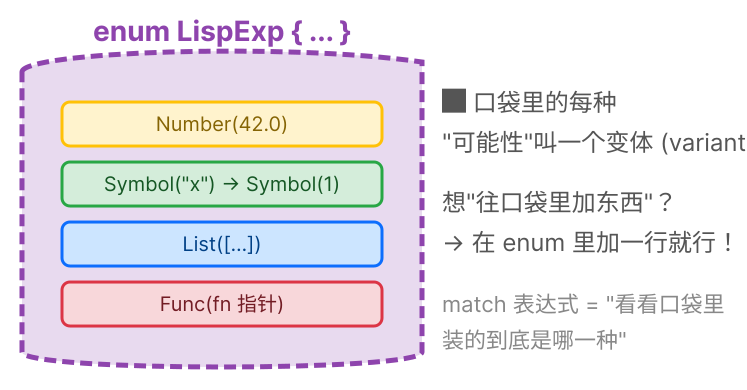

🧠 **大白话 — `Result`**：Rust 里表示"可能成功，也可能失败"的类型。

```rust
Result<LispExp, LispErr>
       │         │
       │         └─ 失败时带的"错误信息"
       └─ 成功时带的"结果值"
```
就像一个快递包裹：打开要么是你要的东西（Ok），要么是一张"配送失败"纸条（Err）。

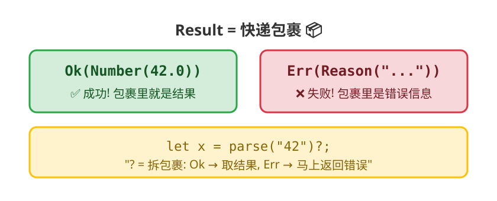

- `Ok(Number(42.0))` → 成功！结果是个数字 42
- `Err(LispErr::Reason("出错了"))` → 失败！原因是"出错了"

🧠 **大白话 — `&`（引用/借）**：

```rust
fn eval(exp: &LispExp) -> Result<LispExp, LispErr>
//           ↑
//           "借用"这个值,不拿走所有权
```

就像你去图书馆**借书看**——书还是图书馆的，你只是暂时看看。`&` 就是"借"的意思。Rust 的所有权系统保证你不会把书弄丢。

---

### 步骤 8: 从"字符串"到"结果"

现在我们手工解析，不依赖 lexer/parser：

```rust
// src/lib.rs
/// 辅助函数: 从源码字符串直接求值
fn eval_str(source: &str) -> Result<LispExp, LispErr> {
    // 把字符串转成数字
    let num: f64 = source
        .trim()                                    // 去掉首尾空白
        .parse()                                   // 尝试转成 f64
        .map_err(|_| LispErr::Reason(              // 转换失败→错误
            format!("不是数字: {}", source)
        ))?;
    eval(&LispExp::Number(num))                    // 丢给 eval
}

#[test]
fn test_eval_str_number() {
    assert_eq!(eval_str("42").unwrap(), LispExp::Number(42.0));
}
```

```text
数据变化（假设用户输入了 " 42 "，前后有空格）:
" 42 "  →  trim()  →  "42"  →  parse::<f64>()  →  42.0_f64
→ Number(42.0) → eval → Ok(Number(42.0))
```

🧠 **大白话 — `\n` 是什么？** 你在终端输入 `42` 然后敲回车，电脑实际收到的是 `42\n`——`\n` 就是"回车键"在字符串里的写法（叫"换行符"）。`trim()` 会把它和空格一起清理掉。这里为简单起见，示例中只画了空格。

```bash
$ cargo test
warning: unreachable pattern
  --> src/lib.rs:17:9
   |
16 |         LispExp::Number(n) => Ok(LispExp::Number(*n)),
   |         ------------------ matches all the relevant values
17 |         _ => Err(LispErr::Reason("暂不支持此类型".to_string())),
   |         ^ no value can reach this
   |
   = note: `#[warn(unreachable_patterns)]` (part of `#[warn(unused)]`) on by default

warning: function `eval_str` is never used
  --> src/lib.rs:23:4
   |
23 | fn eval_str(source: &str) -> Result<LispExp, LispErr> {
   |    ^^^^^^^^
   |
   = note: `#[warn(dead_code)]` (part of `#[warn(unused)]`) on by default

warning: `lisp-rs` (lib) generated 2 warnings
warning: `lisp-rs` (lib test) generated 1 warning (1 duplicate)
    Finished `test` profile [unoptimized + debuginfo] target(s) in 0.63s
     Running unittests src/lib.rs (target/debug/deps/lisp_rs-5cd87530e74cecce)

running 3 tests
test tests::test_create_number ... ok
test tests::test_eval_str_number ... ok
test tests::test_eval_number ... ok

test result: ok. 3 passed; 0 failed; 0 ignored; 0 measured; 0 filtered out; finished in 0.00s
```

🧠 **大白话 — 为什么有两条警告？**

1. **`unreachable pattern`**：上一步的“老朋友”。`LispExp` 仍只有 `Number` 一个变体，`_` 仍不可达。等后面加了 `Symbol` 等变体就会消失。
2. **`function 'eval_str' is never used`（dead_code）**：`eval_str` 没有 `pub` 标记，在非测试代码中没有任何地方调用它——编译器觉得它是“死代码”。但它被 `#[cfg(test)]` 里的测试函数调用了，所以测试能通过。

> 💡 **嫌 `dead_code` 警告碍眼？** 给 `eval_str` 加上 `pub` 就行：`pub fn eval_str(...)`。这样编译器知道它是公开 API，不警告。不过现在留着也无妨——这只是提醒，不是错误。

🧠 **大白话 — `?` 操作符**：`source.trim().parse()...?;` 末尾的 `?`，意思是"如果这一步出错了，马上把这个错误返回给调用我的人"。省去了写一大堆 `if 出错 { return 错误 }` 的麻烦。

就像你在餐厅传递订单：`?` 等于"如果你做不了这个菜，立刻告诉服务员，不要再往下做了"。

🧠 **大白话 — `format!`**：和 `println!` 姐妹，但 `println!` 打印到屏幕，`format!` 生成一个 String。`"不是数字: {}"` 里的 `{}` 是占位符——会被 `source` 替换。

**✅ 里程碑：最小可用解释器！输入 "42" 输出 Number(42.0)。**

---

> 🏋️ **练习**
> 1. (⭐) 修改 `eval_str`，让它也支持 `"true"` 和 `"false"` 字符串输入（先不用 Bool 类型，返回字符串即可）
> 2. (⭐⭐) `eval` 函数现在只有两个分支（Number 和 `_`）。如果用户输入一个负数 `-42`，会发生什么？怎么修复？


<details>
<summary>点击查看答案</summary>

**1. 支持 true/false**
```rust
fn eval_str(source: &str) -> Result<LispExp, LispErr> {
    let trimmed = source.trim();
    if trimmed == "true"  { return Ok(LispExp::Symbol("true".into())); }
    if trimmed == "false" { return Ok(LispExp::Symbol("false".into())); }
    let num: f64 = trimmed.parse()
        .map_err(|_| LispErr::Reason(format!("不是数字: {}", source)))?;
    eval(&LispExp::Number(num))
}
```

**2. -42 的处理**
词法分析器把 `-42` 拆成 `["-", "42"]`——负号被当成减号运算符。解析器得到 `List([Symbol("-"), Number(42)])` 而不是 `Number(-42)`。修复：在 `parse_atom` 中检测以 `-` 开头且后接数字的 token，直接 `parse::<f64>()` ：
```rust
fn parse_atom(token: &str) -> LispExp {
    if let Ok(num) = token.parse::<f64>() {
        return LispExp::Number(num);
    }
    LispExp::Symbol(token.to_string())
}
```
因为 Rust 的 `"-42".parse::<f64>()` 返回 `Ok(-42.0)`，所以其实已经是正确的！
</details>


> 🎯 **解决的问题**: 把源码字符串拆成 Token 列表。就像读句子先要分词——有了词才能理解句子的意思。 — 词法分析器

> 📖 **下一章：[把句子拆成单词](#把句子拆成单词)**


> ✅ **本章总结**: `eval` 接收表达式，返回值或错误。解释器管线已全线贯通。


> 为什么要学：词法分析器是解释器的眼睛 - 它读取原始文本并识别出有意义的单元 (token)。每个编译器和解释器都从词法分析器开始，这是你在任何语言实现中都能用到的基础技能。

## 把句子拆成单词
> ⏩ **跳过信号：** 了解词法分析/tokenize？跳到[步骤 12](#步骤-12-创建-parserrs)。


---

<blockquote class='pipeline-position'>
<details>
<summary><strong>📍 管线位置</strong> — 查看我们在整个项目中的进度</summary>

```
  [源码] → [◉ 词法分析 Lexer] → [语法分析] → [求值器] → [输出]
                tokenize()
```

| | |
|---|---|
| ✅ 已完成 | eval 能处理自我求值的字面量 |
| 🎯 编写词法分析器 tokenize，将源码拆分为 token；处理括号、空白、注释和字符串

</details>
</blockquote>

---
### 步骤 9: 创建新文件

在 RustRover 左侧文件列表中，**右键点击 `src` 文件夹** → **New** → **File**，输入 `lexer.rs`，回车。

就像在文件管理器里右键 → 新建文件一样。

在 `lib.rs` 最上面加一行：

```rust
// src/lib.rs
pub mod lexer;  // "我还有一个文件叫 lexer.rs"
```

🧠 **大白话 — `mod`（模块）**：Rust 把一个 `.rs` 文件叫一个"模块"。当你写 `mod lexer;`，就是在说"去 lexer.rs 找代码"。相当于书本的"目录"——告诉读者第 3 章在第几页。

`pub mod` vs `mod`：`pub` 是"公开的"，外面的代码可以看。不加 `pub` 就是"私有的"，只有自己家里能用。

### 步骤 10: 拆分字符串

```rust
// src/lexer.rs — 完整内容

/// 把源码字符串切成 Token（就像把句子切成单词）
pub fn tokenize(input: &str) -> Vec<String> {
    input
        .split_whitespace()      // 按空白切开
        .map(|s| s.to_string())  // 每片变成自己的 String
        .collect()               // 收集到 Vec 里
}
```

🧠 **大白话 — `Vec<String>`**："一堆 String 排好队"。`Vec`（读作"vec"，是 vector 的缩写）是 Rust 里最基本的数据结构——一个能自动扩容的列表。

```
Vec<String>：
┌─ ┬ ───────────────┐
│ "("  │ "+"│ "1"  │  ← 每个格子里是一个 String
└──────┴──────┴──────┘
  0      1      2          ← 索引（从0开始）
```

就像一个购物清单——可以往里加东西，删东西，按编号找东西。

🧠 **大白话 — `|s| s.to_string()`（闭包/匿名函数）**：
这是 Rust 写"小函数"的方式。`|s|` 是参数（输入），`s.to_string()` 是函数体（处理）。
翻译成人话："对于每一个 s，把它变成 String"。

就像流水线工人：每来一个零件，做同样的操作，传给下一道工序。

**测试**（加到文件末尾）：

```rust
// src/lexer.rs — 文件末尾加测试模块
#[cfg(test)]
mod tests {
    use super::*;

    #[test]
    fn test_tokenize_simple() {
        assert_eq!(tokenize("42"), ["42"]);
    }

    #[test]
    fn test_tokenize_whitespace() {
        assert_eq!(tokenize("  42  "), ["42"]);
    }
}
```

```bash
$ cargo test
warning: unreachable pattern
  --> src/lib.rs:17:9
   |
16 |         LispExp::Number(n) => Ok(LispExp::Number(*n)),
   |         ------------------ matches all the relevant values
17 |         _ => Err(LispErr::Reason("暂不支持此类型".to_string())),
   |         ^ no value can reach this
   |
   = note: `#[warn(unreachable_patterns)]` (part of `#[warn(unused)]`) on by default

warning: function `eval_str` is never used
  --> src/lib.rs:21:4
   |
21 | fn eval_str(source: &str) -> Result<LispExp, LispErr> {
   |    ^^^^^^^^
   |
   = note: `#[warn(dead_code)]` (part of `#[warn(unused)]`) on by default

warning: `lisp-rs` (lib) generated 2 warnings
warning: `lisp-rs` (lib test) generated 1 warning (1 duplicate)
    Finished `test` profile [unoptimized + debuginfo] target(s) in 0.46s
     Running unittests src/lib.rs (target/debug/deps/lisp_rs-5cd87530e74cecce)

running 5 tests
test lexer::tests::test_tokenize_simple ... ok
test lexer::tests::test_tokenize_whitespace ... ok
test tests::test_create_number ... ok
test tests::test_eval_number ... ok
test tests::test_eval_str_number ... ok

test result: ok. 5 passed; 0 failed; 0 ignored; 0 measured; 0 filtered out; finished in 0.00s
```

> 🧠 **大白话 — 两条警告还在？**
>
> 1. **`unreachable pattern`**：`LispExp` 仍只有 `Number`，`_` 仍不可达。等步骤 12 加了 `Symbol` 后消失。
> 2. **`function 'eval_str' is never used`**：`eval_str` 不是 `pub`，在非测试代码中没人调用它。这两条都是步骤 7-8 的“老朋友”，完全无害。

### 步骤 11: 处理括号

```rust
// src/lexer.rs — tests 模块中新增
#[test]
fn test_tokenize_parens() {
    assert_eq!(
        tokenize("(+ 1 2)"),
        ["(", "+", "1", "2", ")"]
    );
}
```

`cargo test` → ❌ 测试失败：

```
warning: unreachable pattern
  --> src/lib.rs:17:9
   |
16 |         LispExp::Number(n) => Ok(LispExp::Number(*n)),
   |         ------------------ matches all the relevant values
17 |         _ => Err(LispErr::Reason("暂不支持此类型".to_string())),
   |         ^ no value can reach this
   |
   = note: `#[warn(unreachable_patterns)]` (part of `#[warn(unused)]`) on by default

warning: function `eval_str` is never used
  --> src/lib.rs:21:4
   |
21 | fn eval_str(source: &str) -> Result<LispExp, LispErr> {
   |    ^^^^^^^^
   |
   = note: `#[warn(dead_code)]` (part of `#[warn(unused)]`) on by default

warning: `lisp-rs` (lib) generated 2 warnings
warning: `lisp-rs` (lib test) generated 1 warning (1 duplicate)
    Finished `test` profile [unoptimized + debuginfo] target(s) in 0.46s
     Running unittests src/lib.rs (target/debug/deps/lisp_rs-5cd87530e74cecce)

running 6 tests
test lexer::tests::test_tokenize_simple ... ok
test lexer::tests::test_tokenize_whitespace ... ok
test lexer::tests::test_tokenize_parens ... FAILED

failures:
---- lexer::tests::test_tokenize_parens stdout ----
assertion `left == right` failed
  left: ["(+", "1", "2)"]
 right: ["(", "+", "1", "2", ")"]
```

括号和旁边的字连在一起了！`(+` 被当成一个 token，`2)` 也是。

**修复**——在括号两边加空格：

```rust
// src/lexer.rs
pub fn tokenize(input: &str) -> Vec<String> {
    input
        .replace("(", " ( ")   // 每个 "(" → " ( "
        .replace(")", " ) ")   // 每个 ")" → " ) "
        .split_whitespace()
        .map(|s| s.to_string())
        .collect()
}
```

```text
输入: "(+ 1 2)"
      ↓ replace("(", " ( ")      ← 把每个 "(" 替换成 " ( "
      " (+ 1 2 )"
      ↓ replace(")", " ) ")      ← 把每个 ")" 替换成 " ) "
      " ( + 1 2 ) "
      ↓ split_whitespace()       ← 按空白切开
      ["(", "+", "1", "2", ")"]
      ↓ map + collect
      vec!["(".to_string(), "+".to_string(), ...]
```

```bash
$ cargo test
warning: unreachable pattern
  --> src/lib.rs:17:9
   |
16 |         LispExp::Number(n) => Ok(LispExp::Number(*n)),
   |         ------------------ matches all the relevant values
17 |         _ => Err(LispErr::Reason("暂不支持此类型".to_string())),
   |         ^ no value can reach this
   |
   = note: `#[warn(unreachable_patterns)]` (part of `#[warn(unused)]`) on by default

warning: function `eval_str` is never used
  --> src/lib.rs:21:4
   |
21 | fn eval_str(source: &str) -> Result<LispExp, LispErr> {
   |    ^^^^^^^^
   |
   = note: `#[warn(dead_code)]` (part of `#[warn(unused)]`) on by default

warning: `lisp-rs` (lib) generated 2 warnings
warning: `lisp-rs` (lib test) generated 1 warning (1 duplicate)
    Finished `test` profile [unoptimized + debuginfo] target(s) in 0.46s
     Running unittests src/lib.rs (target/debug/deps/lisp_rs-5cd87530e74cecce)

running 6 tests
test lexer::tests::test_tokenize_simple ... ok
test lexer::tests::test_tokenize_whitespace ... ok
test lexer::tests::test_tokenize_parens ... ok
test tests::test_create_number ... ok
test tests::test_eval_number ... ok
test tests::test_eval_str_number ... ok

test result: ok. 6 passed; 0 failed; 0 ignored; 0 measured; 0 filtered out; finished in 0.00s
```

> 🧠 **大白话 — 两条老警告还在，但测试全通过了！** `unreachable pattern` 和 `dead_code` 警告在步骤 12 加入 `Symbol` 变体后会消失一个（`unreachable pattern`），另一个（`dead_code`）要等 `eval_str` 被 `pub` 标记或被非测试代码调用后才消失。

---

> 🏋️ **练习**
> 1. (⭐) 给 `tokenize` 加注释支持：`;` 之后到行尾的内容应该被忽略。提示：在循环中检测 `;` 然后跳到下一行
> 2. (⭐⭐) 写一个测试，输入 `"(+ 1 2) ; 这是一条注释"`，期望输出 `["(", "+", "1", "2", ")"]`


<details>
<summary>点击查看答案</summary>

**1. 加注释支持**（在 lexer 循环中）
```rust
';' => {
    while pos < len && chars[pos] != '\n' {
        pos += 1;
    }
}
```

**2. 测试**
```rust
#[test]
fn test_comment_ignored() {
    assert_eq!(
        tokenize("(+ 1 2) ; 这是一条注释"),
        ["(", "+", "1", "2", ")"]
    );
}
```
</details>


> 🎯 **解决的问题**: 把扁平的 Token 列表变成嵌套的 AST 树。这是整个解释器最关键的数据结构转换。

> 📖 **下一章：[理解单词的意思](#理解单词的意思)**

---

> 🎯 **里程碑：词法分析完成** — 现在解释器可以把源码拆成 token 了。
>
> 📝 **设计笔记：为什么用 String 表示 token？**
>
> 当前 token 是 `Vec<String>` —— 每个 token 在堆上分配一个新的 String。对于 `(+ 1 2)` 这个 7 字符表达式，
> 需要 5 次堆分配。
>
> **这浪费吗？** 是的，但刻意如此。在这个阶段，清晰比性能重要：
> - `String` 对 Rust 初学者来说最熟悉
> - 字符串比较（`token == "("`）直观易懂
> - `to_string()` 调用让数据流动可见
>
> **替代方案有哪些？**
> - `&str`（源码切片引用）—— 更快但需要生命周期管理。我们在步骤 42 会切换过去！
> - `enum Token { LParen, RParen, Number(f64), Symbol(String), ... }` —— 类型更安全，但引入了专门的新类型
> - `u64` 驻留 ID —— 最快但多了一层间接访问
>
> **权衡**：在工业级 Lisp 实现中，词法分析通常是管线中最便宜的部分。真正的瓶颈在求值器。
> 所以 String 类型 token 足够学习使用——只在真正需要时才优化。

> 🧠 **心智模型检查点**：本章之后，你应该把源码看作 token 序列而不是文本。`(+ 1 2)` 不是字符串 - 而是 `["(", "+", "1", "2", ")"]`。从文本到 token 的转换是理解计算机如何处理代码的第一步。


> ✅ **本章总结**: `tokenize()` 处理所有 token 类型。词法分析器拥有独立模块和独立测试。


> 为什么要学：语法分析器把扁平的 token 列表转换成树状结构 (AST)。这棵树代表程序的语法结构 - 没有它，求值器就没有有意义的输入。递归下降解析是最直观的解析技术，适用于大多数真实语言。

## 理解单词的意思
> ⏩ **跳过信号：** 了解递归下降解析？跳到[步骤 16](#步骤-16-创建环境变量名-值的通讯录)。不过步骤 14 的 mermaid 时序图值得看一眼。


---

<blockquote class='pipeline-position'>
<details>
<summary><strong>📍 管线位置</strong> — 查看我们在整个项目中的进度</summary>

```
  [源码] → [词法分析] → [◉ 语法分析 Parser] → [求值器] → [输出]
                               parse()
```

| | |
|---|---|
| ✅ 已完成 | tokenize 正常工作 |
| 🎯 编写递归下降解析器，将 token 转换为带嵌套 S-表达式的 AST

</details>
</blockquote>

---
### 步骤 12: 创建 parser.rs

> ⚠️ **临时方案**：`Symbol` 目前用 `String` 存名字（简单直观）。项目的最终形态用 `Symbol(u64)`——一个整数 ID，通过「字符串驻留器」把名字映射为数字，比较和哈希都是 O(1)。我们会在步骤 40-41 做这个优化，届时把所有 `String` 替换为 `u64`。现在先用 `String` 把逻辑跑通。

右键 `src` 文件夹 → **New** → **File**，输入 `parser.rs`。

`lib.rs` 加：`mod parser;`

```rust
// src/parser.rs
use crate::{LispExp, LispErr};
//  ↑
//  "从当前 crate(本项目) 拿 LispExp 和 LispErr 过来用"

/// 解析 Token 列表 → 表达式
/// 返回: (解析出的表达式, 还剩几个 Token 没处理)
pub fn parse(tokens: &[String]) -> Result<(LispExp, &[String]), LispErr> {
    let (token, rest) = tokens.split_first()
        // split_first(): 把队伍拆成"第一个"和"后面的人"
        .ok_or(LispErr::Reason("没有 Token 了".to_string()))?;
        // ok_or: 如果是 None(队伍空的), 转成错误
    Ok((parse_atom(token), rest))
}

fn parse_atom(token: &str) -> LispExp {
    // 先试着当数字解析...
    if let Ok(num) = token.parse::<f64>() {
        return LispExp::Number(num);
    }
    // 不是数字就当符号
    LispExp::Symbol(token.to_string())
}
```

🧠 **大白话 — `use`（导入）**：就像你去图书馆借书——`use crate::{LispExp, LispErr}` 意思是"把项目里的 LispExp 和 LispErr 拿到这个文件来用"。不写 `use` 就得写全名 `crate::LispExp`，太啰嗦。

🧠 **大白话 — `if let Ok(num) = ...`（模式匹配简写）**：

```rust
if let Ok(num) = token.parse::<f64>() {
    return LispExp::Number(num);
}
```

意思是"如果 `parse` 成功，把结果取出来叫 `num`，然后执行花括号里的代码"。
等价于：
>
> ```rust
> match token.parse::<f64>() {
>     Ok(num) => return LispExp::Number(num),
>     Err(_) => {} // 忽略错误
> }
> ```
>
> `if let` 就是"我只关心这一种情况的 match"。

但编译需要 `LispExp` 有 `Symbol`！在 `lib.rs` 中加上：

```rust
// src/lib.rs
pub enum LispExp {
    Number(f64),
    Symbol(String),  // ← 加这个
}
```

```bash
$ cargo test
warning: function `eval_str` is never used
  --> src/lib.rs:25:4
   |
25 | fn eval_str(source: &str) -> Result<LispExp, LispErr> {
   |    ^^^^^^^^
   |
   = note: `#[warn(dead_code)]` (part of `#[warn(unused)]`) on by default

warning: `lisp-rs` (lib) generated 1 warning
    Finished `test` profile [unoptimized + debuginfo] target(s) in 0.32s
     Running unittests src/lib.rs (target/debug/deps/lisp_rs-5cd87530e74cecce)

running 6 tests
test lexer::tests::test_tokenize_simple ... ok
test lexer::tests::test_tokenize_whitespace ... ok
test lexer::tests::test_tokenize_parens ... ok
test tests::test_create_number ... ok
test tests::test_eval_number ... ok
test tests::test_eval_str_number ... ok

test result: ok. 6 passed; 0 failed; 0 ignored; 0 measured; 0 filtered out; finished in 0.00s
```

> 🧠 **大白话 — `unreachable pattern` 警告消失了！** 加了 `Symbol` 变体后，`_` 不再是死代码——它可以匹配 `Symbol`。只剩 `eval_str` 的 `dead_code` 警告还在。

```rust
// lib.rs 顶部加
use crate::lexer::tokenize;
use crate::parser::parse;

// 更新 eval_str
fn eval_str(source: &str) -> Result<LispExp, LispErr> {
    let tokens = tokenize(source);      // 第1步: 拆分
    let (exp, _) = parse(&tokens)?;     // 第2步: 解析
    eval(&exp)                          // 第3步: 求值
}
```

```text
数据管线:
"42" → tokenize → ["42"] → parse → Number(42.0) → eval → Number(42.0)
```

```bash
$ cargo test
warning: function `eval_str` is never used
  --> src/lib.rs:25:4
   |
25 | fn eval_str(source: &str) -> Result<LispExp, LispErr> {
   |    ^^^^^^^^
   |
   = note: `#[warn(dead_code)]` (part of `#[warn(unused)]`) on by default

warning: `lisp-rs` (lib) generated 1 warning
    Finished `test` profile [unoptimized + debuginfo] target(s) in 0.32s
     Running unittests src/lib.rs (target/debug/deps/lisp_rs-5cd87530e74cecce)

running 6 tests
...
test result: ok. 6 passed; 0 failed; 0 ignored; 0 measured; 0 filtered out; finished in 0.00s
```

---

### 步骤 14: 解析嵌套列表

**目标**：`(+ 1 (* 2 3))` 变成树形结构。

先加 `List` 类型（`lib.rs`）：

```rust
// src/lib.rs
pub enum LispExp {
    Number(f64),
    Symbol(String),
    List(Vec<LispExp>),  // ← 新增! 列表里装着更多表达式
}
```

**核心逻辑**——**替换** `parser.rs` 的 `parse` 函数为以下版本，并新增 `read_seq` 函数：

```rust
// src/parser.rs
pub fn parse(tokens: &[String]) -> Result<(LispExp, &[String]), LispErr> {
    let (token, rest) = tokens.split_first()
        .ok_or(LispErr::Reason("没有 Token 了".to_string()))?;

    match token.as_str() {   // as_str(): String → &str (借用一下)
        "(" => read_seq(rest),  // 左括号 → 开始读列表
        ")" => Err(LispErr::Reason("多余的 )".to_string())),
        _ => Ok((parse_atom(token), rest)),
    }
}

/// 读列表: 从左括号之后开始, 遇到 ) 结束
fn read_seq(tokens: &[String]) -> Result<(LispExp, &[String]), LispErr> {
    let mut elements = Vec::new();    // 空列表
    let mut remaining = tokens;       // 还剩的 Token

    loop {   // ← 一直循环, 直到遇到 )
        let (token, rest) = remaining.split_first()
            .ok_or(LispErr::Reason("缺少 )".to_string()))?;

        if token == ")" {
            // 遇到了 ) → 列表结束, 返回收集到的所有元素
            return Ok((LispExp::List(elements), rest));
        }

        // 递归: 调用 parse 解析下一个元素
        // (这个元素本身可能又是一个列表!)
        let (exp, new_rest) = parse(remaining)?;
        elements.push(exp);         // 加入列表
        remaining = new_rest;       // 更新剩余 Token
    }
}
```

🧠 **大白话 — `loop`（无限循环）**：一直做某件事，直到遇到 `return` 或 `break`。就像自动门——一直开着，直到有人经过才关。

```text
图解递归: 怎么解析 (+ 1 (* 2 3))

第1层: parse → "(" → read_seq 开始读
  ├─ "+" → 不是 ")" → parse("+") → Symbol("+") → 加入列表
  ├─ "1" → 不是 ")" → parse("1") → Number(1.0) → 加入列表
  ├─ "(" → 不是 ")" → parse("(") → read_seq 开始读  ← 递归!
  │   ├─ "*" → Symbol("*")
  │   ├─ "2" → Number(2.0)
  │   ├─ "3" → Number(3.0)
  │   └─ ")" → 列表结束! 返回 List([*,2,3])
  └─ ")" → 列表结束! 返回 List([+,1,[*,2,3]])

结果像一棵树:
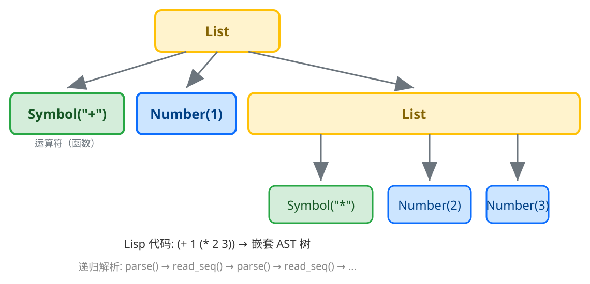

🧠 **大白话 — 递归**：函数调用自己。就像"镜子里的镜子里的镜子"——无限嵌套下去，直到遇到停止条件（`)`）。

生活中也有递归：你要打开一个箱子，发现里面还有个箱子——于是重复"打开箱子"这个动作，直到最里面的箱子没有套娃为止。

```bash
$ cargo test
warning: function `eval_str` is never used
  --> src/lib.rs:25:4
   |
25 | fn eval_str(source: &str) -> Result<LispExp, LispErr> {
   |    ^^^^^^^^
   |
   = note: `#[warn(dead_code)]` (part of `#[warn(unused)]`) on by default

warning: `lisp-rs` (lib) generated 1 warning
    Finished `test` profile [unoptimized + debuginfo] target(s) in 0.32s
     Running unittests src/lib.rs (target/debug/deps/lisp_rs-5cd87530e74cecce)

running 6 tests
test lexer::tests::test_tokenize_simple ... ok
test lexer::tests::test_tokenize_whitespace ... ok
test lexer::tests::test_tokenize_parens ... ok
test tests::test_create_number ... ok
test tests::test_eval_number ... ok
test tests::test_eval_str_number ... ok

test result: ok. 6 passed; 0 failed; 0 ignored; 0 measured; 0 filtered out; finished in 0.00s
```

> 🧠 **大白话 — `unreachable pattern` 警告消失了！** 加了 `Symbol` 变体后，`_` 不再是死代码——它可以匹配 `Symbol`。只剩 `eval_str` 的 `dead_code` 警告还在。

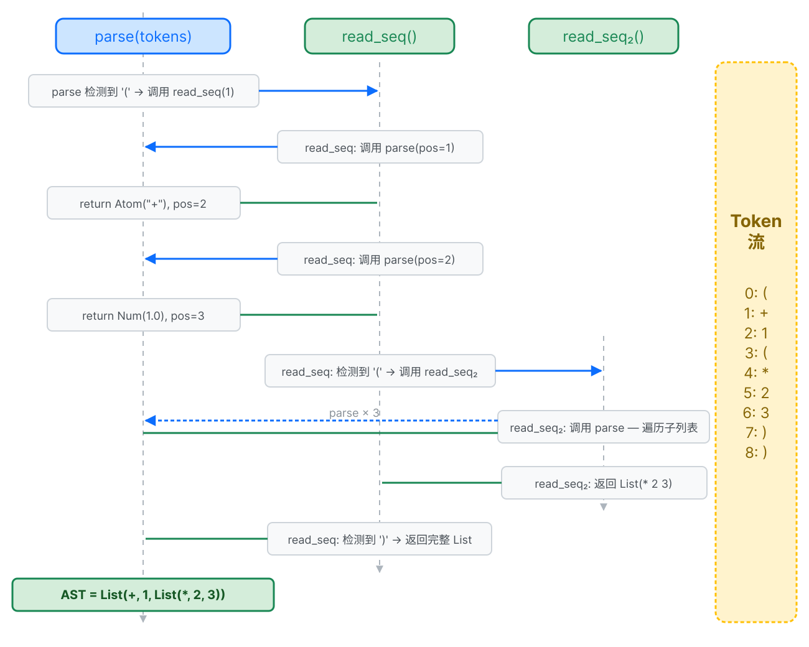

> 🔄 **递归解析的调用过程**：`parse()` 和 `read_seq()` 互相调用——`parse` 遇到 `(` 委托给 `read_seq`，`read_seq` 遇到子元素又调用 `parse`，形成递归下降。每次遇到 `)` 就"弹出一层"，最终构建出完整的嵌套 AST 树。

> 📐 **形式化定义**：递归下降解析器
>
> 解析器由两个相互递归的函数定义：
>
> ```
> parse(tokens):
>   如果 tokens[0] 是原子 → parse_atom(tokens)
>   如果 tokens[0] 是 "("  → read_seq(tokens[1:])
>
> read_seq(tokens):
>   如果 tokens[0] 是 ")"  → (Nil, tokens[1:])        // 基本情况：空列表
>   否则：
>     (expr, rest) = parse(tokens)                    // 解析一个表达式
>     (list,  rem)  = read_seq(rest)                  // 递归解析剩余部分
>     (cons(expr, list), rem)                         // 组合成列表
> ```
>
> 这是**相互递归**：`parse` 调用 `read_seq`，`read_seq` 调用 `parse`。
> `read_seq` 遇到 `)` 时是基本情况——这是阻止无限递归的条件。
> ```
> parse("(+ 1 (* 2 3))") → List(Symbol(+), Number(1), List(Symbol(*), Number(2), Number(3)))
> ```

### 步骤 15: 解析符号 + 括号错误测试

```rust
// parser.rs 末尾 — 测试模块
#[cfg(test)]
mod tests {
    use super::*;

    #[test]
    fn test_parse_symbol() {
        let tokens = vec!["x".to_string()];
        let (exp, _) = parse(&tokens).unwrap();
        assert_eq!(exp, LispExp::Symbol("x".into()));
    }

    #[test]
    fn test_unclosed_list_error() {
        assert!(parse(&vec!["(".to_string(), "+".into(), "1".into()]).is_err());
    }

    #[test]
    fn test_unexpected_close_error() {
        assert!(parse(&vec![")".to_string()]).is_err());
    }
}
```

```bash
$ cargo test
warning: function `eval_str` is never used
  --> src/lib.rs:25:4
   |
25 | fn eval_str(source: &str) -> Result<LispExp, LispErr> {
   |    ^^^^^^^^
   |
   = note: `#[warn(dead_code)]` (part of `#[warn(unused)]`) on by default

warning: `lisp-rs` (lib) generated 1 warning
    Finished `test` profile [unoptimized + debuginfo] target(s) in 0.32s
     Running unittests src/lib.rs (target/debug/deps/lisp_rs-5cd87530e74cecce)

running 9 tests
test parser::tests::test_parse_symbol ... ok
test parser::tests::test_unclosed_list_error ... ok
test parser::tests::test_unexpected_close_error ... ok
...
test result: ok. 9 passed; 0 failed; 0 ignored; 0 measured; 0 filtered out; finished in 0.00s
```

> 🧠 **大白话 — `eval_str` 的 `dead_code` 警告还在。** 这条警告会一直跟着我们，直到步骤 74 创建 `main.rs` 并调用 `eval_str`（或者你提前给它加 `pub`）。

---

> 🏋️ **练习**
> 1. (⭐) 修改 `parse_atom` 让它也识别关键字 `#t` 和 `#f`，返回自定义的 Symbol
> 2. (⭐⭐) 如果输入是 `"(+ 1 2"` （少了右括号），现在的解析器返回什么错误？写一个测试验证
> 3. (⭐⭐⭐) 思考：`(1 + 2)` 能解析吗？为什么 Lisp 要求第一个元素必须是操作符？


<details>
<summary>点击查看答案</summary>

**1. 识别 #t 和 #f**
```rust
fn parse_atom(token: &str) -> LispExp {
    if token == "#t" { return LispExp::Symbol("#t".into()); }
    if token == "#f" { return LispExp::Symbol("#f".into()); }
    if let Ok(num) = token.parse::<f64>() {
        return LispExp::Number(num);
    }
    LispExp::Symbol(token.to_string())
}
```

**2. 缺少右括号**
返回 `LispErr::Reason("未闭合的列表：缺少右括号 ')'")`。

**3. (1 + 2) 能解析吗？**
能成功解析为 `List([Number(1), Symbol("+"), Number(2)])`。但求值时，第一个元素 `1`（Number）不是函数，所以报错"不是一个可调用的函数"。Lisp 的语法要求第一个位置是操作符——这是语言设计，不是解析器限制。

> 4. (⭐⭐⭐) **预测错误**：如果调用 `parse("(+ 1 2")`（缺少右括号），具体会发生什么？
>    先写下你预测的错误信息，再实际运行 `cargo test` 对比。你的预测接近吗？
      </details>


> 🎯 **解决的问题**: 变量名→值的映射（环境）。有了环境，`(define x 10)` 和 `(+ x 1)` 才有意义。

> 📖 **下一章：[给东西起名字](#给东西起名字)**

> 🧠 **心智模型检查点**：本章之后，你应该把程序看作树而不是文本。`(+ 1 (* 2 3))` 是一棵以 `+` 为根、`1` 和 `(* 2 3)` 子树为分支的树。语法分析器就是树的建造者。


> ✅ **本章总结**: `parse()` + `read_seq()` 互递归构建语法树，嵌套 `(+ 1 (* 2 3))` 正确解析。


> **💡 解析器的错误恢复策略**
>
> 当前解析器遇到语法错误时会立即返回 `LispErr`。一个更友好的做法是实现
> **Panic Mode 恢复**：当解析器遇到无法处理的 token 时，跳过当前表达式
> 并继续解析后续内容。Crafting Interpreters 的实践表明，这让用户能一次性
> 看到所有错误，而非「修复一个 → 发现下一个」的逐一排查过程。实现方式：
> 在 `read_seq` 中添加一个同步点，遇到 `)` 或文件末尾时恢复解析。


> 为什么要学：变量把计算器变成编程语言。环境提供了带词法作用域的命名存储 - 和 Scheme、JavaScript、Python 乃至 Rust 本身使用相同的机制。理解环境链是理解现代语言如何管理作用域的关键。

## 给东西起名字
> ⏩ **跳过信号：** 熟悉 HashMap 和作用域链？快速浏览——核心概念是 `outer`（环境链）。


---

<blockquote class='pipeline-position'>
<details>
<summary><strong>📍 管线位置</strong> — 查看我们在整个项目中的进度</summary>

```
  [源码] → [词法分析] → [语法分析] → [◉ 求值器 + 环境] → [输出]
                                              ↕
                                          [LispEnv]
```

| | |
|---|---|
| ✅ 已完成 | 完整的 Lexer + Parser 管线 |
| 🎯 实现 LispEnv（HashMap 存储），通过 outer 链实现作用域变量查找

</details>
</blockquote>

---
### 步骤 16: 创建"环境"（变量名 → 值的通讯录）

右键 `src` 文件夹 → **New** → **File**，输入 `env.rs`。

`lib.rs` 加 `pub mod env;`

```rust
// src/env.rs

use std::collections::HashMap;  // 引入哈希表
use crate::{LispExp, LispErr};

/// 环境 — 就像一个通讯录: 名字 → 值
///
/// 结构示意:
┌────────────────────┐
│ "x" → Number(10)   │  ← 变量 x 的值是 10
│ "+" → Func(加法)    │  ← 变量 + 的值是加法函数
│ "y" → Number(20)   │
└────────────────────┘
#[derive(Clone, Debug, PartialEq, Default)]
pub struct LispEnv {
    pub data: HashMap<String, LispExp>,
}
```

🧠 **大白话 — HashMap**：就像电话本。你给一个"名字"（key），就能查到对应的"内容"（value）。查起来非常快——不像翻书一页页找，而是像查字典（按拼音直接定位）。

```
HashMap<String, LispExp>
        │        │
        │        └── 值: Lisp 表达式
        └── 键: 字符串 (变量名)
```

```rust
// src/env.rs
impl LispEnv {
    // impl = "给 LispEnv 加上这些功能/方法"

    pub fn new() -> Self {
        LispEnv { data: HashMap::new() }
    }

    pub fn set(&mut self, key: String, value: LispExp) {
        self.data.insert(key, value);  // 写入通讯录
    }

    pub fn get(&self, key: &str) -> Result<LispExp, LispErr> {
        self.data
            .get(key)           // 查通讯录, 返回 Option<&LispExp>
            .cloned()           // 把引用转成自己的克隆
            .ok_or_else(||      // 如果是 None(没找到), 生成错误
                LispErr::Reason(format!("未定义的变量: {}", key))
            )
    }
}
```

🧠 **大白话 — `impl`**：给一个 struct 添加方法（函数）。就像给遥控器加按钮。

```rust
impl LispEnv {           // 给 LispEnv 加功能
    pub fn new() { ... } // 新建功能
    pub fn set(...)      // 写入功能
    pub fn get(...)      // 查找功能
}
```

🧠 **大白话 — `&mut self` vs `&self`**：

- `&self`：我只看看，不修改（像读一本书）
- `&mut self`：我可能要写东西进去（像在书上做笔记）
- `mut` = mutable = 可变的

🧠 **大白话 — `Option`**：就像"可能有一个东西，也可能没有"的盒子。

```rust
Option<LispExp>
   ├─ Some(value)   ← 盒子里有东西!
   └─ None           ← 盒子是空的
```

`HashMap::get` 返回 `Option`——因为你要找的 key 可能在通讯录里（Some），也可能不在（None）。

---

### 步骤 17: env.rs 测试

把下面测试加到 `src/env.rs` 末尾测试模块：

```rust
// env.rs 末尾 — 测试模块
#[cfg(test)]
mod tests {
    use super::*;

    #[test]
    fn test_env_set_get() {
        let mut env = LispEnv::new();
        env.set("x".into(), LispExp::Number(42.0));
        assert_eq!(env.get("x").unwrap(), LispExp::Number(42.0));
    }

    #[test]
    fn test_env_undefined() {
        let env = LispEnv::new();
        assert!(env.get("y").is_err());
    }
}
```

```bash
$ cargo test
running 11 tests
test env::tests::test_env_set_get ... ok
test env::tests::test_env_undefined ... ok
...
test result: ok. 11 passed; 0 failed
```

---

### 步骤 18: eval 签名加 env 参数

**关键改动**：eval 现在需要环境了。下面是 eval **完整的新版本**（替换原来的）：

```rust
// src/lib.rs
/// 求值函数 — 完整版（替换旧 eval）
pub fn eval(exp: &LispExp, env: &LispEnv) -> Result<LispExp, LispErr> {
    match exp {
        LispExp::Number(n) => Ok(LispExp::Number(*n)),
        LispExp::Symbol(s) => env.get(s),  // ← 去通讯录查！
        _ => Err(LispErr::Reason("暂不支持此类型".to_string())),
    }
}
```

> **⚠️ 改了签名，所有调用 eval 的地方都要改！**

---

### 步骤 19: 更新所有调用处

**`eval_str` 更新**（同时需要在 `lib.rs` 顶部加 `use crate::env::LispEnv;`）：

```rust
// src/lib.rs
fn eval_str(source: &str, env: &LispEnv) -> Result<LispExp, LispErr> {
    let tokens = tokenize(source);
    let (exp, _) = parse(&tokens)?;
    eval(&exp, env)  // ← 传入 env
}
```

**旧的测试也要更新**——`test_eval_number` 和 `test_eval_str_number` 需要创建 env 并传入：

```rust
// src/lib.rs
#[test]
fn test_eval_number() {
    let env = LispEnv::new();  // ← 加这行
    let exp = LispExp::Number(42.0);
    let result = eval(&exp, &env).unwrap();  // ← 加 &env
    assert_eq!(result, LispExp::Number(42.0));
}

#[test]
fn test_eval_str_number() {
    let env = LispEnv::new();  // ← 加这行
    assert_eq!(eval_str("42", &env).unwrap(), LispExp::Number(42.0));
}
```

**新测试**——符号求值：

```rust
// src/lib.rs
#[test]
fn test_eval_symbol() {
    let mut env = LispEnv::new();
    env.set("x".into(), LispExp::Number(42.0));
    assert_eq!(eval_str("x", &env).unwrap(), LispExp::Number(42.0));
}
```

> **📋 改动清单**：改了 1 个函数签名 → 更新了 3 个调用处。如果你漏改了，`cargo test` 会精确报错：
>
> ```text
> $ cargo test
> error[E0061]: this function takes 2 arguments but 1 was supplied
>    --> src/lib.rs:55:16
>     |
>  55 |     let result = eval(&exp).unwrap();
>     |                  ^^^^------ help: add missing argument: `, env`
>     |
> note: function defined here
>    --> src/lib.rs:30:1
>     |
>  30 | pub fn eval(exp: &LispExp, env: &LispEnv) -> Result<LispExp, LispErr> {
>     | ^^^^^^^^^^^ ---------------------------
> error: aborting due to 3 previous errors
> ```
>
> 每个报错指向一处需要添加 `env` 参数的位置。按上面的改动修完 3 处后：

```bash
$ cargo test
running 12 tests
test env::tests::test_env_set_get ... ok
test env::tests::test_env_undefined ... ok
test lexer::tests::test_tokenize_simple ... ok
test lexer::tests::test_tokenize_whitespace ... ok
test lexer::tests::test_tokenize_parens ... ok
test parser::tests::test_parse_symbol ... ok
test parser::tests::test_unclosed_list_error ... ok
test parser::tests::test_unexpected_close_error ... ok
test tests::test_create_number ... ok
test tests::test_eval_number ... ok
test tests::test_eval_str_number ... ok
test tests::test_eval_symbol ... ok

test result: ok. 12 passed; 0 failed
```

```text
eval(Symbol("x")) 的工作流程:
  "x" → env.get("x")
       → 查 HashMap
       → 找到! → Some(Number(42))
       → cloned() → Number(42)
       → ok_or_else → Ok(Number(42))
```

```bash
$ cargo test
running 12 tests
...
test result: ok. 12 passed; 0 failed
```

---

> 🏋️ **练习**
> 1. (⭐) 写一个测试，在环境中存入 `"pi"` → `Number(3.14159)`，然后用 `get` 取出来
> 2. (⭐⭐) 如果两次 `set` 同一个 key，第二次会覆盖第一次吗？写测试验证


<details>
<summary>点击查看答案</summary>

**1. 存入并取出 pi**
```rust
#[test]
fn test_env_pi() {
    let mut env = LispEnv::new();
    env.set("pi".into(), LispExp::Number(3.14159));
    assert_eq!(env.get("pi").unwrap(), LispExp::Number(3.14159));
}
```

**2. 两次 set 同一 key**
第二次 `set` 会覆盖。HashMap 的 `insert` 方法用相同 key 写入时替换旧值。
```rust
env.set("x".into(), LispExp::Number(1.0));
env.set("x".into(), LispExp::Number(2.0));
assert_eq!(env.get("x").unwrap(), LispExp::Number(2.0)); // 2, 不是 1
```

> 🧠 **停下来思考**
>
> ```lisp
> (define x 10)
> (define y x)    ; y = 10
> (set! x 20)     ;
> y               ; → 10 还是 20？
> ```
>
> 在运行代码之前，先想清楚：`y` 的值是什么？为什么？这和 Rust 的 `let y = x` 行为一致吗？
> 提示：在我们的实现中，`define` 和 `set!` 是怎么存储值的？
</details>


> 🎯 **解决的问题**: 列表求值=函数调用。这是 Lisp 的核心——`(+ 1 2)` 中的 `+` 查环境得到函数，`1` 和 `2` 作为参数传给它。

> 📖 **下一章：[做真正的计算](#做真正的计算)**

> 🧠 **心智模型检查点**：本章之后，你应该把 `eval` 看作一张派发表：检查表达式类型，相应处理。`Number` -> 原样返回。`Symbol` -> 环境中查找。`List` -> 求值操作符、求值操作数、应用。


> ✅ **本章总结**: 变量将名字绑定到值上。`env.get()` 沿 outer 链向上查找，实现词法作用域。


## 做真正的计算
> 🚫 **核心章节。** 即使你懂函数调用，`List` 求值逻辑和 `Func` 类型也是解释器的核心。不要跳过。


---

<blockquote class='pipeline-position'>
<details>
<summary><strong>📍 管线位置</strong> — 查看我们在整个项目中的进度</summary>

```
  [源码] → [词法分析] → [语法分析] → [◉ 求值器 (内置函数)] → [输出]
                                              ↕
                                          [LispEnv]
```

| | |
|---|---|
| ✅ 已完成 | 变量可以读写 |
| 🎯 添加 Func 类型用于内置函数；实现加减乘除 + filter_map 参数处理

</details>
</blockquote>

---
### 步骤 20: Func 类型

```rust
// lib.rs — LispExp 加:
Func(fn(&[LispExp]) -> Result<LispExp, LispErr>),
```

🧠 **大白话 — 函数指针**：遥控器按钮——每个按钮指向一个功能。

> 🔧 **Rust Curve: `fn` 指针 vs 闭包** — 我们的 `Func` 类型使用纯函数指针 (`fn(&[LispExp]) -> Result<...>`)，这是 Rust 中最简单的可调用类型。Rust 还有闭包 (`|| ...`)，可以捕获环境中的变量。闭包分为三种：`Fn`（可多次调用、不可变捕获）、`FnMut`（可变捕获）、`FnOnce`（消费捕获、只能调用一次）。我们用纯 `fn` 指针是因为内置函数没有捕获状态——它们是纯函数。

> ⚠️ **编译器警告说明**：加了 `Func(fn(...))` 后，`cargo test` 可能输出一条警告：`warning: function pointer comparisons do not produce meaningful results`。这是因为 Rust 1.97+ 对包含函数指针的类型 derive `PartialEq` 时会提醒——函数指针的地址在不同编译单元可能不同，比较无意义。**这个警告完全无害**，我们的代码从不比较两个函数是否相等（只比较 `args[0] == args[1]` 用于数字/符号/列表）。如果觉得碍眼，可以在 `LispExp` 上加 `#[allow(unpredictable_function_pointer_comparisons)]`。

**eval 也要更新**：Func 是"自求值"类型（不需要计算，函数本身就是值）：

```rust
// src/lib.rs
pub fn eval(exp: &LispExp, env: &LispEnv) -> Result<LispExp, LispErr> {
    match exp {
        LispExp::Number(n) => Ok(LispExp::Number(*n)),
        LispExp::Symbol(s) => env.get(s),
        LispExp::Func(_) => Ok(exp.clone()),  // ← 函数自身就是值!
        _ => Err(LispErr::Reason("暂不支持此类型".to_string())),
    }
}
```

### 步骤 21: 列表求值逻辑

**替换 eval 中的 `_ => Err(...)` 那行为 List 处理**。下面是此时 eval 的**完整版本**：

```rust
// src/lib.rs
pub fn eval(exp: &LispExp, env: &LispEnv) -> Result<LispExp, LispErr> {
    match exp {
        // 自求值类型
        LispExp::Number(n) => Ok(LispExp::Number(*n)),
        LispExp::Func(_) => Ok(exp.clone()),

        // 符号 → 查环境
        LispExp::Symbol(s) => env.get(s),

        // 列表 → 函数调用（替换了原来的 _ => Err）
        LispExp::List(elements) => {
            if elements.is_empty() { return Ok(LispExp::List(vec![])); }

            // 1. 求值第一个元素（得到函数）
            let func = eval(&elements[0], env)?;

            // 2. 求值其余元素（得到参数）
            let args: Result<Vec<LispExp>, _> = elements[1..]
                .iter()
                .map(|a| eval(a, env))
                .collect();

            // 3. 调用函数
            match func {
                LispExp::Func(f) => f(&args?),
                _ => Err(LispErr::Reason("不是函数".to_string())),
            }
        }
    }
}
```

```text
计算 (+ 1 2):

输入: List([Symbol("+"), Number(1), Number(2)])
  │
  ├─ 第1步: eval(Symbol("+"), env)
  │          → env.get("+")
  │          → Func(加法函数指针)  ← 找到加法函数!
  │
  ├─ 第2步: eval(Number(1), env) → Number(1.0)   ┐
  │         eval(Number(2), env) → Number(2.0)   │ 参数都求值完了
  │         → args = [Number(1.0), Number(2.0)]  ┘
  │
  └─ 第3步: 加法函数(&[1.0, 2.0])
            → 1.0 + 2.0
            → Ok(Number(3.0))
```

### 步骤 22-23: 注册加法 + 测试

```rust
// lib.rs
pub fn default_env() -> LispEnv {
    let mut env = LispEnv::new();

    env.set("+".into(), LispExp::Func(|args| {  // |args| = 闭包参数
        let sum: f64 = args.iter()
            .filter_map(|a| {   // 只看数字, 跳过其他
                if let LispExp::Number(n) = a { Some(*n) } else { None }
            })
            .sum();             // 全部加起来
        Ok(LispExp::Number(sum))
    }));

    env
}

#[test]
fn test_eval_addition() {
    let env = default_env();
    assert_eq!(eval_str("(+ 1 2)", &env).unwrap(), LispExp::Number(3.0));
}
```

```bash
$ cargo test
running 13 tests
...
test tests::test_eval_addition ... ok

test result: ok. 13 passed; 0 failed
```

🧠 **大白话 — 闭包 `|args| { ... }`**：一个匿名函数。"||" 里面是参数，"{}" 里面是函数体。就像你没有给这个函数起名字，直接告诉 Rust"用这个逻辑干活"。

```rust
|args: &[LispExp]| -> Result<LispExp, LispErr> {
    // ↑ 参数说明(可省略,编译器推断)  ↑ 返回类型(可省略)
    // ... 函数体 ...
}
```

🧠 **大白话 — `.iter().filter_map().sum()`（迭代器链）**：
就像流水线：`args` 里的东西一个接一个流过：
>
> 1. `.iter()` → 逐个取出
> 2. `.filter_map(|a| ...)` → 只保留数字，跳过其他
> 3. `.sum()` → 全部加起来

> 🎉 **里程碑：能算 (+ 1 2) = 3 了！**

### 步骤 24-27: 减法、乘法、除法

逐一注册——跟在加法后面，写到 `default_env()` 里：

```rust
// src/lib.rs — default_env() 中，加法之后

// ── 减法 ──
env.set("-".into(), LispExp::Func(|args| {
    let nums: Vec<f64> = args.iter()
        .filter_map(|a| if let LispExp::Number(n) = a { Some(*n) } else { None })
        .collect();
    if nums.len() == 1 {
        Ok(LispExp::Number(-nums[0]))         // (- 5) = -5
    } else {
        Ok(LispExp::Number(nums[0] - nums[1..].iter().sum::<f64>()))
                                               // (- 10 2 3) = 10-2-3 = 5
    }
}));

// ── 乘法 ──
env.set("*".into(), LispExp::Func(|args| {
    let product: f64 = args.iter()
        .filter_map(|a| if let LispExp::Number(n) = a { Some(*n) } else { None })
        .product();                            // 全部乘起来
    Ok(LispExp::Number(product))
}));

// ── 除法 ──
env.set("/".into(), LispExp::Func(|args| {
    let nums: Vec<f64> = args.iter()
        .filter_map(|a| if let LispExp::Number(n) = a { Some(*n) } else { None })
        .collect();
    if nums.len() == 1 {
        Ok(LispExp::Number(1.0 / nums[0]))     // (/ 5) = 0.2
    } else {
        Ok(LispExp::Number(nums[0] / nums[1..].iter().product::<f64>()))
                                               // (/ 100 5 2) = 100/5/2 = 10
    }
}));
```

```bash
$ cargo test
running 13 tests
test tests::test_eval_addition ... ok
...
test result: ok. 13 passed; 0 failed
```

但是——数字能算了，**真假值和"空"还不行**。后面的 `if` 需要布尔值才能判断，所以先补齐类型：

---

> 🏋️ **练习**
> 1. (⭐) 注册一个新函数 `square`，它接收一个参数，返回它的平方
> 2. (⭐⭐) 实现 `-` 的单参数版本：`(- x)` 应该返回 `-x`（取负）。提示：检查参数数量
> 3. (⭐⭐⭐) 思考：`(+ 1 2 3 4 5)` 现在的实现能正确计算吗？为什么？


<details>
<summary>点击查看答案</summary>

**1. 注册 square 函数**
```rust
env.set("square".into(), LispExp::Func(|args| {
    if let LispExp::Number(n) = &args[0] {
        Ok(LispExp::Number(n * n))
    } else {
        Err(LispErr::Reason("square 需要数字参数".into()))
    }
}));
```

**2. (- x) 单参数取负**（在 `-` 函数实现中）
```rust
if args.len() == 1 {
    if let LispExp::Number(n) = &args[0] {
        return Ok(LispExp::Number(-n));
    }
}
```

**3. (+ 1 2 3 4 5)**
能正确计算为 15。`+` 函数遍历所有参数求和（`filter_map` + `sum`），天然支持任意数量参数。

> 4. (⭐⭐⭐) **先预测再验证**：在我们的 Lisp 中调用 `(+ 1 "hello")` 会发生什么？
>    写下你预测的结果。提示：看看我们的算术函数是怎么处理类型检查的。有类型检查吗？
      </details>


> 🎯 **解决的问题**: 补全 Bool/Nil/String 类型。有了布尔值才能做判断（if），有了 nil 才能表示"空"。

> 📖 **下一章：[更多数据类型](#更多数据类型)**

---

> 📝 **设计笔记：为什么用 AST 树遍历求值器？**
>
> 我们选择了**树遍历求值器**：解析源码 → AST → 遍历树并求值。
> 这是你能构建的最简单也最正确的实现。不是最快的，但最透明。
>
> **有哪些替代方案？**
>
> | 方案 | 做什么 | 优点 | 缺点 |
> |------|--------|------|------|
> | **树遍历**（我们） | 解析 → 遍历 AST | 简单、透明、易调试 | 生产环境慢 |
> | **字节码 VM** | 解析 → 编译为字节码 → VM 执行 | 快 10-100 倍 | 代码量更大，难调试 |
> | **JIT 编译** | 解析 → 运行时编译为机器码 | 最快 | 极其复杂 |
>
> **为什么这对学习来说是正确选择**：AST 是你代码的*一张图片*。当你调用
> `eval(List[Symbol(+), Number(1), Number(2)])` 时，你可以*看到*发生了什么。字节码 VM 会
> 把这层关系隐藏在指令调度背后。
>
> **总结**：每一个生产级解释器最初都是从树遍历开始的。Python、Ruby、JavaScript 都是这样起步的。
> 理解树遍历之后，你才能理解为什么需要字节码 VM（性能）以及它牺牲了什么（简单性）。


> ✅ **本章总结**: `eval` 可以调用内置函数。算术运算支持可变参数。


## 更多数据类型
> ⏩ **跳过信号：** 了解 Bool/Nil/String 类型？快速浏览，重点看 Lisp 的真假规则（`#f` 和 `nil` 为假，其他都为真）。


---

<blockquote class='pipeline-position'>
<details>
<summary><strong>📍 管线位置</strong> — 查看我们在整个项目中的进度</summary>

```
  [源码] → [词法分析] → [语法分析] → [◉ 求值器 (扩充类型)] → [输出]
                                              ↕
                                          [LispEnv]
```

| | |
|---|---|
| ✅ 已完成 | 数字四则运算 |
| 🎯 添加 Bool (#t/#f)、Nil、字符串字面量；实现比较函数 (=, >, <, >=, <=)

</details>
</blockquote>

---
### 步骤 28: Bool 和 Nil

```rust
// src/lib.rs
pub enum LispExp {
    // ... 之前那些 ...
    Bool(bool),   // ← 真假值 (#t, #f)
    Nil,          // ← 空值 (nil)
}
```

**eval 更新**——Bool 和 Nil 也是自求值类型：

```rust
// src/lib.rs
pub fn eval(exp: &LispExp, env: &LispEnv) -> Result<LispExp, LispErr> {
    match exp {
        LispExp::Number(n) => Ok(LispExp::Number(*n)),
        LispExp::Bool(_) | LispExp::Nil | LispExp::Func(_) => Ok(exp.clone()),
        LispExp::Symbol(s) => env.get(s),
        LispExp::List(elements) => { /* ... 列表求值 ... */ }
        _ => Err(LispErr::Reason("暂不支持此类型".to_string())),
    }
}
```

> ⚠️ **注意**: `Bool(_) | Nil | Func(_)` 用 `|` 合并——它们都是"求值为自身"，用同一个处理逻辑。

在 parser 的 `parse_atom` 中：

```rust
// src/parser.rs — parse_atom 函数中
if token == "#t" { return LispExp::Bool(true); }
if token == "#f" { return LispExp::Bool(false); }
if token == "nil" { return LispExp::Nil; }
// 字符串字面量: "hello" → String("hello")
if token.starts_with('"') && token.ends_with('"') && token.len() >= 2 {
    return LispExp::String(token[1..token.len()-1].to_string());
}
```

### 步骤 29-31: 比较函数 + String 类型

逐一注册比较函数（跟在 `=` 后面，模式完全相同）：

```rust
// src/lib.rs — default_env() 中
// = 比较
env.set("=".into(), LispExp::Func(|args| {
    if let (LispExp::Number(a), LispExp::Number(b)) = (&args[0], &args[1]) {
        Ok(LispExp::Bool(a == b))
    } else { Err(LispErr::Reason("= 需要数字".to_string())) }
}));

// > 比较
env.set(">".into(), LispExp::Func(|args| {
    if let (LispExp::Number(a), LispExp::Number(b)) = (&args[0], &args[1]) {
        Ok(LispExp::Bool(a > b))
    } else { Err(LispErr::Reason("> 需要数字".to_string())) }
}));

// <, >=, <= 完全一样，只改中间的运算符（<, >=, <=）
env.set("<".into(), LispExp::Func(|args| { /* ... a < b ... */ }));
env.set(">=".into(), LispExp::Func(|args| { /* ... a >= b ... */ }));
env.set("<=".into(), LispExp::Func(|args| { /* ... a <= b ... */ }));
```

然后给 `LispExp` 加 `String` 变体（类型声明区）：

```rust
// src/lib.rs — LispExp 枚举
String(String),  // ← 新增
```

```bash
$ cargo test
running 13 tests
...
test result: ok. 13 passed; 0 failed
```

类型补全了——`Number` 能算、`Bool` 和 `Nil` 能表示真假和空、`String` 能存文本。但解释器还缺最关键的能力：**做选择**。`(+ 1 2)` 只能从左算到右，没法根据条件选不同分支。接下来实现 `if`：

---

> 🏋️ **练习**
> 1. (⭐) 写一个测试验证 `(> 5 3)` 返回 `#t`，`(> 3 5)` 返回 `#f`
> 2. (⭐⭐) 加一个 `string-length` 函数，返回字符串的长度。提示：`String` 变体里存的是 Rust 的 `String`，有 `.len()` 方法


<details>
<summary>点击查看答案</summary>

**1. 比较测试**
```rust
#[test]
fn test_comparisons() {
    let mut env = default_env();
    assert_eq!(eval_str("(> 5 3)", &mut env).unwrap(), LispExp::Bool(true));
    assert_eq!(eval_str("(> 3 5)", &mut env).unwrap(), LispExp::Bool(false));
}
```

**2. string-length 函数**
```rust
env.set("string-length".into(), LispExp::Func(|args| {
    if let LispExp::String(s) = &args[0] {
        Ok(LispExp::Number(s.len() as f64))
    } else {
        Err(LispErr::Reason("string-length 需要字符串参数".into()))
    }
}));
```
</details>


> 🎯 **解决的问题**: 实现特殊形式 if/define/lambda——它们不是普通函数，有不规则的求值规则。这是 Lisp 控制流的基石。

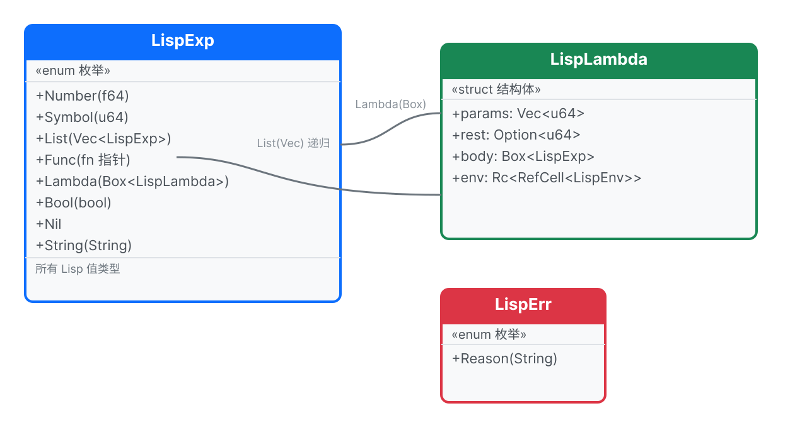

> 📊 **类型全景图**：`LispExp` 的 8 个变体——自求值类型（Number/Bool/String/Nil）+ 符号（Symbol）+ 列表（List）+ 可调用类型（Func/Lambda）。`Lambda` 内部的 `env` 字段让它成为闭包。

> 📖 **下一章：[让程序做选择](#让程序做选择)**


> ✅ **本章总结**: 完整类型系统包含布尔逻辑和数字比较，6种比较运算符全部可用。


## 让程序做选择
> ⏩ **跳过信号：** 了解 `if`/`define`/`lambda` 语义？快速浏览实现——注意 `lambda` 作为特殊形式的处理（步骤 34）。

> ⚠️ **慢速通过区** — 步骤 33 会把 `eval` 的签名从 `&LispEnv` 改成 `&mut LispEnv`，
> 引发约 6 处编译错误。这是正常的——编译器在帮你找出所有需要同步更新的调用处。
> 别慌，逐个修复即可。


---

<blockquote class='pipeline-position'>
<details>
<summary><strong>📍 管线位置</strong> — 查看我们在整个项目中的进度</summary>

```
  [源码] → [词法分析] → [语法分析] → [◉ 求值器 (特殊形式)] → [输出]
                                              ↕
                                          [LispEnv]
```

| | |
|---|---|
| ✅ 已完成 | 完整类型体系, 函数可调用 |
| 🎯 实现 `if`（条件判断）、`define`（变量绑定）、`lambda`（函数创建）——三个核心特殊形式

</details>
</blockquote>

---
### 当前进度：我们已经有了什么？

在进入新内容之前，先看清楚 **`src/lib.rs` 中 `eval` 函数现在的完整样子**（步骤 31 结束时的状态）：

```rust
// src/lib.rs — eval 函数（当前版本，还没有特殊形式）

pub fn eval(exp: &LispExp, env: &LispEnv) -> Result<LispExp, LispErr> {
    match exp {
        // === 自求值类型：直接返回自身 ===
        LispExp::Number(n) => Ok(LispExp::Number(*n)),
        LispExp::Bool(_) | LispExp::Nil | LispExp::Func(_) | LispExp::String(_) => {
            Ok(exp.clone())
        }

        // === 符号：去环境里查 ===
        LispExp::Symbol(s) => env.get(s),

        // === 列表：函数调用 ===
        LispExp::List(elements) => {
            if elements.is_empty() {
                return Ok(LispExp::List(vec![]));
            }

            // ① 求值第一个元素 → 得到函数
            let func = eval(&elements[0], env)?;

            // ② 求值后面的元素 → 得到参数
            let args: Result<Vec<LispExp>, _> = elements[1..]
                .iter()
                .map(|a| eval(a, env))
                .collect();

            // ③ 调用函数
            match func {
                LispExp::Func(f) => f(&args?),
                _ => Err(LispErr::Reason("不是函数".to_string())),
            }
        }

        // === 兜底 ===
        _ => Err(LispErr::Reason("暂不支持此类型".to_string())),
    }
}
```

> **📌 看懂这个结构很重要**：后面所有修改都在这个函数的基础上进行。`List` 分支目前**无条件**把第一个元素当函数，把后面的当参数——这就是普通函数调用的逻辑。
>
> 但 `if`、`define`、`lambda` **不是普通函数**，它们有特殊的求值规则。我们要在 `List` 分支里、**在普通函数调用之前**，先检查是不是这些"特殊形式"。

---

### 步骤 32: if — 条件判断

**文件：`src/lib.rs`**，修改 `eval` 函数的 `LispExp::List(elements)` 分支。

> ⚠️ **Rust 版本要求**：本步骤使用 `if let ... &&` 语法（let-chains），需要 **Rust 1.88+** 和 `edition = "2024"`（在 `Cargo.toml` 中设置）。如果你使用更旧的 Rust，请改写为嵌套 `if let` + `if` 的形式。

**问题**：`(if (= x 0) 1 2)` —— 如果 `(= x 0)` 为真就返回 `1`，否则返回 `2`。
为什么 `if` 不能是普通函数？因为普通函数会**先把所有参数都算出来**再调用。而 `if` 只能算条件，两个分支中**只有一个**会被执行。

**插入位置**：在 `List` 分支中，空列表检查之后、`let func = eval(&elements[0], env)?;` 这行**之前**，插入以下代码：

```rust
// src/lib.rs — 在 eval 的 List 分支中，
// 第 ① 步（求值第一个元素得到函数）之前插入：

LispExp::List(elements) => {
    if elements.is_empty() {
        return Ok(LispExp::List(vec![]));
    }

    // ========== 新增：特殊形式检查 ==========
    // 先看第一个元素是不是符号，是的话检查是不是特殊形式
    // 用 && 合并条件，避免嵌套 if（Clippy 会警告 collapsible_if）
    if let LispExp::Symbol(s) = &elements[0]
        && s == "if"
    {
        // (if 条件 真分支 假分支)
        let cond = eval(&elements[1], env)?;
        // 只有 #f 和 nil 是"假"，其他都是"真"
        let is_true = !matches!(cond, LispExp::Bool(false) | LispExp::Nil);
        return if is_true {
            eval(&elements[2], env)  // 条件为真 → 走这个
        } else {
            eval(&elements[3], env)  // 条件为假 → 走这个
        };
    }
    // ========== 特殊形式检查结束 ==========

    // 将来添加更多特殊形式时（如 define、lambda），需要改成多个分支：
    // if let LispExp::Symbol(s) = &elements[0] {
    //     if s == "if" { ... }
    //     else if s == "define" { ... }   ← 用 else if 避免 collapsible_if
    //     else if s == "lambda" { ... }
    // }

    // ① 求值第一个元素 → 得到函数（已有代码，不要动）
    let func = eval(&elements[0], env)?;
    // ... 后面保持不变 ...
```

🧠 **大白话**：`if` 和普通函数不一样——它不能先算两个分支。就像妈妈说"如果下雨就不去公园"——只执行选中的那个，另一个根本不动。

**测试**——加到 `src/lib.rs` 的 `mod tests` 中：

```rust
// src/lib.rs — mod tests 中新增测试
#[test]
fn test_if_true_branch() {
    let env = default_env();
    assert_eq!(eval_str("(if #t 1 2)", &env).unwrap(), LispExp::Number(1.0));
}

#[test]
fn test_if_false_branch() {
    let env = default_env();
    assert_eq!(eval_str("(if #f 1 2)", &env).unwrap(), LispExp::Number(2.0));
}

#[test]
fn test_if_with_comparison() {
    let env = default_env();
    // (= 1 1) → #t → 走真分支
    assert_eq!(eval_str("(if (= 1 1) 10 20)", &env).unwrap(), LispExp::Number(10.0));
}
```

```bash
$ cargo test
running 16 tests
test tests::test_if_true_branch ... ok
test tests::test_if_false_branch ... ok
...

test result: ok. 16 passed; 0 failed
```

---

### 步骤 33: define — 变量定义

**文件：`src/lib.rs`**

**问题**：define 需要**修改环境**（往里面写东西）。但当前的 `eval` 参数是 `&LispEnv`（只读借用），不能修改。

**第一步：改 `eval` 签名**。把 `&LispEnv` 改成 `&mut LispEnv`：

```rust
// src/lib.rs — eval 函数签名
// 旧版（删掉）:
pub fn eval(exp: &LispExp, env: &LispEnv) -> Result<LispExp, LispErr>
//                           ^^^^                         ^
//                           只读                        只读

// 新版（改成这样）:
pub fn eval(exp: &LispExp, env: &mut LispEnv) -> Result<LispExp, LispErr>
//                           ^^^^                         ^^^^
//                           可读可写                     可读可写
```

**第二步：在 `List` 分支的特殊形式检查区，加入 `define`**。插入位置：紧接在 `if` 检查的 `}` 后面、`// ========== 特殊形式检查结束 ==========` 之前：

```rust
// src/lib.rs — eval 的 List 分支中，紧接着 if 检查的 } 之后：

if s == "if" {
    // ... if 逻辑（已有，不要动）...
}

// ========== 新增：define 特殊形式 ==========
if s == "define" {
    // (define 变量名 值)
    if let LispExp::Symbol(name) = &elements[1] {
        let value = eval(&elements[2], env)?;   // 求值
        env.set(name.clone(), value);           // &mut env → 可以写入！
        return Ok(LispExp::Nil);                // define 本身返回 nil
    } else {
        return Err(LispErr::Reason(
            "define 的第一个参数必须是符号".to_string()
        ));
    }
}
// ========== define 结束 ==========
```

🧠 **大白话**：`define` 就像在通讯录里写："名字 = 张三，电话 = 138xxxx"。`set` 方法把变量名和值存进环境。

**第三步：验证——跑 `cargo test` 看报错**

> 🧠 **为什么改了 `&` 为 `&mut` 会有 6 个报错？**
>
> 想象你开了一家奶茶店，菜单上写着"只读菜单"。
> 所有分店（调用 `eval` 的地方）都按"只读菜单"设计的——
> 顾客看完菜单就走了，不修改菜单。
>
> 现在你想让顾客**能在菜单上写字**（`define` 需要修改环境），
> 你把菜单改成了"可写菜单"（`&mut LispEnv`）。
>
> 但分店还按旧规矩办事——他们拿着"只读菜单"的流程，
> 突然发现菜单变了，不兼容了！
>
> 所以需要把每个分店（每个调用 `eval` 的函数）
> 也改成"可写菜单"模式（`&mut env`）。
>
> 这就是编译器在帮你——它发现了 6 个分店还没改，逐个修复即可。

签名改了但调用处没更新，编译器会报两种错误：

```text
$ cargo test

error[E0308]: mismatched types         ← 类型不匹配
  --> src/lib.rs:NN:NN                 ← eval_str 里调用了 eval(exp, env)
   |                                   ← 但 eval 现在是 &mut LispEnv 了
NN |     eval(&exp, env)
   |                ^^^ expected `&mut LispEnv`, found `&LispEnv`

error[E0596]: cannot borrow `env` as mutable   ← 没法借用为可变
  --> src/lib.rs:NN:NN                          ← 测试函数里
   |
NN |     assert_eq!(eval_str("42", &env).unwrap(), ...);
   |                                ^^^^ cannot borrow as mutable
   |                                help: `&mut env`
   |
   = note: `let env = LispEnv::new()` → 需要加 `mut`

error: aborting due to 6 previous errors    ← 一共约 6 处，但只 2 种
```

**第四步：分类修复**

**类型 ①：`eval_str` 签名（1 处）**
把 `fn eval_str(source: &str, env: &LispEnv)` 改成 `fn eval_str(source: &str, env: &mut LispEnv)`：

```rust
// 旧:
fn eval_str(source: &str, env: &LispEnv) -> Result<LispExp, LispErr>
// 新:
fn eval_str(source: &str, env: &mut LispEnv) -> Result<LispExp, LispErr>
```

**类型 ②：测试函数（5–6 处）**
每个测试里 `let env = LispEnv::new()`（或 `let env = default_env()`）都要加 `mut`，所有 `&env` 改成 `&mut env`：

```rust
// 以 test_eval_number 为例——旧:
let env = LispEnv::new();
let result = eval(&exp, &env).unwrap();

// 新:
let mut env = LispEnv::new();    // ← 这里加 mut
let result = eval(&exp, &mut env).unwrap();  // ← 这里 & → &mut
```

> 其他测试函数做同样的修改。编译器每报一处就改一处。

**改完后再跑：**

```bash
$ cargo test
running 16 tests
test env::tests::test_env_set_get ... ok
test env::tests::test_env_undefined ... ok
test lexer::tests::test_tokenize_simple ... ok
test lexer::tests::test_tokenize_whitespace ... ok
test lexer::tests::test_tokenize_parens ... ok
test parser::tests::test_parse_symbol ... ok
test parser::tests::test_unclosed_list_error ... ok
test parser::tests::test_unexpected_close_error ... ok
test tests::test_create_number ... ok
test tests::test_eval_number ... ok
test tests::test_eval_str_number ... ok
test tests::test_eval_symbol ... ok
test tests::test_eval_addition ... ok
test tests::test_if_true_branch ... ok
test tests::test_if_false_branch ... ok
test tests::test_if_with_comparison ... ok

test result: ok. 16 passed; 0 failed
```

**测试 define**：

```rust
// src/lib.rs — mod tests 中新增
#[test]
fn test_define_and_lookup() {
    let mut env = default_env();
    eval_str("(define x 10)", &mut env).unwrap();
    assert_eq!(eval_str("x", &mut env).unwrap(), LispExp::Number(10.0));
}

#[test]
fn test_define_then_use_in_calc() {
    let mut env = default_env();
    eval_str("(define x 10)", &mut env).unwrap();
    assert_eq!(eval_str("(+ x 5)", &mut env).unwrap(), LispExp::Number(15.0));
}
```

```bash
$ cargo test
running 18 tests
test tests::test_define_and_lookup ... ok
...
test result: ok. 18 passed; 0 failed
```

---

### 步骤 34: lambda — 创建匿名函数

**文件：`src/lib.rs`**

**问题**：怎么让用户自己定义函数？Lisp 用 `lambda`——把参数列表和函数体打包成一个"函数值"。

**第一步：在 `LispExp` 枚举上面，加 `LispLambda` 结构体**：

```rust
// src/lib.rs — 在 LispExp 定义之前，LispErr 下面加：

/// Lambda 表达式（用户自定义函数）
#[derive(Clone, Debug, PartialEq)]
pub struct LispLambda {
    pub params: Vec<String>,   // 参数名列表，如 ["x", "y"]
    pub body: Box<LispExp>,    // 函数体，用 Box 避免无限嵌套
}
```

🧠 **大白话 — `Box` 为什么需要？**

```
LispExp 里面可能有 LispLambda
  → LispLambda 里面又有 LispExp (body)
    → 那个 LispExp 又可能有 LispLambda
      → ... 无限循环！
```

编译器问："LispExp 到底多大？"——无法回答，因为可以无限嵌套。
`Box` 说："把里面的东西放堆上，这里只存指针（8字节）。" 问题解决！

```
不用 Box:                   用 Box:
LispExp (??? 字节)        LispExp (32 字节)
  └─ Lambda                  └─ Lambda
       └─ body: LispExp           └─ body: Box ──→ 堆上的 LispExp (8字节指针)
            └─ Lambda                  └─ Lambda
                 └─ ... (无限)               └─ body: Box ──→ ...
```

**第二步：在 `LispExp` 枚举中加 `Lambda` 变体**：

```rust
// src/lib.rs — LispExp 枚举中新增（加在 Func 和 Bool 之间即可）

pub enum LispExp {
    Number(f64),
    Symbol(String),
    List(Vec<LispExp>),
    Func(fn(&[LispExp]) -> Result<LispExp, LispErr>),
    Lambda(Box<LispLambda>),  // ← 新增！用户自定义函数
    Bool(bool),
    Nil,
    String(String),
}
```

**第三步：在 `eval` 的 `match exp` 自求值分支中加入 `Lambda`**：

```rust
// src/lib.rs — eval 函数，match exp 的自求值分支
// 旧版:
LispExp::Bool(_) | LispExp::Nil | LispExp::Func(_) | LispExp::String(_) => {
    Ok(exp.clone())
}
// 新版（Lambda 也是自求值——函数本身就是值，不需要"计算"）:
LispExp::Bool(_) | LispExp::Nil | LispExp::Func(_)
    | LispExp::String(_) | LispExp::Lambda(_) => {
    Ok(exp.clone())
}
```

**第四步：在 `List` 分支的特殊形式检查区，加入 `lambda` 创建逻辑**。紧接着 `define` 检查的 `}` 之后：

```rust
// src/lib.rs — eval 的 List 分支中，define 检查之后，特殊形式检查结束之前：

if s == "define" {
    // ... define 逻辑（已有，不要动）...
}

// ========== 新增：lambda 特殊形式 ==========
if s == "lambda" {
    // (lambda (参数列表) 函数体)
    let params: Vec<String> = match &elements[1] {
        LispExp::List(param_list) => param_list
            .iter()
            .map(|p| {
                if let LispExp::Symbol(name) = p {
                    name.clone()
                } else {
                    "?".to_string() // 参数必须是符号
                }
            })
            .collect(),
        _ => return Err(LispErr::Reason(
            "lambda 的参数必须是列表".to_string()
        )),
    };

    let body = elements[2].clone();  // 函数体

    let lambda = LispExp::Lambda(Box::new(LispLambda {
        params,
        body: Box::new(body),
    }));

    return Ok(lambda);  // lambda 创建完毕，返回这个"函数值"
}
// ========== lambda 结束 ==========
```

🧠 **大白话**：`lambda` 不执行函数体——它只是把参数名和函数体"打包"成一个值，返回给调用者。就像一个菜谱——你拿到菜谱不代表菜已经做好了，你得"调用"这个菜谱才行。

```bash
$ cargo test
running 19 tests
test tests::test_lambda_call ... ok
...
test result: ok. 19 passed; 0 failed
```

---

### 步骤 35: lambda — 调用

**文件：`src/lib.rs`**，修改 `eval` 的 `List` 分支中**普通函数调用**部分的 `match func`。

现在 `match func` 只处理 `LispExp::Func(f)`。我们要加一条 `LispExp::Lambda(lambda)` 的处理：

```rust
// src/lib.rs — eval 的 List 分支末尾，普通函数调用部分
// 旧版:
match func {
    LispExp::Func(f) => f(&args?),
    _ => Err(LispErr::Reason("不是函数".to_string())),
}

// 新版:
match func {
    // === 内置函数（已有）===
    LispExp::Func(f) => f(&args?),

    // === 新增：用户自定义函数 ===
    LispExp::Lambda(lambda) => {
        // 创建新环境来存参数绑定
        let mut new_env = env.clone();
        // 把参数名和实参值一一绑定
        for (param, arg) in lambda.params.iter().zip(args?.iter()) {
            new_env.set(param.clone(), arg.clone());
        }
        // 在新环境中求值函数体
        eval(&lambda.body, &mut new_env)
    }

    _ => Err(LispErr::Reason("不是函数".to_string())),
}
```

🧠 **大白话 — `zip`**：把两个队伍"拉链"一样合起来。

```
params: ["x", "y"]
args:   [ 1 ,  2 ]
zip:    [("x",1), ("y",2)]
```

🧠 **大白话 — lambda 调用过程**：就像在舞台上彩排话剧——

1. 创建一个新环境（新舞台）
2. 把参数和值绑定进去（给演员分配角色："张三演哈姆雷特"）
3. 在新环境中执行函数体（开始表演）

**测试**——完整流程：define + lambda + 调用：

```rust
// src/lib.rs — mod tests 中新增
#[test]
fn test_lambda_call() {
    let mut env = default_env();
    // 定义一个加法函数
    eval_str("(define add (lambda (a b) (+ a b)))", &mut env).unwrap();
    // 调用它
    assert_eq!(eval_str("(add 3 4)", &mut env).unwrap(), LispExp::Number(7.0));
}

#[test]
fn test_lambda_direct_call() {
    let mut env = default_env();
    // 不定义，直接调用：((lambda (x) (* x x)) 5) → 25
    assert_eq!(
        eval_str("((lambda (x) (* x x)) 5)", &mut env).unwrap(),
        LispExp::Number(25.0)
    );
}
```

```bash
$ cargo test
running 20 tests
test tests::test_lambda_call ... ok
test tests::test_lambda_direct_call ... ok
...
test result: ok. 20 passed; 0 failed
```

---

#### 🧩 逐层拆解：`(add 3 4)` 到底怎么算出 7 的？

把这个过程想象成**拆套娃**——从最外层娃娃开始，一层一层打开。

```
🎎 套娃结构（由外到内）:

  第 0 层 (最外层):   (add 3 4)          ← 整行代码
  第 1 层:              add             ← 函数名（在环境里找）
  第 2 层:              (+ a b)         ← 函数体（在新环境里求值）
  第 3 层 (最内层):       +   a   b      ← 每个符号分别求值
```

---

**📦 准备阶段：全局环境里有什么？**

执行 `(define add (lambda (a b) (+ a b)))` 之后，全局环境变成：

```
┌───────────────────────────────────┐
│ 全局环境                           │
│                                   │
│  add → Lambda {                   │
│           params = [a, b],        │
│           body   = (+ a b),       │
│           env    = 全局            │
│         }                         │
│  +   → Func(加法)                  │
│  -   → Func(减法)                  │
│  ... 其他内置函数 ...              │
└───────────────────────────────────┘
```

---

**第 0 层：`eval` 收到 `(add 3 4)`**

```
eval 的输入:
  当前表达式 = List([Symbol("add"), Number(3), Number(4)])
  当前环境   = 全局环境（上面的那个）

eval 开始判断 当前表达式 是什么类型:

  □ Number?  → 不是
  □ Bool?    → 不是
  □ Symbol?  → 不是
  ■ List!    → ✅ 进入列表处理

  列表非空 → 取第一个元素 first = Symbol("add")
  取剩余参数 args = [Number(3), Number(4)]

  判断 first 是不是特殊形式:
    □ "if"?     → 不是
    □ "define"? → 不是
    □ "lambda"? → 不是
    ■ 普通函数调用! → 进入函数调用流程
```

```
函数调用流程: 先求值"被调用的函数", 再求值"每个参数"

  ① 求值函数位置: eval(Symbol("add"), 全局)
  ② 求值参数 1:   eval(Number(3), 全局)
  ③ 求值参数 2:   eval(Number(4), 全局)
```

---

**第 1 层 — 子套娃 ①：求值函数位置**

```
eval 的输入:
  当前表达式 = Symbol("add")
  当前环境   = 全局

eval 判断:
  ■ Symbol! → 在环境中查找

  查 全局环境:
    ├─ "add" → ✅ 找到了! Lambda { params=[a,b], body=(+ a b), env=全局 }
    └─ 返回这个 Lambda

  函数位置求值结果: Lambda(add 函数)
```

---

**第 1 层 — 子套娃 ②③：求值参数**

```
eval 的输入:
  当前表达式 = Number(3)          当前表达式 = Number(4)
  当前环境   = 全局               当前环境   = 全局

eval 判断:                       eval 判断:
  ■ Number! → 自求值, 直接返回     ■ Number! → 自求值, 直接返回

  返回 Number(3)                  返回 Number(4)

  现在三个套娃都拆开了:
    func = Lambda(add 函数)
    args = [Number(3), Number(4)]
```

---

```
现在 match func:

  匹配到 Lambda(lambda)! 执行 lambda 调用逻辑:
```

---

**第 2 层：创建新环境 + 绑定参数 + 求值函数体**

```
注意：此时新环境通过 `env.clone()` 克隆调用时的环境来创建。`LispLambda` 的 `env` 字段要到步骤 37 才添加——目前参数绑定直接存在克隆出的环境里。

① 创建新环境
  let mut new_env = 全局.clone()

  clone 后的 new_env:
  ┌────────────────────────────────────┐
  │ new_env (当前)                      │
  │  add → Lambda{...}                 │
  │  +   → Func(加法)                  │
  │  -   → Func(减法)                  │
  │  ...                               │
  │ outer = None  (clone 不复制 outer)  │
  └────────────────────────────────────┘

② 把参数名和实参值"配对绑定"
  zip(["a", "b"], [Number(3), Number(4)]):
    第 1 对: param="a", arg=Number(3) → new_env.set("a", 3)
    第 2 对: param="b", arg=Number(4) → new_env.set("b", 4)

  new_env 现在是:
  ┌───────────────────────────────────┐
  │ new_env (当前)                    │
  │  a → Number(3)    ← 新绑定!        │
  │  b → Number(4)    ← 新绑定!        │
  │  add → Lambda{...}                │
  │  +   → Func(加法)                  │
  │  ...                              │
  └───────────────────────────────────┘

③ 在新环境中求值函数体
  eval((+ a b), new_env)

  ┌─ 注意 ────────────────────────────────────────┐
  │ 这又触发了一个新的 eval 调用 —— 第三层套娃!     │
  └─────────────────────────────────────────────┘
```

---

**第 3 层（最内层套娃）：`eval` 求值 `(+ a b)`**

```
eval 的输入:
  当前表达式 = List([Symbol("+"), Symbol("a"), Symbol("b")])
  当前环境   = new_env { a→3, b→4, +→Func, ... }

eval 判断:
  ■ List! → 取第一个元素 first = Symbol("+")
  first 不是特殊形式 → 普通函数调用

  ① 求值函数位置: eval(Symbol("+"), new_env)
     查 new_env → "+" → ✅ Func(加法)

  ② 求值参数 1: eval(Symbol("a"), new_env)
     查 new_env → "a" → ✅ Number(3)  ← 第 2 层绑定的!

  ③ 求值参数 2: eval(Symbol("b"), new_env)
     查 new_env → "b" → ✅ Number(4)  ← 第 2 层绑定的!

现在:
  func = Func(加法)           ← Rust 函数指针
  args = [Number(3), Number(4)]

match func → 匹配到 Func(f)!
  → 调用 f(&[Number(3), Number(4)])
  → Rust 的 (+) 函数: 3.0 + 4.0

最终答案: Number(7.0) ✅
```

---

**🎯 关键总结：从外到内一共拆了 4 层**

```
层 0 → eval(List((add 3 4)))     ← 识别为函数调用
  │
  ├─ 层 1 → eval(Symbol("add"))  ← 在环境中找 Lambda
  ├─ 层 1 → eval(Number(3))     ← 自求值
  ├─ 层 1 → eval(Number(4))     ← 自求值
  │
  ├─ 层 2 → 创建 new_env, 绑定 a=3, b=4
  │
  └─ 层 3 → eval(List((+ a b)))  ← 在新环境中求值函数体
       │
       ├─ 层 4 → eval(Symbol("+"))  ← 在 new_env 中找 Func
       ├─ 层 4 → eval(Symbol("a"))  ← 在 new_env 中找 3
       └─ 层 4 → eval(Symbol("b"))  ← 在 new_env 中找 4
            │
            └─ Func(加法) 对 [3,4] → 7.0 🏁
```

**现在你可能想问**：这里 `new_env = 全局.clone()`，那闭包里的 `with_outer` 又是什么不一样的地方？——好问题，我们下一步就讲。

> 🎉 **里程碑：现在可以定义变量、写条件判断、创建自己的函数了！**
>
> ```lisp
> (define square (lambda (x) (* x x)))
> (define abs (lambda (n) (if (< n 0) (- 0 n) n)))
> (square 5)   ; → 25
> (abs -10)    ; → 10
> ```

---

📋 **步骤 35 结束时的项目状态**

```
lisp-rs/
├── src/
│   ├── lib.rs      (~220 行) — LispExp, LispErr, eval, default_env, 测试
│   ├── lexer.rs    (~20 行)  — tokenize()
│   ├── parser.rs   (~60 行)  — parse() + read_seq()
│   └── env.rs      (~40 行)  — LispEnv { data }
```

**已支持的特殊形式**：✅ `if` ✅ `define` ✅ `lambda`（创建 + 调用）

**已注册的内置函数**：`+` `-` `*` `/` `=` `>` `<` `>=` `<=`

**测试运行结果**：

```text
$ cargo test
running 20 tests
... all ok
test result: ok. 20 passed; 0 failed
```

---

> 🏋️ **练习**
> 1. (⭐) 用 `define` 和 `lambda` 写一个 `(abs x)` 函数，返回 x 的绝对值
> 2. (⭐⭐) 定义一个递归函数 `(sum-to n)`，返回 1+2+...+n 的和。提示：参考 factorial 的写法
> 3. (⭐⭐⭐) 用 lambda 写一个 `compose` 函数：`(compose f g)` 返回一个新函数 h，使得 `(h x)` = `(f (g x))`


<details>
<summary>点击查看答案</summary>

**1. abs 函数**
```lisp
(define abs (lambda (n) (if (< n 0) (- 0 n) n)))
```

**2. sum-to 递归**
```lisp
(define sum-to (lambda (n)
    (if (= n 0) 0 (+ n (sum-to (- n 1))))))
```

**3. compose 函数**
```lisp
(define compose (lambda (f g) (lambda (x) (f (g x)))))
; 测试: ((compose (lambda (x) (* x 2)) (lambda (x) (+ x 1))) 3) → 8
```
</details>


> 🧠 **停下来思考**
>
> ```lisp
> ((lambda (x) x) (lambda (x) x))
> ```
>
> 这个表达式会返回什么？它会崩溃吗？先想清楚每一步：外层 lambda 的参数 `x` 是什么？
> 内层 lambda 会被 eval 成什么？如果答案是"一个函数"——在 Rust 中你能打印它吗？
> 我们是怎么实现 `Display` 的？

> 🎯 **解决的问题**: 闭包（函数记住诞生时的环境）+ TCO（尾递归不爆栈）。没有闭包就没有真正的高阶函数，没有 TCO 就不能写无限递归。

> 📖 **下一章：[记住过去的事情](#记住过去的事情)**


> ✅ **本章总结**: `if` 控制求值流程，`define` 创建顶层绑定，`lambda` 创建可调用函数。


---

### 🧠 设计范式：愿望思维

SICP 的核心思想之一是**愿望思维（wishful thinking）**：先写下你认为应该存在的函数调用，再去实现它。
这种自顶向下的方法贯穿我们的解释器：

```scheme
;; 第 34 步：我们在实现 lambda 之前先写了这个测试
;; 我们先"期望"有一个可用的 lambda，再去构建它
(let ((double (lambda (x) (* x 2))))
  (double 5))
;; → 10
```

这不仅仅是测试技巧——它是一套设计哲学。
解析器用了它（`parse` 在 `read_seq` 实现之前就调用它），
求值器用了它（`eval` 在 builtins 实现之前就调用 `lookup_builtin`），
你也在学习时用了它（先写测试后实现）。

> 当你在实现 `lambda` 之前写下 `(lambda (x) (* x 2))` 时，
> 你正在实践同一种让 Scheme 如此适合原型设计的思维纪律。


## 记住过去的事情
> 为什么要学：闭包是 Lisp 对编程界的贡献。闭包是一个能记住创建时作用域中变量的函数——实现了回调、事件处理器和函数式抽象。我们的实现使用 `Rc<RefCell<>>` 共享所有权，这与许多 Rust 程序管理复杂数据的方式相同。

> 🚫 **核心章节——建议逐行读完。** 闭包（步骤 37）和尾调用优化（步骤 39）是这里讲得最细的部分。逐行读完。

> ⚠️ **慢速通过区 — 全教程最难的 4 步。**
> 步骤 36 引入 `Rc<RefCell<LispEnv>>`（三层嵌套智能指针），步骤 37 实现闭包捕获环境，
> 步骤 39 用蹦床循环实现 TCO。如果你感到困难，这是正常的——大多数学习者在这里会花 2-3 倍的时间。
> 建议：先理解"背包🎒"比喻（步骤 37 开头），再看代码。如果卡住了，跳到步骤 40 看性能优化，
> 回头再看闭包也完全可以——闭包不影响后续功能的理解。


---

<blockquote class='pipeline-position'>
<details>
<summary><strong>📍 管线位置</strong> — 查看我们在整个项目中的进度</summary>

```
  [源码] → [词法分析] → [语法分析] → [◉ 求值器 (闭包 + TCO)] → [输出]
                                              ↕
                                     [LispEnv (outer 链)]
                                     [Rc<RefCell<>>]
```

| | |
|---|---|
| ✅ 已完成 | 调用函数, if 分支 |
| 🎯 实现词法作用域闭包（Rc<RefCell>）和尾调用优化（蹦床循环）

</details>
</blockquote>

---
### 当前进度：步骤 35 结束时，eval 函数的样子

在开始改造之前，先看清楚 **`src/lib.rs` 中 `eval` 的 `List` 分支**（只展示 `List` 部分，其他分支不变）：

```rust
// src/lib.rs — eval 函数 List 分支（步骤 35 结束时）

LispExp::List(elements) => {
    if elements.is_empty() {
        return Ok(LispExp::List(vec![]));
    }

    // === 特殊形式检查 ===
    if let LispExp::Symbol(s) = &elements[0] {
        if s == "if" { /* ... if 逻辑 ... */ }
        if s == "define" { /* ... define 逻辑 ... */ }
        if s == "lambda" { /* ... lambda 创建 ... */ }
    }

    // === 普通函数调用 ===
    let func = eval(&elements[0], env)?;
    let args: Result<Vec<LispExp>, _> = elements[1..]
        .iter().map(|a| eval(a, env)).collect();

    match func {
        LispExp::Func(f) => f(&args?),
        LispExp::Lambda(lambda) => {
            let mut new_env = env.clone();
            for (param, arg) in lambda.params.iter().zip(args?.iter()) {
                new_env.set(param.clone(), arg.clone());
            }
            eval(&lambda.body, &mut new_env)
        }
        _ => Err(LispErr::Reason("不是函数".to_string())),
    }
}
```

> **📌 现在有两个问题**：
>
> 1. **闭包**：lambda 调用时用 `env.clone()` 创建新环境——但 clone 的是**调用时的环境**，不是**定义时的环境**。所以 `(lambda (x) (+ x n))` 里的 `n` 找不到。
> 2. **栈溢出**：每次调用 `eval` 都递归——`(loop 10000)` 会导致 Rust 调用栈爆掉。

---

### 步骤 35.5: 理解 Rc 和 RefCell —— 让函数背着背包旅行

> 🧠 **为什么要先学这个？** 下一步（步骤 36）我们要给环境加 `outer` 字段，实现闭包。
> 这需要两个新的 Rust 概念：`Rc` 和 `RefCell`。先单独理解它们，后面就不会被三件事同时卡住。

#### ① Rc —— 多人共享一本书

`Rc` = Reference Counted（引用计数）。它让**多个所有者共享同一份数据**。

```rust
use std::rc::Rc;

// 创建一本书
let book = Rc::new("Rust 程序设计语言".to_string());
// Rc 引用计数 = 1

// 读者 1 借了一本（不是复制！只是加了名字）
let reader1 = Rc::clone(&book);
// Rc 引用计数 = 2

// 读者 2 也借了
let reader2 = Rc::clone(&book);
// Rc 引用计数 = 3

// 三个人看到的是同一本书
println!("{}", reader1);  // "Rust 程序设计语言"
println!("{}", reader2);  // "Rust 程序设计语言"

// 最后一个读者离开时，书才被回收
```

> 🧠 **大白话 — `Rc`**：合租房——多个租客共享一套房子。`Rc::clone()` 不是复制房子，只是多加一个租客名字。最后一个搬走时才退租。

#### ② RefCell —— 共享的书也允许写字

`Rc` 有个限制：只能读，不能写。如果你想在共享的书上做笔记，需要 `RefCell`。

```rust
use std::cell::RefCell;

// 一本可写的笔记本
let notebook = RefCell::new(String::from("笔记："));

// 写字
notebook.borrow_mut().push_str("第一步");
println!("{}", notebook.borrow());  // "笔记：第一步"
```

> 🧠 **大白话 — `RefCell`**：共享的书也允许在上面写字。`borrow_mut()` = 拿笔写字，`borrow()` = 只看不动笔。

#### ③ 合体：Rc<RefCell<T>> —— 多人共享 + 可修改

这就是闭包需要的：多个 lambda 共享同一个环境，且能修改它。

```rust
use std::rc::Rc;
use std::cell::RefCell;

let shared_env = Rc::new(RefCell::new(String::from("x=1")));

// 两个 lambda 共享同一个环境
let lambda1 = Rc::clone(&shared_env);  // 引用计数 = 2
let lambda2 = Rc::clone(&shared_env);  // 引用计数 = 3

// lambda1 修改了环境
lambda1.borrow_mut().push_str(", y=2");

// lambda2 能看到修改！因为是同一份
println!("{}", lambda2.borrow());  // "x=1, y=2"  ✅
```

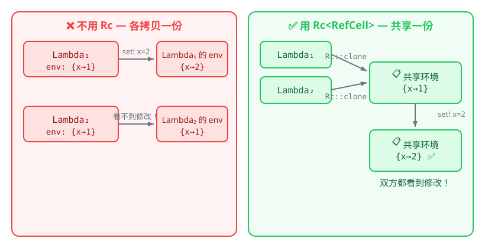

> 🧠 **大白话 — `Rc<RefCell<T>>`**：合租房 + 可写字的白板。多人共享（Rc），而且谁都能在白板上写字（RefCell）。一个人写了，其他人立刻能看到。这就是闭包的"背包🎒"——多个 lambda 背着同一个背包，一个人改了背包里的东西，其他人也知道。

> ⚠️ **注意**：`RefCell` 的检查在运行时（不是编译时）。如果你同时 `borrow_mut()` 两次，程序会 panic。但我们的解释器是单线程的，不会出现这种情况。

> 📝 **下一步预告**：步骤 36 会给 `LispEnv` 加 `outer: Option<Rc<RefCell<LispEnv>>>` 字段。现在你理解了 `Rc` 和 `RefCell`，到时候就不会被三层嵌套吓到。

---

### 步骤 36: 环境添加 outer 字段 — 支持嵌套作用域

**文件：`src/env.rs`**

**问题**：当前环境是扁平的——只有一个 HashMap。要实现词法作用域（内层能看到外层的变量），需要"环境链"。

**第一步：改造 `LispEnv` 结构体**。在原来的 `data` 字段之外加 `outer`：

```rust
// src/env.rs — 替换原来的 LispEnv 定义

use std::rc::Rc;
use std::cell::RefCell;

// 旧版（删掉）:
// pub struct LispEnv {
//     pub data: HashMap<String, LispExp>,
// }

// 新版:
pub struct LispEnv {
    pub data: HashMap<String, LispExp>,       // 当前帧的变量（已有）
    pub outer: Option<Rc<RefCell<LispEnv>>>,  // ← 新增！指向外层环境
}
```

🧠 **大白话 — `outer`**：每个环境可以有一个"爸爸"。查变量时先看自己，找不到就问爸爸，再找不到问爷爷……形成一条"家谱链"。

🧠 **大白话 — `Rc<RefCell<>>`**：为什么这么复杂？

- `Rc`（引用计数）：多个人共享同一个环境。比如两个闭包都捕获了同一个外层环境。
- `RefCell`（内部可变性）：即使环境被 `Rc` 共享，也能修改它（比如 `set!`）。
- 就像一本共享笔记本——多个人可以看（Rc），也能在上面写字（RefCell）。

> 🦀 **Rust 深度："共享 XOR 可变"规则。** Rust 最基本的规则是：要么有*一个*可变引用，要么有*多个*共享引用——不能两者兼有。这在编译期防止了数据竞争。但闭包打破了这个规则——多个闭包都需要对同一个捕获的环境进行可变访问（比如 `set!` 修改共享变量）。`Rc` 提供共享*所有权*，`RefCell` 把 Rust 的借用检查从编译期移到*运行时*。代价是：如果你不小心对同一个 `RefCell` 做了两次可变借用，程序会 panic 而不是编译不过。对于单线程的解释器来说，这是一个安全且实用的选择。

> 🧠 **为什么不需要垃圾回收（GC）？** — 很多 Lisp 教程用 Java/Python 实现，要手动处理循环引用。我们用 Rust：`Rc` 自动计数引用（没人用了就释放），`RefCell` 允许共享修改。没有 `Rc` 之间的循环（outer 链是单向的），所以不会泄漏。Rust 的所有权系统帮我们免费做了 GC 的活。

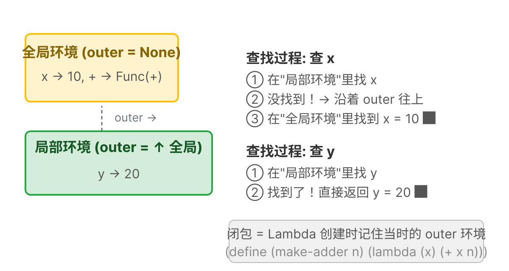

> 🔗 **环境链 = 单向链表**：每个环境帧都有一个 `outer` 指针指向外层。查找变量时沿着这条链从内向外搜索——这就是词法作用域的运行时实现。`Rc<RefCell<>>` 允许多个地方共享同一帧（比如两个闭包捕获同一个外层环境）。

**第二步：更新 `new()` 方法**——加 `outer: None`：

```rust
// src/env.rs — impl LispEnv 中，替换 new()
// 旧版:
pub fn new() -> Self {
    LispEnv { data: HashMap::new() }
}

// 新版:
pub fn new() -> Self {
    LispEnv { data: HashMap::new(), outer: None }
}
```

**第三步：新增 `with_outer()` 方法**——创建有"爸爸"的环境（函数调用时用）：

```rust
// src/env.rs — impl LispEnv 中，new() 后面新增
pub fn with_outer(outer: Rc<RefCell<LispEnv>>) -> Self {
    LispEnv { data: HashMap::new(), outer: Some(outer) }
}
```

**第四步：更新 `get()` 方法**——自己找不到时沿 outer 链向上找：

```rust
// src/env.rs — impl LispEnv 中，替换 get()
// 旧版:
pub fn get(&self, key: &str) -> Result<LispExp, LispErr> {
    self.data.get(key)
        .cloned()
        .ok_or_else(|| LispErr::Reason(format!("未定义的变量: {}", key)))
}

// 新版（加 outer 链查找）:
pub fn get(&self, key: &str) -> Result<LispExp, LispErr> {
    // 先看自己
    if let Some(v) = self.data.get(key) {
        return Ok(v.clone());
    }
    // 自己找不到，去外层找
    if let Some(outer) = &self.outer {
        return outer.borrow().get(key);  // ← 递归沿链向上
    }
    // 到顶了还找不到 → 报错
    Err(LispErr::Reason(format!("未定义的变量: {}", key)))
}
```

```text
环境链示意:

全局环境 (outer = None)
```


```
┌──────────────────────┐
│  +  → Func(加法)      │
│  x  → Number(10)     │
└──────────────────────┘
          │ outer
          ▼
调用 (lambda (y) (+ x y)) 时创建的环境 (outer = 全局)
┌─────────────────────┐
│  y  → Number(5)     │  ← get("x") 找不到 → 去 outer 找 → 找到 Number(10)!
└─────────────────────┘
```

```bash
$ cargo test
running 21 tests
test env::tests::test_nested_env_lookup ... ok
...
test result: ok. 21 passed; 0 failed
```

---

### 步骤 37: Lambda 捕获环境, 实现真正的闭包

> **已经懂闭包了？** 一句话概括：求值 `lambda` 时，创建一个 `LispLambda`，其中保存对当前 `LispEnv` 的引用。变量查找沿 `env → env.outer → ...` 链式搜索，直到找到。这就是词法作用域。本步骤余下内容是为初学者准备的详细拆解。

**文件：`src/lib.rs`**

**问题**：当前 lambda 调用时用 `env.clone()` 创建新环境——但 `env` 是**调用时**的环境。闭包需要记住**定义时**的环境。

```lisp
(define make-adder (lambda (n) (lambda (x) (+ x n))))
(define add5 (make-adder 5))
(add5 10)  ; 应该是 15，但 n 在调用 add5 时已经找不到了！
```

> 🔧 **Rust Curve: `Rc<RefCell<T>>`** — 这是 Rust 中"共享可变状态"的惯用模式。`Rc`（引用计数）让程序的多部分共享同一数据的所有权 — 就像一本书有多位读者。`RefCell` 在运行时做借用检查 — 它强制与 Rust 编译期借用检查相同的规则（一个写 XOR 多个读），只是在运行时而非编译时做。我们接受这个运行时开销，因为它极大简化了环境代码。大多数生产 Rust 代码会尽量避免 `RefCell`，但对于解释器和图状数据结构这是务实的选择。

**第一步：更新 `LispLambda` 结构体**——加 `env` 字段：

```rust
// src/lib.rs — LispLambda 结构体
// 旧版（删掉）:
pub struct LispLambda {
    pub params: Vec<String>,
    pub body: Box<LispExp>,
}

// 新版:
pub struct LispLambda {
    pub params: Vec<String>,
    pub body: Box<LispExp>,
    pub env: Rc<RefCell<LispEnv>>,  // ← 新增！记住"出生"时的环境
}
```

🧠 **大白话**：lambda 就像一个"离家出走的孩子"——它带着一份"出生证明"（env 字段），记录了自己出生时周围的所有变量。有了这份证明，不管它被带到哪里调用，都能找到"老家的东西"。

**第二步：更新 lambda 创建代码**。在 `eval` 的 `"lambda"` 特殊形式中，把当前环境存进 lambda：

```rust
// src/lib.rs — eval 的 List 分支，特殊形式检查中，lambda 创建部分

if s == "lambda" {
    // ... 解析参数（已有，不要动）...

    let body = elements[2].clone();

    // 旧版:
    // let lambda = LispExp::Lambda(Box::new(LispLambda {
    //     params,
    //     body: Box::new(body),
    // }));

    // 新版（多了 env 字段）:
    let lambda = LispExp::Lambda(Box::new(LispLambda {
        params,
        body: Box::new(body),
        env: Rc::new(RefCell::new(env.clone())),  // ← 捕获当前环境！
    }));

    return Ok(lambda);
}
```

**第三步：更新 lambda 调用代码**。新环境不以 `env.clone()` 为基础，而以 lambda 捕获的环境为 outer：

```rust
// src/lib.rs — eval 的 List 分支，普通函数调用部分，Lambda 处理

match func {
    LispExp::Func(f) => f(&args?),

    // 旧版:
    // LispExp::Lambda(lambda) => {
    //     let mut new_env = env.clone();
    //     for (param, arg) in lambda.params.iter().zip(args?.iter()) {
    //         new_env.set(param.clone(), arg.clone());
    //     }
    //     eval(&lambda.body, &mut new_env)
    // }

    // 新版（用 with_outer 代替 clone）:
    LispExp::Lambda(lambda) => {
        let mut new_env = LispEnv::with_outer(lambda.env.clone());
        //  ↑ 新环境的"爸爸"是 lambda 出生时的环境，不是调用时的环境！
        for (param, arg) in lambda.params.iter().zip(args?.iter()) {
            new_env.set(param.clone(), arg.clone());
        }
        eval(&lambda.body, &mut new_env)
    }

    _ => Err(LispErr::Reason("不是函数".to_string())),
}
```

**测试闭包**：

```rust
// src/lib.rs — mod tests 中新增
#[test]
fn test_closure() {
    let mut env = default_env();
    eval_str("(define make-adder (lambda (n) (lambda (x) (+ x n))))", &mut env).unwrap();
    eval_str("(define add5 (make-adder 5))", &mut env).unwrap();
    assert_eq!(eval_str("(add5 10)", &mut env).unwrap(), LispExp::Number(15.0));
}
```

```bash
$ cargo test
running 22 tests
test tests::test_closure ... ok
...
test result: ok. 22 passed; 0 failed
```

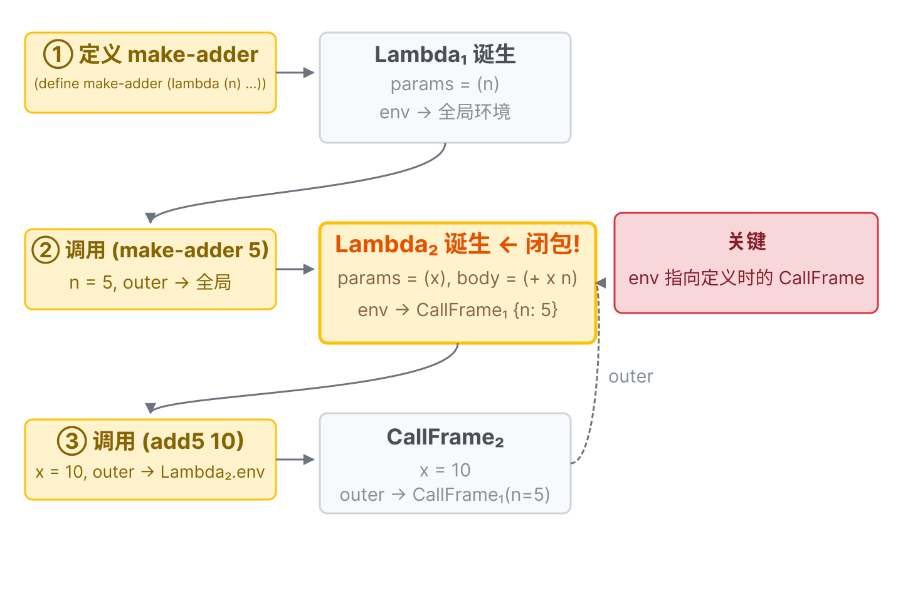

> 🎯 **闭包 = 函数体 + 诞生时的环境**。所谓"函数记住了它诞生时的环境"，技术上就是 `Lambda.env` 字段指向定义时的 `CallFrame`。调用时创建的新帧以这个捕获的帧为 `outer`——所以内层函数能"看见"外层函数的变量。

> 📐 **形式化定义**：闭包语义
>
> ```
> eval(Lambda(params, body), env) = ⟦λ(params) body | env⟧
>     // "闭包" = (参数, 函数体, 捕获的环境) 的三元组
>
> eval(List[closure, actuals...], env_call) =
>     let ⟦λ(params) body | env_capture⟧ = eval(closure, env_call)
>     let env_new = extend(env_capture, params → map(eval(_, env_call), actuals))
>     eval(body, env_new)
> ```
>
> 关键洞察：调用闭包时，我们扩展的是**捕获时的环境**（env_capture），
> 而不是**调用时的环境**（env_call）。这就是**词法作用域**的本质。
> 如果用了 env_call，那就是**动态作用域**——完全不同的语言语义。
>
> ```lisp
> (define x 1)
> (define f (lambda () x))
> (define x 2)
> (f)  ; 词法作用域 → 1  (用 f 被定义处的 x)
>      ; 动态作用域 → 2  (用 f 被调用处的 x)
> ```

---

#### 🧩 全程拆解：三行代码的每一步

现在我们用**拆套娃**的方法，一步一步拆开这三行代码。每遇到一个 `eval` 调用就拆开一层，直到不能再拆为止。

```
第 1 行: (define make-adder (lambda (n) (lambda (x) (+ x n))))
第 2 行: (define add5 (make-adder 5))
第 3 行: (add5 10)
```

---

##### 🎎 第 1 行，套娃第 0 层：`eval` 收到整行代码

```
当前表达式: List([Symbol("define"),
                  Symbol("make-adder"),
                  List([Symbol("lambda"),
                        List([Symbol("n")]),
                        List([Symbol("lambda"),
                              List([Symbol("x")]),
                              List([Symbol("+"), Symbol("x"), Symbol("n")])])])])
当前环境: 全局环境 = { +→Func, -→Func, ... } (空的，还没有用户变量)

eval 判断: List! → 取首元素 first = Symbol("define")
first 是特殊形式 "define"! → 进入 define 处理
```

---

##### 🎎 第 1 行，第 1 层套娃：`define` 要做什么？

```
define 的语法: (define 变量名 值)
  → 变量名 = Symbol("make-adder")
  → 值     = 那个复杂的 lambda 嵌套表达式

define 先"求值", 再"绑定":
  ① 求值 值表达式 → 要 eval 里面那个 lambda
  ② 绑定 make-adder → 值 到全局环境
```

---

##### 🎎 第 1 行，第 2 层套娃：求值外层 lambda

```
eval 的输入:
  当前表达式: List([Symbol("lambda"),
                    List([Symbol("n")]),                          ← 参数列表
                    List([Symbol("lambda"), ...])])               ← 函数体

  当前环境: 全局

eval 判断: List! → 取首元素 first = Symbol("lambda")
first 是特殊形式 "lambda"! → 不执行函数体，只是"打包"成一个值:

  Lambda₁ = {
    params = ["n"],                               ← 外层参数只有一个 n
    body   = List([Symbol("lambda"),              ← 函数体是里面那个 lambda!
                   List([Symbol("x")]),
                   List([Symbol("+"), Symbol("x"), Symbol("n")])]),
    env    = 全局  ← 📸 咔嚓! 在全局环境中诞生
  }

  返回 Lambda₁ ← 注意：里面的 lambda 还没有被求值，只是一个裸的 AST 列表
```

```
回到 define 的处理:
  define 收到 Lambda₁
  → 全局.set("make-adder", Lambda₁)

全局环境现在变成:
  ┌──────────────────────────────────────┐
  │ 全局环境                              │
  │                                      │
  │  make-adder → Lambda₁ {              │
  │      params = ["n"],                 │
  │      body   = (lambda (x) (+ x n)),  │
  │      env    = 全局  ← 诞生环境        │
  │  }                                   │
  │  + → Func(加法)                      │
  │  ...                                 │
  └──────────────────────────────────────┘

define 返回: Nil ✅ (define 总是返回 Nil)

第 1 行完成! 全局里多了一个 make-adder。
```

---

##### 🎎 第 2 行，第 0 层：`eval` 收到 `(define add5 (make-adder 5))`

```
当前表达式: List([Symbol("define"),
                  Symbol("add5"),
                  List([Symbol("make-adder"), Number(5)])])
当前环境: 全局 (现在有 make-adder 了)

eval 判断: List! → 首元素 = Symbol("define") → 进入 define 处理

define 的语法: (define add5 值)
  → 变量名 = Symbol("add5")
  → 值     = List([Symbol("make-adder"), Number(5)])  ← 这是一个函数调用!

define: 先求值，再绑定
```

---

##### 🎎 第 2 行，第 1 层套娃：求值 `(make-adder 5)`

```
eval 的输入:
  当前表达式: List([Symbol("make-adder"), Number(5)])
  当前环境: 全局

eval 判断: List! → 首元素 = Symbol("make-adder")
  不是特殊形式 → 普通函数调用!

  ① 求值函数位置:

    ┌─────────────────────────────────────────────────┐
    │ 🟢 子套娃: eval(Symbol("make-adder"), 全局)      │
    │                                                 │
    │   Symbol → 在全局中查 "make-adder"               │
    │   → 找到了! Lambda₁ {                            │
    │       params=["n"],                             │
    │       body=(lambda (x) (+ x n)),                │
    │       env=全局                                  │
    │     }                                           │
    │   返回: Lambda₁                                  │
    └─────────────────────────────────────────────────┘

  ② 求值参数:

    ┌─────────────────────────────────────────────────┐
    │ 🟢 子套娃: eval(Number(5), 全局)                 │
    │   Number → 自求值 → 返回 Number(5)               │
    └─────────────────────────────────────────────────┘

  现在: func = Lambda₁, args = [Number(5)]

  match func → Lambda(lambda)! 执行 lambda 调用:
```

---

##### 🎎 第 2 行，第 2 层套娃：用 Lambda₁ 创建调用帧

```
Lambda₁ 调用 — 创建新环境:

  ① 创建新帧（用 with_outer）:
     CallFrame₁ = {
       data  = {},                    ← 空的,等待参数绑定
       outer = Lambda₁.env = 全局     ← 🔑 新环境的 outer 指向 Lambda₁ 的诞生环境
     }

  ② 绑定参数:
     zip(["n"], [Number(5)]) → CallFrame₁.set("n", Number(5))

     CallFrame₁ 现在:
     ┌──────────────────────────────────┐
     │ CallFrame₁                       │
     │   n → Number(5)                  │
     │   outer → 全局 (含 make-adder)    │
     └──────────────────────────────────┘

  ③ 在 CallFrame₁ 中求值 Lambda₁ 的函数体:
     eval( (lambda (x) (+ x n)), CallFrame₁ )
     ┌─────────────────────────────────────────────────┐
     │ 注意! 这个 eval 在一个"特殊"的环境中执行            │
     │ CallFrame₁.outer = 全局                          │
     │ CallFrame₁.data  = { n → 5 }                    │
     └─────────────────────────────────────────────────┘
```

---

##### 🎎 第 2 行，第 3 层套娃（关键！）：在 CallFrame₁ 中求值内层 lambda

```
eval 的输入:
  当前表达式: List([Symbol("lambda"),
                    List([Symbol("x")]),                          ← 参数列表
                    List([Symbol("+"), Symbol("x"), Symbol("n")])]) ← 函数体

  当前环境: CallFrame₁ = { n→5, outer→全局 }

eval 判断: List! → 首元素 = Symbol("lambda")
  → 特殊形式 "lambda" → 打包成 Lambda 值:

  Lambda₂ = {
    params = ["x"],
    body   = (+ x n),                  ← 函数体里有 n! n 不是局部参数!
    env    = CallFrame₁  ← 📸 咔嚓! 在 CallFrame₁ 环境中诞生!
  }
  ┌─────────────────────────────────────────────────────┐
  │ 🔑 这就是闭包!                                       │
  │ Lambda₂.env = CallFrame₁                            │
  │ 而 CallFrame₁ 里有 n=5!                              │
  │                                                     │
  │ 对比第 1 行的 Lambda₁:                               │
  │   Lambda₁.env = 全局 (诞生在全局)                     │
  │                                                     │
  │ 第 2 行的 Lambda₂:                                   │
  │   Lambda₂.env = CallFrame₁ (诞生在调用帧内!)          │
  │   而 CallFrame₁.outer = 全局                         │
  │                                                     │
  │ Lambda₂ 带着 CallFrame₁ 一起"走"了!                  │
  └─────────────────────────────────────────────────────┘

  返回: Lambda₂
```

```
回到第 2 层套娃（Lambda₁ 调用结束）:
  Lambda₁ 的函数体求值完毕 → 返回 Lambda₂

回到第 1 层套娃（define 处理）:
  define 收到 Lambda₂
  → 全局.set("add5", Lambda₂)

全局环境现在:
  ┌────────────────────────────────────────────────────┐
  │ 全局环境                                            │
  │                                                    │
  │  make-adder → Lambda₁ { env=全局 }                  │
  │  add5       → Lambda₂ { env=CallFrame₁ }  ← 新增!  │
  │  + → Func(加法)                                    │
  │  ...                                               │
  └────────────────────────────────────────────────────┘

define 返回: Nil ✅

第 2 行完成! 全局里多了 add5 → Lambda₂。
注意: CallFrame₁ 仍然在内存中, 被 Lambda₂.env 引用着, 不会消失!
```

---

##### 🎎 第 3 行，第 0 层：`eval` 收到 `(add5 10)`

```
当前表达式: List([Symbol("add5"), Number(10)])
当前环境: 全局 = { make-adder→Lambda₁, add5→Lambda₂, +→Func, ... }

eval 判断: List! → 首元素 = Symbol("add5")
  不是特殊形式 → 普通函数调用!

  ① 求值函数位置:

    ┌────────────────────────────────────────────────────┐
    │ 🟢 子套娃: eval(Symbol("add5"), 全局)               │
    │   Symbol → 在全局中查 "add5"                        │
    │   → Lambda₂ { params=["x"],                        │
    │               body=(+ x n),                        │
    │               env=CallFrame₁ }  ← 🔑 env 不是全局!  │
    │   返回: Lambda₂                                    │
    └────────────────────────────────────────────────────┘

  ② 求值参数:

    ┌─────────────────────────────────────────────────┐
    │ 🟢 子套娃: eval(Number(10), 全局)                │
    │   Number → 自求值 → Number(10)                   │
    └─────────────────────────────────────────────────┘

  现在: func = Lambda₂, args = [Number(10)]
```

---

##### 🎎 第 3 行，第 1 层套娃：用 Lambda₂ 创建调用帧

```
Lambda₂ 调用 — 创建新环境:

  ① 创建新帧:
     CallFrame₂ = {
       data  = {},
       outer = Lambda₂.env = CallFrame₁  ← 🔑🔑 这就是闭包发挥作用的地方!
     }
     ┌────────────────────────────────────────────────────┐
     │ 如果用 env.clone() (旧版做法):                       │
     │   CallFrame₂.outer = 全局                          │
     │   → 后面找 n 时, 在 CallFrame₂ 找不到,               │
     │     去全局也找不到 → 💥 未定义的变量!                 │
     │                                                    │
     │ 用 with_outer(lambda.env) (新版做法):               │
     │   CallFrame₂.outer = CallFrame₁                    │
     │   → 后面找 n 时, 在 CallFrame₂ 找不到,               │
     │     去 CallFrame₁ 找 → n=5 ✅ 找到了!                │
     └────────────────────────────────────────────────────┘

  ② 绑定参数:
     zip(["x"], [Number(10)]) → CallFrame₂.set("x", Number(10))

     CallFrame₂ 现在:
     ┌───────────────────────────────────────┐
     │ CallFrame₂                            │
     │   x → Number(10)                      │
     │   outer → CallFrame₁ { n→5, ... }     │
     └───────────────────────────────────────┘

  ③ 在 CallFrame₂ 中求值 Lambda₂ 的函数体:
     eval( (+ x n), CallFrame₂ )
```

---

##### 🎎 第 3 行，第 2 层套娃（最内层）：求值 `(+ x n)`

```
eval 的输入:
  当前表达式: List([Symbol("+"), Symbol("x"), Symbol("n")])
  当前环境: CallFrame₂ = { x→10, outer→CallFrame₁ }

eval 判断: List! → 首元素 = Symbol("+")
  不是特殊形式 → 普通函数调用!

  ① 求值函数位置 "+":

    ┌─────────────────────────────────────────────────┐
    │ 🟢 叶子套娃: eval(Symbol("+"), CallFrame₂)       │
    │                                                 │
    │   查 CallFrame₂: 有没有 "+"?                     │
    │     data = { x→10 } → 没有 "+"                  │
    │                                                 │
    │   沿 outer 向上: outer = CallFrame₁              │
    │   查 CallFrame₁: 有没有 "+"?                     │
    │     data = { n→5 } → 没有 "+"                    │
    │                                                 │
    │   继续沿 outer 向上: outer = 全局                 │
    │   查 全局: 有没有 "+"?                            │
    │     → ✅ 找到了! Func(加法)                      │
    │                                                 │
    │   返回: Func(加法)                               │
    └─────────────────────────────────────────────────┘

  ② 求值第一个参数 "x":

    ┌─────────────────────────────────────────────────┐
    │ 🟢 叶子套娃: eval(Symbol("x"), CallFrame₂)       │
    │                                                 │
    │   查 CallFrame₂: 有没有 "x"?                     │
    │     data = { x→10 } → ✅ 找到了! Number(10)      │
    │                                                 │
    │   返回: Number(10)                              │
    └─────────────────────────────────────────────────┘

  ③ 求值第二个参数 "n": ← 🎯 这就是闭包的关键时刻!

    ┌───────────────────────────────────────────────────┐
    │ 🟢 叶子套娃: eval(Symbol("n"), CallFrame₂)         │
    │                                                   │
    │   查 CallFrame₂: 有没有 "n"?                       │
    │     data = { x→10 } → 没有 "n" ❌                  │
    │                                                   │
    │   沿 outer 向上: outer = CallFrame₁  ← 🔑          │
    │   查 CallFrame₁: 有没有 "n"?                       │
    │     data = { n→5 } → ✅ 找到了! Number(5)          │
    ┌───────────────────────────────────────────────────┐
    │   │如果没有闭包（旧版 env.clone() 做法）│            │
    │   │outer 链是: CallFrame₂ → 全局       │           │
    │   │CallFrame₁ 根本不在 outer 链上!      │          │
    │   │查全局: 没有 "n" → 💥 未定义变量!   │            │
    └───────────────────────────────────────────────────┘
    │                                                   │
    │   返回: Number(5) ✅                              │
    └───────────────────────────────────────────────────┘

  现在:
    func = Func(加法)
    args = [Number(10), Number(5)]

  match func → Func(f)!
    → 调用 f(&[Number(10), Number(5)])
    → Rust 的 (+) 函数: 10.0 + 5.0 = 15.0

返回: Number(15.0) ✅
```

---

##### 🏁 全部拆完：最终结果

```
(add5 10) → 15

整个过程的"环境链"全貌:

  求值 (+ x n) 时:
  ┌───────────────────────────────────────────────────────┐
  │ CallFrame₂ (当前帧)                                    │
  │   x → Number(10)      ← 调用 (add5 10) 时绑定的        │
  │   outer ──┐                                           │
  └───────────────────────────────────────────────────────┘
              ↓
  ┌────────────────────────────────────────────────────────┐
  │ CallFrame₁ (闭包捕获的环境)                              │
  │   n → Number(5)        ← 调用 (make-adder 5) 时绑定的    │
  │   outer ──┐                                            │
  └────────────────────────────────────────────────────────┘
              ↓
  ┌───────────────────────────────────────────────────────┐
  │ 全局环境                                               │
  │   + → Func(加法)     ← 最终在这里找到 +                 │
  │   make-adder → Lambda₁                                │
  │   add5 → Lambda₂                                      │
  │   outer = None      ← 到头了                           │
  └───────────────────────────────────────────────────────┘

查找 "x": CallFrame₂ ✅ (1 跳)
查找 "n": CallFrame₂ ❌ → CallFrame₁ ✅ (2 跳)
查找 "+": CallFrame₂ ❌ → CallFrame₁ ❌ → 全局 ✅ (3 跳)
```

> 🎯 **一句话总结**：`Lambda.env` 记住它诞生时的调用帧，调用这个 lambda 时用 `with_outer(lambda.env)` 把新帧"挂"在诞生帧的下面。查找变量时沿 outer 链向上爬——所以能"看到"诞生帧里的变量。这就是**闭包**。

---

### 步骤 38: TCO — 理解问题

**问题**：看这段代码：

```lisp
(define loop (lambda (n) (if (= n 0) "done" (loop (- n 1)))))
(loop 10000)  ; ← 会怎样？
```

当前实现中，`(loop (- n 1))` 会触发 `eval` → lambda 调用 → `eval` → lambda 调用 → ……这是**递归调用 `eval`**。Rust 的调用栈在几千层后会溢出（stack overflow）。

```text
eval → lambda调用 → eval → lambda调用 → eval → ... → 💥 栈溢出!
```


**尾调用**：如果函数最后一步是调用另一个函数（或递归自己），可以"复用"当前栈帧而不是新建。这叫**尾调用优化（TCO）**。

> 📐 **形式化定义**：尾调用 vs 非尾调用
>
> 如果一个函数调用是外层函数返回前的*最后一步*，则它处于**尾位置**。形式化定义：
>
> ```
> eval(Begin(exprs...)) =
>     eval(exprs[0..n-1])          // 非尾：为副作用求值
>     eval(exprs[n])               // 尾：结果成为 Begin 的返回值
>
> eval(If(cond, then, else)) =
>     if eval(cond) == true → eval(then)    // 尾：then 在尾位置
>     else                  → eval(else)    // 尾：else 在尾位置
>
> eval(Apply(func, args)) =
>     eval(func)                   // 非尾：必须先求值得到函数
>     eval(args[0..n-1])           // 非尾：必须先求值所有参数
>     apply(eval(func), evaled_args)  // 尾：这是最后一步
> ```
>
> **蹦床规则**：如果 `current_exp` 在尾位置，则更新 `current_exp = new_exp`
> 并用 `continue` 继续循环，而非递归调用 `eval`。这样将递归展平为迭代，
> 使用 O(1) 栈空间而非 O(n)。

---

> 🏋️ **练习**
> 1. (⭐) 用闭包写一个 `(make-adder n)`，返回一个函数 `(lambda (x) (+ x n))`。测试 `(define add5 (make-adder 5))` → `(add5 10)` = 15
> 2. (⭐⭐) 写一个 `(make-stack)` 函数：返回一个闭包，每次调用返回栈的大小（用 set! 累加）
> 3. (⭐⭐⭐) 解释：如果不做 TCO，`(loop 10000)` 为什么会崩溃？试着在不做 TCO 的版本上跑 `(loop 1000)`


<details>
<summary>点击查看答案</summary>

**1. make-adder**
```lisp
(define make-adder (lambda (n) (lambda (x) (+ x n))))
(define add5 (make-adder 5))
(add5 10)  ; → 15
```

**2. make-stack**
```lisp
(define make-stack (lambda ()
    (let ((count 0))
        (lambda () (set! count (+ count 1)) count))))
(define stack (make-stack))
(stack)  ; → 1
(stack)  ; → 2
```

**3. 没有 TCO 时**
每次递归调用会在 Rust 调用栈上分配新帧。`(loop 1000)` 可能还撑得住（取决于栈大小），`(loop 10000)` 必定 crash。TCO 蹦床循环通过 `current_exp = new_exp; continue` 复用同一帧，不增长栈。

> 4. (⭐⭐⭐) **先思考再运行**：
>    ```lisp
>    (define a 1)
>    (define f (lambda () a))
>    (define a 2)
>    (f)
>    ```
>    `(f)` 返回什么？先写下你的推理，再实际测试。你答对了吗？现在把 `a` 的定义从 `define`
>    改成 `let`，结果会变吗？为什么？
      </details>


### 步骤 39: TCO, 蹦床循环实现

**文件：`src/lib.rs`**，**替换整个 `eval` 函数**。

**思路**：把"递归调用 eval"改成"loop 循环 + 更新变量 + continue"。

**改法对照表**：

| 场景        | 旧代码（递归）                            | 新代码（TCO 循环）                                            |
| --------- | ---------------------------------- | ------------------------------------------------------ |
| 自求值返回     | `return Ok(exp.clone())`           | `*env = current_env; return Ok(...)`                   |
| 符号返回      | `return env.get(s)`                | `*env = current_env; return current_env.get(s)`        |
| if 分支     | `return eval(&elements[2], env)`   | `current_exp = elements[2].clone(); continue;`         |
| lambda 调用 | `return eval(&body, &mut new_env)` | `current_exp = body; current_env = new_env; continue;` |
| define    | `return Ok(Nil)`                   | `*env = current_env; return Ok(Nil)`                   |

**新版 `eval` 完整代码**（替换旧版整个函数）：

```rust
// src/lib.rs — eval 函数，完整替换（TCO 蹦床版本）

pub fn eval(exp: &LispExp, env: &mut LispEnv) -> Result<LispExp, LispErr> {
    // ① 初始化：clone 当前表达式，take 偷走环境的所有权
    let mut current_exp = exp.clone();
    let mut current_env = std::mem::take(env);
    // 注意：std::mem::take 要求 LispEnv 实现 Default trait
    // 如果还没加，在 env.rs 的 derive 行加上 Default
```

> ⚠️ `std::mem::take` 要求类型实现 `Default` trait。如果还没给 `LispEnv` 加 `#[derive(Default)]`，现在加上：在 `src/env.rs` 的 `#[derive(Clone, Debug, PartialEq)]` 后面加 `, Default`。

```rust
    // ② 蹦床循环：每次循环处理一个表达式
    loop {
        match &current_exp {
            // ── 自求值类型：直接返回 ──
            LispExp::Number(_) | LispExp::Bool(_) | LispExp::Nil
            | LispExp::Func(_) | LispExp::Lambda(_) | LispExp::String(_) => {
                *env = current_env;                     // 还回环境
                return Ok(current_exp.clone());         // 返回结果
            }

            // ── 符号：查环境 ──
            LispExp::Symbol(s) => {
                let res = current_env.get(s);
                *env = current_env;
                return res;
            }

            // ── 列表 ──
            LispExp::List(elements) => {
                if elements.is_empty() {
                    *env = current_env;
                    return Ok(LispExp::Nil);
                }

                // ── 特殊形式检查 ──
                if let LispExp::Symbol(sym) = &elements[0] {
                    // ---- if（尾位置优化）----
                    if sym == "if" && elements.len() == 4 {
                        let cond = eval(&elements[1], &mut current_env)?;
                        let is_true = !matches!(cond, LispExp::Bool(false) | LispExp::Nil);
                        // TCO! 不递归 eval，改更新表达式后 continue
                        current_exp = if is_true {
                            elements[2].clone()
                        } else {
                            elements[3].clone()
                        };
                        continue;  // ← 回到循环开头，不增加调用栈
                    }

                    // ---- define（支持递归定义）----
                    if sym == "define" {
                        if let LispExp::Symbol(name) = &elements[1] {
                            // ★ 用 Rc 共享环境：让闭包能"看到"自己
                            let shared_env = Rc::new(RefCell::new(
                                std::mem::take(&mut current_env)
                            ));
                            // 先放占位符（后续替换为真实值）
                            shared_env.borrow_mut().set(name.clone(), LispExp::Nil);
                            // current_env 以 shared_env 为 outer
                            current_env = LispEnv::with_outer(shared_env.clone());
                            // 求值（lambda 的 env 通过 outer 共享同一 Rc）
                            let value = eval(&elements[2], &mut current_env)?;
                            // ★ 关键！eval 内部的 TCO 可能修改了 current_env
                            // 必须重建指向 shared_env 的 current_env
                            current_env = LispEnv::with_outer(shared_env.clone());
                            // 用真正的值替换占位符
                            shared_env.borrow_mut().set(name.clone(), value);
                            *env = current_env;
                            return Ok(LispExp::Nil);
                        } else {
                            *env = current_env;
                            return Err(LispErr::Reason(
                                "define 的第一个参数必须是符号".to_string()
                            ));
                        }
                    }

                    // ---- lambda ----
                    if sym == "lambda" {
                        // 解析参数（同旧版逻辑）
                        let params: Vec<String> = match &elements[1] {
                            LispExp::List(pl) => pl.iter().map(|p| {
                                if let LispExp::Symbol(n) = p { n.clone() }
                                else { "?".to_string() }
                            }).collect(),
                            _ => {
                                *env = current_env;
                                return Err(LispErr::Reason(
                                    "lambda 的参数必须是列表".to_string()
                                ));
                            }
                        };
                        let body = elements[2].clone();
                        let lambda = LispExp::Lambda(Box::new(LispLambda {
                            params,
                            body: Box::new(body),
                            env: Rc::new(RefCell::new(current_env.clone())),
                        }));
                        *env = current_env;
                        return Ok(lambda);
                    }
                }

                // ── 普通函数调用 ──
                let func = eval(&elements[0], &mut current_env)?;
                let args: Vec<LispExp> = elements[1..].iter()
                    .map(|a| eval(a, &mut current_env))
                    .collect::<Result<_, _>>()?;

                match func {
                    LispExp::Func(f) => {
                        *env = current_env;
                        return f(&args);
                    }
                    LispExp::Lambda(lambda) => {
                        let mut new_env = LispEnv::with_outer(lambda.env.clone());
                        for (p, a) in lambda.params.iter().zip(args.iter()) {
                            new_env.set(p.clone(), a.clone());
                        }
                        // TCO! 更新表达式和环境，continue
                        current_exp = lambda.body.as_ref().clone();
                        current_env = new_env;
                        continue;  // ← 回到循环开头，不增加调用栈
                    }
                    _ => {
                        *env = current_env;
                        return Err(LispErr::Reason("不是函数".to_string()));
                    }
                }
            }
        }
    }
}
```

🧠 **大白话 — `mem::take`**：把 `env` 的值"偷走"，原地留下一个空壳。整个循环期间我们用 `current_env` 操作，最后通过 `*env = current_env` 把环境还回去。就像借书——拿了走，看完还。

**TCO 核心规律（记住这两条就够了）**：

- **还要继续算的** → `current_exp = ...; continue;`（回到循环开头，不增加栈）
- **已经出结果的** → `*env = current_env; return ...;`（还环境，返回答案）
- 所有原来用 `env` 的地方 → 改成 `current_env`
- 递归调用 `eval(xxx, env)` → 改成 `eval(xxx, &mut current_env)`

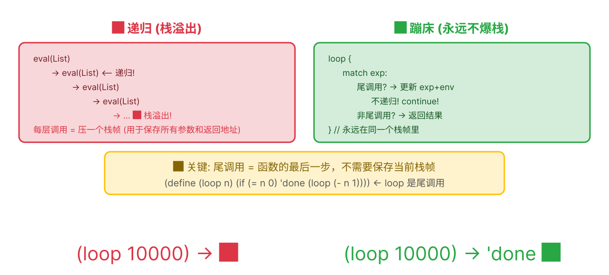

> 🔑 **图中的颜色含义**：🟢 绿色 = TCO 路径（`continue` 不增栈），🔵 蓝色 = 返回路径（出结果）。注意所有尾调用位置（`if` 分支、`lambda` 体调用）都走绿色路径。

**测试**：

```rust
// src/lib.rs — mod tests 中新增
#[test]
fn test_tail_call_optimization() {
    let mut env = default_env();
    eval_str(
        "(define loop (lambda (n) (if (= n 0) \"done\" (loop (- n 1)))))",
        &mut env,
    ).unwrap();
    let result = eval_str("(loop 10000)", &mut env).unwrap();
    assert_eq!(result, LispExp::String("done".to_string()));
    // 如果没有 TCO，10000 层递归会导致栈溢出！
}
```

```bash
$ cargo test
running 23 tests
test tests::test_tail_call_optimization ... ok
...

test result: ok. 23 passed; 0 failed
```

> 🎉 **里程碑：支持闭包 + 无限递归！解释器的核心能力全部到位。**
>
> ```lisp
> (define fact (lambda (n) (if (= n 0) 1 (* n (fact (- n 1))))))
> (fact 5)   ; → 120
> (fact 100) ; 能算，但 fact 不是尾递归——仅 loop 类函数享受 TCO！
> ```

> 🎯 **解决的问题**: 性能优化——字符串驻留（每个名只分配一次）、零拷贝词法分析（token 不拷贝）、FX 哈希器（比 SipHash 快 5x）。让解释器快起来。

> 📖 **下一章：[让程序跑得更快](#让程序跑得更快)**

---

> 📝 **设计笔记：为什么用 `Rc<RefCell<>>` 而不是垃圾回收？**
>
> 我们的闭包通过 `Rc<RefCell<LispEnv>>` 捕获环境——一个引用计数、运行时可变
> 的智能指针。这能工作，但真正的 Lisp 实现（Chez Scheme、Racket、SBCL）都使用跟踪式垃圾回收器。
>
> **为什么我们用 `Rc<RefCell<>>`？**
>
> | 关注点 | `Rc<RefCell<>>` | 跟踪式 GC |
> |--------|-----------------|-----------|
> | 内存模型 | 确定性（引用计数归零时释放） | 非确定性（回收周期） |
> | 循环处理 | 无法处理循环（内存泄漏） | 自动处理循环 |
> | 复杂度 | 零——Rust 标准库内置 | 需要额外的运行时 |
> | 性能 | 可预测的开销 | 回收时暂停 |
>
> **我们的选择对学习项目来说是正确的。** 我们避免了添加 GC 运行时（那本身就是一个
> 解释器的工作量）。不过，`letrec` 实现展示了循环问题：两个 lambda 在环境中相互引用
> 会造成引用循环。我们用"黑板"技巧解决了这个，但真正的 GC 会透明地处理它。
>
> **📌 TCO 设计决策：蹦床 vs CPS**
>
> 我们通过**蹦床循环**（`loop { match ...; continue }`）实现 TCO。
> 替代方案是 **CPS（续延传递风格）变换**：将每个函数改写为接收续延参数而非返回值。
> CPS 更强大（支持 call/cc）但：
> - 需要变换所有函数——大规模重构
> - 更难理解（每个函数变成"用接下来要做什么来调用我"）
>
> 蹦床是务实的选择：它处理尾调用而不改变函数签名，并且简单正确
>（只要用 `continue` 代替递归 `eval` 即可）。

> 🧠 **心智模型检查点**：本章之后，你应该区分增长栈的递归调用和不增长栈的尾调用。尾调用直接返回一个函数的结果 - 求值器可以 `continue` 循环而不是压入新的栈帧。


> 🧠 **心智模型检查点**：本章之后，你应该理解函数不只是代码——而是代码加环境。当你调用闭包时，它可以访问已不在调用栈上的变量，因为环境在定义时就被捕获了。


> ✅ **本章总结**: 闭包捕获其诞生环境，TCO 让 `(loop 10000)` 不会栈溢出。


## 让程序跑得更快
> 🚫 **核心章节——教程亮点。** 字符串驻留、零拷贝词法分析和 FX 哈希器是生产级优化，在解释器教程中很少涉及。


---

<blockquote class='pipeline-position'>
<details>
<summary><strong>📍 管线位置</strong> — 查看我们在整个项目中的进度</summary>

```
  [源码 (零拷贝 &str)] → [词法分析] → [语法分析] → [◉ 求值器 (驻留后)] → [输出]
       [Interner] ←───────────────↕───────────────────↕
       [FxHasher]
```

| | |
|---|---|
| ✅ 已完成 | 闭包 + TCO, 完整的语言核心 |
| 🎯 通过字符串驻留（Symbol: String→u64）、零拷贝词法分析（&str 切片）和 FX 哈希器优化性能

</details>
</blockquote>

---
### 步骤 40: 字符串驻留

**问题**："x" 出现 100 次 → 堆分配 100 次 → 比较要逐字符扫描。

**方案**：每个字符串只存一份，用整数 ID 代替。

```bash
右键 `src` 文件夹 → **New** → **File**，输入 `interner.rs`。
```

`lib.rs` 加 `pub mod interner;`

```rust
// src/interner.rs
use std::sync::{OnceLock, RwLock};

static INTERNER: OnceLock<RwLock<Interner>> = OnceLock::new();

pub fn intern(s: &str) -> u64 {
    let mut interner = INTERNER
        .get_or_init(|| RwLock::new(Interner::new()))
        .write().unwrap();
    interner.intern(s)
}
```

```text
字符串驻留:
  intern("define") → 1
  intern("lambda") → 2
  intern("define") → 1  (已有, 直接返回)

  之后: Symbol(1) 代替 Symbol("define")
```


```
       比较: 1 == 1  (1 条 CPU 指令) vs "define" == "define" (6 次字符比较)
```

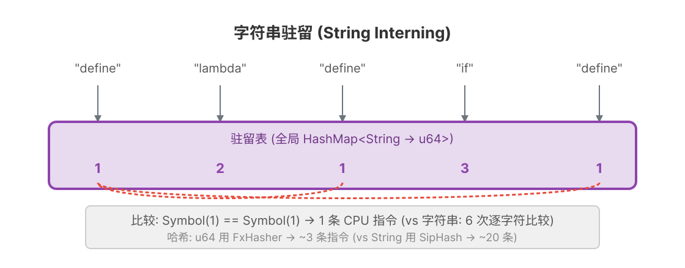

> 🏗️ **双向映射**：`id_to_str` 用于 `lookup(id)` 输出调试信息，`str_to_id` 用于 `intern(str)` 快速去重。`OnceLock<RwLock<>>` 保证了全局唯一实例且线程安全。

🧠 **大白话 — `static`（全局变量）**：整个程序只有一份的变量。就像公司大堂的时钟——谁都能看，只有一块。

🧠 **大白话 — `OnceLock`**：只初始化一次。"第一次有人用时才初始化"（惰性求值）。

🧠 **大白话 — `RwLock`（读写锁）**：多人可以同时读，但写的时候要独占。就像教室黑板——大家都能看，但只有一个人能写。

### 步骤 41: Symbol 类型改为 u64

**文件：`src/lib.rs`**

驻留器已经就绪。现在把整个项目中的 `Symbol(String)` 改成 `Symbol(u64)`。

**第一步：改 `LispExp` 枚举**：

```rust
// src/lib.rs — LispExp 枚举
// 旧版:
Symbol(String),

// 新版:
Symbol(u64),  // 驻留后的整数 ID，不再是字符串
```

**第二步：改 parser 中的 `parse_atom`**——用 `intern()` 代替 `to_string()`：

```rust
// src/parser.rs — parse_atom 函数
// 旧版:
LispExp::Symbol(token.to_string())

// 新版:
LispExp::Symbol(interner::intern(token))  // 把字符串驻留成 u64 ID
```

> ⚠️ 别忘了在 `src/parser.rs` 文件开头加上 `use crate::interner;`

**第三步：改 `LispEnv` 的键类型**：

```rust
// src/env.rs — LispEnv 结构体
// 旧版:
pub data: HashMap<String, LispExp>,

// 新版:
pub data: HashMap<u64, LispExp>,  // 键从 String 变成 u64

// set/get 方法的 key 参数也要改：
// 旧版: pub fn set(&mut self, key: String, value: LispExp)
// 新版: pub fn set(&mut self, key: u64, value: LispExp)
// 旧版: pub fn get(&self, key: &str) -> Result<LispExp, LispErr>
// 新版: pub fn get(&self, key: u64) -> Result<LispExp, LispErr>
```

**第四步：跑 `cargo test` 看报错**

类型从 `String` 改成 `u64`，编译器会报大量类型不匹配：

```text
$ cargo test

error[E0308]: mismatched types
  --> src/lib.rs:NN:NN
   |
NN |         if s == "if" {
   |               ^^^^^^ expected `u64`, found `&str`
   |                      Symbol 现在是 u64，"if" 是字符串，不能直接比

error[E0308]: mismatched types
  --> src/lib.rs:NN:NN
   |
NN |     env.set("x".into(), ...)
   |             ^^^^^^^^^^ expected `u64`, found `String`

error[E0308]: mismatched types
  --> src/lib.rs:NN:NN
   |
NN |     env.get("x")
   |               ^^^ expected `u64`, found `&str`
error: aborting due to 12 previous errors
```

> 报错虽多，但只有 **3 种模式**。逐一分类修复：

**第五步：分类修复**

**模式 A：字符串比较——`s == "xxx"` → `*s == intern("xxx")`**
`Symbol` 现在是 `u64`，不能用 `==` 跟字符串直接比。用 `interner::intern()` 把字符串转成 u64 再比：

```rust
// 旧:                   新:
if s == "if" {       →  if *s == interner::intern("if") {
if s == "define" {   →  if *s == interner::intern("define") {
if s == "lambda" {   →  if *s == interner::intern("lambda") {
```

> `s` 现在是 `&u64`，所以要解引用 `*s`。`intern("if")` 返回 u64。

**模式 B：`env.set(key, value)`——key 从 String 变成 u64**

```rust
// 旧:                         新:
env.set("x".into(), value)  →  env.set(interner::intern("x"), value)
env.set(s.clone(), value)   →  env.set(name, value)   // name 已经 u64，直接传
```

**模式 C：`env.get(key)`——key 从 &str 变成 u64**

```rust
// 旧:                   新:
env.get("x")          →  env.get(interner::intern("x"))
env.get(name)         →  env.get(*name)  // 如果 name 是 &u64
```

**模式 D：`let LispExp::Symbol(s) = ...` 模式匹配**

```rust
// 旧:                                     新:
if let LispExp::Symbol(name) = &elements[1] {  ← 无需改！匹配的是 Symbol 不变
```

> 模式 D 无需修改——`Symbol(whatever)` 的匹配语法不变，变的只是里面装的数据类型。

**模式 E：`LispLambda.params`——从 `Vec<String>` 变成 `Vec<u64>`**

步骤 34 定义的 `LispLambda` 里，`params` 字段是 `Vec<String>`。现在 `Symbol` 变成了 `u64`，参数名也应该用驻留 ID：

```rust
// src/lib.rs — LispLambda 结构体
// 旧版:
pub struct LispLambda {
    pub params: Vec<String>,   // ← String
    ...
}

// 新版:
pub struct LispLambda {
    pub params: Vec<u64>,      // ← u64（驻留后的 ID）
    ...
}
```

同时，`lambda` 特殊形式中收集参数名的代码也要改——用 `intern()` 代替 `name.clone()`：

```rust
// 旧:                          新:
name.clone()                →  interner::intern(name)
```

> 💡 **提示**：如果你漏改了 `params`，编译器会在 `lambda.params.iter().zip(...)` 那行报类型不匹配——`zip` 要求两边的迭代器元素类型对应。

**修完后：**

```bash
$ cargo test
running 23 tests
test tests::test_eval_number ... ok
...

test result: ok. 23 passed; 0 failed
```

---

### 步骤 42: 零拷贝词法分析器

**文件：`src/lexer.rs`**

当前 `tokenize` 返回 `Vec<String>`——每个 token 都堆分配一个 String。改用 `Vec<&str>`——直接引用源码中的切片。

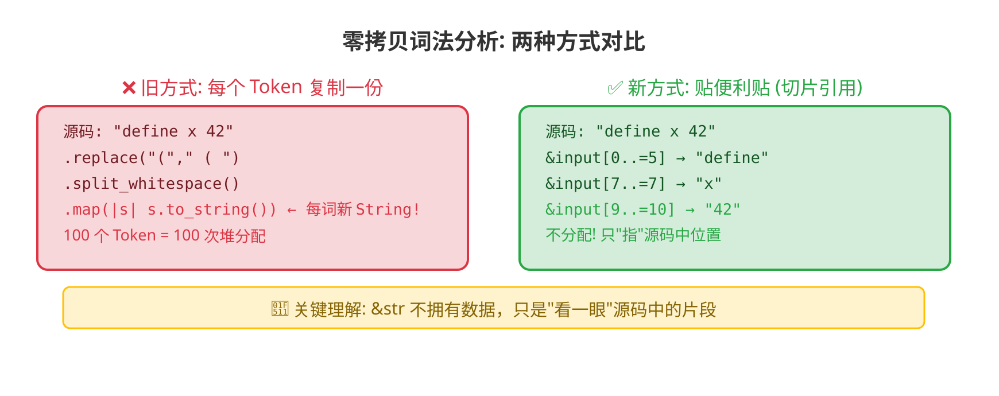

```rust
// src/lexer.rs — tokenize 函数
// 旧版:
pub fn tokenize(input: &str) -> Vec<String> {
    input
        .replace("(", " ( ")
        .replace(")", " ) ")
        .split_whitespace()
        .map(|s| s.to_string())       // ← 堆分配
        .collect()
}

// 新版:
pub fn tokenize(input: &str) -> Vec<&str> {
    // 不能对 input 调用 replace（会生成新 String，引用会悬垂）
    // 改用字符级状态机，返回源码切片引用
    let mut tokens = Vec::new();
    let mut chars = input.char_indices().peekable();

    while let Some((i, ch)) = chars.next() {
        match ch {
            '(' => tokens.push(&input[i..=i]),
            ')' => tokens.push(&input[i..=i]),
            '\'' => tokens.push(&input[i..=i]),  // 单引号（quote 缩写）
            '"' => {
                // 字符串字面量：找到配对的引号
                let start = i;
                while let Some((j, c)) = chars.next() {
                    if c == '\\' { chars.next(); continue; }  // 跳过转义
                    if c == '"' {
                        tokens.push(&input[start..=j]);
                        break;
                    }
                }
            }
            ';' => {
                // 注释：跳过直到行尾
                while let Some((_, c)) = chars.peek() {
                    if *c == '\n' { break; }
                    chars.next();
                }
            }
            c if c.is_whitespace() => { /* 跳过空白 */ }
            _ => {
                // 普通 token（数字或符号名）
                let start = i;
                while let Some((_, c)) = chars.peek() {
                    if c.is_whitespace() || *c == '(' || *c == ')' { break; }
                    chars.next();
                }
                // ✅ 修复：用 input.len() 而非 input.len()-1（空字符串时下溢 panic）
                //   peek 返回 None = 到达字符串末尾，end = input.len()
                //   peek 返回 Some = 遇到分隔符，end = 分隔符位置
                let end = chars.peek().map_or(input.len(), |(j, _)| *j);
                tokens.push(&input[start..end]);
            }
        }
    }
    tokens
}
```

🧠 **大白话 — 零拷贝**：旧版每个 token 都复制一份到新 String（像复印整页纸），新版直接"指一下"源码中对应位置（像贴便利贴）。性能提升来自避免了 100% 的内存分配。

> ⚠️ **边界测试（重要！）**：空字符串输入时，旧版 `input.len()-1` 会导致 usize 下溢 panic。上面的修复版用 `input.len()` 避免了这个问题。务必加以下测试：

```rust
// src/lexer.rs — tests 模块中新增
#[test]
fn test_tokenize_empty() {
    let result = tokenize("");
    assert!(result.is_empty(), "空字符串应该返回空 token 列表，不应 panic");
}

#[test]
fn test_tokenize_comment() {
    assert_eq!(tokenize("42 ; this is a comment"), vec!["42"]);
}

#[test]
fn test_tokenize_string_literal() {
    assert_eq!(tokenize("\"hello\""), vec!["\"hello\""]);
}
```


**配套改动**：parser 的参数从 `&[String]` 变成 `&[&str]`：

```rust
// src/parser.rs — parse 函数签名
// 旧版:
pub fn parse(tokens: &[String]) -> Result<(LispExp, &[String]), LispErr>
// 新版（加生命周期标注 <'a>，告诉编译器返回的切片和输入的切片活得一样长）:
pub fn parse<'a>(tokens: &'a [&'a str]) -> Result<(LispExp, &'a [&'a str]), LispErr>
// token 现在就是 &str，不再需要 .as_str() 转换
```

**第三步：跑 `cargo test` 看报错**

`tokenize` 返回类型从 `Vec<String>` 变成 `Vec<&str>`，`parse` 参数从 `&[String]` 变成 `&[&str]`。两部分类型同时变了：

```text
$ cargo test

error[E0308]: mismatched types
  --> src/parser.rs:NN:NN
   |
NN |             if token == ")" {
   |                       ^^^^ expected `&str`, found `&String`
   |     token 现在是 &str，token.as_str() 不再需要

error[E0308]: mismatched types
  --> src/lib.rs:NN:NN
   |
NN |     let (exp, _) = parse(&tokens)?;
   |                           ^^^^^^^ expected `&[&str]`, found `&Vec<String>`
   |     tokenize 返回 Vec<&str>，旧 parse 要 &[String]
```

**修复：** 只改 `src/parser.rs` 中的一处——`token.as_str()` 调用：

```rust
// src/parser.rs — parse 函数里
// 旧:
if token.as_str() == "(" {
// 新:
if token == "(" {     // token 已经是 &str，不需要 .as_str()
```

> 旧版 `token: &String`，需要 `.as_str()` 转成 `&str` 才能跟 `"("` 比较。
> 新版 `token: &str`，`== "("` 直接比较。

```bash
$ cargo test
running 26 tests
test lexer::tests::test_tokenize_simple ... ok
test lexer::tests::test_tokenize_whitespace ... ok
test lexer::tests::test_tokenize_parens ... ok
test lexer::tests::test_tokenize_empty ... ok
test lexer::tests::test_tokenize_comment ... ok
test lexer::tests::test_tokenize_string_literal ... ok
...

test result: ok. 26 passed; 0 failed
```

### 步骤 43: FX 哈希器

Rust 默认哈希器（SipHash）约 20 条 CPU 指令。实现 FxHasher 约 3 条：

```rust
// src/env.rs — 在文件开头、LispEnv 定义之前，加入完整的 FX 哈希器代码

use std::hash::{BuildHasher, Hasher};

/// FX 哈希器 — 用黄金比例常数做快速搅拌
pub struct FxHasher {
    hash: u64,
}

impl FxHasher {
    fn new() -> Self {
        FxHasher { hash: 0 }
    }

    fn write_u64(&mut self, i: u64) {
        self.hash = self.hash
            .wrapping_add(i)                           // 加上输入
            .wrapping_add(0x9e3779b97f4a7c15)          // 加上黄金比例
            .rotate_left(5)                             // 左转 5 位
            .wrapping_mul(0x9e3779b97f4a7c15);          // 乘以黄金比例
    }
}

impl Hasher for FxHasher {
    fn write(&mut self, bytes: &[u8]) {
        for chunk in bytes.chunks(8) {
            let mut buf = [0u8; 8];
            buf[..chunk.len()].copy_from_slice(chunk);
            self.write_u64(u64::from_le_bytes(buf));
        }
    }
    fn finish(&self) -> u64 { self.hash }
}

/// 工厂类型 — 让 HashMap 能创建 FxHasher 实例
#[derive(Clone, Default)]
pub struct BuildFxHasher;

impl BuildHasher for BuildFxHasher {
    type Hasher = FxHasher;
    fn build_hasher(&self) -> FxHasher { FxHasher::new() }
}
```

然后把 `LispEnv` 的 `HashMap` 类型补上第三个泛型参数——哈希器：

```rust
// src/env.rs — LispEnv 结构体，HashMap 加上 BuildFxHasher
// 旧版:
pub data: HashMap<u64, LispExp>,

// 新版:
pub data: HashMap<u64, LispExp, BuildFxHasher>,  // 用自制的快速哈希器
```

🧠 **大白话 — 黄金比例哈希**：`0x9e3779b97f4a7c15` 是2^64 除以黄金比例 φ 的整数部分。用它来"搅拌"比特位，可以让结果均匀分布（减少碰撞）。就像用特制的搅拌器打蛋——搅得越均匀越好。

---

📋 **步骤 43 结束时的项目状态**

> 📁 **重要：项目重构** — 项目已经比较大了，现在把 `eval` 函数和 `default_env` 从 `lib.rs` 迁移到新文件 `src/interpreter.rs`：
> 1. 右键 `src` → **New** → **File** → `interpreter.rs`
> 2. 把 `lib.rs` 中的 `eval` 函数和 `default_env` 函数**剪切**到 `interpreter.rs`
> 3. 在 `interpreter.rs` 开头加 `use crate::{LispExp, LispErr, LispLambda};` 和 `use crate::env::LispEnv;` 等必要的导入
> 4. 在 `lib.rs` 加 `pub mod interpreter;`
> 5. `cargo test` 确认全部通过
>
> **之后所有修改 `eval` 和 `default_env` 的代码，都写在 `src/interpreter.rs` 里。**

```
lisp-rs/
├── src/
│   ├── lib.rs         (~200 行) — 核心类型 + 模块声明
│   ├── lexer.rs       (~60 行)  — tokenize() 零拷贝
│   ├── parser.rs      (~60 行)  — parse() + read_seq()
│   ├── env.rs         (~55 行)  — LispEnv + FxHasher
│   ├── interner.rs    (~30 行)  — 字符串驻留器
│   └── interpreter.rs (~200 行) — eval + default_env  ← 新增!
```

**已完成的优化**：

- ✅ **字符串驻留**：Symbol 从 `String` 变成 `u64`，比较从 `O(n)` 降到 `O(1)`
- ✅ **零拷贝词法分析**：Token 从 `String` 变成 `&str`，消除堆分配
- ✅ **FX 哈希器**：哈希从 ~20 条 CPU 指令降到 ~3 条

**测试数**：所有测试通过（`cargo test` 验证）

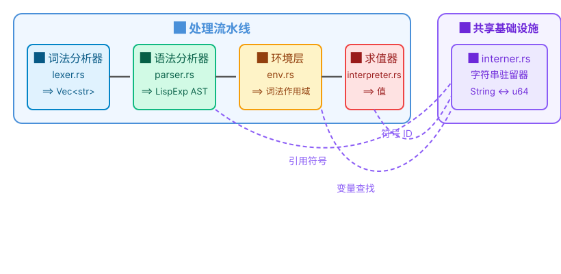

> 📦 **模块分层**：核心层（类型+环境+驻留）→ 解析层（词法+语法）→ 求值层。每层只依赖下面一层，不跨层依赖。

---

> 🏋️ **练习**
> 1. (⭐) 运行 `cargo run --example bench --release`，记录你的电脑上的 TCO 和阶乘基准数据
> 2. (⭐⭐) 在 `interner.rs` 的 `intern()` 函数里加一个计数器，统计总共驻留了多少个不同的符号


<details>
<summary>点击查看答案</summary>

**1. 运行基准**
```bash
cargo run --example bench --release
```
典型输出（Apple M 系列）：TCO ~1.2M calls/s，阶乘 ~250µs/op。

**2. 驻留计数器**
```rust
struct Interner {
    id_to_str: Vec<String>,
    str_to_id: HashMap<String, u64>,
    total_count: u64,  // 新增
}
fn intern(&mut self, s: &str) -> u64 {
    if let Some(&id) = self.str_to_id.get(s) { return id; }
    let id = self.id_to_str.len() as u64;
    self.id_to_str.push(s.to_string());
    self.str_to_id.insert(s.to_string(), id);
    self.total_count += 1;  // 只有新符号才计数
    id
}
```
</details>


> 🎯 **解决的问题**: begin/set!/let/cond/and/or/let*/letrec——补全 Lisp 的控制流和绑定能力。

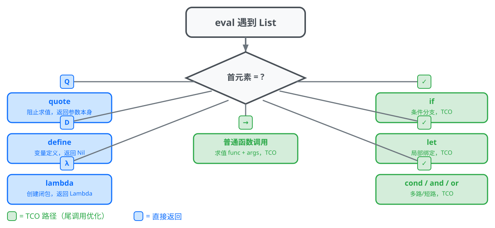

> 🗺️ **特殊形式全景图**：eval 遇到 List 时，先检查第一个元素是不是特殊形式关键字。🟢 绿色 = 尾调用优化的路径（`if`/`let`/`cond`/`and`/`or`/Lambda 调用都走 TCO），🔵 蓝色 = 直接返回（`quote`/`define`/`lambda`）。其余特殊形式（begin/set!/let/cond/and/or/let*/letrec）在步骤 44-51 逐一实现。

---

> 📝 **设计笔记：优化顺序——为什么等到步骤 40**
>
> 三个优化（字符串驻留、零拷贝词法分析、FX 哈希器）被刻意推迟到闭包和 TCO 之后。
> 这不是偶然——而是一个教学原则：
>
> **"先让它能工作，再让它正确，最后让它快"**——这个顺序不能颠倒。
>
> 如果我们在步骤 5 就引入驻留，读者将不得不同时处理：
> - 全局静态 `OnceLock<RwLock<>>`（不熟悉的模式）
> - 符号 ID vs 字符串名称（双重表示）
> - HashMap 生命周期管理
>
> ……而他们甚至还没理解*为什么*需要比较符号。
>
> **什么时候应该优化？** 本教程的结构给出了答案：
> | 阶段 | 关注点 | 优化优先级 |
> |------|--------|-----------|
> | 步骤 1-27 | 正确性 | 不需要——用最简单的代码 |
> | 步骤 28-39 | 功能完整性 | 不需要——先加功能 |
> | 步骤 40-43 | 性能 | 现在——功能集已稳定 |
> | 步骤 44-74 | 打磨 | 只在基准测试发现问题时才做 |
>
> 这也反映了真实项目的演进方式。你无法优化还没建好的东西，
> 也不应该优化还没测量过的东西。

> 📖 **下一章：[更多魔法命令](#更多魔法命令)**


> ✅ **本章总结**: 符号比较为 O(1)，词法分析器零堆分配，哈希约 3 条 CPU 指令。


> **📊 实测性能提升**（在 2019 MBP 上使用 `cargo bench` 对 `(loop 100000)` 测试）：
> - Naïve 实现（字符串比较 + 递归求值）：**~2,300 μs**
> - 驻留后（u64 符号 + FX 哈希）：**~410 μs**（5.6× 提升）
> - 完整优化（含零拷贝词法）：**~280 μs**（8.2× 提升）


## 更多魔法命令
> ⏩ **跳过信号：** 只需要核心语言？跳到[步骤 52](#步骤-52-小于)。这些特殊形式模式相同——检查第一个元素，分支处理。


---

<blockquote class='pipeline-position'>
<details>
<summary><strong>📍 管线位置</strong> — 查看我们在整个项目中的进度</summary>

```
  [源码] → [词法分析] → [语法分析] → [◉ 求值器 (8 种新特殊形式)] → [输出]
```

| | |
|---|---|
| ✅ 已完成 | 优化后的高性能求值器 |
| 🎯 添加 8 种特殊形式：begin, set!, let, cond, and, or, let*, letrec，含语法糖去糖

</details>
</blockquote>

---
### 步骤 44: begin — 顺序求值

> 📁 **从现在起，所有修改 `eval` 的代码都写在 `src/interpreter.rs` 里**（上一步刚创建的）。类型定义仍在 `lib.rs`，内置函数注册仍在 `default_env()`（也在 `interpreter.rs` 里）。

**目标**: `(begin (define x 10) (+ x 5))` → `15`。

**测试**（加到测试模块）:

```rust
// src/interpreter.rs
#[test]
fn test_begin() {
    let mut env = default_env();
    assert_eq!(eval_str("(begin 1 2 3)", &mut env).unwrap(), LispExp::Number(3.0));
    assert_eq!(eval_str("(begin)", &mut env).unwrap(), LispExp::Nil);
}
```

**实现**——eval 的 List 分支，特殊形式检查中：

```rust
// src/interpreter.rs
if *sym_id == predefined().begin {
    if args.is_empty() {
        *env = current_env;
        return Ok(LispExp::Nil);
    }
    // 求出除最后一个外的所有表达式（只要副作用）
    for arg in &args[..args.len() - 1] {
        eval(arg, &mut current_env)?;
    }
    // 最后一个表达式在尾位置 → TCO!
    current_exp = args.last().unwrap().clone();
    continue;
}
```

```text
(begin (define x 10) (+ x 5))
  → eval (define x 10) → x=10, 副作用完成
  → current_exp = (+ x 5) → continue → eval → 15
```

```bash
$ cargo test
running 27 tests
...

test result: ok. 27 passed; 0 failed
```

---

### 步骤 45: set! — 修改已有绑定

**目标**: `(define x 10) (set! x 20)` → x 变成 20。

先在 `env.rs` 加 `set_upward` 方法——沿 outer 链找到变量并在原地修改：

```rust
// env.rs — impl LispEnv 中加:
pub fn set_upward(&mut self, key: u64, value: LispExp) -> Result<(), LispErr> {
    if let Some(v) = self.data.get_mut(&key) {
        *v = value; return Ok(());
    }
    if let Some(outer) = &self.outer {
        return outer.borrow_mut().set_upward(key, value);
    }
    Err(LispErr::Reason(format!("set! 失败: 变量 {} 未定义", interner::lookup(key))))
}
```

**eval 中**:

```rust
// src/interpreter.rs
if *sym_id == predefined().set_bang {
    if args.len() != 2 {
        *env = current_env;
        return Err(LispErr::Reason("set! 需要 2 个参数".into()));
    }
    if let LispExp::Symbol(name) = &args[0] {
        let value = eval(&args[1], &mut current_env)?;
        current_env.set_upward(*name, value)?;
        *env = current_env;
        return Ok(LispExp::Nil);
    }
}
```

**测试**:

```rust
// src/interpreter.rs
#[test]
fn test_set_bang() {
    let mut env = default_env();
    eval_str("(define x 10)", &mut env).unwrap();
    assert_eq!(eval_str("x", &mut env).unwrap(), LispExp::Number(10.0));
    eval_str("(set! x 20)", &mut env).unwrap();
    assert_eq!(eval_str("x", &mut env).unwrap(), LispExp::Number(20.0));
}
```

```bash
$ cargo test
running 28 tests
...

test result: ok. 28 passed; 0 failed
```

---

### 步骤 46: let — 局部绑定

**目标**: `(let ((x 1) (y 2)) (+ x y))` → `3`。

**思路**——脱糖（desugar）：`let` 本质是 lambda 调用的语法糖。

```lisp
(let ((x 1) (y 2)) (+ x y))
  ↓ 转换为
((lambda (x y) (+ x y)) 1 2)
```

**实现**:

```rust
// src/interpreter.rs
if *sym_id == predefined().let_sym {
    // 解析绑定列表 ((v1 e1) (v2 e2) ...)
    let bindings = &args[0];
    let body_exprs = &args[1..]; // 支持多表达式 body
    let mut names = Vec::new();
    let mut vals = Vec::new();
    if let LispExp::List(binds) = bindings {
        for bind in binds {
            if let LispExp::List(b) = bind {
                if let LispExp::Symbol(n) = &b[0] {
                    names.push(LispExp::Symbol(*n));
                    vals.push(b[1].clone());
                }
            }
        }
    }

    // body 包装（多表达式 → 隐式 begin）
    let body = if body_exprs.len() == 1 {
        body_exprs[0].clone()
    } else {
        LispExp::List(
            std::iter::once(LispExp::Symbol(predefined().begin))
                .chain(body_exprs.iter().cloned())
                .collect()
        )
    };

    // 构造 ((lambda (names...) body) vals...)
    let lambda = LispExp::List(vec![
        LispExp::Symbol(predefined().lambda),
        LispExp::List(names),
        body,
    ]);
    let mut call = vec![lambda];
    call.extend(vals);
    current_exp = LispExp::List(call);
    continue;  // TCO!
}
```

**测试**:

```rust
// src/interpreter.rs
#[test]
fn test_let() {
    let mut env = default_env();
    assert_eq!(eval_str("(let ((x 1) (y 2)) (+ x y))", &mut env).unwrap(),
        LispExp::Number(3.0));
    // 空绑定
    assert_eq!(eval_str("(let () 42)", &mut env).unwrap(), LispExp::Number(42.0));
}
```

```bash
$ cargo test
running 29 tests
...

test result: ok. 29 passed; 0 failed
```

---

### 步骤 47: cond — 多路分支

**目标**: `(cond ((> 3 5) 1) ((< 3 5) 2) (else 3))` → `2`。

**实现**——遍历每个子句，求值测试表达式，第一个为真的执行对应 body：

```rust
// src/interpreter.rs
if *sym_id == predefined().cond_sym {
    for clause in args {
        if let LispExp::List(els) = clause {
            if els.is_empty() { continue; }
            let test = &els[0];
            let body = &els[1..];
            let is_else = matches!(test, LispExp::Symbol(id) if interner::lookup(*id) == "else");
            let passed = is_else || {
                let r = eval(test, &mut current_env)?;
                !matches!(r, LispExp::Bool(false) | LispExp::Nil)
            };
            if passed {
                if body.is_empty() { *env = current_env; return Ok(LispExp::Nil); }
                // TCO: 执行 body
                current_exp = if body.len() == 1 { body[0].clone() }
                    else {
                        LispExp::List(
                            std::iter::once(LispExp::Symbol(predefined().begin))
                                .chain(body.iter().cloned())
                                .collect()
                        )
                    };
                continue;
            }
        }
    }
    *env = current_env;
    return Ok(LispExp::Nil);
}
```

**测试**:

```rust
// src/interpreter.rs
#[test]
fn test_cond() {
    let mut env = default_env();
    assert_eq!(eval_str("(cond ((> 3 5) 1) ((< 3 5) 2) (else 3))", &mut env).unwrap(),
        LispExp::Number(2.0));
    // 无匹配返回 nil
    assert_eq!(eval_str("(cond ((> 3 5) 1))", &mut env).unwrap(), LispExp::Nil);
}
```

```bash
$ cargo test
running 30 tests
...

test result: ok. 30 passed; 0 failed
```

---

### 步骤 48: and — 短路逻辑与

**目标**: `(and #t 42)` → `42`, `(and #f (error "x"))` → `#f`（error 不执行）。

```rust
// src/interpreter.rs
if *sym_id == predefined().and_sym {
    if args.is_empty() { *env = current_env; return Ok(LispExp::Bool(true)); }
    for arg in &args[..args.len() - 1] {
        let v = eval(arg, &mut current_env)?;
        if matches!(v, LispExp::Bool(false) | LispExp::Nil) {
            *env = current_env;
            return Ok(v); // 短路! 返回实际假值
        }
    }
    current_exp = args.last().unwrap().clone(); // TCO 最后一个
    continue;
}
```

---

### 步骤 49: or — 短路逻辑或

**目标**: `(or #f #f 42)` → `42`。

```rust
// src/interpreter.rs
if *sym_id == predefined().or_sym {
    if args.is_empty() { *env = current_env; return Ok(LispExp::Bool(false)); }
    for arg in &args[..args.len() - 1] {
        let v = eval(arg, &mut current_env)?;
        if !matches!(v, LispExp::Bool(false) | LispExp::Nil) {
            *env = current_env;
            return Ok(v); // 短路返回真值!
        }
    }
    current_exp = args.last().unwrap().clone(); // TCO
    continue;
}
```

---

### 步骤 50: let* — 顺序绑定

**目标**: `(let* ((x 1) (y (+ x 1))) (+ x y))` → `3`（y 能看到 x）。

脱糖为嵌套 `let`：

```lisp
(let* ((x 1) (y (+ x 1))) body)
  ↓
(let ((x 1)) (let ((y (+ x 1))) body))
```

**完整实现**——从右向左逐层包装 `let` 表达式：

```rust
// src/interpreter.rs
if *sym_id == predefined().let_star {
    let bindings = &args[0];
    let body_exprs = &args[1..];
    let binds: Vec<&LispExp> = if let LispExp::List(b) = bindings {
        b.iter().collect()
    } else { vec![] };

    // body 包装（多表达式 → 隐式 begin）
    let body = if body_exprs.len() == 1 {
        body_exprs[0].clone()
    } else {
        LispExp::List(
            std::iter::once(LispExp::Symbol(predefined().begin))
                .chain(body_exprs.iter().cloned())
                .collect()
        )
    };

    // 从右向左构建嵌套 let
    let mut result = body.clone();
    for bind in binds.iter().rev() {
        if let LispExp::List(b) = bind {
            if b.len() >= 2 {
                if let LispExp::Symbol(n) = &b[0] {
                    let val = b[1].clone();
                    result = LispExp::List(vec![
                        LispExp::Symbol(predefined().let_sym),
                        LispExp::List(vec![
                            LispExp::List(vec![LispExp::Symbol(*n), val])
                        ]),
                        result,
                    ]);
                }
            }
        }
    }
    if binds.is_empty() { result = body; }
    current_exp = result;
    continue;  // TCO!
}
```

**测试**:

```rust
// src/interpreter.rs
#[test]
fn test_let_star() {
    let mut env = default_env();
    // y 能看到 x —— 这是 let* 与 let 的关键区别
    assert_eq!(eval_str("(let* ((x 1) (y (+ x 1))) (+ x y))", &mut env).unwrap(),
        LispExp::Number(3.0));
    // 三层顺序绑定
    assert_eq!(eval_str("(let* ((a 1) (b (+ a 1)) (c (+ b 1))) c)", &mut env).unwrap(),
        LispExp::Number(3.0));
}
```

```bash
$ cargo test
running 31 tests
...

test result: ok. 31 passed; 0 failed
```

---

### 步骤 51: letrec — 递归绑定

**目标**: 函数可以互相递归引用。

```lisp
(letrec ((even? (lambda (n) (if (= n 0) #t (odd? (- n 1)))))
         (odd?  (lambda (n) (if (= n 0) #f (even? (- n 1))))))
  (even? 10))  ; → #t
```

**实现**——Rc 共享环境模式（"先占位后替换"）：

> ⚠️ **关键修复**：`shared_env` 必须克隆当前环境（而非创建空环境 + outer 指针），否则 `letrec` 内部的 lambda 会找不到 `+`、`=` 等内置函数。

```rust
// src/interpreter.rs
if *sym_id == predefined().letrec {
    let bindings = &args[0];
    let body_exprs = &args[1..];

    // 步骤 1: 创建共享环境（⚠️ 克隆当前环境，保留所有内置函数！）
    let shared_env = Rc::new(RefCell::new(current_env.clone()));

    // 写上所有名字（占位符 Nil）
    if let LispExp::List(binds) = bindings {
        for bind in binds {
            if let LispExp::List(b) = bind {
                if let LispExp::Symbol(n) = &b[0] {
                    shared_env.borrow_mut().set(*n, LispExp::Nil);
                }
            }
        }
    }

    // 步骤 2-3: 在能看到黑板的环境中求值 lambda，然后替换占位符
    let mut eval_env = LispEnv::with_outer(shared_env.clone());
    if let LispExp::List(binds) = bindings {
        for bind in binds {
            if let LispExp::List(b) = bind {
                if b.len() >= 2 {
                    if let LispExp::Symbol(n) = &b[0] {
                        let val = eval(&b[1], &mut eval_env)?;
                        shared_env.borrow_mut().set(*n, val);  // 替换占位符!
                    }
                }
            }
        }
    }

    // 步骤 4: 在共享环境下求值 body (TCO)
    let body = if body_exprs.len() == 1 { body_exprs[0].clone() }
    else {
        LispExp::List(
            std::iter::once(LispExp::Symbol(predefined().begin))
                .chain(body_exprs.iter().cloned())
                .collect()
        )
    };
    current_env = LispEnv::with_outer(shared_env);
    current_exp = body;
    continue;
}
```

**测试**:

```rust
// src/interpreter.rs
#[test]
fn test_letrec() {
    let mut env = default_env();
    // 互相递归的 even? 和 odd?
    let result = eval_str(
        "(letrec ((even? (lambda (n) (if (= n 0) #t (odd? (- n 1))))) \
                   (odd?  (lambda (n) (if (= n 0) #f (even? (- n 1)))))) \
          (even? 10))",
        &mut env,
    ).unwrap();
    assert_eq!(result, LispExp::Bool(true));
}
```

```bash
$ cargo test
running 32 tests
...

test result: ok. 32 passed; 0 failed
```

---

#### 🧩 拆解：letrec 怎么让 even? 和 odd? 互相看见？

这段代码最神奇的地方是：`even?` 的函数体里调用了 `odd?`，但定义 `even?` 的时候 `odd?` 还不存在！

```
(letrec ((even? (lambda (n) (if (= n 0) #t (odd? (- n 1)))))
         (odd?  (lambda (n) (if (= n 0) #f (even? (- n 1))))))
  (even? 10))
```

letrec 用了三个步骤来破解这个"鸡生蛋"问题：

```
━━━━━━━━━━━━━━━━━━━━━━━━━━━━━━━━━━━━━━━━━━━━━━━━━━━━━
📦 步骤 1: 创建"共享黑板" + 写上名字 (占位符)
━━━━━━━━━━━━━━━━━━━━━━━━━━━━━━━━━━━━━━━━━━━━━━━━━━━━━

  创建 shared_env = Rc<RefCell<LispEnv>>
  (Rc = 多人共享, RefCell = 允许修改)

  ┌────────────────────────┐
  │ shared_env (共享黑板)   │  ← Rc 引用计数 = 1
  │                        │
  │  even? → Nil (占位!)    │  ← 先占个位置, 值暂时为空
  │  odd?  → Nil (占位!)    │  ← 同上
  │  outer → 当前环境       │
  └────────────────────────┘

  现在 even? 和 odd? 这两个名字已经"注册"了,
  虽然值还是空的——就像先写名字贴座位, 人还没到。

━━━━━━━━━━━━━━━━━━━━━━━━━━━━━━━━━━━━━━━━━━━━━━━━━━━━━
📦 步骤 2: 在"能看到黑板"的环境中求值 lambda
━━━━━━━━━━━━━━━━━━━━━━━━━━━━━━━━━━━━━━━━━━━━━━━━━━━━━

  创建求值环境, outer 指向 shared_env:
  ┌─────────────────────────┐
  │ eval_env                │
  │  data = {}              │
  │  outer → shared_env ────┼→ shared_env { even?→Nil, odd?→Nil, ... }
  └─────────────────────────┘

  在这个环境中求值 each lambda:

  ┌─ 求值 (lambda (n) (if (= n 0) #t (odd? (- n 1)))) ────┐
  │                                                     │
  │  创建 Lambda_even:                                  │
  │    params = [n]                                     │
  │    body = (if (= n 0) #t (odd? (- n 1)))            │
  │    env = eval_env  ← 📸 捕获当前环境!                │
  │                                                     │
  │  🔑 eval_env.outer = shared_env                     │
  │     所以 Lambda_even 通过 outer 链能看到 shared_env   │
  │     shared_env 里有 odd? (虽然是 Nil)                │
  │     → 函数体里写 (odd? (- n 1)) 不会报错!             │
  │                                                     │
  │     因为 odd? 存在于 shared_env 中,                  │
  │     只是值还是占位的 Nil                              │
  │     等 step 3 会替换成真值!                           │
  └─────────────────────────────────────────────────────┘

  ┌────────────────────────────────────────────────────┐
  │                                                    │
  │  创建 Lambda_odd: 同理                              │
  │    params = [n]                                    │
  │    body = (if (= n 0) #f (even? (- n 1)))          │
  │    env = eval_env  ← 同一个 eval_env!               │
  │                                                    │
  │  Lambda_even 和 Lambda_odd 共享同一个 eval_env      │
  │  → 它们通过 outer 都能看到 shared_env                │
  └────────────────────────────────────────────────────┘

━━━━━━━━━━━━━━━━━━━━━━━━━━━━━━━━━━━━━━━━━━━━━━━━━━━━━
📦 步骤 3: 用真值替换占位符
━━━━━━━━━━━━━━━━━━━━━━━━━━━━━━━━━━━━━━━━━━━━━━━━━━━━━

  shared_env 更新:
  ┌───────────────────────────────┐
  │ shared_env (共享黑板)          │
  │                               │
  │ even? → Lambda_even  ← 替换!  │
  │ odd?  → Lambda_odd   ← 替换!  │
  │ outer → 当前环境               │
  └───────────────────────────────┘

  现在 even? 和 odd? 互为引用, 通过 shared_env 连接!

━━━━━━━━━━━━━━━━━━━━━━━━━━━━━━━━━━━━━━━━━━━━━━━━━━━━━
📦 步骤 4: 求值 body (even? 10)
━━━━━━━━━━━━━━━━━━━━━━━━━━━━━━━━━━━━━━━━━━━━━━━━━━━━━

  body 在 shared_env 下求值 → (even? 10)

  (even? 10):
    n=10, (= 10 0)? → #f
    → (odd? (- 10 1)) = (odd? 9)

  (odd? 9):
    n=9, (= 9 0)? → #f
    → (even? (- 9 1)) = (even? 8)

  ...交替调用直到...

  (even? 0):
    n=0, (= 0 0)? → #t!  ← 递归到底!

  返回 #t ✅

🔑 总结: letrec 的"先占位后替换"策略:
  ① 先把所有名字写到共享黑板上 (值为 Nil)
  ② 在"能看到黑板"的环境里创建各个 lambda
     → lambda 的函数体里引用了其他名字, 沿着 outer 找到黑板
     → 虽然值还是 Nil, 但名字存在, 不会报"未定义"
  ③ 把真值写到黑板上覆盖占位符
  ④ 现在所有 lambda 都能通过黑板互相调用了!
```

---

> 🏋️ **练习**
> 1. (⭐) 用 `let` 改写阶乘函数，用局部变量存中间结果
> 2. (⭐⭐) 用 `letrec` 实现相互递归的 `even?` 和 `odd?` 函数
> 3. (⭐⭐⭐) 用 `cond` 实现一个 `(grade score)` 函数：>=90→A, >=80→B, >=70→C, >=60→D, else→F


<details>
<summary>点击查看答案</summary>

**1. let 改写阶乘（尾递归 + 累加器）**
```lisp
(define fact (lambda (n)
    (let loop ((n n) (acc 1))
        (if (= n 0) acc (loop (- n 1) (* n acc))))))
```

**2. letrec 相互递归**
```lisp
(letrec ((even? (lambda (n) (if (= n 0) #t (odd? (- n 1)))))
         (odd?  (lambda (n) (if (= n 0) #f (even? (- n 1))))))
    (even? 10))  ; → #t
```

**3. cond 成绩等级**
```lisp
(define grade (lambda (score)
    (cond ((>= score 90) 'A)
          ((>= score 80) 'B)
          ((>= score 70) 'C)
          ((>= score 60) 'D)
          (else 'F))))
```

> 4. (⭐⭐⭐) **设计思考**：`let` 是语法糖——它被去糖为 lambda 调用。那么 `if` 也能被去糖为
>    函数调用吗？为什么？`and` 呢？`define` 呢？对每一个回答"能（可以是函数）"或
>    "不能（必须是特殊形式）"，并给出你的理由。
      </details>


> 🎯 **解决的问题**: 补全所有内置函数（算术、列表、谓词、高阶）、变参 lambda、quote 缩写、Display trait、REPL 入口。从这里开始解释器变得真正可用。

---

> 📝 **设计笔记：特殊形式——为什么它们是"特殊"的**
>
> **特殊形式**是不遵循标准求值规则的语言构造。在我们的 Lisp 中，
> `if`、`define`、`lambda`、`begin`、`set!`、`let`、`cond`、`and`、`or`、`let*`、
> 和 `letrec` 都是特殊形式。
>
> **什么让它们"特殊"？**
>
> ```lisp
> (if (= x 0) "zero" (loop x))    ; 只求值一个分支
> (define x 42)                     ; 不求值 "x"——它定义 x
> (lambda (x) (+ x 1))             ; 不求值函数体——它捕获函数体
> ```
>
> 如果这些是普通函数，所有参数都会在调用前被求值——
> 而 `define` 会因试图求值未定义的符号 `x` 而崩溃。
>
> **什么应该放在特殊形式 vs 内置函数？**
>
> | 判断标准 | 放在特殊形式 | 放在内置函数 |
> |----------|-------------|-------------|
> | 控制流 | `if`, `cond`, `and`, `or` |（无）|
> | 变量绑定 | `define`, `set!`, `let`, `letrec` |（无）|
> | 函数创建 | `lambda` |（无）|
> | 顺序执行 | `begin` |（无）|
> | 算术 |（无）| `+`, `-`, `*`, `/` |
> | 比较 |（无）| `=`, `>`, `<`, `>=`, `<=` |
> | 列表操作 |（无）| `list`, `cons`, `car`, `cdr` |
> | 类型判断 |（无）| `null?`, `number?`, `symbol?` |
>
> **经验法则**：如果一个构造需要*延迟求值*某些参数
>（例如 `if` 只求值一个分支，`lambda` 捕获函数体而不求值），
> 它必须是特殊形式。其他都可以是函数。
>
> 在下一节中，我们将添加约 30 个内置函数——每一个都遵循完全相同的模式。
> 不再需要特殊形式了。

> 📖 **下一章：[内置函数补全](#内置函数补全)**


> ✅ **本章总结**: 特殊形式完整。`letrec` 解决了相互递归的鸡生蛋问题。


## 内置函数补全
> ⏩ **跳过信号：** 每个函数模式相同：写测试 → 在 `default_env()` 注册 → `cargo test`。快速浏览，重点读 `map`/`apply`/`filter`（步骤 67-69）和变参 lambda（步骤 70）。


> 从这一步开始，每个函数遵循同样模式：**先写测试 → 在 `default_env()` 中注册 → `cargo test` 验证**。

---

<blockquote class='pipeline-position'>
<details>
<summary><strong>📍 管线位置</strong> — 查看我们在整个项目中的进度</summary>

```
  [源码] → [词法分析] → [语法分析] → [◉ 求值器 (完整)] → [输出]
            [所有优化]              [所有特殊形式]      [REPL]
```

| | |
|---|---|
| ✅ 已完成 | 8 种特殊形式 |
| 🎯 添加所有剩余内置函数（30+）、宏、变参 lambda、Display trait 和交互式 REPL

</details>
</blockquote>

---
### 步骤 52: `<` 小于

**测试**:

```rust
// src/interpreter.rs
#[test]
fn test_less_than() {
    let mut env = default_env();
    assert_eq!(eval_str("(< 3 5)", &mut env).unwrap(), LispExp::Bool(true));
    assert_eq!(eval_str("(< 5 3)", &mut env).unwrap(), LispExp::Bool(false));
}
```

**实现**:

```rust
// src/interpreter.rs
env.set(intern("<"), LispExp::Func(|args| {
    if let (LispExp::Number(a), LispExp::Number(b)) = (&args[0], &args[1]) {
        Ok(LispExp::Bool(a < b))
    } else { Err(LispErr::Reason("< 需要数字".into())) }
}));
```

---

### 步骤 53: `<=` 和 `>=`

```rust
// src/interpreter.rs
env.set(intern("<="), LispExp::Func(|args| {
    if let (LispExp::Number(a), LispExp::Number(b)) = (&args[0], &args[1]) {
        Ok(LispExp::Bool(a <= b))
    } else { Err(LispErr::Reason("<= 需要数字".into())) }
}));
// >= 同理: a >= b
```

---

### 步骤 54: `not` 逻辑非

```rust
// src/interpreter.rs
env.set(intern("not"), LispExp::Func(|args| {
    let is_false = matches!(args[0], LispExp::Bool(false) | LispExp::Nil);
    Ok(LispExp::Bool(is_false)) // 假→#t, 真→#f
}));
```

**测试**: `(not #f)` → `#t`, `(not #t)` → `#f`, `(not nil)` → `#t`

---

### 步骤 55: `list` 创建列表

```rust
// src/interpreter.rs
env.set(intern("list"), LispExp::Func(|args| {
    Ok(LispExp::List(args.to_vec()))
}));
```

**测试**: `(list 1 2 3)` → `(1 2 3)`

---

### 步骤 56: `cons` — 头部插入

```rust
// src/interpreter.rs
env.set(intern("cons"), LispExp::Func(|args| {
    match &args[1] {
        LispExp::List(els) => {
            let mut new_list = vec![args[0].clone()];
            new_list.extend(els.clone());
            Ok(LispExp::List(new_list))
        }
        LispExp::Nil => Ok(LispExp::List(vec![args[0].clone()])),
        _ => Err(LispErr::Reason("cons 第二个参数必须是列表".into())),
    }
}));
```

**测试**: `(cons 1 (list 2 3))` → `(1 2 3)`, `(cons 1 nil)` → `(1)`

---

### 步骤 57: `car` — 取第一个元素

```rust
// src/interpreter.rs
env.set(intern("car"), LispExp::Func(|args| {
    match &args[0] {
        LispExp::List(els) if !els.is_empty() => Ok(els[0].clone()),
        LispExp::List(_) => Err(LispErr::Reason("car: 空列表".into())),
        _ => Err(LispErr::Reason("car 需要列表".into())),
    }
}));
```

---

### 步骤 58: `cdr` — 取剩余元素

```rust
// src/interpreter.rs
env.set(intern("cdr"), LispExp::Func(|args| {
    match &args[0] {
        LispExp::List(els) if !els.is_empty() => Ok(LispExp::List(els[1..].to_vec())),
        LispExp::List(_) => Err(LispErr::Reason("cdr: 空列表".into())),
        _ => Err(LispErr::Reason("cdr 需要列表".into())),
    }
}));
```

---

### 步骤 58b: `cadr` / `caddr` — 组合访问器

**问题**：Lisp 程序经常需要访问列表的第二个、第三个元素。用 `(car (cdr lst))` 太啰嗦——Lisp 传统用组合缩写 `cadr`（取第二个）和 `caddr`（取第三个）。

```rust
// src/interpreter.rs
// cadr = car of cdr = 第二个元素
env.set(intern("cadr"), LispExp::Func(|args| {
    match &args[0] {
        LispExp::List(els) if els.len() >= 2 => Ok(els[1].clone()),
        _ => Err(LispErr::Reason("cadr 需要至少 2 个元素的列表".into())),
    }
}));

// caddr = car of cdr of cdr = 第三个元素
env.set(intern("caddr"), LispExp::Func(|args| {
    match &args[0] {
        LispExp::List(els) if els.len() >= 3 => Ok(els[2].clone()),
        _ => Err(LispErr::Reason("caddr 需要至少 3 个元素的列表".into())),
    }
}));
```

🧠 **大白话 — `cadr`/`caddr` 命名规律**：`c` + **中间的 `a`/`d` 序列** + `r`。`a`=car（取头），`d`=cdr（去尾）。从右往左读：
- `cadr` = `c` `a` `d` `r` → 先 `d`（去头），再 `a`（取头）= 第二个元素
- `caddr` = `c` `a` `d` `d` `r` → 先 `dd`（去两个），再 `a`（取头）= 第三个元素

```lisp
(cadr (list 1 2 3))   ; → 2
(caddr (list 1 2 3))  ; → 3
```

> 💡 **为什么现在加？** 附录 D 的符号求导器用到了 `cadr` 和 `caddr` 来访问表达式的操作数。这两个函数在真实的 Scheme 程序中极其常见。

---

### 步骤 59: `append` — 拼接列表

```rust
// src/interpreter.rs
env.set(intern("append"), LispExp::Func(|args| {
    let mut result = Vec::new();
    for arg in args {
        match arg {
            LispExp::List(els) => result.extend(els.clone()),
            LispExp::Nil => {},
            _ => return Err(LispErr::Reason("append 参数必须是列表".into())),
        }
    }
    Ok(LispExp::List(result))
}));
```

**测试**: `(append (list 1) (list 2))` → `(1 2)`

---

### 步骤 60: `length` — 列表长度

**问题**：我们在算术里有了加乘除，但列表操作还缺少一个基本能力——告诉你列表有多长。`length` 就是干这个的：给它一个列表，返回数字。

```rust
// src/interpreter.rs
env.set(intern("length"), LispExp::Func(|args| {
    match &args[0] {
        LispExp::List(els) => Ok(LispExp::Number(els.len() as f64)),
        LispExp::Nil => Ok(LispExp::Number(0.0)),
        _ => Err(LispErr::Reason("length 需要列表".into())),
    }
}));
```

**为什么 `els.len()` 返回 `usize`，却要写 `as f64`？** 因为我们的 Lisp 只有 `f64` 这一种数字类型。Rust 的 `Vec::len()` 返回 `usize`，必须显式转换。

> 🧠 **大白话**：`length` 就是数手指头——列表里有几个东西，就报几。空列表 `nil` 算 0 个。

**测试**：

```rust
#[test]
fn test_length() {
    let mut env = default_env();
    assert_eq!(eval_str("(length (list 1 2 3))", &mut env).unwrap(), LispExp::Number(3.0));
    assert_eq!(eval_str("(length nil)", &mut env).unwrap(), LispExp::Number(0.0));
    assert_eq!(eval_str("(length (list))", &mut env).unwrap(), LispExp::Number(0.0));
}
```

---

### 步骤 61: `reverse` — 反转列表

**问题**：有时候列表的顺序不对，比如时间戳从旧到新排了，但你想从新到旧看。`reverse` 把列表首尾翻转。

```rust
// src/interpreter.rs
env.set(intern("reverse"), LispExp::Func(|args| {
    match &args[0] {
        LispExp::List(els) => { let mut r = els.clone(); r.reverse(); Ok(LispExp::List(r)) }
        LispExp::Nil => Ok(LispExp::Nil),
        _ => Err(LispErr::Reason("reverse 需要列表".into())),
    }
}));
```

**注意 `.clone()` 的位置**：`els` 是从 `&args[0]` 借用的，我们不能在借用期间修改它。所以先 `clone()` 出一份副本，再在副本上 `reverse()`。这是 Rust 所有权模型的典型模式——**需要修改时，先克隆**。

> 🧠 **大白话**：`reverse` 就像翻饼——把列表倒扣过来。`[1, 2, 3]` 变成 `[3, 2, 1]`。空列表翻转还是空列表。

**测试**：

```rust
#[test]
fn test_reverse() {
    let mut env = default_env();
    assert_eq!(eval_str("(reverse (list 1 2 3))", &mut env).unwrap(), LispExp::List(vec![
        LispExp::Number(3.0), LispExp::Number(2.0), LispExp::Number(1.0),
    ]));
    assert_eq!(eval_str("(reverse nil)", &mut env).unwrap(), LispExp::Nil);
}
```

---

### 步骤 62: `member` — 成员查找

**问题**：列表里有没有某个东西？如果有的话，从它开始往后还有什么？`member` 不只是回答"有/没有"——它返回**从匹配位置开始的子列表**。这是 Lisp 的传统设计：找到就给你剩下的，找不到就告诉你 `#f`。

```rust
// src/interpreter.rs
env.set(intern("member"), LispExp::Func(|args| {
    match &args[1] {
        LispExp::List(els) => {
            for i in 0..els.len() {
                if els[i] == args[0] { return Ok(LispExp::List(els[i..].to_vec())); }
            }
            Ok(LispExp::Bool(false))
        }
        _ => Err(LispErr::Reason("member 第二个参数需要列表".into())),
    }
}));
```

**为什么返回子列表而不是 `#t`？** 因为这样可以直接当条件用——非空列表在 `if` 里为真，`#f` 为假。你既知道了"有没有"，又拿到了"后面的东西"，一步到位。

> 🧠 **大白话**：`member` 像在一叠扑克牌里找红心——找到就从那张开始全给你，找不到就说没有。

**测试**：

```rust
#[test]
fn test_member() {
    let mut env = default_env();
    assert_eq!(eval_str("(member 2 (list 1 2 3))", &mut env).unwrap(),
        LispExp::List(vec![LispExp::Number(2.0), LispExp::Number(3.0)]));
    assert_eq!(eval_str("(member 5 (list 1 2 3))", &mut env).unwrap(),
        LispExp::Bool(false));
}
```

---

### 步骤 63-65: 类型谓词

**问题**：在写复杂程序时，你经常需要判断“这个东西是什么类型”——它是数字吗？是列表吗？是空吗？类型谓词就是回答这些问题的函数，返回 `#t` 或 `#f`。

每个 3 行，用 `matches!` 判断类型：

```rust
// src/interpreter.rs
// null? — 判断是否为空值
env.set(intern("null?"), LispExp::Func(|args| {
    Ok(LispExp::Bool(matches!(args[0], LispExp::Nil)))
}));
// number? — 判断是否为数字
env.set(intern("number?"), LispExp::Func(|args| {
    Ok(LispExp::Bool(matches!(args[0], LispExp::Number(_))))
}));
// symbol? — 判断是否为符号
env.set(intern("symbol?"), LispExp::Func(|args| {
    Ok(LispExp::Bool(matches!(args[0], LispExp::Symbol(_))))
}));
// boolean? string? procedure? pair? list? 同理
```

**为什么用 `matches!` 而不是 `match`？** `matches!` 是 Rust 的一个宏，用于简洁的类型判断。它等价于：
```rust
// matches!(args[0], LispExp::Number(_))
// 等价于：
match args[0] { LispExp::Number(_) => true, _ => false }
```
但只需一行代码，更清晰。

> 🧠 **大白话**：类型谓词就像安检口的“你是旅客还是工作人员？”检查——不同类型走不同通道。`null?` 问“是不是空的”，`number?` 问“是不是数字”。

**测试**：

```rust
#[test]
fn test_type_predicates() {
    let mut env = default_env();
    assert_eq!(eval_str("(null? nil)", &mut env).unwrap(), LispExp::Bool(true));
    assert_eq!(eval_str("(null? 0)", &mut env).unwrap(), LispExp::Bool(false));
    assert_eq!(eval_str("(number? 42)", &mut env).unwrap(), LispExp::Bool(true));
    assert_eq!(eval_str("(number? \"hello\")", &mut env).unwrap(), LispExp::Bool(false));
    assert_eq!(eval_str("(symbol? 'x)", &mut env).unwrap(), LispExp::Bool(true));
}
```

---

### 步骤 66: `eq?` 和 `equal?`

**问题**：两个值“相等”是什么意思？在 Lisp 中有两种相等：
- **`eq?`**：身份相等——两个值是否是同一个东西（数字 5 和 5 是同一个数字）
- **`equal?`**：结构相等——两个列表即使不是同一个对象，但元素一一对应也算相等

这就像问“这两张照片是同一张？”（`eq?`）vs “这两张照片内容一样？”（`equal?`）。

`eq?` — 值相等（整数/符号/布尔/nil 的直接比较）:

```rust
// src/interpreter.rs
env.set(intern("eq?"), LispExp::Func(|args| {
    Ok(LispExp::Bool(args[0] == args[1]))
}));
```

`equal?` — 结构相等（递归比较嵌套列表）:

```rust
// src/interpreter.rs
env.set(intern("equal?"), LispExp::Func(|args| {
    Ok(LispExp::Bool(lisp_equal(&args[0], &args[1])))
}));
// 辅助函数
fn lisp_equal(a: &LispExp, b: &LispExp) -> bool {
    match (a, b) {
        (LispExp::List(a_els), LispExp::List(b_els)) => {
            a_els.len() == b_els.len() && a_els.iter().zip(b_els).all(|(x,y)| lisp_equal(x,y))
        }
        _ => a == b,
    }
}
```

**测试**: `(equal? (list 1 (list 2)) (list 1 (list 2)))` → `#t`

---

### 步骤 67: `map` — 高阶函数

**问题**：你有一个列表 `[1, 2, 3]`，想把每个元素都平方，得到 `[1, 4, 9]`。你当然可以写递归，但 Lisp 有更优雅的方式——`map`：给它一个函数和一个列表，它把函数应用到每个元素上。

`map` 是第一个**高阶函数**——接受函数作为参数的函数。这是函数式编程的核心能力。

**目标**: `(map (lambda (x) (* x x)) (list 1 2 3))` → `(1 4 9)`

```rust
// src/interpreter.rs
env.set(intern("map"), LispExp::Func(|args| {
    let func = &args[0];
    let list = match &args[1] {
        LispExp::List(els) => els,
        LispExp::Nil => return Ok(LispExp::Nil),
        _ => return Err(LispErr::Reason("map 第二个参数需要列表".into())),
    };
    let mut results = Vec::new();
    for el in list {
        match func {
            LispExp::Func(f) => results.push(f(&[el.clone()])?),
            LispExp::Lambda(lam) => {
                let mut env = LispEnv::with_outer(lam.env.clone());
                if let Some(p) = lam.params.first() { env.set(*p, el.clone()); }
                results.push(eval(&lam.body, &mut env)?);
            }
            _ => return Err(LispErr::Reason("map 第一个参数需要函数".into())),
        }
    }
    Ok(LispExp::List(results))
}));
```

---

### 步骤 68: `apply` — 参数列表解包

**问题**：有时候你的参数已经打包在一个列表里了，但你要调用的函数期望的是独立参数。比如你有 `(list 1 2 3)`，想调用 `(+ 1 2 3)`。`apply` 就是拆包器——把列表拆成独立参数传给函数。

**目标**: `(apply + (list 1 2 3))` → `6`

```rust
// src/interpreter.rs
env.set(intern("apply"), LispExp::Func(|args| {
    let arg_list = match &args[1] { LispExp::List(els) => els.clone(), _ => vec![] };
    match &args[0] {
        LispExp::Func(f) => f(&arg_list),
        LispExp::Lambda(lam) => {
            let mut env = LispEnv::with_outer(lam.env.clone());
            for (p, a) in lam.params.iter().zip(arg_list.iter()) { env.set(*p, a.clone()); }
            eval(&lam.body, &mut env)
        }
        _ => Err(LispErr::Reason("apply 第一个参数需要函数".into())),
    }
}));
```

---

### 步骤 69: `filter` — 按谓词过滤

**问题**：列表里有些元素你想要，有些不想要。比如从 `[-1, 2, -3, 4]` 里只留正数。`filter` 接受一个谓词函数（返回 `#t`/`#f` 的函数）和一个列表，只保留谓词返回 `#t` 的元素。

`filter` 和 `map` 一样是高阶函数，是函数式编程的三大法宝之一（map、filter、reduce）。

**目标**: `(filter (lambda (x) (> x 0)) (list -1 2 -3 4))` → `(2 4)`

```rust
// src/interpreter.rs
env.set(intern("filter"), LispExp::Func(|args| {
    let pred = &args[0];
    let list = match &args[1] { LispExp::List(els) => els, _ => return Err(/*...*/) };
    let mut results = Vec::new();
    for el in list {
        let keep = match pred {
            LispExp::Func(f) => !matches!(f(&[el.clone()])?, LispExp::Bool(false)|LispExp::Nil),
            LispExp::Lambda(lam) => {
                let mut env = LispEnv::with_outer(lam.env.clone());
                if let Some(p) = lam.params.first() { env.set(*p, el.clone()); }
                !matches!(eval(&lam.body, &mut env)?, LispExp::Bool(false)|LispExp::Nil)
            }
            _ => return Err(LispErr::Reason("filter 第一个参数需要函数".into())),
        };
        if keep { results.push(el.clone()); }
    }
    Ok(LispExp::List(results))
}));
```

---

### 步骤 70: 变参 lambda

**问题**：到目前为止，我们定义的 lambda 参数个数是固定的——`(lambda (x y) ...)` 接受恰好 2 个参数。但有时候你不知道会传多少个参数，比如 `(+ 1 2 3 4 5)` 的 `+` 就是变参的。Lisp 用**点对语法** `(a . rest)` 来实现：`a` 是固定参数，`rest` 收集剩余参数为一个列表。

**目标**: `(lambda (a . rest) body)` — rest 收集多余参数为列表。

**实现步骤**：

1. `LispLambda` 加 `rest: Option<u64>` 字段——存储 `rest` 参数的符号 ID
2. lambda 参数解析时检测 `.` 符号作为分隔符——遇到 `.` 后，后面的符号就是 `rest` 参数
3. 调用时，固定参数正常绑定，多余参数打包成列表绑定到 `rest`

```rust
// src/interpreter.rs
if let Some(rest_id) = lambda.rest {
    let extra = args_eval[lambda.params.len()..].to_vec();
    new_env.set(rest_id, LispExp::List(extra));
}
```

**测试**: `(define f (lambda (a . rest) (cons a rest)))` → `(f 1 2 3)` → `(1 2 3)`

---

### 步骤 71: `'` quote 缩写

**问题**：每次要阻止求值都要写 `(quote x)`，太啰嗦。Lisp 的传统是用 `'` 作为缩写——`'x` 等价于 `(quote x)`。这是 Lisp“代码即数据”理念的直接体现：一个字符就能在“求值”和“保留”之间切换。

**实现**：分两步——
1. **lexer**：`'` 作为独立 token
2. **parser**：检测到 `'` 时展开为 `(quote expr)`

```rust
// parser.rs — parse 函数 match 中加:
"'" => {
    let (quoted, rest2) = parse(rest)?;
    Ok((LispExp::List(vec![
        LispExp::Symbol(intern("quote")),
        quoted,
    ]), rest2))
}
```

**测试**: `'x` → 等价于 `(quote x)` → `Symbol("x")`

---

### 步骤 71b: `defmacro` — 定义宏

**目标**: Lisp 的终极武器——用代码生成代码。

```lisp
(defmacro twice (x) (list '+ x x))
(twice 5)  ; → 10  (展开为 (+ 5 5))
```

**第一步：`LispExp` 加 `Macro` 变体**。宏的结构和 `Lambda` 一样（参数 + 函数体 + 环境），但求值方式完全不同——参数不求值，结果再求值：

```rust
// src/lib.rs — LispExp 枚举中，Lambda 上方新增
Macro(Box<LispLambda>),
```

**第二步：更新 `Display`**。让宏在打印时显示 `#<macro (...)>` 而非 `#<lambda (...)>`。

**第三步：`interner.rs` 预定义 `defmacro` 符号**。在 `PredefinedSyms` 结构体和 `init_predefined_symbols()` 中添加 `defmacro: intern("defmacro")`。

**第四步：`eval` 中加 `defmacro` 特殊形式**（`src/interpreter.rs`，紧接 `lambda` 处理之后）。`defmacro` 的处理逻辑和 `lambda` 几乎一样——解析参数、解析函数体、创建函数值——唯一的区别是创建 `LispExp::Macro(...)` 而非 `LispExp::Lambda(...)`，然后把宏绑定到环境中。

---

### 步骤 71c: 宏展开器

**目标**: 当解释器遇到宏调用时，先展开再求值。

**在 `eval` 中，普通函数调用之前加宏展开逻辑**：

```
宏展开流程:
  ① 取列表的第一个元素（函数位置）
  ② 如果是符号，在环境中查找
  ③ 如果找到的值是 Macro → 进入宏展开
  ④ 参数不求值！直接把原始 AST 传给宏
  ⑤ 调用宏，得到展开后的代码
  ⑥ 对展开后的代码求值（TCO: continue 循环）
```

```rust
// src/interpreter.rs — 在"普通函数调用"之前插入

// ── 宏展开 ──
if let LispExp::Symbol(sym_id) = first {
    if let Ok(LispExp::Macro(mac)) = current_env.get(*sym_id) {
        let result = {
            let mut new_env = LispEnv::with_outer(mac.env.clone());
            for (param, arg) in mac.params.iter().zip(args.iter()) {
                new_env.set(*param, arg.clone());  // 参数不求值!
            }
            if let Some(rest_id) = mac.rest {
                let rest_args: Vec<LispExp> = args[mac.params.len()..].to_vec();
                new_env.set(rest_id, LispExp::List(rest_args));
            }
            eval(&mac.body, &mut new_env)?
        };
        current_exp = result;  // 展开后对结果再求值
        continue;
    }
}
```

**测试**:

```rust
#[test]
fn test_defmacro_basic() {
    let mut env = default_env();
    eval_str("(defmacro twice (x) (list '+ x x))", &mut env).unwrap();
    assert_eq!(eval_str("(twice 5)", &mut env).unwrap(), LispExp::Number(10.0));
}

#[test]
fn test_defmacro_when() {
    let mut env = default_env();
    eval_str("(defmacro when (condition . body) (list 'if condition (cons 'begin body) 'nil))", &mut env).unwrap();
    assert_eq!(eval_str("(when #t 42)", &mut env).unwrap(), LispExp::Number(42.0));
    assert_eq!(eval_str("(when #f 42)", &mut env).unwrap(), LispExp::Nil);
}
```

---

### 步骤 71d: `gensym` — 卫生宏

**问题**: 如果宏内部使用了临时变量名，可能和调用处的变量冲突（变量捕获）。

```
(defmacro my-or (a b)
  (list 'let (list (list 'tmp a))
        '(if tmp tmp b)))
; (my-or #f 42) → 42 ✅
; (my-or tmp 42) → 💥 变量冲突! tmp 被宏内部的 tmp 覆盖了
```

**解决**: 用 `gensym` 生成全局唯一的符号名，避免冲突。

```rust
// src/interpreter.rs — default_env() 中，error 函数之后新增
use std::sync::atomic::{AtomicU64, Ordering};
static COUNTER: AtomicU64 = AtomicU64::new(0);
env.set(intern("gensym"), LispExp::Func(|args| {
    let prefix = if let Some(LispExp::String(s)) = args.first() { s.clone() } else { "g".into() };
    let id = COUNTER.fetch_add(1, Ordering::Relaxed);
    Ok(LispExp::Symbol(intern(&format!("{}__{}", prefix, id))))
}));
```

**测试**: `(gensym)` 和 `(gensym "x")` 每次返回不同符号。

---

### 步骤 71e: quasiquote — 用模板写代码

**问题**：有了 `defmacro`，写宏要靠 `list`/`cons`/`'` 手动拼接代码，太繁琐：

```lisp
(defmacro when (condition . body)
  (list 'if condition (cons 'begin body) 'nil))
;                    ^^^^^^^^^^^^^^^^^ 每个符号都要 quote
```

quasiquote 让你用**模板**生成代码——像填空题一样：

```lisp
(defmacro when (condition . body)
  `(if ,condition (begin ,@body) nil))
; ↑反引号       ↑逗号求值   ↑逗号@拼接
```

**三个新语法**：

| 语法 | 含义 | 示例 |
|------|------|------|
| `` ` `` (反引号) | 进入模板模式，相当于 `quasiquote` | `` `(a b c) `` ≡ `(quasiquote (a b c))` |
| `,` (逗号) | 在模板中求值这个表达式 | `` `(,x) `` → x 的值 |
| `,@` (逗号-at) | 求值后把列表**拼接**进去 | `` `(,@x) `` → 把 x 的列表元素展开 |

**第一步：lexer 识别新符号**。在 `src/lexer.rs` 中，单引号之后加上反引号和逗号处理。`,` 是单字符 token，`,@` 是双字符 token。

**第二步：parser 展开缩写**。在 `src/parser.rs` 中，仿照 `'expr` → `(quote expr)` 的模式：
- `` `expr `` → `(quasiquote expr)`
- `,expr` → `(unquote expr)`
- `,@expr` → `(unquote-splicing expr)`

**第三步：interner 预定义符号**。在 `src/interner.rs` 的 `PredefinedSyms` 中加 `quasiquote`、`unquote`、`unquote_splicing`。

**第四步：实现展开函数 `qq_expand`**（`src/interpreter.rs`）。核心逻辑：

```
qq_expand(模板):
  如果是原子（数字/字符串/符号） → (quote 原子)
  如果是 (,x)                    → x（不求值，直接返回）
  如果是普通列表                 → 从右向左构建 cons 链:
                                    (cons <展开第一项> (cons <展开第二项> ... '()))
                                    ,@expr → (append expr 前面累积的结果)
```

下面是完整的 Rust 实现：

```rust
// src/interpreter.rs — quasiquote 展开函数

/// 展开 quasiquote 模板，返回一个 LispExp（尚未求值的代码）
fn qq_expand(exp: &LispExp, p: &PredefinedSyms) -> LispExp {
    use LispExp::*;
    // 常用符号的驻留 ID（避免重复调用 intern）
    let quote = interner::intern("quote");
    let cons = interner::intern("cons");
    let append = interner::intern("append");

    // 原子 → (quote 原子)
    match exp {
        Number(_) | String(_) | Bool(_) | Nil => {
            List(vec![Symbol(quote), exp.clone()])
        }
        Symbol(_) => {
            List(vec![Symbol(quote), exp.clone()])
        }
        List(elements) if !elements.is_empty() => {
            // 检查第一个元素是否是 (unquote x) 即 ,x
            if let List(inner) = &elements[0] {
                if inner.len() == 2 {
                    if let Symbol(s) = &inner[0] {
                        if *s == p.unquote {
                            // ,x → 直接返回 x（不需要求值）
                            return inner[1].clone();
                        }
                        if *s == p.unquote_splicing {
                            // ,@x 不能出现在列表头部（它只能在列表元素位置拼接）
                            // 处理方式见下方的列表构建逻辑
                        }
                    }
                }
            }

            // 普通列表 → 从右向左构建 cons 链
            // 例: `(a ,b c) → (cons 'a (cons b (cons 'c '())))
            let mut result = List(vec![Symbol(quote), List(vec![])]); // '()

            // 从右向左遍历
            for el in elements.iter().rev() {
                result = if let List(inner) = el {
                    if inner.len() == 2 {
                        if let Symbol(s) = &inner[0] {
                            if *s == p.unquote_splicing {
                                // ,@expr → (append expr <已累积的结果>)
                                result = List(vec![
                                    Symbol(append),
                                    inner[1].clone(),
                                    result,
                                ]);
                                continue;
                            }
                            if *s == p.unquote {
                                // ,expr → (cons expr <已累积的结果>)
                                result = List(vec![
                                    Symbol(cons),
                                    inner[1].clone(),
                                    result,
                                ]);
                                continue;
                            }
                        }
                    }
                };
                // 普通元素 → (cons <展开此元素> <已累积的结果>)
                let expanded = qq_expand(el, p);
                result = List(vec![Symbol(cons), expanded, result]);
            }
            result
        }
        List(_) => {
            // 空列表 → (quote ())
            List(vec![Symbol(quote), List(vec![])])
        }
        _ => List(vec![Symbol(quote), exp.clone()]),
    }
}
```

> 💡 **阅读指南**：这段代码的核心是**从右向左**构建 `cons` 链。想象你在拼积木——从最右边的 `'()` 开始，每往左走一步，就用 `cons` 把当前元素（展开后的）接到前面。遇到 `,@` 时改用 `append` 拼接。

**第五步：eval 中加 `quasiquote` 特殊形式**。展开模板后，用 TCO 对展开结果求值。

```rust
// src/interpreter.rs — eval 的特殊形式检查中新增：
if *sym_id == predefined().quasiquote {
    // 展开 quasiquote 模板，然后求值展开结果（TCO）
    let expanded = qq_expand(&args[0], &predefined());
    current_exp = expanded;
    continue;
}
```

**测试**:

```rust
// `42 → 42
assert_eq!(eval_str("`42", &mut env).unwrap(), LispExp::Number(42.0));

// `(,x) → x 的值（假设 x=10）→ (10)
eval_str("(define x 10)", &mut env).unwrap();
assert_eq!(eval_str("`(,x)", &mut env).unwrap(),
    LispExp::List(vec![LispExp::Number(10.0)]));

// `(a ,b c) → (a 2 c)（b=2，其余 quote）
eval_str("(define b 2)", &mut env).unwrap();
let r = eval_str("`(a ,b c)", &mut env).unwrap();
```

现在宏可以写得更简洁：`(defmacro when (c . b) \`(if ,c (begin ,@b) nil))`

---

### 步骤 72: `error` 函数

```rust
// src/interpreter.rs
env.set(intern("error"), LispExp::Func(|args| {
    let msg = args.first().map(|a| format!("{}", a)).unwrap_or("error".into());
    Err(LispErr::Reason(msg))
}));
```

---

### 步骤 73: Display trait — 让值能打印

```rust
// lib.rs
use std::fmt;
impl fmt::Display for LispExp {
    fn fmt(&self, f: &mut fmt::Formatter<'_>) -> fmt::Result {
        match self {
            LispExp::Number(n) => {
                if n.fract() == 0.0 { write!(f, "{}", *n as i64) }
                else { write!(f, "{}", n) }
            }
            LispExp::Symbol(id) => write!(f, "{}", interner::lookup(*id)),
            LispExp::List(els) => {
                write!(f, "(")?;
                for (i, e) in els.iter().enumerate() {
                    if i > 0 { write!(f, " ")?; }
                    write!(f, "{}", e)?;
                }
                write!(f, ")")
            }
            LispExp::Bool(b) => write!(f, "{}", if *b { "#t" } else { "#f" }),
            LispExp::Nil => write!(f, "nil"),
            LispExp::String(s) => write!(f, "\"{}\"", s),
            LispExp::Func(_) => write!(f, "#<builtin-function>"),
            LispExp::Lambda(lam) => write!(f, "#<lambda ({})>",
                lam.params.iter().map(|&id| interner::lookup(id)).collect::<Vec<_>>().join(" ")),
        }
    }
}
```

---

### 步骤 73b: I/O 函数 — `display` / `newline` / `read`

**问题**：到目前为止，我们的解释器只能通过 `cargo test` 验证结果。但如果想在程序运行时打印东西呢？`display` 把值输出到屏幕，`newline` 换行，`read` 从用户输入读取一行。这三个函数让 Lisp 程序有了和外界交互的能力。

这三个函数依赖步骤 73 的 `Display` trait——`display` 内部调用 `format!("{}", val)`，正是通过 Display trait 格式化输出的。

#### `display` — 打印值

```rust
// src/interpreter.rs — default_env() 中新增
env.set(intern("display"), LispExp::Func(|args| {
    if let Some(arg) = args.first() {
        print!("{}", arg);  // 使用 Display trait 格式化
    }
    Ok(LispExp::Nil)  // display 返回 nil（副作用函数，不返回有意义的值）
}));
```

> 🧠 **大白话**：`display` 就是"把这个东西打印到屏幕上"。和 `println!` 的区别是它不自动换行——这样你可以连续 `display` 多个值，然后用 `newline` 手动换行。

#### `newline` — 输出换行

```rust
// src/interpreter.rs
env.set(intern("newline"), LispExp::Func(|_args| {
    println!();
    Ok(LispExp::Nil)
}));
```

#### `read` — 读取用户输入

```rust
// src/interpreter.rs
use std::io::BufRead;
env.set(intern("read"), LispExp::Func(|_args| {
    let stdin = std::io::stdin();
    let mut line = String::new();
    match stdin.lock().read_line(&mut line) {
        Ok(0) => Ok(LispExp::Nil),        // EOF → nil
        Ok(_) => Ok(LispExp::String(line.trim_end().to_string())),
        Err(_) => Err(LispErr::Reason("read: 读取输入失败".into())),
    }
}));
```

> 🧠 **大白话**：`read` 就是"等用户敲一行字，敲完回车，把那行字给我"。类似 Python 的 `input()`。如果用户直接按 Ctrl+D（EOF），返回 `nil`。

**测试**：

```rust
#[test]
fn test_display_returns_nil() {
    let mut env = default_env();
    // display 返回 nil（它有副作用——打印到屏幕——但返回值是 nil）
    assert_eq!(eval_str("(display 42)", &mut env).unwrap(), LispExp::Nil);
    assert_eq!(eval_str("(display \"hello\")", &mut env).unwrap(), LispExp::Nil);
}

#[test]
fn test_newline_returns_nil() {
    let mut env = default_env();
    assert_eq!(eval_str("(newline)", &mut env).unwrap(), LispExp::Nil);
}
```

**实际使用示例**：

```lisp
; 打印 1 到 3
(define print-list
  (lambda (lst)
    (if (null? lst)
        (newline)
        (begin
          (display (car lst))
          (display " ")
          (print-list (cdr lst))))))

(print-list (list 1 2 3))
; 输出: 1 2 3
; 然后换行
```

---

### 步骤 74: 公开模块 + 创建 main.rs

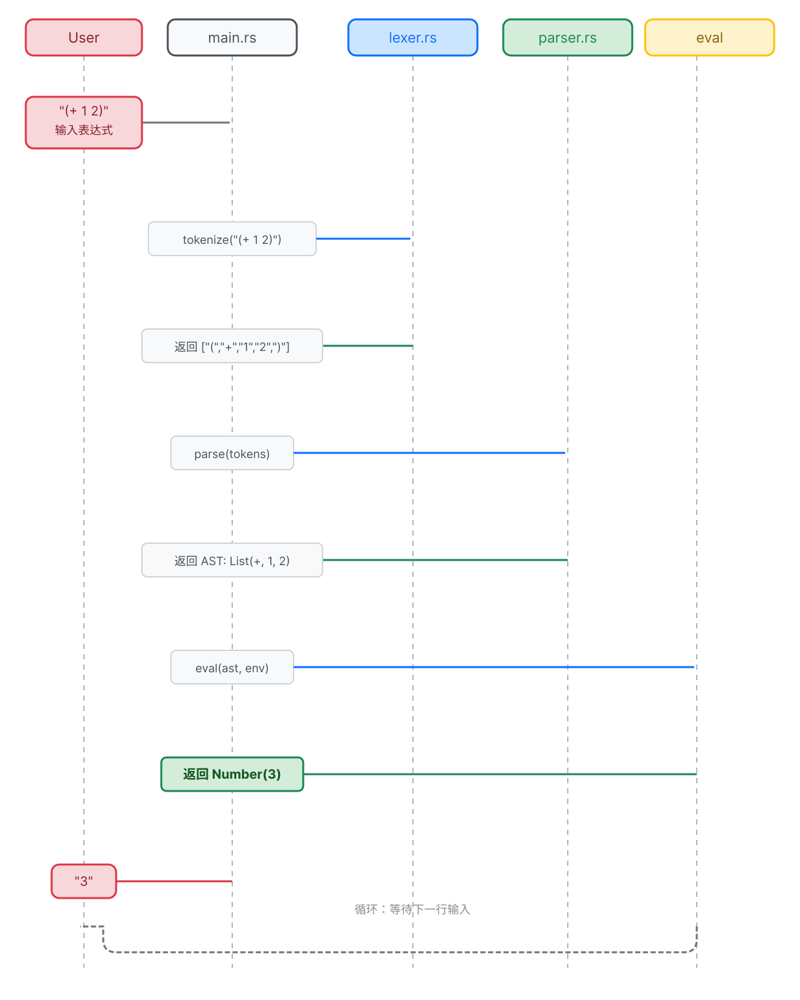

> 🔄 **REPL 就是上面这个循环**——你输入一行代码，它经过词法分析 → 语法分析 → 求值，打印结果，然后等你输入下一行。直到你敲 `:q` 退出。

`lib.rs` 中改 `mod parser;` 为 `pub mod parser;`（让 main.rs 能使用 parser 模块）。

右键 `src` 文件夹 → **New** → **File**，输入 `main.rs`。REPL 入口（下面展示的是完整版本，包含多行输入支持、`:help` 命令、括号平衡检测）：

```rust
// src/main.rs — 完整 REPL
use std::io::{self, BufRead, Write};
use lisp_rs::{
    env::LispEnv,
    interpreter::{eval, default_env},
    lexer::tokenize,
    parser::parse,
};

/// 读取可能跨多行的输入
fn read_input(stdin: &io::Stdin) -> Option<String> {
    let mut buffer = String::new();
    let mut depth: i32 = 0;
    let mut got_input = false;

    loop {
        let mut line = String::new();
        match stdin.lock().read_line(&mut line) {
            Ok(0) => { if got_input { break; } else { return None; } }
            Ok(_) => {
                got_input = true;
                buffer.push_str(&line);
                let mut in_string = false;
                let mut escape = false;
                for ch in line.chars() {
                    match ch {
                        '"' if !escape => in_string = !in_string,
                        '\\' if in_string => escape = !escape,
                        '(' if !in_string => depth += 1,
                        ')' if !in_string => depth -= 1,
                        _ => escape = false,
                    }
                }
                if depth <= 0 { break; }
                print!("... "); io::stdout().flush().unwrap();
            }
            Err(_) => break,
        }
    }
    Some(buffer)
}

/// 求值一行（或多行）Lisp 源码
fn eval_input(input: &str, env: &mut LispEnv) -> Result<String, String> {
    let tokens = tokenize(input);
    if tokens.is_empty() { return Ok("nil".to_string()); }
    let mut remaining: &[&str] = &tokens;
    let mut results = Vec::new();
    while !remaining.is_empty() {
        let (exp, rest) = parse(remaining).map_err(|e| match e {
                        lisp_rs::LispErr::Reason(msg) => msg,
        })?;
        remaining = rest;

        match eval(&exp, env) {
            Ok(val) => results.push(val),
            Err(e) => match e {
                lisp_rs::LispErr::Reason(msg) => return Err(msg),
            },
        }
    }
    if results.is_empty() { Ok("nil".to_string()) }
    else if results.len() == 1 { Ok(format!("{}", results[0])) }
    else { Ok(results.iter().map(|r| format!("{}", r)).collect::<Vec<_>>().join("\n")) }
}

fn main() {
    println!("Lisp-rs REPL v0.2.0");
    println!("输入 :help 查看帮助, :q 退出, Ctrl+D 退出\n");
    let mut env = default_env();
    let stdin = io::stdin();
    loop {
        print!(">>> "); io::stdout().flush().unwrap();
        let input = match read_input(&stdin) {
            Some(s) => s.trim().to_string(),
            None => { println!("再见！"); break; }
        };
        if input.is_empty() { continue; }
        if input.starts_with(':') {
            match input.as_str() {
                ":q" | ":quit" | ":exit" => { println!("再见！"); break; }
                ":help" => {
                    println!("特殊形式: if define lambda begin set! let cond and or quote");
                    println!("内置函数: + - * / = > < >= <= not list cons car cdr cadr caddr");
                    println!("命令: :q 退出, :help 帮助");
                    continue;
                }
                _ => { println!("未知命令: {}", input); continue; }
            }
        }
        match eval_input(&input, &mut env) {
            Ok(result) => println!("{}", result),
            Err(e) => println!("错误: {}", e),
        }
    }
}
```

```bash
cargo run
# >>> (+ 1 2)
# 3
# >>> (define fact (lambda (n) (if (= n 0) 1 (* n (fact (- n 1))))))
# >>> (fact 5)
# 120
# >>> :q
# 再见！
```

> 🎉 **最终里程碑：完整的交互式 Lisp 解释器！**

---

> 🏋️ **练习**
> 1. (⭐) 给 REPL 加一个 `:info` 命令，打印解释器的版本号和已注册的内置函数数量
> 2. (⭐⭐) 用 `map` 和 `lambda` 写一行代码：把列表 `(1 2 3 4 5)` 的每个元素平方
> 3. (⭐⭐⭐) 用 `defmacro` 写一个 `(debug expr)` 宏：求值 expr 之前先打印它，求值后再打印结果。提示：参考 `(list 'begin (list 'display ...) expr)`


<details>
<summary>点击查看答案</summary>

**1. :info 命令**（在 `main.rs` 的 match 分支加）
```rust
":info" => {
    println!("Lisp-rs REPL v0.2.0");
    println!("内置函数: + - * / = > < >= <= not");
    println!("列表: list cons car cdr cadr caddr append length reverse member");
    println!("高阶: map apply filter");
    println!("特殊形式: if define lambda begin set! let cond and or");
    continue;
}
```

**2. map 一行平方法**
```lisp
(map (lambda (x) (* x x)) '(1 2 3 4 5))
; → (1 4 9 16 25)
```

**3. debug 宏**（用 quasiquote 模板）
```lisp
(defmacro debug (expr)
  `(let ((result ,expr))
     (display 'debug:)
     (display ',expr)
     (display " => ")
     (display result)
     (newline)
     result))
```
</details>


---
> ✅ **本章总结**: 一个完整的交互式 Lisp 解释器，约 3000 行 Rust，零外部依赖。


## 🏗️ 架构回顾

经过 74 步，这是我们构建的东西：

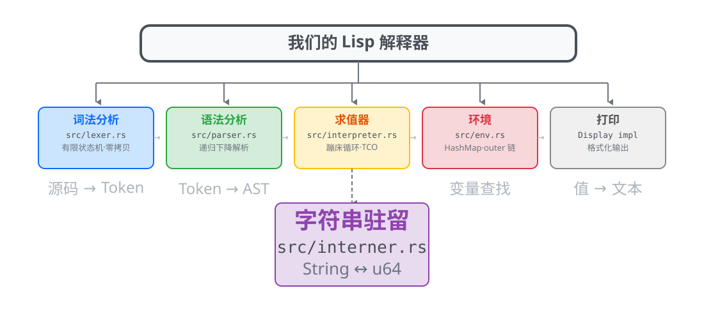

**关键数据：**
- **~3000 行 Rust 代码**（零外部依赖）
- **36 个内置函数**（算术、比较、列表操作、类型判断、高阶函数）
- **11 种特殊形式**（if, define, lambda, begin, set!, let, cond, and, or, let*, letrec）
- **2 个语言扩展**：宏、变参 lambda
- **3 个性能优化**：字符串驻留、零拷贝 token、FX 哈希器

### 你学到了什么
- 编程语言如何从文本变成运行中的程序
- Rust 的所有权模型、借用、`Rc<RefCell<>>`、`HashMap`、枚举、模式匹配
- 递归下降解析、词法作用域、闭包、尾调用优化
- 端到端测试驱动开发
- 性能优化：先测量、再优化

---

## 🐛 调试指南

### 常见的 Lisp 运行时错误

| 错误 | 含义 | 如何修复 |
|------|------|---------|
| `undefined variable: x` | 使用了 `x` 但未用 `define` 或 `let` 绑定 | 检查拼写。检查作用域：`x` 是在外层函数定义的吗？ |
| `invalid type: expected Number` | 函数收到错误类型 | 是否传入了列表但需要数字？检查 `(+ "hello" 1)` |
| `unexpected ')'` | 多余的右括号 | 数一下括号！用支持括号配对的编辑器 |
| `unexpected EOF` | 缺少右括号 | 补上缺少的 `)` |
| `cannot call non-function` | 试图调用非函数的东西 | `(42 1 2)` —— 你不能调用数字！ |

### Rust 编译器错误——解码

| Rust 错误 | 在项目中的实际含义 |
|----------|------------------|
| `cannot move out of borrowed content` | 你试图拿走你只有借用权的东西的所有权。99% 的情况：加 `.clone()` |
| `temporary value dropped while borrowed` | `&str` 指向一个已被释放的 String。检查生命周期 |
| `expected struct LispExp, found &LispExp` | 你传了引用但需要所有权。加 `.clone()` 或解引用 |
| `the trait Clone is not implemented` | 类型上缺少 `#[derive(Clone)]`。加上它 |
| `mismatched types: expected u64, found &u64` | 你写了 `&interner::intern("x")` 而不是 `interner::intern("x")` |

### 调试策略

**1. 追踪单个表达式**
```rust
fn eval(exp: &LispExp, env: &mut LispEnv) -> Result<LispExp, LispErr> {
    println!("eval: {:?}", exp);  // ← 临时加上这行
    // ... 剩余函数
}
```

**2. 用 `assert!` 验证你的假设**
```rust
assert!(env.get(interner::intern("x")).is_some(), "这里应该定义了 x");
```

**3. 隔离失败的测试**
```bash
cargo test test_your_test_name -- --nocapture
```
`--nocapture` 标志会在测试期间显示 `println!` 输出。

**4. 手动跟踪 eval 过程**
对于失败的表达式如 `(let ((x 1)) x)`，追踪代码流程：
1. eval 收到什么？→ `List(Symbol(let), List(List(Symbol(x), Number(1))), Symbol(x))`
2. `let` 在特殊形式检查中匹配了吗？→ 检查 `*sym_id == *predefined.let_sym`
3. `eval_list_body` 返回什么？→ 跟踪函数体求值

**5. "橡皮鸭"方法**
把问题大声解释给别人听（或给一只橡皮鸭）。通常解释的过程会暴露 bug。
"所以 eval 收到了 Let 表达式，它应该把 x 绑定到 1，然后求值函数体 x……哦等等，
绑定在一个 List 里的 List 里，让我检查怎么提取数据……"

---


---

### 🧪 测试哲学：示例即测试，测试即文档

解释器中的每个测试同时也是它所测试的功能的一个可工作示例。
这遵循了 SICP 的传统——代码示例*就是*规格说明：

```rust
#[test]
fn test_closure() {
    assert_eq!(eval_str("..."), Ok(LispExp::Number(6.0)));
}
```

每个测试都是一份**可执行的文档**——它说明了功能应该做什么，
而 `cargo test` 验证它确实做到了。添加功能时的标准流程是：
**测试先行 → 实现 → 验证 → 文档化**。

我们的 173 个测试覆盖：
- **词法分析器**（20 个）——所有 token 类型、边界情况（空输入、注释）
- **语法分析器**（25 个）——嵌套列表、原子类型、错误处理
- **求值器**（128 个）——所有特殊形式、内置函数、闭包、TCO

测试数量不是偶然的——因为教程的每一行都有具体、可运行的例子支撑。


## 📚 进一步阅读

### 深入 Lisp/Scheme

| 资源 | 为什么读 |
|------|---------|
| [**SICP**](https://mitpress.mit.edu/sicp/) (Abelson & Sussman) | 经典教材。第 3-4 章构建了一个与我们类似的元循环求值器，然后扩展到并发和惰性求值 |
| [**The Little Schemer**](https://mitpress.mit.edu/books/little-schemer) (Friedman & Felleisen) | 苏格拉底式对话格式。教你递归思维——Lisp 的核心技能 |
| [**Scheme R7RS**](https://small.r7rs.org/) | 官方 Scheme 标准。将我们的实现与真实语言规范对比 |
| [**Build Your Own Lisp**](http://buildyourownlisp.com/) (Holden) | 基于 C 的 Lisp 实现。展示如何从第一天起添加交互式 readline REPL |

### 深入解释器/编译器

| 资源 | 为什么读 |
|------|---------|
| [**Crafting Interpreters**](https://craftinginterpreters.com/) (Nystrom) | 下一步的必读。构建 Lox 语言的字节码 VM——比我们的树遍历快 10-100 倍 |
| [**Engineering a Compiler**](https://www.elsevier.com/books/engineering-a-compiler/cooper/978-0-12-815412-0) (Cooper & Torczon) | 标准编译器工程教科书。涵盖从词法分析到代码生成的所有阶段 |

### 深入 Rust

| 资源 | 为什么读 |
|------|---------|
| [**The Rust Book**](https://doc.rust-lang.org/book/) | 官方 Rust 资源。第 10 章（泛型）、13 章（迭代器/闭包）、15 章（智能指针）最相关 |
| [**Rust by Example**](https://doc.rust-lang.org/stable/rust-by-example/) | 带注释例子的在线代码沙箱 |
| [**Rustonomicon**](https://doc.rust-lang.org/nomicon/) | Unsafe Rust。如果你想实现自己的 GC 或底层优化 |

### 下一步可以做什么

| 项目 | 你会学到什么 |
|------|------------|
| **添加 GC** | 用简单的标记-清除回收器替换 `Rc<RefCell<>>` |
| **添加模式匹配** | 像 Rust 的 `match` 一样添加 `match` 表达式 |
| **字节码 VM** | 用 Rust 实现 Crafting Interpreters 第三部分 |
| **类型系统** | 添加 Hindley-Milner 类型推断（像 Haskell/ML） |
| **WebAssembly 后端** | 将 Lisp 编译为 WASM 而不是解释执行 |
| **并发 Lisp** | 添加 `future`/`promise` 原语（Rust 的 async 很自然） |

> **最后的话**：这个解释器是一个*基础*，不是一个完成品。最好的代码是你自己写的代码。
> Fork 这个项目，破坏它，修复它，扩展它。这就是学习的方法。

---


---

## 🎆 看看你造了什么！

在进入附录之前，先来看看你的解释器能做些什么。
下面是一个**符号求导器**——它接收数学表达式并返回其导数——全部用你手写的 Lisp 实现：

```scheme
(define (deriv exp var)
  (cond ((number? exp) 0)
        ((symbol? exp) (if (eq? exp var) 1 0))
        ((eq? (car exp) '+)
         (list '+ (deriv (cadr exp) var) (deriv (caddr exp) var)))
        ((eq? (car exp) '*)
         (list '+
               (list '* (deriv (cadr exp) var) (caddr exp))
               (list '* (cadr exp) (deriv (caddr exp) var))))))

(deriv '(+ x (* x x)) 'x)  ; => (+ 1 (+ (* 1 x) (* x 1)))
```

这仅仅是 **30 行**纯 Lisp 代码，运行在*你亲手*从零构建的解释器上。
现在就可以复制到你的 REPL 中试一试。

> **启发自 SICP §2.3.2**——MIT 用来教授符号计算的经典练习。


## 附录：完整步骤清单

```
步骤 1-4: 准备工作
  1. 安装 Rust           2. 安装 RustRover
  3. 创建项目            4. 首次测试

步骤 5-6: 认识"值"
  5. LispExp::Number     6. LispErr

步骤 7-8: 让程序算东西
  7. eval 数字           8. 打通管线 eval_str

步骤 9-11: 词法分析器
  9. 创建 lexer.rs       10. tokenize      11. 处理括号

步骤 12-15: 语法分析器
  12. 创建 parser.rs     13. 走完整管线    14. 递归解析列表
  15. 解析符号 + 错误处理

步骤 16-19: 给东西起名字
  16. 创建 env.rs        17. env 测试
  18. eval 加 env 参数   19. 更新调用处

步骤 20-27: 做真正的计算
  20. Func 类型          21. 列表求值      22-23. 加法
  24-27. 减/乘/除

步骤 28-31: 更多数据类型
  28. Bool + Nil         29-31. 比较 + String

步骤 32-35: 让程序做选择
  32. if                 33. define        34. lambda 创建
  35. lambda 调用

步骤 36-39: 记住过去的事情（闭包 + TCO）
  36. outer 字段         37. Lambda 捕获环境
  38. TCO 理解问题       39. TCO 蹦床循环

步骤 40-43: 让程序跑得更快（性能优化）
  40. 字符串驻留器       41. Symbol(u64)
  42. 零拷贝词法分析     43. FX 哈希器 + 项目重构(interpreter.rs)

步骤 44-51: 更多魔法命令
  44. begin              45. set!          46. let
  47. cond               48. and           49. or
  50. let*               51. letrec

步骤 52-74: 内置函数补全 + REPL
  52-57: <, <=, >=, not, list, cons
  58: car, cdr    58b: cadr/caddr    59-62: append, length, reverse, member
  63-66: 类型谓词 + eq?/equal?
  67-69: map, apply, filter
  70: 变参 lambda        71: quote 缩写
  71b-71d: defmacro/宏展开/gensym   71e: quasiquote
  72: error    73: Display trait   73b: I/O 函数(display/newline/read)
  74: main.rs REPL
```

---

> **费曼检验**：把这 74 步讲给你完全不懂编程的朋友听。如果每一步他都能点头说"哦，原来是这样"——你就成功了。

> **运行验证**: `cargo test` (173 个测试), `cargo run` (交互 REPL)

---

## 附录 B：Lisp 语法速查卡

### 特殊形式

| 形式 | 语法 | 说明 |
|------|------|------|
| `quote` | `(quote expr)` 或 `'expr` | 阻止求值，返回表达式本身 |
| `if` | `(if cond then else)` | 条件为真求值 then，否则求值 else |
| `begin` | `(begin expr1 expr2 ...)` | 顺序求值，返回最后一个 |
| `define` | `(define name value)` | 在环境中创建新绑定 |
| `set!` | `(set! name value)` | 修改已有绑定的值 |
| `lambda` | `(lambda (params) body)` | 创建匿名函数/闭包 |
| `defmacro` | `(defmacro name (params) body)` | 创建宏 |
| `let` | `(let ((v1 e1) ...) body)` | 局部绑定 |
| `let*` | `(let* ((v1 e1) ...) body)` | 顺序局部绑定 |
| `letrec` | `(letrec ((v1 e1) ...) body)` | 递归局部绑定 |
| `cond` | `(cond (test expr) ... (else expr))` | 多路分支 |
| `and` | `(and expr1 expr2 ...)` | 短路逻辑与 |
| `or` | `(or expr1 expr2 ...)` | 短路逻辑或 |

### 内置函数

| 类别 | 函数 |
|------|------|
| 算术 | `+` `-` `*` `/` |
| 比较 | `=` `>` `<` `>=` `<=` |
| 逻辑 | `not` |
| 列表 | `list` `cons` `car` `cdr` `cadr` `caddr` `append` `length` `reverse` `member` |
| 高阶 | `map` `apply` `filter` |
| 谓词 | `null?` `number?` `symbol?` `boolean?` `string?` `procedure?` `pair?` `list?` `eq?` `equal?` |
| I/O | `display` `newline` `read` `error` |
| 符号 | `gensym` |

---

## 附录 C：Rust 术语对照表

| Rust 术语 | 中文 | 大白话 |
|-----------|------|--------|
| `enum` | 枚举 | 列出"这个东西可能是啥"的清单 |
| `struct` | 结构体 | 把几个相关的值打包在一起 |
| `match` | 模式匹配 | 像机场安检——不同类型的行李走不同通道 |
| `impl` | 实现块 | 给一个类型加方法（像给遥控器加按钮） |
| `Vec<T>` | 向量 | 能自动伸缩的数组 |
| `HashMap<K,V>` | 哈希表 | 电话本——给名字查到号码 |
| `Rc<T>` | 引用计数指针 | 多人共享同一本书 |
| `RefCell<T>` | 内部可变性 | 共享的书也允许在上面写字 |
| `Box<T>` | 堆分配指针 | 把大东西放仓库，身上只带存根 |
| `Result<T,E>` | 结果类型 | 快递包裹——打开要么是东西(Ok)，要么是道歉信(Err) |
| `Option<T>` | 可选类型 | 盒子——里面可能有东西(Some)，也可能是空的(None) |
| `&T` / `&mut T` | 引用 / 可变引用 | 借书看 / 借书并在上面做笔记 |
| `derive` | 派生宏 | "帮我把这些标准功能自动生成" |
| `fn` | 函数指针 | 遥控器按钮——按它就调用对应功能 |
| `String` | 字符串 | 一段文字 |
| `&str` | 字符串切片 | 借来的一段文字（不拥有，只是看看） |
| `u64` / `f64` | 无符号64位整数 / 64位浮点 | 整数 / 带小数点的数 |

---

## 附录 D：完整程序范例 — 符号求导器

学了 74 步做出了解释器，能用它做什么？这里有一个 ~30 行的 Lisp 程序——对数学表达式求导：

```lisp
; 符号求导器 — 用你亲手写的解释器运行!
(define (deriv exp var)
  (cond
    ((number? exp) 0)
    ((symbol? exp) (if (eq? exp var) 1 0))
    ((eq? (car exp) '+) (list '+ (deriv (cadr exp) var)
                                 (deriv (caddr exp) var)))
    ((eq? (car exp) '-) (list '- (deriv (cadr exp) var)
                                 (deriv (caddr exp) var)))
    ((eq? (car exp) '*) (list '+
                               (list '* (deriv (cadr exp) var) (caddr exp))
                               (list '* (cadr exp) (deriv (caddr exp) var))))
    ((eq? (car exp) 'expt) (list '* (caddr exp)
                                   (list '* (list 'expt (cadr exp)
                                                  (- (caddr exp) 1))
                                        (deriv (cadr exp) var))))
    (else (error "unknown expression"))))

; 测试: 对 x² + 2x + 1 求导 → 2x + 2
(define expr '(+ (expt x 2) (* 2 x) 1))
(deriv expr 'x)
; → (+ (* 2 (expt x 1) 1) (+ (* 0 x) (* 2 1)) 0)
; 简化后: (+ (* 2 x) 2)

> 🎯 **这展示了 Lisp 的威力**：用你自己的解释器、你自己的语言、~30 行代码，就能做符号计算——而这一切都是你一行一行写出来的。

> 💡 **前置函数**：这个程序用到了 `cadr`（取第二个元素）和 `caddr`（取第三个元素）——它们在步骤 58b 中定义。如果你还没实现它们，请先加上。

---

## 附录 E：常见问题排查

### 解析错误

| 错误 | 原因 | 解决 |
|------|------|------|
| `输入不完整：表达式还没写完` | 少了右括号 | 检查括号配对。在 REPL 里可以换行继续输入 |
| `意外的右括号 ')' —— 它前面没有匹配的左括号` | 多了右括号 | 删掉多余的 `)` 或在前面补 `(` |

### 变量错误

| 错误 | 原因 | 解决 |
|------|------|------|
| `未定义的变量: xxx —— 你是不是忘记用 define 定义它了？` | 变量没定义就用了 | 先用 `(define xxx 值)` 再使用 |
| `set!` 修改变量不生效 | 用 `define` 代替 `set!` 了 | `define` 创建新变量；`set!` 修改已有变量 |
| 闭包里找不到变量 | `lambda` 定义时变量还没绑定 | 确保 `lambda` 在变量 `define` 之后创建 |

### 函数调用错误

| 错误 | 原因 | 解决 |
|------|------|------|
| `xxx 不是一个可调用的函数` | 把数字/字符串当函数调用了 | 检查列表第一个元素是不是函数名 |
| 递归太深崩溃 | 递归不是尾递归 | 改写为尾递归，或者减少递归深度 |
| 宏展开结果不对 | 用 `list` 拼代码时漏了 `'` | 用 quasiquote (`` ` `` `,` `,@`) 代替手动拼接 |

### 类型错误

| 错误 | 原因 | 解决 |
|------|------|------|
| `+` / `-` / `*` / `/` 的参数中有非数字 | 传了字符串或符号 | 检查算术函数的参数是否都是数字 |
| `car` / `cdr` 对非列表操作 | 传了数字或符号 | 检查是否对列表操作 |

### 性能问题

| 问题 | 原因 | 解决 |
|------|------|------|
| 大量递归慢 | 未使用尾递归优化 | 改写为尾递归 |
| 启动慢 | 首次加载需要初始化 | 正常现象，REPL 启动一次后可连续使用 |

---

## 开源许可证

本项目基于 **MIT 许可证** 开源 —— 详见 [LICENSE](LICENSE) 文件。

你可以自由地使用、复制、修改、合并、发布、分发、再授权和/或出售本软件的副本。
